# 基础篇

## 1. 网络模型

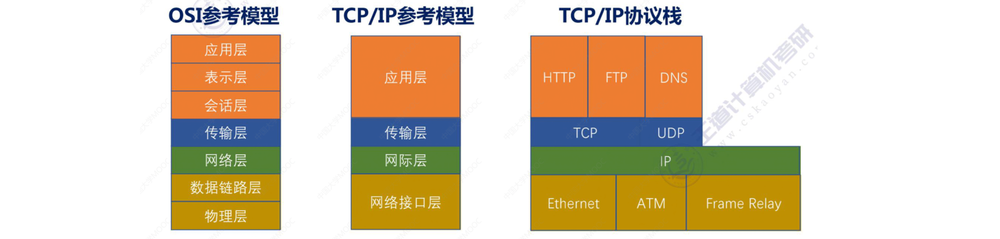

**OSI 参考模型**：“物链网输会示用”

<br>

## 2. TCP/IP 参考模型

> 为不同设备上的进程间通信协商出的一套通用的网络协议

### 2.1 应用层

应用层专注于为用户提供应用功能，如 HTTP、FTP、Telnet、DNS、SMTP等，而不用去关心数据是如何传输的

两个不同设备的应用需要通信的时候，应用会把应用数据传给下一层，即「传输层」

应用层工作在 OS 的用户态，其他层则工作在内核态

### 2.2 传输层

应用层的数据包会传给传输层，**传输层是为应用层提供网络支持的**（应用层的传输媒介）

传输层有两个传输协议：

**`TCP`**：传输控制协议，

- 大部分应用使用的正是 TCP 传输层协议，比如 HTTP 应用层协议
- TCP 相比 UDP 多了很多特性，比如流量控制、超时重传、拥塞控制等，这些都是为了保证数据包能可靠地传输给对方

**TCP 段**：应用需要传输的数据可能非常大，当超过 MSS（TCP 最大报文段长度），就需要将数据包分块，这样即使中途有一个分块丢失或损坏了，只需要重新发送这一个分块，而不用重新发送整个数据包，每个分块在 TCP 中称为「TCP 段」

**`UDP`**：用户数据报协议

- 只负责发送数据包，不保证数据包是否能抵达对方
- 实时性相对更好，传输效率也更高
- 如果把 TCP 的特性在应用层上实现，UDP 也可以实现可靠传输 

**端口**：设备作为接收方时，传输层负责把数据包传给应用，一台设备上可能有很多应用在接收或者传输数据，需要用端口这样一个编号将应用区分开

- 80 端口通常是 Web 服务器使用，22 端口通常是远程登录服务器使用
- 浏览器（客户端）中的每个标签栏都是一个独立的进程，操作系统会为这些进程分配临时的端口号
- 传输层的报文中会携带端口号，接收方可以识别出该报文是发送给哪个应用

<br>

### 2.3 网络层

> 负责实际的传输功能，最常使用的是 IP 协议

#### IP 协议：寻址和路由

> **IP 协议的寻址作用是告诉我们去往下一个目的地该朝哪个方向走，路由则是根据「下一个目的地」选择路径**

将传输层的报文作为数据部分，再加上 IP 报头组成 IP 报文

- 如果 IP 报文大小超过`MTU`（最大传输单元，以太网中一般为1500字节）就会再次进行**分片**，得到一个即将发送到网络的 IP 报文

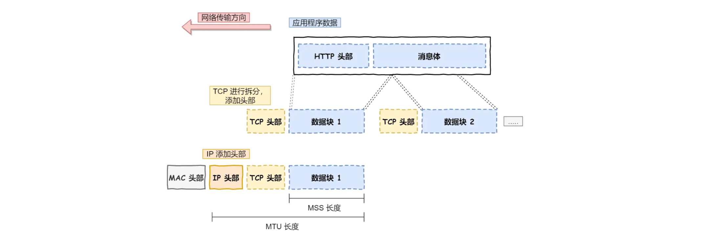

**IPv4 协议**：IP 地址共 32 位，分成四段，每段 8 位


网络号：标识 IP 地址属于哪个「子网」

主机号：标识同一「子网」下的不同主机

子网掩码：划分网络中主机和子网的 32 位二进制数字，将 IP 地址和子网掩码做「按位与」运算，可以得到网络号
		（网络位设为 1，主机位设为 0）

- 寻址时，先匹配到相同的网络号，才会去找对应的主机

<br>

**路由**：实际场景中，两条设备是通过很多网关、路由器、交换机等网络设备连接起来，需要路由算法决定下一步走哪条网络路径，从而将数据包发送给下一个网络节点

- 路由器寻址，就是要找到目标地址的子网，进而把数据包转发给对应的网络内

<br>

### 2.4 网络接口层

> 为网络层提供「链路级别」传输的服务，负责在以太网、WiFi 这样的底层网络上发送原始数据包，工作在网卡这个层次，使用 MAC 地址来标识网络上的设备

生成了 IP 头部之后，接下来要交给**网络接口层**，在 IP 头部的前面加上「MAC 头部」，并封装成**数据帧（Data frame）**发送到网络上

以太网：一种在「局域网」内，把附近的设备连接起来，使它们之间可以进行通讯的技术

在以太网进行通讯，需要使用 **MAC 地址**

**MAC 头部**：以太网使用的头部，包含了接收方和发送方的 MAC 地址等信息，可以通过 ARP 协议获取对方的 MAC 地址

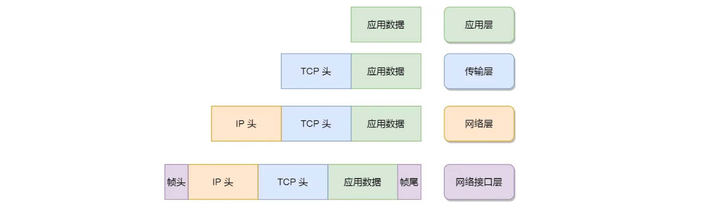

帧 frame：网络接口层的传输单位

包 packet：IP 层的传输单位

段 segment：TCP 层的传输单位

报文/消息 message：HTTP 的传输单位

<br>

## 3. 从输入网址到网页显示

### 3.1 HTTP

#### 解析 URL

- 当没有路径名时，就代表访问根目录下事先设置的**默认文件**，也就是 `/index.html` 或者 `/default.html` 这些文件

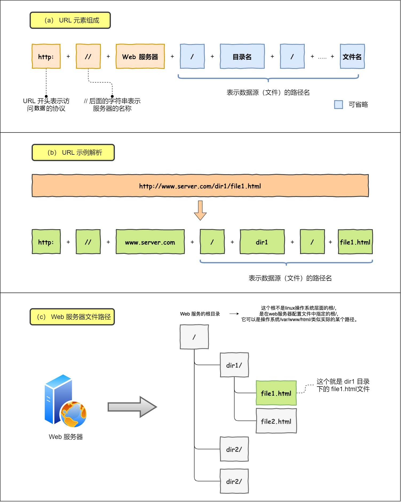

#### 生成 HTTP 请求消息

- 解析后，浏览器确定了 Web 服务器和文件名，根据这些信息生成 HTTP 请求消息

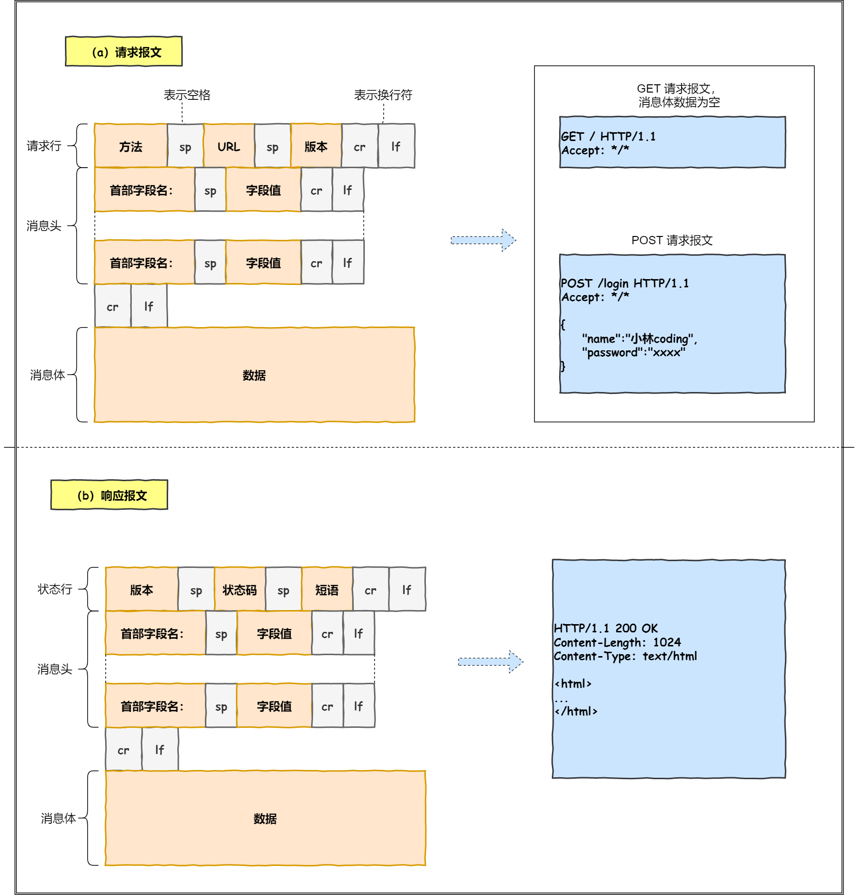

### 3.2 DNS

**DNS 域名系统**：查询服务器域名对应的 IP 地址，DNS 服务器保存了 Web 服务器域名与 IP 的对应关系

#### 域名层级关系

- DNS 中的域名用「句点」分割，句点代表了不同层次之间的界限
- 在域名中，越靠右的位置表示层级越高
- 实际上域名最后还有一个点，`www.bilibili.com.`，代表根域名

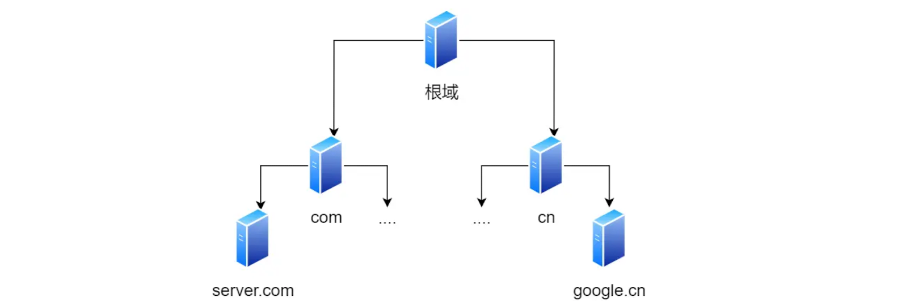


`.`根域是最顶层，下一层是`.com`顶级域，再下面是`bilibili.com`权威域

根域 DNS 服务器信息保存在互联网中所有的 DNS 服务器中，进而可以从根域向下找到目标 DNS 服务器

<br>

#### 域名解析流程

> 解析的域名：`www.bilibili.com`

1. 客户端首先会发出一个 DNS 请求，询问域名 IP，并发给本地域名服务器（也就是客户端的 TCP/IP 设置中填写的 DNS 服务器地址）
2. 本地域名服务器收到客户端的请求后，如果缓存里的表格能找到域名，则它直接返回 IP 地址；如果没有，会向它的根域名服务器询问 IP 地址
3. 根 DNS 收到来自本地 DNS 的请求后，发现后置是`.com`，从而获得`.com`顶级域名服务器地址
4. 本地 DNS 收到顶级域名服务器的地址后，发起请求，询问 IP 地址
5. 顶级域名服务器返回`www.bilibili.com`区域的权威域名服务器的地址
6. 本地 DNS 进而转向询问权威域名服务器对应的 IP ；`bilibili.com`的权威域名服务器是域名解析结果的原出处
7. 权威域名服务器查询后将对应的 IP 地址告诉本地 DNS
8. 本地 DNS 再将 IP 地址返回客户端，客户端和目标建立连接

`本地 -> 根 -> 对应的顶级 -> 对应的权威 -> 解析得到 IP`

**缓存**：解析前会先查看浏览器自身、操作系统本地、hosts 文件（手动指定域名和 IP 地址对应关系的文件）的缓存有没有对应 IP，否则才会去询问本地域名服务器

<br>

### 3.3 协议栈

从 DNS 获得 IP 后，把 HTTP 的传输工作交给操作系统中的「协议栈」

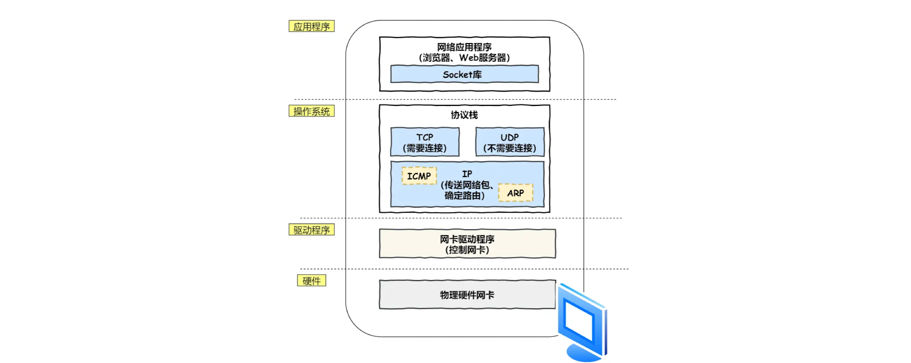

**应用程序（浏览器）**：通过调用 Socket 库，委托协议栈工作

**协议栈**：上半部分是负责收发数据的 TCP 和 UDP 协议，下半部分是控制网络包路由操作的 IP 协议（包括 ICMP、ARP 协议）

- `ICMP`：告知网络包传送过程中产生的错误以及各种控制信息
- `ARP`：根据 IP 地址查询相应的以太网 MAC 地址

**网卡驱动程序**：控制网卡硬件

**硬件**：物理硬件网卡负责完成实际的收发操作，即对网线中的信号执行发送和接收操作

<br>

### 3.4 TCP 可靠传输

1. 在传输数据前，通过三次握手建立连接 `netstat -napt`
2. 将较长的 HTTP 消息进行分割，分割成小于`MSS`的网络包
3. 双方建立连接后，TCP 部分存放`HTTP 头部 + 数据`，加上 TCP 头后，就交个网络层进行处理
    - TCP 协议有浏览器监听的端口（随机生成），Web 服务器监听端口（默认`80`）

<br>

### 3.5 IP 远程定位

IP 协议里有「源地址 IP」和「目标地址 IP」，以及协议号

- 源地址 IP：客户端输出的 IP 地址
- 目标地址 IP：通过 DNS 解析得到的 Web 服务器 IP
- 协议号：`06`标定协议为 TCP

当客户端有多个网卡时，需要根据**路由表**规则来判断选择哪个网卡作为源地址 IP

在网络层加上 IP 头部后，就可以交给 MAC

<br>

### 3.6  MAC 两点传输

> MAC 地址是用于在局域网中唯一标识网络设备的地址

生成 IP 头部后，还需要在 IP 头部前面加上 **MAC 头部**

MAC 头部：`接收方 MAC 地址（48位） + 发送方 MAC 地址（48位） + 协议类型`

- 协议类型一般选择 IP 协议或 ARP 协议

- 发送方的 MAC 地址：网卡生产时写入 ROM 中，直接读取该值就行

#### 查找接收方的 MAC 地址

方法一：静态配置

- 某些情况下，目标设备的 MAC 地址可能已经被静态地配置在网络设备上，直接读取即可

方法二：路由器转发表

- 如果目标设备**不在同一个局域**网，发送方需要通过路由器进行转发
- 路由器通常会维护一个转发表，包含目标 IP 地址与下一跳路由器之间的映射关系
- 查询路由器转发表即可确定下一跳路由器的 MAC 地址

方法三：ARP 协议（地址解析协议）

- 目标设备**在同一个局域网**中，需要使用 ARP 协议得到目标 IP 对应的 MAC 地址
- 首先查询 ARP 缓存，如果已经保存就直接使用
- 没有找到，则发送 ARP 广播查询，向子网中的所有设备查询目标 MAC 地址

<br>

### 3.7 网卡 — 出口

网络包只是存放在内存中的一串二进制数字信息，需要将**数字信息转换为电信号**，才能在网线上传输

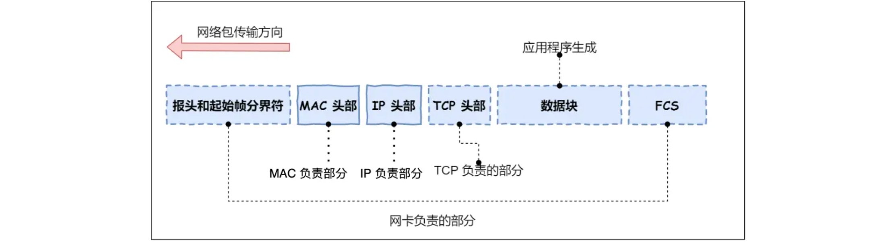

**网卡驱动程序**：网卡驱动获得网络包之后，将其复制到网卡的缓存中

- 在开头加上**报头**和**起始帧分界符**，在末尾加上用于检查错误的**帧校验序列**

网卡会将包转换为电信号，通过网线发送出去

<br>

### 3.8 交换机 — 送别

交换机是局域网两个设备之间的链路层网络设备，可以根据目的 MAC 地址转发数据包到特定的端口，而不是广播到所有端口

- 交换机将网络包原样转发到目的地，工作在 MAC 层，即二层网络设备
- 交换机可以连接多台计算机和设备，构建一个局域网
- 交换机根据 MAC 地址表查询 MAC 地址，将信号发送到相应的端口

网络包（电信号）经过交换机在局域网内传输，抵达路由器

<br>

### 3.9 路由器 — ”出境“

网络包到达路由器，由路由器决定转发到下一个路由器或网络设备

- 路由器是基于 IP 设计的，三层网络设备，每个端口都具有 MAC 地址和 IP 地址

当转发包时，路由器端口会接收发给自己的以太网包，然后**路由表**查询转发目标，再由相应的端口作为发送方将以太网包发送出去

**路由器接收**：

1. 电信号抵达网线接口，路由器中的模块将其转成数字信号，通过末尾`FCS`进行错误校验
2. 检查 MAC 头部的**接收方 MAC 地址**，如果是发给自己的包则接收
3. 去掉 MAC 头部，根据 IP 头部进行包的转发操作

**路由器发送**：根据路由表判断转发目标

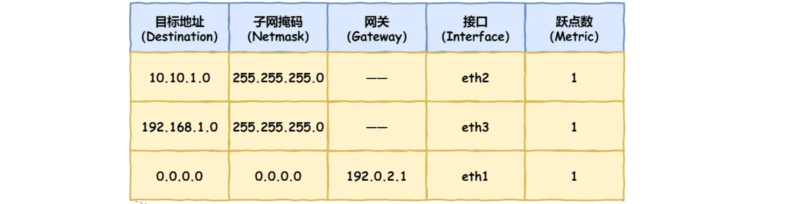

1. 根据包的接收方 IP 地址，查询路由表中的目标地址（找不到是会选择默认路由`0.0.0.0`）
2. 根据网关列判断对方地址
    - `Gateway`为空，目标地址就是 IP 头部的接收方地址，说明**已抵达终点**
    - `Gateway`非空，则该地址就是要转发的目标地址，还需要路由器转发，还**未抵达终点**
3. 根据 ARP 协议得到 IP 地址对应的目标 MAC 地址
4. 同计算机相同，包装后的网络包转换成电信号通过端口发送出去

<br>

### 3.10 总结

1. 数据包在客户端层层包装后，经链路层传输抵达服务端
2. 服务端扒开 MAC 头部，查看和自己是否符合
3. 扒开 IP 头部判断，并得知上层是 TCP 协议
4. 扒开 TCP 头，查看序列号，判断成功则将数据放入缓存并返回一个 ACK（单独的确认包）
5. HTTP 进程监听 TCP 头部的端口，包会发送给 HTTP
6. HTTP 封装网页放入 HTTP 响应报文，响应报文同样层层包装，经链路层传回客户端
7. 客户端同样层层”扒皮“，将得到的网页交给浏览器渲染
8. 经过四次挥手，双方断开连接

<br>

<br>

# HTTP

> HTTP 是基于 TCP 传输协议进行通信的应用层协议

常见面试题：

1. HTTP 基本概念
2. Get 与 Post
3. HTTP 特性
4. HTTP 缓存技术
5. HTTPS 与 HTTP
6. HTTP/1.1、HTTP/2、HTTP/3 演变

<br>

## 1. HTTP 基础概念

### 1.1 什么是 HTTP

HTTP 是**超文本传输协议**，即 **H**yperText **T**ransfer **P**rotocol

**协议**：计算机之间（两个以上参与者）交流通信的规范，以及相关的各种控制和错误处理方式（行为约定和规范）

**传输**：用来在**两点之间传输数据**的约定和规范

**超文本**：文字、图片、视频等的混合体，可以通过超链接从一个超文本跳转到另一个超文本

**HTTP 是一个在计算机世界里专门在「两点」之间「传输」文字、图片、音频、视频等「超文本」数据的「约定和规范」**

<br>

### 1.2 常见状态码（结合项目整理一下）

[HTTP 响应状态码](https://developer.mozilla.org/zh-CN/docs/Web/HTTP/Status)，[常见的状态码有哪些](https://www.xiaolincoding.com/network/2_http/http_interview.html#http-%E5%B8%B8%E8%A7%81%E7%9A%84%E7%8A%B6%E6%80%81%E7%A0%81%E6%9C%89%E5%93%AA%E4%BA%9B)

`1xx`：信息响应（提示信息，很少使用）

`2xx`：成功响应

`3xx`：重定向消息（客户端请求的资源 URL 发生了变动）

`4xx`：客户端错误响应（客户端发送的报文有误）

`5xx`：服务端错误响应（客户端请求报文正确，服务器处理时内部发生错误）

<br>

### 1.3 HTTP 常见字段

`Host`：客户端发送请求时，指定服务器的域名

`Content-Length`：服务器返回数据的数据长度

- HTTP 协议通过设置回车符、换行符作为 HTTP header 的边界，通过`Content-Length`字段作为 HTTP body 的边界，这两个方式都是为了解决“粘包”的问题

`Connection`：最常用于客户端要求服务器使用「HTTP 长连接」机制，以便其他请求复用

- HTTP 长连接特点：只要任意一端没有明确提出端口连接，则保持 TCP 连接状态
- 开启`HTTP Keep-Alive`后，会开启长连接，客户端发送的请求使用同一个连接，直到断开

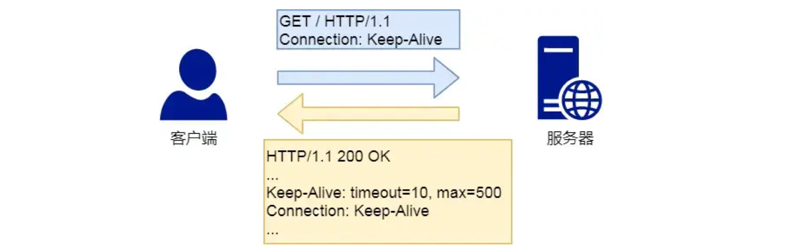

`Content-Type`：服务器回应给客户端本次传输的数据格式

```json
Accept: */*		// 客户端声明可以接收的格式，*/* 表示可以介绍任意格式
Content-Type: text/html; Charset=utf-8 // 发送的是网页，编码是UTF-8
```

`Content-Encoding`：说明数据的压缩方式，客户端请求时也有`Accept-Encoding`字段声明可以接受的方式

<br>

## 2. GET 和 POST

### 2.1 GET 和 POST 的区别

`GET`：从服务器获取指定的资源

- GET 请求的参数位置一般写在 URL 中，URL 规定只能支持 ASCII，所以 GET 请求的参数只允许 ASCII 字符 ，而且浏览器会对 URL 的长度有限制（HTTP 协议本身对 URL 长度并没有做任何规定）

`POST`：根据请求负荷（报文 body）对指定的资源做出处理

- POST 请求携带数据的位置一般是写在报文 body 中，body 中的数据可以是任意格式的数据，只要客户端与服务端协商好即可，而且浏览器不会对 body 大小做限制
- "负荷"（payload）一词在计算机和网络领域常用来指代数据传输中实际携带的有效信息，而不包括传输的控制信息和其他辅助信息

<br>

### 2.2 安全和幂等

**安全**：指请求方法不会修改服务器上的资源

**幂等**：多次执行相同的操作，结果都是相同的

**GET 方法安全且幂等**：是「只读」操作

- 可以对 GET 请求的数据做缓存（浏览器本身上或代理上），在浏览器中 GET 请求可以保存为书签

**POST 方法不安全且不幂等**：是「新增或提交数据」操作，会修改服务器上的资源（不安全），多次提交数据就会创建多个资源（不幂等）；浏览器一般不会缓存 POST 请求，也不能将其保存为标签

<br>

## 3. HTTP 缓存技术

> 对于一些具有重复性的 HTTP 请求，比如每次请求得到的数据都一样的，我们可以把这对「请求-响应」的数据都**缓存在本地**，那么下次就直接读取本地的数据，不必在通过网络获取服务器的响应了

### 3.1 强制缓存

只要浏览器判断缓存没有过期，就直接使用浏览器的本地缓存，由浏览器决定是否使用缓存

强缓存可以利用两个 HTTP 响应头部字段实现，都是用来表示资源在客户端缓存的有效期

`Cache-Control`：相对时间（指定资源在缓存中的有效时间）

`Expires`：绝对时间（指定具体的日期时间）

如果 HTTP 响应头部同时有 Cache-Control 和 Expires 字段的话，**Cache-Control 的优先级高于 Expires** 

**使用 Cache-Control 实现强缓存的流程**：

1. 浏览器请求资源，服务器返回资源同时，在 Response 头部加上 Cache-Control，设置过期时间大小
2. 浏览器再次请求该资源时，会先计算该资源是是否过期，没有则使用缓存
3. 如果过期，则重新请求服务器

<br>

### 3.2 协商缓存

通过服务端告知客户端是否可以使用缓存的方式被称为**协商缓存**

- 某些请求的响应码是 `304`，告诉浏览器可以使用本地缓存的资源

#### 实现方法

1. 请求头部：`If-Modified-Since` + `Last-Modifield`（基于时间）
    - `Last-Modifield`标识这个响应资源的最后修改时间
    - `If-Modified-Since` ：当资源过期了，发现响应头中具有 Last-Modified 声明，则再次发起请求的时候带上 Last-Modified 的时间，服务器收到请求后发现有 If-Modified-Since 则与被请求资源的最后修改时间进行对比（Last-Modified），如果最后修改时间较新（大），说明资源又被改过，则返回最新资源，HTTP 200 OK；如果最后修改时间较旧（小），说明资源无新修改，响应 HTTP 304 走缓存

2. 请求头部：`If-None-Match`  + `ETag`（基于唯一标识）
    -  `ETag`：唯一标识响应资源
    - `If-None-Match`：当资源过期时，浏览器发现响应头里有 Etag，则再次向服务器发起请求时，会将请求头 If-None-Match 值设置为 Etag 的值。服务器收到请求后进行比对，如果资源没有变化返回 304，如果资源变化了返回 200

- Etag 的使用优先级更高
- 协商缓存的两种方法都需要配合强制缓存中的 Cache-Control 字段来使用，只有在未能命中强制缓存的时候，才能发起带有协商缓存字段的请求

<br>

## 4. HTTP 与 HTTPS

### 4.1 HTTP 与 HTTPS 的区别

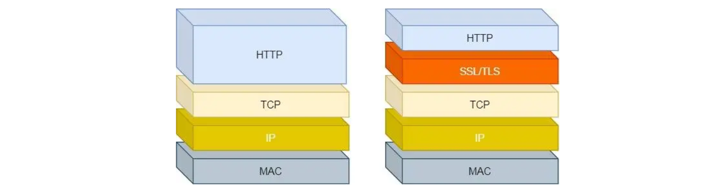

1. HTTP 信息是明文传输，存在安全风险的问题；HTTPS 在 TCP 和 HTTP 网络层之间加入了 SSL/TLS 安全协议，使得报文能够加密传输
2. HTTP 经三次握手即可建立 TCP 连接；HTTPS 则在 TCP 三次握手后，还需进行 SSL/TLS 的握手过程，才可进入加密报文传输
3. HTTP 的默认端口是 80；HTTPS 默认端口号是 443
4. HTTPS 协议需要向 CA（证书权威机构）申请数字证书，来保证服务器的身份是可信的

<br>

### 4.2 HTTPS 解决了 HTTP 的哪些问题？

**HTTP 明文传输的安全风险**：窃听风险、篡改风险、冒充风险

**加入`SSL/TLS`协议后**：

- 信息加密：交互信息无法被窃取（解决窃听风险）
- 校验机制：无法篡改通信内容（解决篡改风险）
- 身份证书：（解决网站冒充风险）

#### 混合加密

通过混合加密的方式，可以保证信息的机密性，解决了窃听的风险

HTTPS 采用的是「对称加密」和「非对称加密」结合的混合加密方式

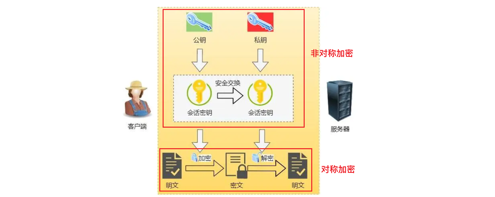

- 在通信建立前采用**非对称加密**的方式交换「会话密钥」，后续就不再使用非对称加密；使用两个密钥：公钥和私钥，公钥可以任意分发，而私钥保密（速度慢，但安全性高）
- 在通信过程中全部使用**对称加密**的「会话密钥」的方式加密明文数据（速度快，但密钥必须保密）

<br>

#### 摘要算法 + 数字签名

> 通过摘要算法保证传输内容不被篡改，通过数字签名验证信息来源

**摘要算法**：通过哈希函数计算内容的哈希值，即”指纹“，哈希值唯一

- 为了保证传输的内容不被篡改，对内容计算出一个”指纹“，然后同内容一起传输给对方

- 对方收到后，先是对内容也计算出一个”指纹“，然后跟发送方发送的”指纹“做一个比较，如果”指纹“同，说明内容没有被篡改，否则就可以判断出内容被篡改了

​	通过哈希算法可以确保内容不会被篡改，但是并不能保证「内容 + 哈希值」不会被中间人替换，因为这里缺少对客户端收到的消息是否来源于服务端的证明

**非对称加密算法**：公钥（公开给所有人），私钥（本人管理，不可泄露）

- 两个密钥可以「双向加解密」
    - **公钥加密，私钥解密**：保证内容传输的安全，因为被公钥加密的内容，其他人是无法解密的，只有持有私钥的人，才能解密出实际的内容（针对接收者）
    - **私钥加密，公钥解密**：保证信息不会被冒充，因为私钥是不可泄露的，如果公钥能正常解密出私钥加密的内容，就能证明这个消息是来源于持有私钥身份的人发送的（针对发送者）

**数字签名算法**：通过私钥加密、公钥解密，确认信息的来源

- 服务端保管私钥，向客户端颁发对应的公钥，客户端收到的信息能被公钥解密，说明是服务端发的

<br>

#### 数字证书

> 如果公钥是伪造的，仍然不能验证身份

​	数字证书由 CA（数字证书认证机构）颁发，将服务器公钥放在数字证书（中，只要证书是可信的，公钥就是可信的

<br>

### 4.3 HTTPS 的应用数据是如何保证完整性的

TLS 分为握手协议和记录协议，其中握手协议就是通过四次握手过程生成会话密钥，通过密钥保护应用程序数据（HTTP 数据）

**TLS 记录协议**：负责保护应用程序数据并验证其完整性和来源，所以对 HTTP 数据加密是使用记录协议，涉及对 HTTP 数据的压缩、加密、数据认证

**基本流程**：

1. 消息（HTTP 数据）被分割为多个较短的片段，对每个片段进行压缩
2. 经过压缩的片段会被加上**消息认证码（MAC 值，是通过哈希算法生成的），这是为了保证完整性，并进行数据的认证**
    - 通过附加消息认证码的 MAC 值，可以识别出篡改
    - 与此同时，为了防止重放攻击，在计算消息认证码时，还加上了片段的编码
3. 经过压缩的片段再加上消息认证码会一起通过对称密码进行加密
4. 最后，上述经过加密的数据再加上由数据类型、版本号、压缩后的长度组成的报头就是最终的报文数据

<br>

### 4.4 HTTPS 的“漏洞”

​	HTTPS 协议本身到目前为止还是没有任何漏洞的，即使你成功进行中间人攻击，本质上是利用了客户端的漏洞（用户点击继续访问或者被恶意导入伪造的根证书），并不是 HTTPS 不够安全

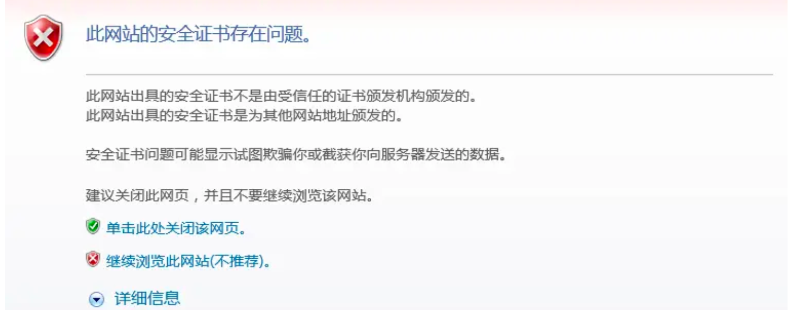

对于 HTTPS 连接来说，中间人要满足以下两点，才能实现真正的明文代理:

1. 中间人，作为客户端与真实服务端建立连接这一步不会有问题，因为服务端不会校验客户端的身份
2. 中间人，作为服务端与真实客户端建立连接，这里会有客户端信任服务端的问题，也就是服务端必须有对应域名的私钥

可以通过 HTTPS 双向认证（服务端也认证客户端）、客户端本地认证安全避免

<br>

## 5. HTTPS 建立连接过程

### 5.1 SSL/TLS 协议基本流程

1. TLS 握手过程：

    - 客户端向服务器索要并验证服务器的公钥

    - 双方协商生产「会话密钥」

2. 双方采用「会话密钥」进行加密通信

**TLS 需要经过「四个消息」完成，即 2 个`RTT`时延**

- 不同的密钥交换算法，TLS 的握手过程会有区别，主要使用的是 RAS 和 ECDHE 算法

`RTT`时延：Round-Trip Time，指把数据从发送端发送到接收端，再返回发送端所经历的时间

<br>

### 5.2 RAS 算法

#### RAS 密钥协商算法

客户端会生成随机密钥，使用服务端的公钥加密后再传给服务端（根据非对称加密算法，公钥加密的消息仅能通过私钥解密），服务端解密后就得到了相同的密钥，再用它加密应用信息

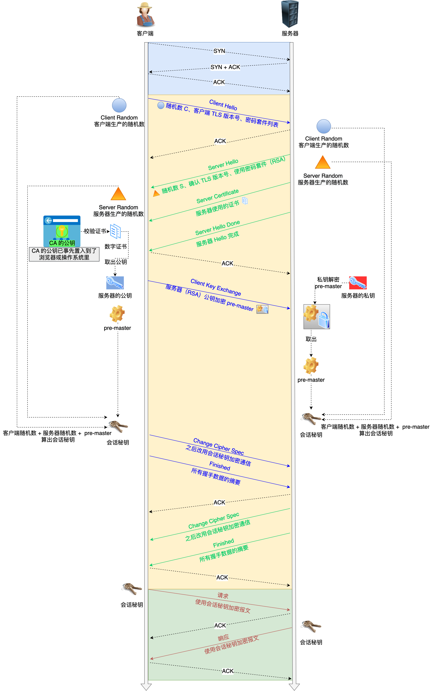

**TLS 第一次握手**：`客户端 -> 服务端`

1. 客户端发送「**Client Hello**」消息给服务端

    - 消息包含客户端使用的 TLS 版本号、支持的密码套件列表，以及生成的随机数（Client Random）

    - 这个随机数将被服务端保留，即生成对称加密密钥的材料之一

**TLS 第二次握手**：`服务端 -> 客户端`

1. 服务端收到消息，确认 TLS 版本号是否支持，从密码套件列表中选择一个密码套件，生成**随机数**；
2.  返回「**Server Hello**」消息，消息包含确认的 TLS 版本号、随机数（Server Random）、选择的密码套件；
3. 服务端发送「**Server Certificate**」消息证明身份，其中含有数字证书；
4. 服务端发送「**Server Hello Done**」消息，通知客户端消息发送完毕。
    - 这里的三个消息实际上是三个记录，组合成一个 TCP 包发送给客户端

**TLS 第三次握手**：`客户端 -> 服务端`

1. 客户端验证证书并认为可信；生成新的随机数（pre-master），用服务器的 RSA 公钥加密该随机数
2. 通过「**Client Key Exchange**」消息将随机数传给服务端
    - 双方根据共享的三个随机数（Clinet Random，Server Random，pre-master）生成会话密钥
3. 发送「**Change Cipher Spec**」消息，告诉服务端开始使用加密方式发送消息
4. 发送「**Encrypted Handshake Message**」消息
    - 把之前所有发送的数据做个**摘要**
    - 再用会话密钥加密，让服务器做验证加密通信「是否可用」和「之前握手信息是否有被中途篡改过」

**TLS 第四次握手**：`服务端 -> 客户端`

1. 服务端也发送「**Change Cipher Spec**」和「**Encrypted Handshake Message**」消息
    - 让客户端验证，验证加密和解密都没问题，至此握手正式完成

四次握手结束后，就可以通过「会话密钥」加密 HTTP 请求和响应

<br>

**密码套件**：指在加密通信中使用的一组密码学算法、密钥长度和其他相关参数的集合

- 基本形式：「密钥交换算法 + 签名算法 + 对称加密算法 + 摘要算法」

#### 客户端验证证书

客户端在第二次握手后拿到数字证书，其中通常包括：

- 公钥
- 持有者信息
- 证书认证机构（CA）的信息
- CA 对这份文件的数字签名及使用的算法
- 证书有效期
- 还有一些其他额外信息

**数字证书验证流程**：

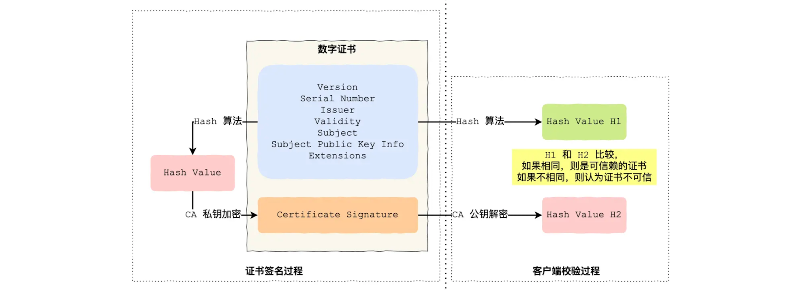

CA 签发证书：

1. CA 把持有者的公钥、用途、颁发者、有效时间等信息打成一个包，对这些信息进行 Hash 计算，得到哈希值
2. CA 使用自己的私钥对哈希值加密，生成`Certificate Signature`，即对证书签名
3. 将签名添加到文件证书中，形成数字证书

客户端校验证书：

4. 客户端使用相同的 Hash 算法获取证书的哈希值`H1`
5. 通常浏览器和操作系统中集成了 CA 的公钥信息，浏览器收到证书后可以使用 CA 的公钥解密`Certificate Signature`内容，得到一个 Hash 值`H2`
6. 最后比` H1`和`H2`，如果值相同，则为可信赖的证书，否则则认为证书不可信

<br>

#### RAS 缺陷：不支持前向保密

因为客户端传递随机数（用于生成对称加密密钥的条件之一）给服务端时使用的是公钥加密的

服务端收到后，会用私钥解密得到随机数

所以一旦服务端的私钥泄漏了，过去被第三方截获的所有 TLS 通讯密文都会被破解

<br>

### 5.3 ECDHE 算法

> RSA 算法不具备前向安全性质，现在广泛使用 ECDHE 密钥加密算法

#### 算法基础

**离散对数**（DH 算法的数学基础）


- 底数 a 和模数 p 是公共参数，b 是实数，i 是对数
- 知道对数，就可以通过公式计算出来实数，但反过来，知道实数，很难推导出对数

**DH 算法**：底数和模数公开，记为 P 和 G；加密双方各自持有私钥，记为 a 和 b

- 双方的公钥分别为`A = G^a (mod P)`和`B = G^b (mod P)`，就是上面说的实数
- 根据公钥，双方可以得到「对称加密秘钥」`K =  A^b (mod P ) =  B^a (mod P) `（离散对数的幂运算交换律）

**DHE 算法**：通信双方的私钥在每次密钥交换通信时，都是临时的、随机生成的，即便某次私钥被破解，但每个通信过程之间是独立的，即保证了「前向安全」（E，ephemeral，临时性的）

**总结**：加密的双方各自持有私钥和公开的`P,G,A,B`，通过私钥进行两次离散对数操作可以得到「对称加密密钥」；没有私钥，DH 密钥交换就是安全的；在此基础上，每次通信都使用临时的、随机生成的私钥，即便某一次私钥被破解，其余通信过程仍然是安全的

#### ECDHE 算法

ECDHE 算法是在 DHE 算法的基础上利用了 ECC 椭圆曲线特性，可以用更少的计算量计算出公钥，以及最终的会话密钥

<br>

#### ECDHE 握手过程

**TLS 第一次握手**：`客户端 -> 服务端`

1. 客户端发送「**Client Hello**」消息给服务端
    - 消息包含客户端使用的 TLS 版本号、支持的密码套件列表，以及生成的随机数（Client Random）

**TLS 第二次握手**：`服务端 -> 客户端`

1. 服务端收到消息，确认 TLS 版本号是否支持，从密码套件列表中选择一个密码套件，生成**随机数**；
2.  返回「**Server Hello**」消息，消息包含确认的 TLS 版本号、随机数（Server Random）、选择的密码套件；
3. 服务端发送「**Server Certificate**」消息证明身份，其中含有数字证书；
4. 服务端发送「**Server Key Exchange**」消息
    - 选择公开的椭圆曲线及其参数，生成随机私钥，计算出椭圆曲线公钥并对其做签名（保证不被篡改）
5. 服务端发送「**Server Hello Done**」消息，通知客户端消息发送完毕。

**TLS 第三次握手**：`客户端 -> 服务端`

1. 客户端验证证书并认为可信；生成随机数作为椭圆曲线的私钥，生成椭圆曲线公钥
2. 通过「**Client Key Exchange**」消息将公钥传给服务端
    - 双方此时共享椭圆曲线公钥、自己的椭圆曲线私钥、椭圆曲线参数，由此得到共享密钥 X
    - `X + Client Random + Server Random` 生成最终的会话密钥
3. 发送「**Change Cipher Spec**」消息，告诉服务端开始使用对称加密算法通信
4. 发送「**Encrypted Handshake Message**」消息
    - 把之前所有发送的数据做个**摘要**
    - 再用会话密钥加密，让服务器做验证加密通信「是否可用」和「之前握手信息是否有被中途篡改过」

**TLS 第四次握手**：`服务端 -> 客户端`

1. 服务端也发送「**Change Cipher Spec**」和「**Encrypted Handshake Message**」消息
    - 让客户端验证，验证加密和解密都没问题，至此握手正式完成

四次握手结束后，就可以通过「会话密钥」加密 HTTP 请求和响应

<br>

### 5.4 RAS 和 ECDHE  算法的区别

1. RAS 算法不支持前向保密，而 ECDHE 支持
2. 使用了 RSA 密钥协商算法，TLS 完成四次握手后，才能进行应用数据传输，而对于 ECDHE 算法，客户端可以不用等服务端的最后一次 TLS 握手，就可以提前发出加密的 HTTP 数据，节省了一个消息的往返时间
3. 使用 ECDHE， 在 TLS 第二次握手中，会出现服务器端发出的「Server Key Exchange」消息，而 RSA 握手过程没有该消息

<br>

## 6. HTTP/1.1, HTTP/2, HTTP/3

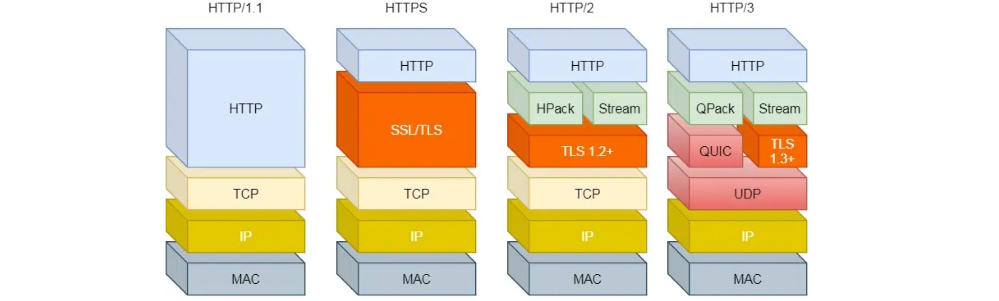

### 6.1 HTTP/1.1

**相较于 HTTP/1.0 的改进**：

1. 使用长连接改善了 HTTP/1.0 短连接造成的性能开销
2. 支持管道（pipeline）网络传输，只要第一个请求发出去，不必等其回来，就可以发第二个请求出去，减少整体的响应时间

**HTTP/1.1 的性能瓶颈**：

1. 请求/响应头部未经压缩就发送，Header 信息越多延迟越大，只能压缩 Body 部分
2. 发送冗长的首部，每次互相发送相同的首部造成的浪费很多
3. 服务器是按请求的顺序响应的，如果服务器响应慢，会导致客户端一直请求不到数据，即队头阻塞
4. 没有请求优先级控制
5. 请求只能从客户端开始，服务端只能被动响应

<br>

### 6.2 HTTP/2 

**HTTP/2 的改进**：基于 HTTPS，头部压缩、二进制格式、并发传输、服务器主动推送资源

#### 头部压缩

**HPACK 算法**：在客户端和服务器同时维护一张头信息表，所有字段都会存入这个表，生成一个索引号，以后就不发送同样字段了，只发送索引号，从而提高速度

- HTTP/2 会压缩头，头部表会保存在两端的内存中

#### 二进制格式

头信息和数据体都是二进制，统称为帧：**头信息帧（Headers Frame），数据帧（Data Frame）**

- 收到报文后，计算机直接解析二进制报文，增加了数据传输的效率

#### 并发执行

> 引出 Stream 概念，多个 Stream 复用一条 TCP 连接

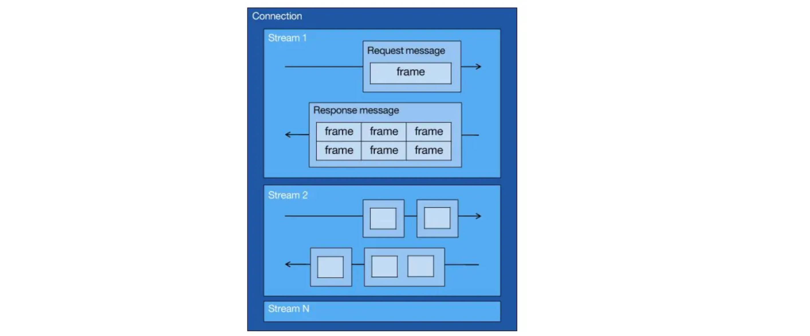

- 1 个 TCP 连接包含多个 Stream
- Stream 里可以包含 1 个或多个 Message
- Message 对应 HTTP/1 中的请求或响应，由 HTTP 头部和包体构成
- Message 里包含一条或者多个 Frame，Frame 是 HTTP/2 最小单位，以二进制压缩格式存放 HTTP/1 中的内容

**针对不同的 HTTP 请求用独一无二的 Stream ID 来区分，接收端可以通过 Stream ID 有序组装成 HTTP 消息，不同 Stream 的帧是可以乱序发送的，因此可以并发不同的 Stream ，也就是 HTTP/2 可以并行交错地发送请求和响应**
「流间并行，流内串行，整体并发」

#### 服务端推送

- 服务端在收到资源请求后，可以根据请求的资源类型和其他相关信息决定是否主动推送其他相关资源
    - 如请求 HTML 资源时，服务端会主动推送其依赖的 CSS 资源

- 客户端收到推送资源后，可以根据需要决定是否使用这些资源

#### HTTP/2 的缺陷

HTTP/2 没有解决队头阻塞问题，一旦发生丢包，就会触发 TCP 重传机制

这样在一个 TCP 连接中的**所有的 HTTP 请求都必须等待这个丢了的包被重传回来**（属于 TCP 层的队头阻塞）

- HTTP/2  基于 TCP 传输数据，TCP 是字节流协议
- 而 TCP 层必须保证收到的字节数据是完整且连续的，这样内核才会将缓冲区里的数据返回给 HTTP 应用
- 当「前 1 个字节数据」没有到达时，后收到的字节数据只能存放在内核缓冲区里，只有等到这 1 个字节数据到达时，HTTP/2 应用层才能从内核中拿到数据

<br>

### 6.3 HTTP/3

HTTP/1.1 使用管道（ pipeline）解决了请求的队头阻塞

HTTP/2 通过多个请求复用一个 TCP 连接解决了 HTTP 的队头阻塞，但无法解决 TCP 层队头阻塞

**HTTP/3 将 HTTP 下层的 TCP 协议改成了 UDP**

- UDP 不保证数据的完整性和可靠性，不会处理丢包问题
- 使用基于 UDP 的「**QUIC 协议**」可以实现类似 TCP 的可靠传输

<br>

#### QUIC 协议

> QUIC 是一个在 UDP 之上的**伪** TCP + TLS + HTTP/2 的多路复用的协议

**无队头阻塞**：QUIC 也有流 Stream 的概念，当某个流发生丢包时，只阻塞这个流，其他流不受影响

- QUIC 连接上的多个流之间没有依赖，都是独立的

**更快的连接建立**： 传输数据前需要 QUIC 协议握手，但只需要 1 RTT

- QUIC 协议并不是与 TLS 分层，而是 QUIC 内部包含了 TLS，它在自己的帧会携带 TLS 里的“记录”，再加上 QUIC 使用的是 TLS/1.3，因此仅需 1 个 RTT 就可以「同时」完成建立连接与密钥协商

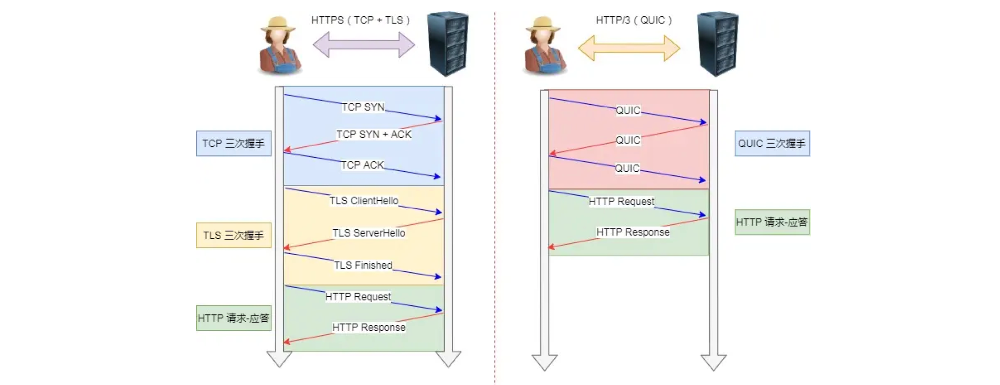

- 甚至，在第二次连接的时候，应用数据包可以和 QUIC 握手信息（连接信息 + TLS 信息）一起发送，达到 0-RTT 的效果

**连接迁移**：QUIC 通过**连接 ID** 标记通信的两个端点

- 客户端和服务器可以各自选择一组 ID 来标记自己
- 因此即使移动设备的网络变化后，导致 IP 地址变化了，只要仍保有上下文信息（比如连接 ID、TLS 密钥等），就可以“无缝”地复用原连接，消除重连的成本，没有丝毫卡顿感，达到了**连接迁移**的功能

基于 TCP 传输协议的 HTTP 协议，由于是通过四元组（源 IP、源端口、目的 IP、目的端口）确定一条 TCP 连接

当移动设备的网络从 4G 切换到 WIFI 时，意味着 IP 地址变化了，那么就必须要断开连接，然后重新建立连接

<br>

#### HTTP 3 缺点：普及进度慢

- QUIC 作为新协议，很多网络设备仍将其只当做 UDP
- 有的网络设备是会丢掉 UDP 包的，而 QUIC 是基于 UDP 实现的，那么如果网络设备无法识别这个是 QUIC 包，那么就会当作 UDP包，然后被丢弃

<br>

## 7. HTTPS 如何优化

https://www.xiaolincoding.com/network/2_http/https_optimize.html

<br>

## 8. HTTP 和 RPC

https://www.xiaolincoding.com/network/2_http/http_rpc.html#http-%E5%92%8C-rpc

<br>

## 9. HTTP 和 WebSocket

https://www.xiaolincoding.com/network/2_http/http_websocket.html#%E4%BD%BF%E7%94%A8-http-%E4%B8%8D%E6%96%AD%E8%BD%AE%E8%AF%A2

<br>

<br>

# TCP

## 1. TCP 基本概念

### 1.1 TCP

TCP 是**面向连接的**、**可靠的**、**基于字节流的**传输层通信协议

- IP 层是不可靠的，不保证网络包的按序交付、网络包的交付，也不保证网络包中的数据的完整性
- 这些任务需要上层的 TCP 协议负责
- TCP 是一个工作在**传输层**的**可靠**数据传输的服务，它能确保接收端接收的网络包是按序完整的

<br>

### 1.2 TCP 连接及其头格式

**Socket**（IP 地址和端口号）、**序列号**、**窗口大小**是 TCP 连接建立的基础

- 通过源地址、源端口、目标地址、目标端口可以唯一确定一个 TCP 连接

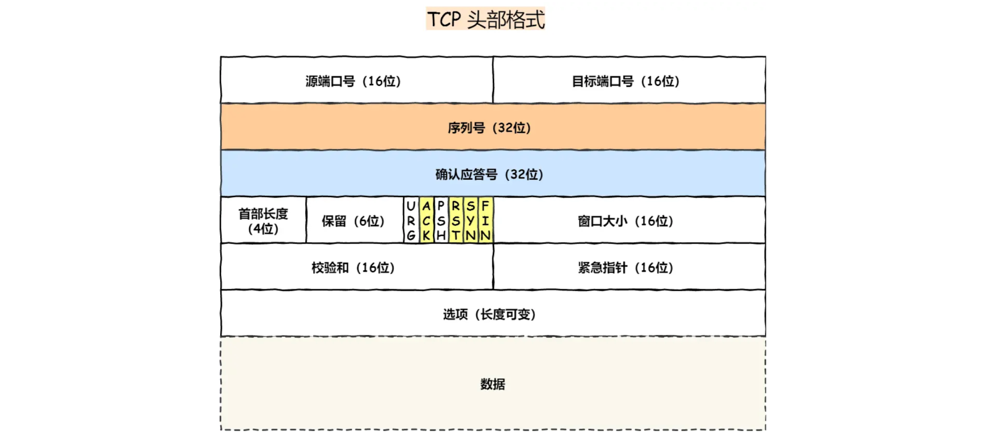

**源端口号、目的端口号**：知道发送给哪个应用

**序列号**：在 TCP 连接的建立阶段由双方协定，并在数据传输过程中动态更新。每个数据包都会使用上一个数据包的序列号加上数据长度来计算自己的序列号，从而确保序列号在整个数据流中是唯一的且按顺序递增的（解决网络乱序问题）

**确认号**：是下一次「期望」收到的数据序列号，发送端收到确认应答后认为在这个序号以前的数据都被正常接收（解决丢包问题）

**控制位**：TCP 是面向连接的，使用控制位维护或变更双方连接的状态

- `ACK`：ACK=1 时，「确认应答」字段有效；TCP 规定除了最初建立连接时的 `SYN` 包之外该位必须设置为 `1`
- `RST`：RST=1 时，表示 TCP 连接中出现异常，必须断开连接
- `SYN`：SYN=1 时，表示希望建立连接，并在其「序列号」字段进行能序列号初始值的设定
- `FIN`：FIN=1 时，表示之后不会再有数据发生，希望断开连接；当通信结束希望断开连接时，通信双方的主机之间就可以相互交换 `FIN` 位为 1 的 TCP 段

**窗口大小**：用于 TCP 的流量控制，通信双方各声明一个窗口（缓存大小），标识自己当前能够处理的能力

- 除了流量控制，TCP 还要做拥塞控制

<br>

### 1.3 TCP 对比 UDP

UDP 是**无连接的**、**不可靠的**、**以包为单位的**传输层协议

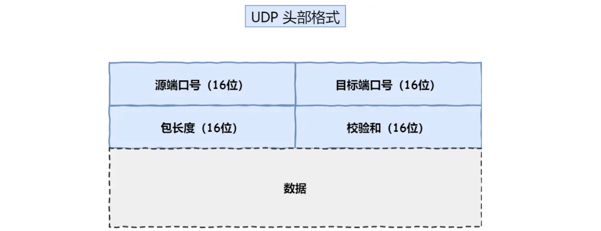

**包长度**：UDP 首部和数据长度之和

**校验和**：提供可靠的 UDP 首部和数据而设计，防止收到在网络传输中受损的 UDP 包

#### TCP vs UDP

1. TCP 是面向连接的，传输前要先建立连接；UDP 不需要连接
2. TCP 是一对一的；UDP 支持一对一、一对多、多对对的交互通信
3. TCP 是可靠交付数据的；UDP 是尽最大努力交付
4. TCP 有拥塞控制和流量控制机制；UDP 没有
5. TCP 首部较长开销较大；UDP 首部只有 8 个字节，开销较小
6. TCP 是流式传输；UDP 是以包为单位发送
7. TCP 数据如果大于 MSS，会在传输层进行分片；UDP 数据如果待遇 MTU，会在 IP 层进行分片

#### 应用场景

TCP 用于 FTP 文件传输、HTTP/HTTPS 传输

UDP 面向无连接、随时发送数据，本身简单高效，适合：

- 包总量较少的：DNS、SNMP（简单网络管理协议）
- 视频、音频等多媒体通信
- 广播通信

<br>

### 1.4 TCP 分割数据

`MTU`：最大传输单元，是网络包的最大长度，以太网中一般为 1500 字节

`MSS`：最大分段大小，除去 IP 和 TCP 头部后，一个网络包能容纳的 TCP 数据的最大长度

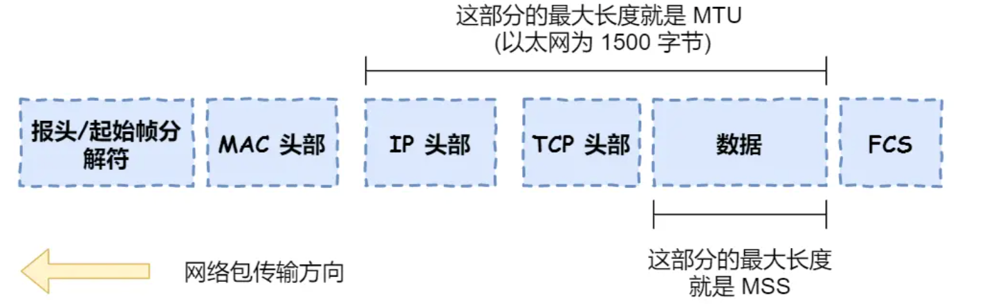

建立连接时要协商双方的 MSS 值，在 TCP 层对超过 MSS 的数据包进行分片，分片后也会小于 MTU

丢失一个分片，只需重发这个分片即可

- 如果在 IP 层进行分片，没有超时重传机制，组装得到 TCP 报文后如果发生丢包，需要重传整个分片前的 IP 报文

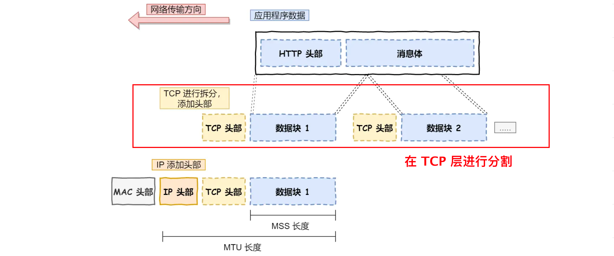

- 数据会以`MSS`的长度为单位进行拆分，拆分出来的每一块数据都会被放进单独的网络包中，加上 TCP 头部后交给 IP

<br>

## 2. 三次握手，四次挥手

### 2.1 TCP 建立连接

#### 三次握手

> 三次握手的目的，是保证双方都有发送和接收的能力

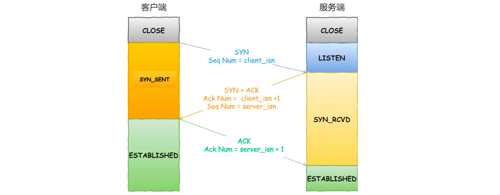

**第一次握手**：客户端发送`SYN`报文给服务端

1. 服务端主动监听端口，处于`LISTEN`状态
2. 客户端随机初始化序号`client_isn`，将`SYN`置 1，把第一个`SYN`报文发送给服务端，发起连接
3. 客户端处于`SYN-SENT`状态

**第二次握手**：服务端返回`SYN + ACK`报文

1. 服务端收到报文，随机初始化序列号`server_isn`
2. 将首部「确认号」位置填入`client_isn + 1`
3. `SYN`和`ACK`标志置 1，将该报文发送回客户端
4. 服务端处于`SYN_RCVD`·状态

**第三次握手**：客户端发送`ACK`应答报文

1. 客户端收到报文，回应应答报文，将首部`ACK`置 1
2. 「确认号」位置填入`server_isn + 1`
3. 将报文发送给服务端，本次报文已经可以携带客户端到服务端的数据
4. 客户端处于`ESTABLISHED`连接成立状态
5. 服务端收到应答报文后，也进入`ESTABLISHED`状态

<br>

#### **Q1：为什么是三次握手？**

「两次握手」：无法防止历史连接的建立，会造成双方资源的浪费，也无法可靠的同步双方序列号

「四次握手」：三次握手就已经理论上最少可靠连接建立，所以不需要使用更多的通信次数

**防止旧的重复连接初始化造成混乱**：

- 当一个「旧 SYN 报文」比「最新的 SYN」 报文早到达了服务端，服务端返回旧序列号的`SYN + ACK`报文，客户端收到后发现确认号不符合，直接返回`RST`报文释放连接，后续根据新报文建立连接
- 两次握手，服务端没有中间状态给客户端来阻止历史连接（收到 SYN 报文后直接进入`ESTABLISHED`状态），客户端判断是历史连接则断开连接，而服务端不会收到 RST 报文而断开连接，可以发送数据

**同步双方初始序列号**：后两次握手都有`ACK`置 1，填入确认号，用于不重复的、按序的接收数据

- 四次握手是将第二次的 SYN 报文和 ACK 报文分开，其实可以优化为一步
- 两次握手无法同步序列号

**避免资源浪费**：

- 如果省略第三次握手，服务端无法确认客户端是否收到 ACK 报文，在第一次握手后就直接建立连接；客户端因为网络阻塞发送了多个 SYN 报文，服务端就会因此建立多个冗余的无效链接

#### Q2：为什么每次初始化序列号要求随机？

1. 防止相同四元组之间建立多个 TCP 连接时造成混乱
2. 防止黑客伪造相同序列号的 TCP 报文被对方接收

#### Q3：第一次握手丢失？

客户端无法收到服务端的 SYN-ACK 报文，就会触发「超时重传」机制，重传 SYN 报文

- 每次超时的时间是上一次的两倍
- Linux 默认设置最大重传次数为`5`，等待时间没有收到 ACK，客户端就会断开 TCP 连接

#### Q4：第二次握手丢失？

客户端接收不到 ACK 报文，会认为第一次握手丢失，触发超时重传机制，重传 SYN 报文

服务端收不到第三次握手的 ACK 报文，也会触发超时重传机制，重传 SYN-ACK 报文

#### Q5：第三次握手丢失？

ACK 报文是不会有重传的，此时客户端已经进入连接状态

服务端无法收到 ACK 报文，会重传 SYN-ACK 报文，等待收到第三次握手或达到最大重传次数

#### Q6：什么是 SYN 攻击？如何避免？

在 TCP 三次握手的时候，Linux 内核会维护两个队列

SYN 队列：半连接队列

Accept 队列：全连接队列

- 当服务端接收到客户端的 SYN 报文时，会创建一个半连接的对象，然后将其加入到内核的「 SYN 队列」
- 接着发送 SYN + ACK 给客户端，等待客户端回应 ACK 报文
- 服务端接收到 ACK 报文后，从「 SYN 队列」取出一个半连接对象，然后创建一个新的连接对象放入到「 Accept 队列」
- 应用通过调用 `accpet()` socket 接口，从「 Accept 队列」取出连接对象

TCP 连接建立是需要三次握手，假设攻击者短时间伪造不同 IP 地址的 `SYN` 报文，服务端每接收到一个 `SYN` 报文，就进入`SYN_RCVD` 状态，但服务端发送出去的 `ACK + SYN` 报文，无法得到未知 IP 主机的 `ACK` 应答，久而久之就会**占满服务端的半连接队列**，使得服务端不能为正常用户服务

- TCP 半连接队列满了，后续再收到 SYN 报文就会丢弃，导致无法正常建立连接
- 解决方案
    - 增大 TCP 半连接队列
    - 开启 tcp_syncookies，在队列满后计算 SYN 包的 cookie 值用以校验
    - 减少 SYN+ACK 重传次数

<br>

### 2.2 TCP 断开连接

#### 四次挥手

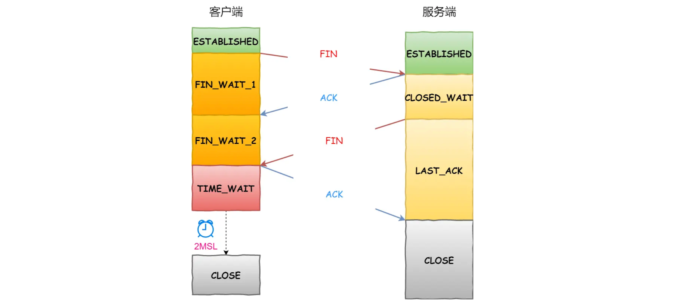

> 主动关闭连接的，才有`FIN_WAIT_1`状态
>
> 一个 FIN 对应一个 ACK

**第一次挥手**：客户端发送 FIN 报文给服务端

1. 客户端主动断开连接，发送`FIN`报文（FIN 位置 1）给服务端
2. 客户端进入`FIN_WAIT_1`状态

**第二次挥手**：服务端回复 ACK 报文给客户端

1. 服务端收到报文，向客户端发送`ACK`应答报文
2. 服务端进入`CLOSE_WAIT`状态，开始处理数据

**第三次挥手**：服务端发送 FIN 报文给客户端

1. 服务端处理完数据后，也向客户端发送`FIN`报文
2. 服务端进入`LAST_ACK`状态

**第四次挥手**：客户端回复 ACK 报文给服务端

1. 客户端收到`ACK`报文，进入`FIN_WAIT_2`状态
2. 客户端收到`FIN`报文，回复`ACK`应答报文
3. 客户端进入`TIME_WAIT`状态

**后续**：

1. 服务端收到`ACK`报文，直接进入`CLOSE`状态，服务端连接关闭
2. 客户端在经过`2MSL`后，自动进入`CLOSE`状态，客户端连接关闭

<br>

#### Q1：为什么需要四次挥手？

关闭连接时，客户端向服务端发送 `FIN` 时，仅仅表示客户端不再发送数据了但是还能接收数据

服务端收到客户端的 `FIN` 报文时，先回一个 `ACK` 应答报文，而服务端可能还有数据需要处理和发送，等服务端不再发送数据时，才发送 `FIN` 报文给客户端来表示同意现在关闭连接

- 不发送数据时，将 FIN 位置 1

#### Q2：挥手丢失情况

第一次挥手丢失：客户端收不到 ACK 应答，触发超时重传，超过限制后就等待一段时间后进入`CLOSE`状态

第二次挥手丢失：同一

第三次挥手丢失：服务端收不到第四次挥手的 ACK 应答，触发超时重传，超过限制后就等待一段时间后进入`CLOSE`状态；客户端收不到 FIN 报文，等待（默认 60s）一段时间后直接关闭连接

第四次挥手丢失：客户端等待`2MSL`后关闭，服务端同三

- 客户端在第三次挥手后的等待时间内，如果再次收到第三次挥手，会重置等待 2MSL

#### Q3：2MSL 是什么个情况？

`MSL`：报文最大生存时间，超过该时间报文会被丢弃，在 Linux 中设置为 30秒

`TTL`：最大路由数，即 IP 数据包经过的路由最大跳数，在 Linux 中设置为 64（小于等于 MSL）

**等待 2MSL**：至少允许报文丢弃一次，即 ACK 在一个 MSL 内丢失，被动方重传的 FIN 会在第二个 MSL 内到达

- 此时客户端重新第四次挥手，定时器重置

**等待的原因**：

1. 防止历史连接中的数据，被相同四元组的连接错误接收（等待至原来连接的数据包在网络中都消失）
    - 序列号不会无限递增，会绕回初始值
    - 等待时间不足，可能在新建连接后，收到断开连接前的数据包
2. 保证被动关闭连接的一方，能正确关闭，即保证第四次挥手的 ACK 报文被对方接收到

<br>

## 3. TCP 机制

### 3.1 重传机制

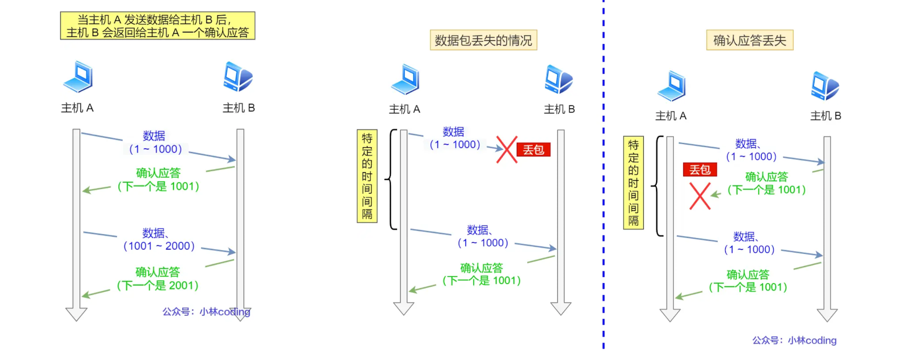

序列号和确认号一一对应，是 TCP 实现可靠传输的方式之一

- 当发送端的数据到达时，接收端会返回一个确认应当消息，表示已经收到消息

#### 超时重传

在发送数据时，设定一个定时器，超过指定时间且没有收到 ACK 应当报文，就会重发该数据

`RTT`：往返时延

`RT0`：超时重传时间（较大会导致重发缓慢，较小会导致不必要的重传）

- 通过采样得到 RTT 的平均值以及波动范围，RT0 应该略大于 RTT
- 对于连续的超时重传，设定间隔时间加倍，并设置最大重传次数

#### 快速重传

> 不以时间驱动重传，以数据驱动重传

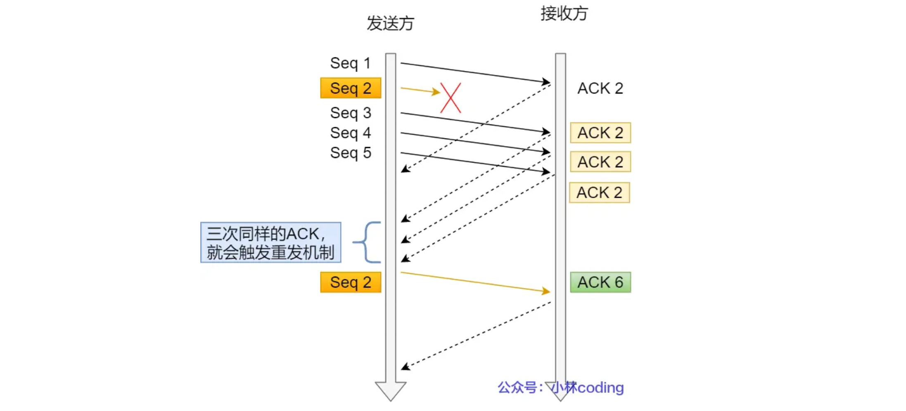

在上图，发送方发出了 1，2，3，4，5 份数据：

- 第一份 Seq1 先送到了，于是就 Ack 回 2
- 结果 Seq2 因为某些原因没收到，Seq3 到达了，于是还是 Ack 回 2
- 后面的 Seq4 和 Seq5 都到了，但还是 Ack 回 2，因为 Seq2 还是没有收到
- **发送端收到了三个 Ack = 2 的确认，知道了 Seq2 还没有收到，就会在定时器过期之前，重传丢失的 Seq2**
- 最后，收到了 Seq2，此时因为 Seq3，Seq4，Seq5 都收到了，于是 Ack 回 6

快速重传：当收到三个相同的 ACK 报文后，会在定时器到期之前，重传丢失的报文段

#### SACK 方法

使用快速重传，只重传丢失的报文段或重传后续所有报文段都存在问题

`SACK`，选择性确认

在 TCP 头部加上 SACK 字段，标记接收方已经收到的数据，告知发送方**只重传丢失的数据**

#### D-SACK 方法

Duplicate Sack：使用 SACK 告知发送方有哪些数据被重复接收了

1. 可以让「发送方」知道，是发出去的包丢了，还是接收方回应的 ACK 包丢了（会重复接收）
2. 可以知道是不是「发送方」的数据包被网络延迟了（会重复接收）
3. 可以知道网络中是不是把「发送方」的数据包给复制了

<br>

### 3.2 滑动窗口机制

**窗口**：指定窗口大小，开辟缓存空间，每个窗口内的 TCP 段之间，无需等待确认应答，即可继续发送数据

**窗口大小**：TCP 头部的一个字段，是接收端告诉发送端自己还有多少缓冲区可以接收数据，于是发送端就可以根据这个接收端的处理能力来发送数据，而不会导致接收端处理不过来

- 窗口大小是由接收方决定的

**累计确认**：例如 ACK 600 丢失，如果收到了 ACK 700，说明 700 之前的数据都被成功接收了，包括了 ACK 600

#### 发送方的滑动窗口

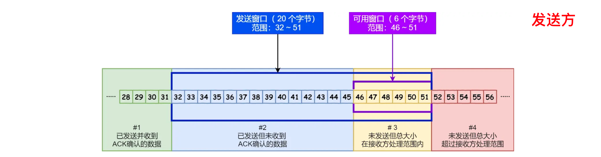

- 滑动窗口的单位是字节 byte
- 当发送方发送了全部窗口大小的数据，#3 变为 0 B

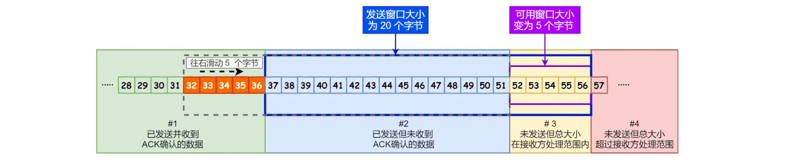

- 接收到 ACK 36，#2 向后滑动，#3 补充新的未发生字节
- 在程序中，由三个指针跟踪滑动窗口

`SND.WND`：发送窗口的大小（由接收方决定）

`SND.UNA`：绝对指针，指向已发送但未收到确认的第一个字节的序列号（#2 的第一个字节）

`SND.NXT`：绝对指针（指向内存特定位置），指向 #3 的第一个字节

#### 接收方的滑动窗口

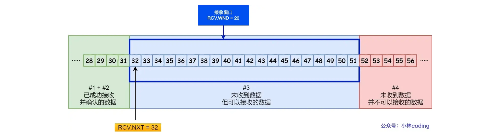

`RCV.WND`：表示接收窗口大小（会告知发送方，和发送窗口大小不一定相等，是动态调整的）

`RCV.NXT`：指向期望从发送方发送来的下一个数据字节的序列号

<br>

### 3.3 流量控制

TCP 提供的可以让「发送方」根据「接收方」的实际接收能力控制发送数据量的机制，即流量控制

发送窗口、接收窗口都是在操作系统内存缓冲区开辟的，**会被操作系统调整**

- 当服务端繁忙，应用进程无法及时读取数据，会「收缩窗口」
- 当服务端资源紧张，操作系统可能会直接减少接收缓冲区大小，即「减少缓存」
- 不允许先减少缓存，再收缩窗口，这样会造成丢包问题（接收字节数大于缓存）

**窗口关闭**：TCP 通过控制接收方窗口大小，进而控制发送方发送数据，直到窗口变为 0，此时会阻止发送方发送数据，直到变为非 0

- 当接收方通知「窗口非 0」的报文丢失，发送方处于窗口关闭状态等待，接收方处于等待数据状态，会造成死锁
- 只要 TCP 连接一方收到对方的零窗口通知，就启动**持续计时器**
    - 定时器超时，会发送窗口探测报文，对方接收后会通知当前窗口大小

<br>

### 3.4 拥塞控制

#### 定义拥塞

在网络出现拥堵时，如果继续发送大量数据包，可能会导致数据包时延、丢失等，这时 TCP 就会重传数据，但是一重传就会导致网络的负担更重，于是会导致更大的延迟以及更多的丢包，这个情况就会进入恶性循环被不断地放大....

**拥塞控制**：定义「拥塞窗口 cwnd」，避免发送方的数据填满整个网络

**拥塞窗口 cwnd**：发送方维护的一个状态变量，根据网络的拥塞程度动态变化（和接收窗口取 min）

- 当「发送方」发生超时重传，认为网络出现了拥塞
- 网络没有拥塞，cwnd 增大；出现拥塞，cwnd 减小


#### 慢启动

TCP 在刚建立连接后，会有一个慢启动过程

- 当发送方每收到一个 ACK，拥塞窗口 cwnd 大小就增加一个单位
- cwnd = 1，表示可以传一个`MSS`大小的数据

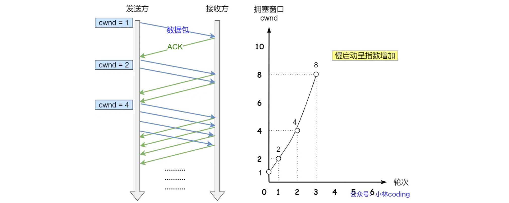

- 在慢启动算法中，发包的个数是指数性增长的

`ssthresh`：慢启动门限，一般是 66535 字节（64KB）

- `cwnd < ssthresh`，使用慢启动算法
- `cwnd >= ssthresh`，使用拥塞避免算法

#### 拥塞避免算法

每当收到一个 ACK，cwnd 增加 `1/cwnd`（每个 RTT 增加一个单位）

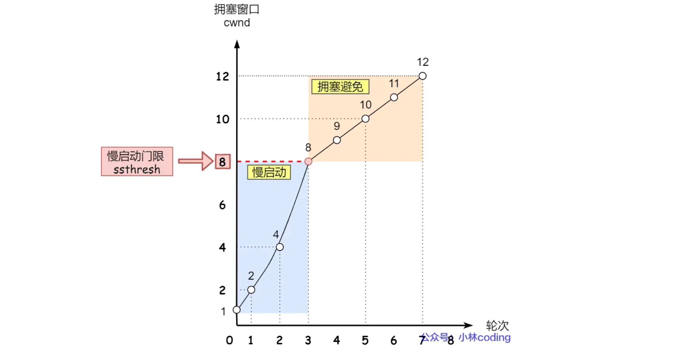

- 达到慢启动门限后，进入线性增长

#### 拥塞发生算法

当拥塞窗口增长到一定程度，网络出现丢包情况，即触发重传机制，进入「拥塞发生算法」

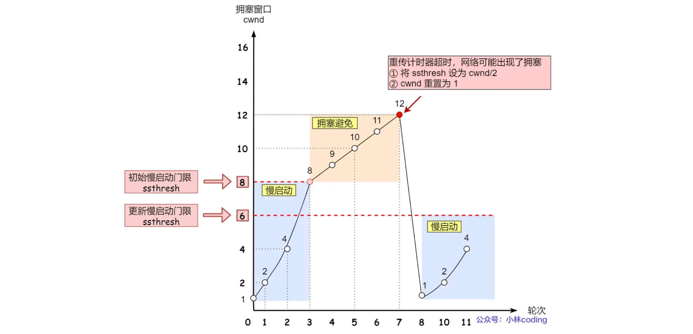

**超时重传拥塞发生算法**：`ssthresh`设为`cwnd/2`，`cwnd`重置为初始值，重新开始慢启动

**快速重传拥塞发生算法**：设置`cwnd = cwnd/2`，`ssthresh = cwnd`，进入「快速恢复算法」

#### 快速回复算法

- 快速回复算法和快速重传一般搭配使用

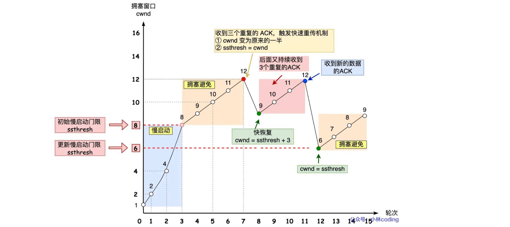

1. 触发快速重传：`cwnd = cwnd/2`，`ssthresh = cwnd`
2. 进入快速恢复：`cwnd = ssthresh + 3`（3 表示收到 3 个重复 ACK）
3. 重传丢失的数据包，如果再收到重复的 ACK，`cwnd++`
4. 如果收到新数据的 ACK，设置`cwnd = ssthresh`，恢复过程结束，进入拥塞避免状态

<br>

# IP

> IP 处于 TCP/IP 参考模型的第三层，网络层
>
> 网络层：实现主机与主机之间的通信，即点对点通信

IP 的作用是在复杂的网络环境中，将数据包发送给最终目的主机

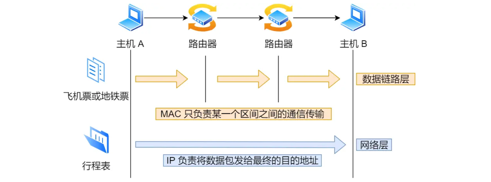

- 与数据链路层的区别是
    - MAC 层实现「直连」两个设备之间通信，即区间节点之间通信
    - IP 负责在没有直连的两个网络之间进行通信传输


# 问题

1. TCP 黏包问题


