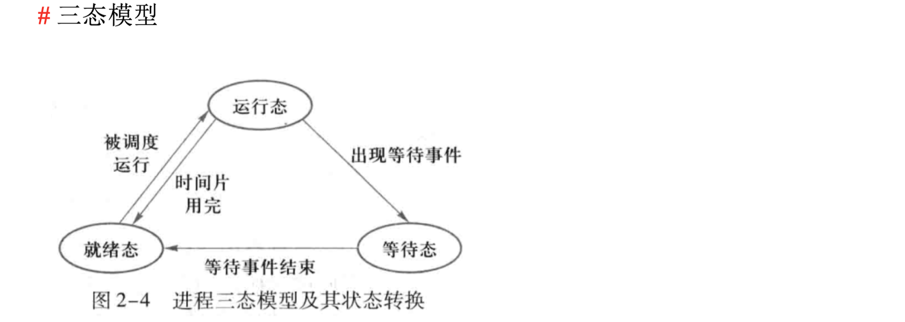
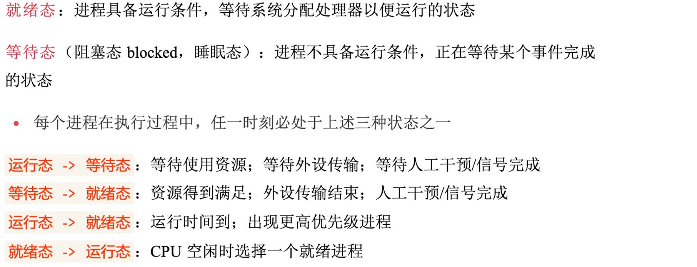
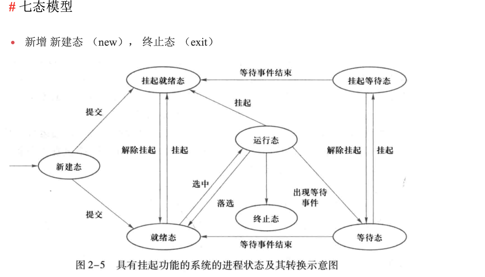
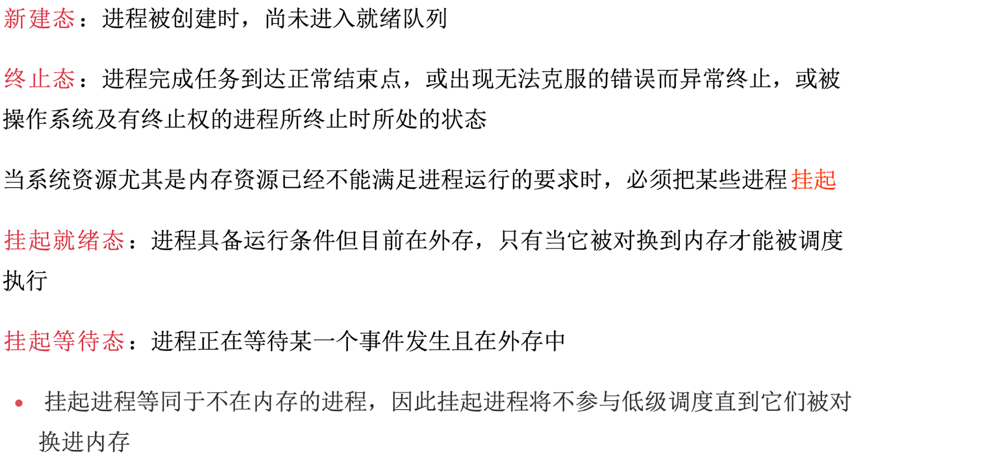

# 进程管理

## 1. 进程、线程、协程

### 1.1 进程

> 我们编写的代码是一个存储在硬盘的静态文件，通过编译后就会生成二进制可执行文件，当我们运行这个可执行文件时，它会被装载到内存中，接着 CPU 会执行程序中的每一条指令，这个运行的程序即是进程

**进程**：具有独立功能的程序在某个数据集合上的一次运行活动，也是操作系统进行资源分配和保护的独立单位；每个进程有自己的独立内存空间，不同进程通过进程间通信方式进行通信

- 程序和数据客户进程的静态特征，PCB 刻画进程的动态特征

**PCB**：内存控制块，OS 记录和刻画进程状态及环境信息的数据结构，是进程存在的唯一标识，与进程一一对应

**进程映像**：某时刻进程的内容及其状态集合，包括：PCB、程序块、数据块、核心块

**进程队列**：把处于同一状态的所有进程的 PCB 链接在一起的数据结构（链表或索引方式）

**上下文**：一个进程切换到另一个进程运行，即上下文切换，需要用到 CPU 寄存器和程序计数器 PC

- 上下文切换不仅包含了虚拟内存、栈、全局变量等用户空间的资源，还包括了内核堆栈、寄存器等内核空间的资源

- PC：用于存储当前正在执行的指令的地址或指针，是 CPU 中一种专用的寄存器，CPU 通过 PC 跟踪执行的指令，以确定下一条要执行的指令

#### 进程状态的转换

​	

​	

​	

 

### 1.2 调度

> 操作系统把进程切换到运行状态，该进程就占用着 CPU 在执行

**非抢占式调度算法**：挑选一个进程，让该进程运行到被阻塞或退出，才会调用另外一个进程

**抢占式调度算法**：挑选一个进程，进程只运行某段时间，时间结束后进程会被挂起，调度程序从就绪队列挑选另外一个进程，在时间间隔末端发生「时钟中断」，即「时间片机制」

#### 调度原则/指标

**CPU 利用率**：调度程序应确保 CPU 是始终匆忙的状态，这可提高 CPU 的利用率；

**系统吞吐量**：吞吐量表示的是单位时间内 CPU 完成进程的数量，长作业的进程会占用较长的 CPU 资源，因此会降低吞吐量，相反，短作业的进程会提升系统吞吐量；

**周转时间**：周转时间是进程运行+阻塞时间+等待时间的总和，一个进程的周转时间越小越好；

**等待时间**：这个等待时间不是阻塞状态的时间，而是进程处于就绪队列的时间，等待的时间越长，用户越不满意；

**响应时间**：用户提交请求到系统第一次产生响应所花费的时间，在交互式系统中，响应时间是衡量调度算法好坏的主要标准。

 

 

### Q1. 并发、并行、串行

**串行**：多个任务按顺序执行，完成一个后才能进行下一个任务

**并发**：同一**时间段**内执行多个任务

**并行**：同一**时刻**执行多个任务

 

### Q2. 进程，线程，协程的区别

**进程**：具有独立功能的程序在某个数据集合上的一次运行活动，也是操作系统进行资源分配和保护的独立单位；每个进程有自己的独立内存空间，不同进程通过进程间通信方式进行通信

**线程**：线程是进程中能够并发执行的实体，是 CPU 调度和分配的基本单位；线程本身只拥有在运行时必不可少的资源（程序计数器、寄存器和栈等），同属一个进程的线程共享进程拥有的全部资源，线程间主要通过共享内存通信

**协程**：一种用户态的轻量级线程，协程不受操作系统的调度，协程的调度器由用户应用程序提供，协程调度器按照调度策略把协程调度到线程中运行（M:N 线程模型），goroutine 就是一种协程

**进程 vs 线程**：线程是调度的基本单位，进程是资源拥有的基本单位

1. 地址空间：线程是进程内的一个执行单元，进程内至少有一个线程，线程间共享进程的地址空间，进程有自己独立的地址空间
2. 资源拥有：进程是资源分配和保护的独立单位，同一个进程的线程间共享资源
3. 线程是处理器调度的基本单位，进程不是
4. 进程和线程均可并发执行
5. 每个独立的线程有一个程序运行的入口、顺序执行序列和程序的出口，但线程不能独立执行，必须依存在应用程序中，由应用程序提供多个线程执行控制（程序运行即是一个进程）

**线程 vs 协程**

1. 线程和协程是 M:N 模型
2. 线程和进程都是同步机制，而协程是异步机制
    - 同步：进程或线程按照既定的顺序执行指令
    - 异步：协程通过暂停和恢复执行的方式，可以实现在一个线程内并发执行
3. 协程能保留上一次调用的状态，每次过程冲入时，相当于进入上一次调用的状态

 

### Q3. 同步和异步

> 同步和异步是指访问数据的机制，或者说是消息通信机制

**同步**：调用方必须等待调用结果返回才能继续执行后续操作（如浏览器发送请求后等待服务器响应返回）

**异步**：调用方不必等待结果返回，而是通过状态、通知或回调函数来处理调用结果

回调函数：常见的编程模式，允许一个函数作为参数传递给另一个函数，并在特定事件发生时被调用

 

