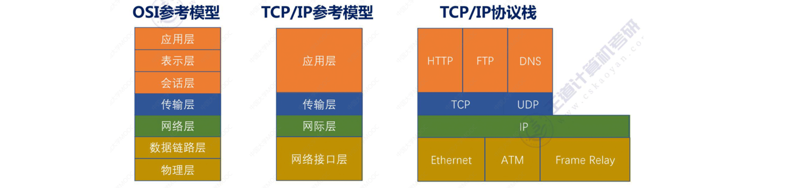
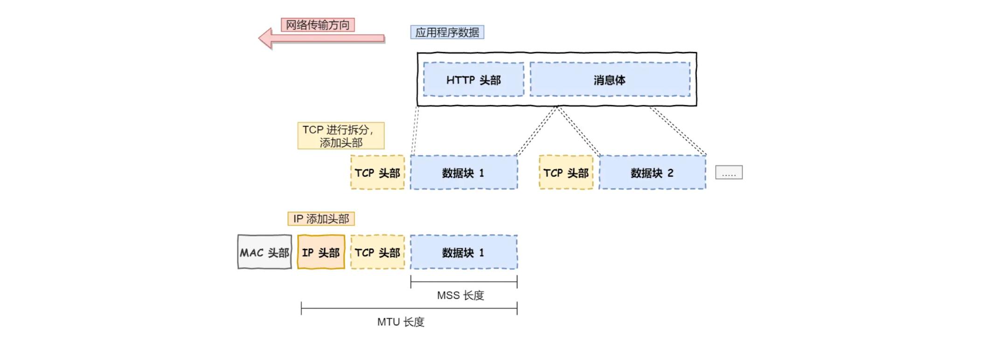
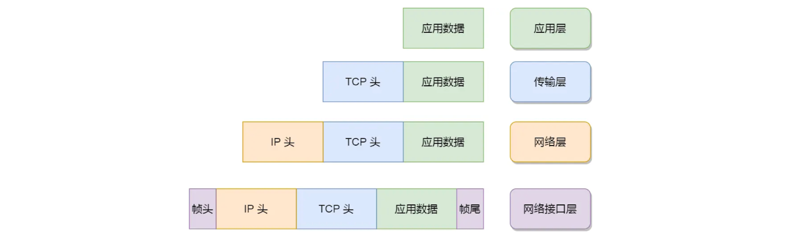

## 0. 问题汇总

Q1. OSI 参考模型和 TCP/IP 参考模型

Q2. TCP/IP 参考模型简介

Q3. 从输入网址到网页显示，期间发生了什么？

## Q1. OSI 参考模型和TCP/IP 参考模型

> 为不同设备上的进程间通信协商出的一套通用的网络协议

### 1.1 OSI 参考模型

**OSI 参考模型**：“物链网输会示用”

**使用 OSI 参考模型的目的**：解决各种不同设备在网络互联中的兼容性问题，使多种设备能够通过网络相互通信

`应用层`：给应用程序提供统一的接口

`表示层`：把数据转换成兼容另一个系统能识别的格式

`会话层`：建立、管理和终止表示层实体之间的通信会话

`传输层`：端到端的数据传输

`网络层`：数据的路由、转发、分片

`数据链路层`：数据的封帧和差错检测，MAC 寻址

`物理层`：物理网络中传输数据帧

> OSI 参考模型过于复杂

#### 1.2 TCP/IP 参考模型简介

`应用层`：给应用程序提供统一的接口，HTTP、DNS、FTP...

`传输层`：端到端的通信，TCP、UDP...

`网络层`：网络包的封装、分片、路由、转发，IP

`网络接口层`：网络包在物理网络中的传输，网络包的封帧、MAC 寻址、差错检测、通过网卡传输网络帧...

**不同协议层的的数据包名称**：

|     层     |                   传输对象                   |
| :--------: | :------------------------------------------: |
|   应用层   |                报文 `Message`                |
|   传输层   | TCP 报文段 `Segment` / UDP 数据报 `Datagram` |
|   网络层   |             数据包/分组 `Packet`             |
| 网络接口层 |                  帧 `Frame`                  |

- 数据封装成帧后发送到传输介质上

### 2.1 应用层

应用层专注于为用户提供应用功能，如 HTTP、FTP、Telnet、DNS、SMTP等，而不用去关心数据是如何传输的

两个不同设备的应用需要通信的时候，应用会把应用数据传给下一层，即「传输层」

应用层工作在 OS 的用户态，其他层则工作在内核态

### 2.2 传输层

应用层的数据包会传给传输层，**传输层是为应用层提供网络支持的**（应用层的传输媒介）

传输层有两个传输协议：

**`TCP`**：传输控制协议，

- 大部分应用使用的正是 TCP 传输层协议，比如 HTTP 应用层协议
- TCP 相比 UDP 多了很多特性，比如流量控制、超时重传、拥塞控制等，这些都是为了保证数据包能可靠地传输给对方

**TCP 段**：应用需要传输的数据可能非常大，当超过 MSS（TCP 最大报文段长度），就需要将数据包分块，这样即使中途有一个分块丢失或损坏了，只需要重新发送这一个分块，而不用重新发送整个数据包，每个分块在 TCP 中称为「TCP 段」

**`UDP`**：用户数据报协议

- 只负责发送数据包，不保证数据包是否能抵达对方
- 实时性相对更好，传输效率也更高
- 如果把 TCP 的特性在应用层上实现，UDP 也可以实现可靠传输 

**端口**：设备作为接收方时，传输层负责把数据包传给应用，一台设备上可能有很多应用在接收或者传输数据，需要用端口这样一个编号将应用区分开

- 80 端口通常是 Web 服务器使用，22 端口通常是远程登录服务器使用
- 浏览器（客户端）中的每个标签栏都是一个独立的进程，操作系统会为这些进程分配临时的端口号
- 传输层的报文中会携带端口号，接收方可以识别出该报文是发送给哪个应用

 

### 2.3 网络层

> 负责实际的传输功能，最常使用的是 IP 协议

#### IP 协议：寻址和路由

> **IP 协议的寻址作用是告诉我们去往下一个目的地该朝哪个方向走，路由则是根据「下一个目的地」选择路径**

将传输层的报文作为数据部分，再加上 IP 报头组成 IP 报文

- 如果 IP 报文大小超过`MTU`（最大传输单元，以太网中一般为1500字节）就会再次进行**分片**，得到一个即将发送到网络的 IP 报文

**IPv4 协议**：IP 地址共 32 位，分成四段，每段 8 位

网络号：标识 IP 地址属于哪个「子网」

主机号：标识同一「子网」下的不同主机

子网掩码：划分网络中主机和子网的 32 位二进制数字，将 IP 地址和子网掩码做「按位与」运算，可以得到网络号
		（网络位设为 1，主机位设为 0）

- 寻址时，先匹配到相同的网络号，才会去找对应的主机

 

**路由**：实际场景中，两条设备是通过很多网关、路由器、交换机等网络设备连接起来，需要路由算法决定下一步走哪条网络路径，从而将数据包发送给下一个网络节点

- 路由器寻址，就是要找到目标地址的子网，进而把数据包转发给对应的网络内

 

### 2.4 网络接口层

> 为网络层提供「链路级别」传输的服务，负责在以太网、WiFi 这样的底层网络上发送原始数据包，工作在网卡这个层次，使用 MAC 地址来标识网络上的设备

生成了 IP 头部之后，接下来要交给**网络接口层**，在 IP 头部的前面加上「MAC 头部」，并封装成**数据帧（Data frame）**发送到网络上

以太网：一种在「局域网」内，把附近的设备连接起来，使它们之间可以进行通讯的技术

在以太网进行通讯，需要使用 **MAC 地址**

**MAC 头部**：以太网使用的头部，包含了接收方和发送方的 MAC 地址等信息，可以通过 ARP 协议获取对方的 MAC 地址

帧 frame：网络接口层的传输单位

包 packet：IP 层的传输单位

段 segment：TCP 层的传输单位

报文/消息 message：HTTP 的传输单位

 

## Q3. 从输入网址到网页显示，期间发生了什么？

## Q4. Linux 系统是如何收发网络包的？

### 4.1 Linux 网络协议栈

- 应用程序需要通过系统调用，和 Socket 层进行数据交互

### 4.2 Linux 接收网络包

**网卡**：接收到网络包后，通过 DMA 技术，将网络包写入指定的内存地址 Ring Buffer 中

- DMA：直接内存访问技术，不需要CPU干预，设备直接和内存进行数据传输
- Ring Buffer：环形缓冲区，大小固定，由两个指针负责读写

`NAPI`机制：告知操作系统网络包已到达

- 以混合「中断和轮询」的方式来接收网络包
-  核心概念就是**不采用中断的方式读取数据**，而是首先采用中断唤醒数据接收的服务程序，
- 然后 `poll` 的方法来轮询数据

**接收数据包 -> 网络协议栈**

1. 当有网络包到达时，会通过 DMA 技术，将网络包写入到指定的内存地址
2. 网卡向 CPU 发起硬件中断，当 CPU 收到硬件中断请求后，根据中断表，调用已经注册的中断处理函数
    - 先「暂时屏蔽中断」，表示已经知道内存中有数据了，告诉网卡下次再收到数据包直接写内存就可以了，不要再通知 CPU 了，这样可以提高效率，避免 CPU 不停的被中断
    - 接着，发起「软中断」，然后恢复刚才屏蔽的中断
3. 内核中的软中断处理线程收到软中断后，就会来轮询处理数据
    - ksoftirqd 线程会从 Ring Buffer 中获取一个数据帧，`sk_buff`
    - 将其作为一个网络包交给网络协议栈进行逐层处理
    - sk_buff 是一个在内存中动态分配的，表示各层网络数据包的数据结构

**网络协议栈**

1. 网络接口层：检查报文的合法性，如果不合法则丢弃，合法则会找出该网络包的上层协议的类型，IPv4/IPv6...，去掉帧头和帧尾，然后交给网络层
2. 网络层：取出 IP 包，判断网络包下一步的走向，比如是交给上层处理还是转发出去。当确认这个网络包要发送给本机后，就会从 IP 头里看看上一层协议的类型是 TCP 还是 UDP，接着去掉 IP 头，然后交给传输层
3. 传输层：取出 TCP 头或 UDP 头，根据四元组「源 IP、源端口、目的 IP、目的端口」 作为标识，找出对应的 Socket，并把数据放到 Socket 的接收缓冲区

**应用层**

- 应用层程序调用 Socket 接口，将内核的 Socket 接收缓冲区的数据「拷贝」到应用层的缓冲区，然后唤醒用户进程，至此网络包的接收过程完成

 

### 4.3 Linux 发送网络包

**应用层**

应用程序调用 Socket 发送数据包的接口，由于这个是系统调用，所以会从用户态陷入到内核态中的 Socket 层

内核申请一个内核态的`sk_buff`内存，**将用户待发送的数据拷贝到 sk_buff 内存，并将其加入到发送缓冲区**

**网络协议层**

1. 如果使用的是 TCP 传输协议发送数据，那么**先拷贝一个新的 sk_buff 副本**（需要支持重传）
    - 当收到 ACK 报文后，传输层会释放掉原始的 sk_buff
2. 接着，对 sk_buff 填充 TCP 头
3. 网络层：选取路由（确认下一跳的 IP）、填充 IP 头、netfilter 过滤、对超过 MTU 大小的数据包进行分片
4. 网络接口层：通过 ARP 协议获得下一跳的 MAC 地址，然后对 sk_buff 填充帧头和帧尾，接着将 sk_buff 放到网卡的发送队列中

**网卡**

触发「软中断」告诉网卡驱动程序，这里有新的网络包需要发送，驱动程序会从发送队列中读取 sk_buff，将这个 sk_buff 挂到 Ring Buffer 中，接着将 sk_buff 数据映射到网卡可访问的内存 DMA 区域，最后触发真实的发送

