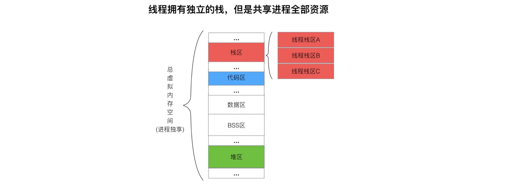
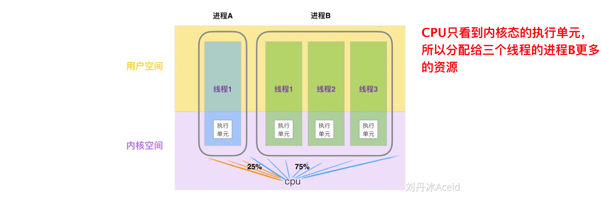

## 1. 进程 | 线程 | 协程

### Q1. 对比进程、线程、协程、goroutine「☆☆☆☆☆」

#### 从定义出发

**进程**：具有一定独立功能的程序在某个数据集合上的一次运行活动包含的计算机执行环境的总和就是进程，**进程是资源分配的基本单位**，是系统进行资源分配和调度的一个独立单位

**线程**：线程是进程中能够并发执行的实体，**是 CPU 调度和分配的基本单位**；线程本身只拥有在运行时必不可少的资源（程序计数器 PC、寄存器和栈等），同属一个进程的线程共享进程拥有的全部资源，线程间主要通过共享内存通信

**协程**：一种**用户态的轻量级线程**，协程不受操作系统的调度，协程的调度器由用户应用程序提供，协程调度器按照调度策略把协程调度到线程中运行（M:N 线程模型），goroutine 就是一种协程

> **补充**：我们编写的代码是一个存储在硬盘的静态文件，通过编译后就会生成二进制可执行文件，当我们运行这个可执行文件时，它会被装载到内存中，接着 CPU 会执行程序中的每一条指令，这个运行的程序即是进
>
> 程序：源代码经过编译得到二进制文件，其中包括了正常运行所需要的数据，这些数据加上代码本身存放在磁盘上，就是一个「程序」，也叫代码的可执行镜像（executable image）
>
> - 当程序被执行起来，就从磁盘上的二进制文件变成了内存中的数据、寄存器里的值、堆栈中的指令、被打开的文件，以及各种设备的状态信息的一个集合
> - 程序的静态表现是放在磁盘上的文件；动态表现是程序运行起来后数据和状态的总和，即进程

#### 上下文切换成本对比

> 进程的上下文切换不仅包含了虚拟内存、栈、全局变量等用户空间的资源，还包括了内核堆栈、寄存器等内核空间的资源

当CPU在内核态切换一个执行单元时，会有时间成本和性能的开销

**CPU 上下文**：CPU在运行任务前所依赖的环境，由CPU寄存器和程序计数器保存

- CPU寄存器：CPU内部的内存（缓存）
- 程序计数器 PC：存储CPU正在执行的指令位置或即将执行的下一条指令的位置

**进程切换CPU上下文**：把前一个任务的CPU上下文保存起来，加载新任务的上下文到寄存器和 PC，跳转到 PC 所指的新位置运行

- 进程是由内核管理和调度的，切换发生在内核态
- 把交换的信息保存在进程的 PCB，当要运行另外一个进程的时候，我们需要从这个进程的 PCB 取出上下文，然后恢复到 CPU 中，这使得这个进程可以继续执行

**线程的上下文切换**：当两个线程不是同属于一个进程，切换过程等同于进程上下文切换；同属于一个进程，虚拟内存是共享的，在切换时只需切换线程的私有数据、寄存器等不被共享的数据

- 操作系统的任务调度，实际上调度对象是线程，同进程线程的上下文切换开销很小，但由于需要OS调度，仍涉及到用户空间和内核空间的切换，相较于协程开销还是较大

**协程的切换成本**：协程切换完全在用户空间进行，把当前协程的 CPU 寄存器状态保存起来，然后将需要切换进来的协程的 CPU 寄存器状态加载到 CPU 寄存器上，开销成本更小

<br>

### Q2. 进程内存和线程内存



**进程内存**：可执行程序运行中会形成一个独立的内存体，内存体有独立的地址空间、堆空间；操作系统以进程为单位分配系统资源（CPU时间片、内存等），进程是资源分配的最小单位

**线程内存**：同一进程的多个线程除了拥有各自的栈空间外，其余内存空间共享，互相通信很简单

- 堆区、全局区等数据共享，加锁即可完成同步通信

<br>

### Q3. 执行单元

对于 Linux 来讲，不区分进程还是线程，他们都是一个单独的执行单元，都被视为任务并且调度到 CPU 上执行



- 如果进程想抢占更多的CPU资源，多开线程就是一种方式

<br>

### Q4. 切换问题

> 

<br>

### Q5. 进程和线程的比较

**线程与进程的比较**

- 进程是资源（包括内存、打开的文件等）分配的单位，线程是 CPU 调度的单位；
- 进程拥有一个完整的资源平台，而线程只独享必不可少的资源，如寄存器和栈；
- 线程同样具有就绪、阻塞、执行三种基本状态，同样具有状态之间的转换关系；
- 线程能减少并发执行的时间和空间开销；

**线程相比进程能减少开销**

- 线程的创建时间比进程快，因为进程在创建的过程中，还需要资源管理信息，比如内存管理信息、文件管理信息，而线程在创建的过程中，不会涉及这些资源管理信息，而是共享它们；
- 线程的终止时间比进程快，因为线程释放的资源相比进程少很多；
- 同一个进程内的线程切换比进程切换快，因为线程具有相同的地址空间（虚拟内存共享），这意味着同一个进程的线程都具有同一个页表，那么在切换的时候不需要切换页表。而对于进程之间的切换，切换的时候要把页表给切换掉，而页表的切换过程开销是比较大的；
- 由于同一进程的各线程间共享内存和文件资源，那么在线程之间数据传递的时候，就不需要经过内核了，这就使得线程之间的数据交互效率更高了；

所以，不管是时间效率，还是空间效率线程比进程都要高

<br>

### Q6. 线程的实现

**用户线程（User Thread）**：在用户空间实现的线程，不是由内核管理的线程，是由用户态的线程库来完成线程的管理

- 用户线程的整个线程管理和调度，操作系统是不直接参与的，而是由用户级线程库函数来完成线程的管理，包括线程的创建、终止、同步和调度等
- 用户线程和内核线程的关系可以是一对一、多对一、多对多

**内核线程（Kernel Thread）**：在内核中实现的线程，是由内核管理的线程

- 内核线程是由操作系统管理的，线程对应的 TCB 自然是放在操作系统里的，这样线程的创建、终止和管理都是由操作系统负责

**轻量级进程（LightWeight Process）**：在内核中来支持用户线程

<br>

## 2. 用户态和内核态

CPU 执行指令时有两种不同权限级别：

**内核态（Kernel Mode）**：运行操作系统程序、操作硬件，可以执行特权指令，访问系统资源等

**用户态（User Mode）**：运行用户程序，执行的是普通的用户程序指令

特权指令：只能由操作系统使用，用户程序不能使用的指令（启动I/O、修改程序状态字、设置时钟等）

非特权指令：用户程序可以使用的指令

- CPU特权分为四级：`R0-R3`，其中`R0`表示内核态，`R3`表示用户态

### 2.1 用户态和内核态的区别

处于用户态时，进程所能访问的内存空间和对象收到限制，CPU是可以被抢占的；处于内核态时，可以访问所有的内存空间和对象，CPU无法被抢占

- 当在系统中执行一个程序时，大部分时间是运行在用户态下的，运行在用户态下的程序不能直接访问操作系统内核数据结构和程序，当需要操作系统帮助完成某些任务（如操作硬件）时，就会切换到内核态


- 内核态对应的内核空间只有一个，N个进程则有N个用户空间
- 对于每个进程来说，有独立的虚拟地址空间，其中包括独占的用户空间，和所有进程共享的内核空间

### 2.2 用户态和内核态的切换

`用户态->内核态`

**系统调用**：内核抽象出的给用户态调用的接口，申请使用操作系统提供的服务程序（如`fork()`）

**异常**：CPU 执行用户态程序时，发生无法预知的异常，内核态会接管（如缺页异常）

**中断**：外围设备完成用户请求操作后，会向CPU发出相应的中断信号，这时CPU会暂停执行的指令转而去执行与中断信号对应的处理程序

`内核态->用户态`

CPU 进入用户态通常是由内核在必要时自动进行的

<br>

## 3. 进程调度算法有哪些？

**先来先服务（FCFS）**：不利于短作业

**最短作业优先（SJF）**：不利于长作业

**高响应比优先（HRRN）**：无法预知要求服务时间，是一种理想型调度算法

`优先权 = (等待时间 + 要求服务时间) / 要求服务时间`

**时间片轮转（RR）**： 每个进程被分配一个时间段，称为时间片（*Quantum*），即允许该进程在该时间段中运行

- 时间片用完，将次进程从 CPU 中释放出来，并把 CPU 分配给另外一个进程
- 如果该进程在时间片结束前阻塞或结束，则立刻进行 CPU 切换

- 时间片过段会导致太多进程上下文切换，太长导致短作业响应时间变长

**最高优先级（HRF）**：从就绪队列中选择最高优先级的进程运行，不利于低优先级进程

- 静态优先级：创建进程时候，就已经确定了优先级了，然后整个运行时间优先级都不会变化；
- 动态优先级：根据进程的动态变化调整优先级，比如如果进程运行时间增加，则降低其优先级，如果进程等待时间（就绪队列的等待时间）增加，则升高其优先级，也就是**随着时间的推移增加等待进程的优先级**。

**多级反馈队列（MFQ）**：时间片轮转 + 最高优先级

- 「多级」表示有多个队列，每个队列优先级从高到低，同时优先级越高时间片越短
- 「反馈」表示如果有新的进程加入优先级高的队列时，立刻停止当前正在运行的进程，转而去运行优先级高的队列

<br>

## 4. 进程间的通信方式

https://xiaolincoding.com/os/4_process/process_commu.html#%E7%AE%A1%E9%81%93

> 每个进程的用户地址空间都是独立的，一般而言是不能互相访问的，但内核空间是每个进程都共享的，所以进程之间要通信必须通过内核

### 4.1 管道

- 传输数据是单向的，相互通信需要创建两个管道
- 通信效率低，不适合进程间频繁地交换数据

**匿名管道**

```sh
$ ps auxf | grep mysql
```

- 这条`|`就是一个管道，即将前一个命令的输出，作为后一个命令的输入

**命名管道**：FIFO

```sh
$ mkfifo myPipe
```

- myPipe 就是这个管道的名称，基于 Linux 一切皆文件的理念，所以管道也是以文件的方式存在，我们可以用 ls 看一下，这个文件的类型是 p，也就是 pipe（管道） 

<br>

### 4.2 消息队列

A 进程要给 B 进程发送消息，A 进程把数据放在对应的消息队列后就可以正常返回了，B 进程需要的时候再去读取数据就可以了。同理，B 进程要给 A 进程发送消息也是如此

**消息队列**：是保存在内核中的消息链表

- 在发送数据时，会分成一个一个独立的数据单元，也就是消息体（数据块）
- 消息体是用户自定义的数据类型，消息的发送方和接收方要约定好消息体的数据类型，所以每个消息体都是固定大小的存储块，不像管道是无格式的字节流数据
- 如果进程从消息队列中读取了消息体，内核就会把这个消息体删除

**缺点**：通信不及时，不适合较大数据的传输，涉及用户态和内核态之间的数据拷贝开销


<br>

### 4.3 共享内存 + 信号量

**共享内存**：将不同进程的虚拟地址空间拿出一部分，映射到相同的物理内存中，不需要数据拷贝

- 会产生数据竞争或者竞态

**信号量**：一个整型计数器，实现进程间的互斥与同步，涉及两个原子操作：

- P 操作：把信号量减去 1，相减后如果信号量 < 0，则表明资源已被占用，进程需阻塞等待；相减后如果信号量 >= 0，则表明还有资源可使用，进程可正常继续执行
- V 操作：信号量加上 1，相加后如果信号量 <= 0，则表明当前有阻塞中的进程，于是会将该进程唤醒运行；相加后如果信号量 > 0，则表明当前没有阻塞中的进程

<br>

### 4.4 信号

**信号**：异常情况下，使用信号通知进程

```sh
$ kill -9 <pid>	# 通过 kill 发送给进程 SIGKILL 信号，立即结束该进程
```


<br>

### 4.5 Socket

跨网络与不同主机的进程之间通信


