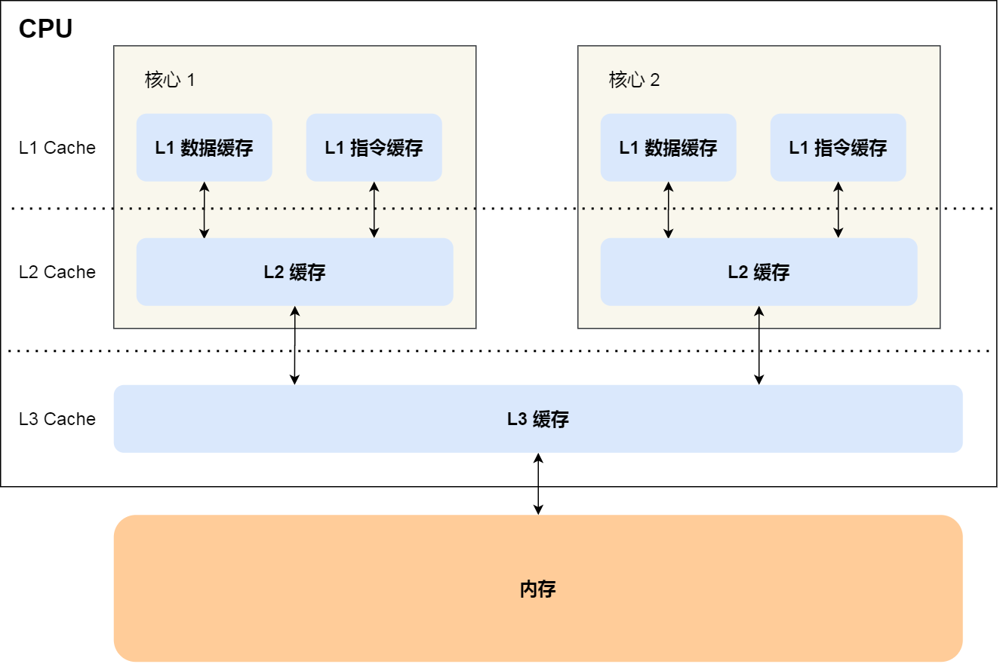

## 1. CPU Cache

https://xiaolincoding.com/os/1_hardware/how_to_make_cpu_run_faster.html#%E5%A6%82%E4%BD%95%E6%8F%90%E5%8D%87%E5%A4%9A%E6%A0%B8-cpu-%E7%9A%84%E7%BC%93%E5%AD%98%E5%91%BD%E4%B8%AD%E7%8E%87

**CPU Cache（高速缓存）**：嵌入在 CPU 内部，存储容量很小但离 CPU 核心很近

- 缓存的读写速度是极快的，那么如果 CPU 运算时，直接从 CPU Cache 读取数据，而不是从内存的话，运算速度就会很快

CPU Cache 通常分为大小不等的三级缓存，分别是 L1 Cache、L2 Cache 和 L3 Cache

**L1 Cache**：「数据缓存」和「指令缓存」，每个 CPU 核心独有

**L2 Cache**：也是么个 CPU 核心独有

**L3 Cache**：多个 CPU 核心共享

- 程序执行时，会先将内存中的数据加载到共享的 L3 Cache 中，再加载到每个核心独有的 L2 Cache，最后进入到最快的 L1 Cache，之后才会被 CPU 读取。

- 越靠近 CPU 核心的缓存访问速度越快，CPU 从 L1 Cache 读取数据的速度，相比从内存读取的速度，会快 `100` 多倍

