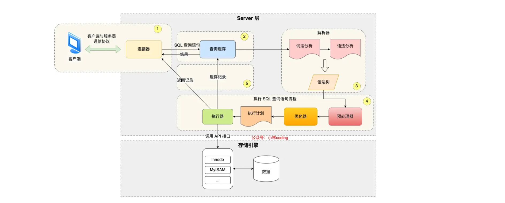
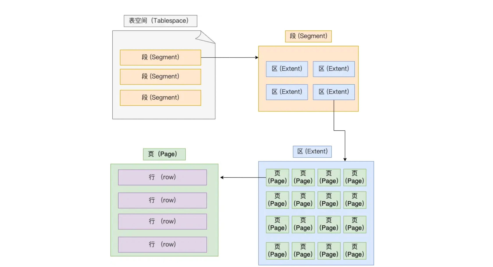
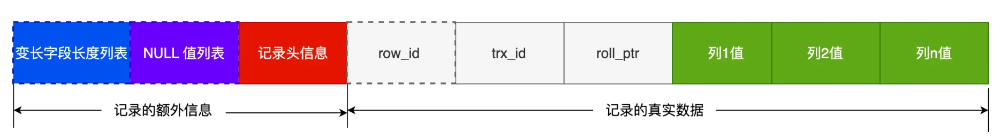
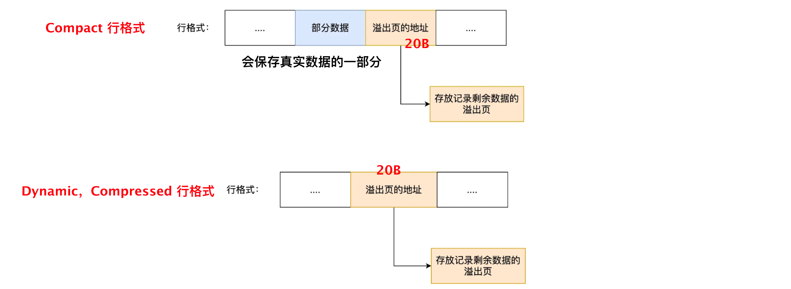
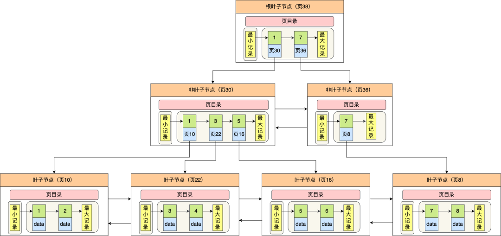
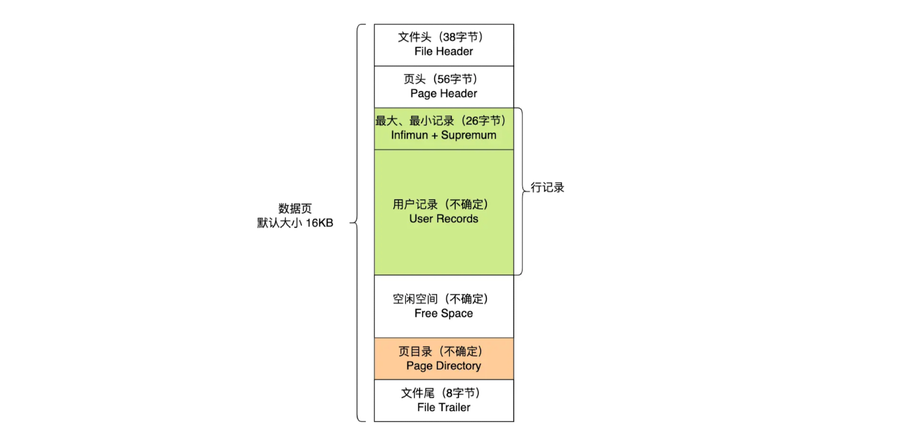
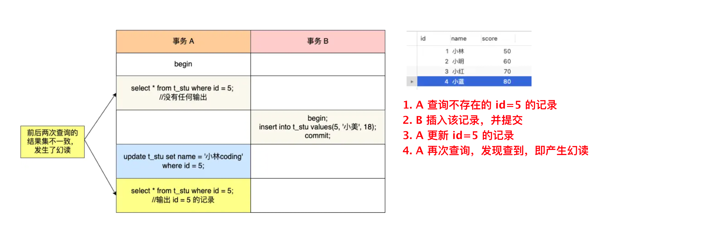
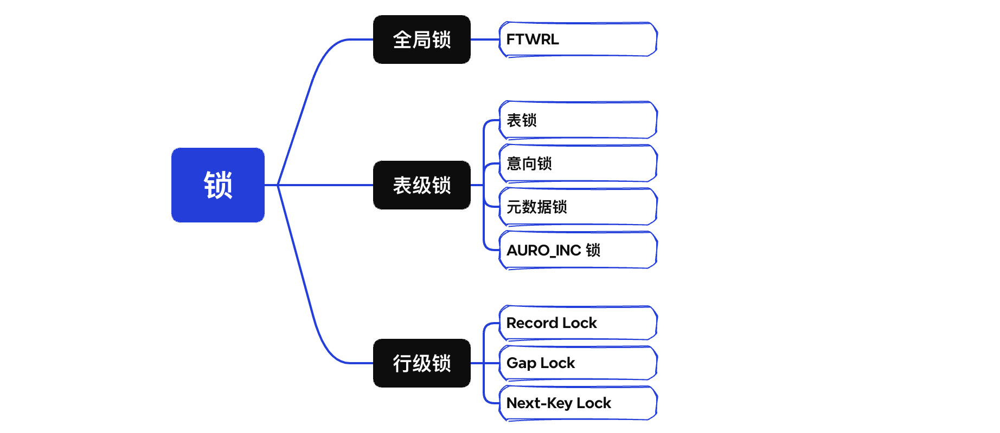

# 基础篇

## 1. 处理一条查询操作的流程



**server层**：负责建立连接、分析和执行 SQL

**存储引擎**：负责数据的存储和提取，包含索引和数据

<br>

**1. 连接器**：经过 TCP **三次握手**建立连接，校验用户名和密码，读取权限；**四次挥手**断开连接

- 有最大空闲时间，也可以`kill connection + id`
- 有最大连接数限制
- 有短连接（执行一条SQL语句）和长连接

查询缓存：MySQL 8.0 后查询语句不再经过

**2. 解析器**：词法分析（关键字、非关键字），语法分析（根据语法树判断是否满足MySQL语句)

**3. 预处理器**：检查表和字段是否存在，将通配符`*`扩展为所有列

**4. 优化器**：确定执行查询语句的执行计划（索引选择等）

**5. 执行器**：按照计划执行执行SQL语句，存储引擎读取数据，返回给客户端

- 执行计划：主键索引查询 / 全表扫描 / 索引下推？？？

<br>

## 2. 存储一行记录

> MySQL 的数据都是保存在磁盘的

常见问题：

- MySQL 的`NULL`值会占用空间吗（会，占整数字节）
- MySQL 怎么知道`varchar(n)`实际占用数据的大小（根据变长字段长度列表）
- `varchar(n)`中 n 最大值取多少（根据实际计算）
- 行溢出后，MySQL 怎么处理（放在溢出页）

### 2.1 表空间文件结构



**行 row**：记录按行存储

**页 page**：记录存储在数据页中，页之间物理位置不连续，此外还有 undo日志页、溢出页等

- InnoDB 的数据是按**页**为单位读写的，页是其磁盘管理的最小单元，默认每页大小为 16KB

**区 extent**：每个区的大小为`1MB`，对于`16KB`的页来说，**连续的 64 个页会被划为一个区**

- B+ 树每一层内通过双向链表连接，如果以页为单位，由于物理位置不连续，可能产生大量随机I/O

- 当表中数据量大的时候，为某个索引分配空间的时候就需要按照区（extent）为单位分配

- 这样就使得链表中相邻的页的物理位置也相邻，就能使用顺序 I/O 了

**段 segment**：分为数据段、索引段和回滚段等

- 索引段：存放 B+ 树的非叶子节点的区的集合
- 数据段：存放 B+ 树叶子节点的区的集合
- 回滚段：存放的是回滚数据的区的集合（MVCC 就是利用回滚段实现多版本查询数据）

**表空间 Tablespace**：各个段组成

<br>

### 2.2 COMPACT 行格式

> InnoDB 提供 Redundant、Compact、Dynamic 和 Compressed 四种行格式，Redundant 基本弃用，Dynamic 和 Compressed 由 Dynamic 改进而来，MySQL5.7 以后默认为 Dynamic



> 一行记录（不包括TEXT等大对象类型）最大只能存储 64KB（65535）的数据

**变长字段长度列表**：存储`varchar(n)、TEXT、BLOB`等变长字段的实际长度，根据实际数据的长度动态分配存储空间，没有变长字段时不需要该列表

- 变长类型设置的长度`varchar(n)`如 n，表示的是最大值，但不需要开这么大空间

存储规则：

1. 变长字段最大字节数`<255B`：1字节表示字段长度，存放在列表中
2. `>=255B`：2字节表示长度

真实数据占用的字节数按照列的顺序**逆序存放**

- 逆序从右向左读，正好读到记录头信息，其中包含指向下一条记录的指针
- 变长字段长度列表中逆序，使得位置靠前的记录的真实数据，和数据对应的字段长度信息（）可以同时在一个 CPU Cache Line 中，这样就可以提高 CPU Cache 的命中率？？？

<br>

**NULL 值列表**：标记某些列是`NULL`值，逆序存放，字节中逆序序号对应位设为`1`

- NULL 是不会存放在行格式中记录的真实数据部分里的（需要填充、内存对 齐，浪费空间）
- 字段都定义为 NOT NULL，就不会有该列表了


**记录头信息**：标记记录是否被删除、下一条记录位置、当前记录类型等

- 当前记录类型：`0`普通记录，`1` B+ 树非叶子节点记录，`2`最小记录，`3`最大记录

**记录的真实数据**：

`row_id`：占 6 字节，用于标识记录的逻辑位置，当指定主键、或唯一约束列时省略该字段

`trx_id`：事务 id，占 6 字节，是必需的

`roll_pointer`：该记录上一个版本的指针，占 7 字节，必需

<br>

### 2.3 问答

1. varchar(n) 中 n 最大取值为多少？

保证所有字段长度 + 变长字段长度列表 + NULL值列表 <= 65535B（该限制不考虑`row_id/trx_id/roll_id`）

- ASCII 一个字符占`1B`，UTF-8 一个字符占`1-4B` ，根据实际情况考虑

2. 行溢出后，MySQL 怎么处理

一个页（16KB）存不下一条记录，会发生行溢出，多的数据会另外存储到**溢出页**（由多个溢出页存储）中



- 只存地址，可以节省空间，有利于索引

<br>

## 3. 课程记录

局部性原理，>/< 这些是运行在 CPU 的

<br>

# 索引篇

常见问题：

- 索引底层使用了什么数据结构和算法？
- 为什么 MySQL InnoDB 选择 B+tree 作为索引的数据结构？
- 什么时候适用索引？
- 什么时候不需要创建索引？
- 什么情况下索引会失效？
- 有什么优化索引的方法？

## 1. 索引的分类与选择


### 1.1 聚簇索引和二级索引

#### 聚簇索引的 B+ Tree 结构

- B+ Tree 是一种多叉树，叶子节点才存放数据；非叶子节点只存放索引，而且每个节点里的数据是**按主键顺序存放**的
- 每一层节点的索引值都会出现在下层子节点的索引值中，因此在叶子节点中，包括了所有的索引值信息
- 并且每一个叶子节点都有两个指针，分别指向下一个叶子节点和上一个叶子节点，形成一个双向链表

数据库的索引和数据都是存储在硬盘的，我们可以把读取一个节点当作一次磁盘 I/O 操作

那么整个查询过程一共经历的节点数，即 I/O 操作数

<br>

#### 主键索引对比二级索引

***主键索引的 B+ Tree***

- 主键索引的 B+Tree 的叶子节点存放的是实际数据，所有完整的用户记录都存放在主键索引的 B+Tree 的叶子节点里（查一个 B+ Tree）

***二级索引的 B+ Tree***

- 二级索引的 B+Tree 的叶子节点存放的是主键值，而不是实际数据（叶子节点之间仍然是双向链表）
- 如果恰好查到的叶子节点内有查询结果，直接返回结果（**覆盖索引**，查一个 B+ Tree）
- 然后通过主键索引总的 B+ Tree 树查询对应的叶子节点（**回表**，查两个 B+ Tree）

<br>

####  InnoDB 聚簇索引的索引键选择

- 有主键：默认使用主键作为聚簇索引的索引键
- 没有主键：选择第一个不包含 NULL 值的唯一列（每个值唯一）作为聚簇索引的索引键
- 都没有：InnoDB 自动生成一个自增 id 列作为聚簇索引的索引列

其他索引都属于辅助索引（二级索引或非聚簇索引），聚簇索引和二级索引默认都是 B+ Tree 结构

<br>

### 1.2 选择 B+ Tree 结构的原因

***B+Tree vs B Tree***

- B+ Tree 只在叶子节点存储数据，而 B 树的非叶子节点也要存储数据，所以 B+ Tree 的单个节点的数据量更小，在相同的磁盘 I/O 次数下，就能查询更多的节点

- 另外，B+Tree 叶子节点采用的是双链表连接，适合 MySQL 中常见的基于范围的顺序查找，而 B 树无法做到这一点

***B+Tree vs 二叉树***

> d = 100，三层 `100*100*100 = 100 0000`，四层`100 0000*100 = 10000 0000`

- 对于有 N 个节点的 B+ Tree，其搜索复杂度为`O(logdN)`，`d`表示节点允许的最大子节点个数（以d为底）

- 在实际的应用当中，d 值是大于100的，这样就保证了，即使数据达到千万级别时，B+ Tree 的高度依然维持在 3~4 层左右，也就是说一次数据查询操作只需要做 3~4 次的磁盘 I/O 操作就能查询到目标数据

- 而二叉树的每个父节点的儿子节点个数只能是 2 个，意味着其搜索复杂度为 `O(logN)`，这已经比 B+ Tree 高出不少，因此二叉树检索到目标数据所经历的磁盘 I/O 次数要更多

***B+Tree vs Hash***

- Hash 在做等值查询的时候效率很快，搜索复杂度为 O(1)

- 但是 Hash 表不适合做范围查询，它更适合做等值的查询，这也是 B+Tree 索引要比 Hash 表索引有着更广泛的适用场景的原因

<br>

### 1.3 分类中的一些类别

**主键索引**：建立在主键字段，每张表只有一个

```sql
CREATE TABLE table_name  (
  ....
  PRIMARY KEY (index_column_1) USING BTREE
);
```

**唯一索引**：建立在`UNIQUE`字段上，每张表可以有多个，索引列值唯一但允许有空值

```sql
CREATE TABLE table_name  (
  ....
  UNIQUE KEY(index_column_1,index_column_2,...) 
);

# 建表后再创建
CREATE UNIQUE INDEX index_name
ON table_name(index_column_1,index_column_2,...); 
```

**普通索引**：不对列值有要求

```sql
CREATE TABLE table_name  (
  ....
  INDEX(index_column_1,index_column_2,...) 
);

# 建表后再创建
CREATE INDEX index_name
ON table_name(index_column_1,index_column_2,...); 
```

**前缀索引**：对字符类型字段的前几个字符建立的索引，可以建立在字段类型为`char、 varchar、binary、varbinary`的列上

**单列索引**：建立在单列上

**联合索引**：多个字段组成一个索引

```sql
CREATE INDEX index_col1_col2 ON product(col1, col2);
```

<br>

### 1.4 再探联合索引

**最左匹配原则**：按照先后顺序，每个节点先按`col1`排序，再按`col2`排序

（只有当第一个列值存在且相同时，才会用到其他列值）

**全局无序，局部有序**：最左列值是全局有序的，其他索引列值在满足最左列查询范围的局部情况下有序

- 所以不使用最左列索引，其他列在全局都是无序的，联合索引自然失效

**部分用到联合索引**：联合索引遇到范围查询（>, <）就会停止匹配，只有停止前的字段用到了联合索引

- 例如：当符合最左列查询范围内，第二列无序时，只有最左列字段用到了联合索引
- 包含边界值时，情况与此不同

```sql
select * from t_table where a >= 1 and b = 2
# 如果在 a >= 1的范围内 b 无序，但存在 a=1 且 b=2 的记录
# 则 a, b 列都用到了的联合索引，通过 b=2 缩小了查询范围，直接从 a=1 且 b=2 的记录查

## 类似的
# MySQL 的 BETWEEN AND 语句也是包括边界值的
# 在'j'前缀的记录内，age无序，但存在 name=j 且 age=22 的记录，同理可以缩小查询范围
SELECT * FROM t_user WHERE name like 'j%' and age = 22
```

**索引下推**：判断记录交给存储引擎，而不是server层，减少回表次数

1. 定位到满足范围查询的第一条记录
2. 先判断联合索引的其他列值是否满足
    - 不成立，则跳过该二级索引【索引下推】
    - 成立，则执行回表操作，返回查询记录
    - 如果不使用索引下推，会直接回表，由server层判断其他索引列值（额外的回表操作）
3. server 层判断记录的其余列值，是否成立，成立返回给客户端，否则继续查询

**索引区分度**：越靠前的字段被用于过滤的概率越高，建立联合索引时，要把**区分度大的字段排在前面**，使其越有可能被更多的 SQL 使用到`区分度 = distinct(cloumn) / count(*)`

- MySQL 有一个查询优化器，当其发现某个值出现在数据行中的百分比很高（30%），会忽略索引，进行全表扫描

<br>

## 2. 索引结构

### 2.1 衡量索引结构优劣的依据

> MySQL 的数据是持久化的，索引和记录是保存在磁盘上的

1. 从索引读取数据，需要先将索引读到内存，再通过索引找到磁盘上的某条记录，然后读入内存
2. 查询过程中会发生多次 I/O 操作，而磁盘 I/O 速度远小于内存读取速度
3. MySQL 支持范围查询，索引结构也需要满足这一点

**适合的索引结构满足**：尽可能少的磁盘 I/O，高效地范围查询

<br>

### 2.2 常见查询 DS 舍弃理由

#### 二分

**二分法**：每次查询范围减半，对于 N 条记录`O(logN)`，但数组插入操作难以在磁盘实现

**二分查找树**：将二分法的`mid`作为根节点，`左子树 < 根节点 < 右子树`，解决了插入新节点的问题，但当按照顺序插入时，其将退化为单链表，时间复杂度来到`O(N)`

- 树存储在磁盘，每次访问树的一层的某个节点，即对应一次 I/O 操作，树的高度直接影响着查询性能，这也是舍弃二分查找树的原因

<br>

#### AVL 树（平衡二叉树）

在二分查找树的基础上，**每个节点的左子树和右子树的高度差不能超过 1**

红黑树是一种特化的 AVL 树

AVL 树查询时间复杂度为`O(logN)`

**AVL 树是二叉树，每个节点只有两个子节点，随着节点增多不可避免的高度变高，进而增加磁盘 I/O 次数，影响到查询效率**

<br>

#### B 树

B 树的每一个节点最多可以包括 M 个子节点，M 称为 B 树的阶，所以 **B 树就是一个多叉树**

B 树的每个节点都包含数据（索引+记录）

- 用户的记录数据的大小很有可能远远超过了索引数据，当我们查询底层的某个节点时，非该节点的记录数据会随着索引值加载到内存，占用资源
- 如果用 B 树做范围查询，需要使用中序遍历，涉及多个节点的磁盘 I/O 操作

<br>

### 2.3 B+ Tree

> ！B+ 树和 B 树的插入和删除（需要补充）

#### 区别于 B 树

1. 非叶子节点只存放索引值，叶子节点才存放数据（索引 + 记录）
2. 所有索引都出现在叶子节点，叶子节点间构成有序链表（MySQL 中双链表）
3. 非叶子结点的索引值也会出现在子节点中，取其中最小（或最大的）

#### 单点查询

- B+ 树的非叶子节点不存放实际的记录数据，仅存放索引

- 因此数据量相同的情况下，相比存储即存索引又存记录的 B 树，B+树的非叶子节点可以存放更多的索引，因此 B+ 树可以比 B 树更「矮胖」，查询底层节点的磁盘 I/O次数会更少

- B 树最快在`O(1)`能查询到数据，但总体来看波动较大

#### 插入和删除

> B+ 树的插入和删除效率更高

- B+ 树有大量的冗余节点，这样使得删除一个节点的时候，可以直接从叶子节点中删除，甚至可以不动非叶子节点，这样删除非常快
- B+ 树的插入也是一样，有冗余节点，插入可能存在节点的分裂（如果节点饱和），但是最多只涉及树的一条路径。而且 B+ 树会自动平衡，不需要像更多复杂的算法，类似红黑树的旋转操作等
- B 树没有冗余节点，删除节点的时候非常复杂，比如删除根节点中的数据，可能涉及复杂的树的变形

#### 范围查询

B+ 树所有**叶子节点间还有一个链表进行连接**，这种设计对范围查找非常有帮助

而 B 树则需要依靠中序遍历，范围查找效率远不如 B+ Tree

**综上**：存在范围检索的场景，适合 B+ 树，对于大量单点查询，可以考虑 B 树

<br>

### 2.4 MySQL 中的 B+ Tree



1. 每个节点是数据页（16KB）
2. 节点间使用**双向链表**连接，顺逆序遍历都行（逻辑上连续），通过二分定位到查询值的页
3. 节点内，是根据主键顺序形成的单链表，二分定位到槽，遍历槽内的记录查到值
4. 非叶子节点存放索引，包含**（页内最小）主键值**和对应的**页号**（目录页）
5. 聚簇索引的叶子节点存放实际数据，二级索引叶子节点存放的是主键值（无完整记录）

<br>

**开辟新页的方式**：复制原来的页，将原页改为目录页（起始页不变，可以缓存）

这一块儿补充完整！

<br>

#### 查找过程

1. 从根节点开始，二分定位到包含查询值的页的范围，索引到下一层
2. 非叶子节点同理
3. 定位到具体的叶子节点，在页内定位到槽，槽内遍历记录得到查询结果
4. （二级索引**回表**）如果查询值不是主键，则通过查询到的记录的主键，去查询聚簇索引，进而得到查询记录数据
5. （二级索引**索引覆盖**）如果查询的就是主键值，则通过二级索引查到即可

<br>

### 2.5 InnoDB 存储数据的方式

**InnoDB 的数据是按「数据页」为单位来读写的**，读取记录时，以页为单位读入内存



|     名称     |                        说明                        |
| :----------: | :------------------------------------------------: |
|    文件头    |   表示页的信息（**其中指向前后数据页的双指针**）   |
|     页头     |                  表示页的状态信息                  |
| 最大最小记录 | 两个虚拟的伪记录，分别表示页中的最小记录和最大记录 |
|   用户记录   |                   存储行记录内容                   |
|   空闲空间   |                页中还没被使用的空间                |
|    页目录    |     存储用户记录的相对位置，对记录起到索引作用     |
|    文件尾    |                   校验页是否完整                   |

- 数据**页中**的记录，按照**主键**顺序组成**单向链表**（增删方便、遍历效率不高）
    - `最小记录 -> {键值, 页号} -> 最大记录`
- 页目录的创建：槽对应组内主键最大的记录
    1. 将所有的记录划分成几个组，这些记录包括最小记录和最大记录，但不包括标记为“已删除”的记录
    2. 每个记录组的最后一条记录就是组内最大的那条记录，并且最后一条记录的头信息中会存储该组一共有多少条记录，作为`n_owned`字段
    3. 页目录用来存储每组最后一条记录的地址偏移量，这些地址偏移量会按照先后顺序存储起来，每组的地址偏移量也被称之为槽（slot），**每个槽相当于指针指向了不同组的最后一个记录**
- 可以通过二分法快速定位记录的分组，并遍历分组找到记录
- 如果找组内最小记录，可以通过偏移量定位到上一个槽，通过单链表向下搜索找到记录
- 槽内记录的限制：防止退化为`O(N)`
    - 第一个分组中的记录只能有 1 条记录
    - 最后一个分组中的记录条数范围只能在 1-8 条之间
    - 剩下的分组中记录条数范围只能在 4-8 条之间

<br>

## 3. 索引相关问题

### 什么时候需要 / 不需要建立索引

**衡量优缺点**

优点：提高查询速度

缺点：占用物理空间、创建和维护要耗费时间、降低表的增删改效率

**适用索引的情况**

1. 字段有唯一性限制时
2. 经常用于 `WHERE` 查询条件的字段，这样能够提高整个表的查询速度，如果查询条件不是一个字段，可以建立联合索引
3. 经常用于 `GROUP BY` 和 `ORDER BY` 的字段，这样在查询的时候就不需要再去做一次排序了，因为我们都已经知道了建立索引之后在 B+ Tree 中的记录都是排序好的

**不需要创建索引的情况**

1. `WHERE`条件，`GROUP BY`、`ORDER BY`里用不到的字段，对于这些字段不需要创建索引
2. 字段中存在大量重复数据（如性别）
3. 表数据太少
4. 经常更新的字段（需要频繁重建索引，来维护 B+ Tree 的有序性）

<br>

### 优化索引的方法

**前缀索引优化**：减小索引字段大小，增加索引页中的索引值，提供查询速度

- order by 无法使用（排序列值不同，可能涉及多个列的排序）
- 无法用到覆盖索引

**覆盖索引优化**：对于多个查询字段，可以通过联合索引整合这些字段到二级索引，减少回表操作

**主键自增**：每插入一条记录，只是追加操作，不需要在中间位置页分裂，主键字段长度应尽可能小，占用空间变小，二级索引的叶子节点可以存放更多主键值

**索引 NOT NULL**

- **统计**时忽略 NULL 值，选择时需要额外处理，影响查询优化器的判断
- **值比较**时需要考虑 NULL 值处理，影响查询性能

**防止索引失败**：

- 当我们使用左或者左右模糊匹配的时候，也就是 `like %xx` 或者 `like %xx%`这两种方式都会造成索引失效
- 当我们在查询条件中对索引列做了计算、函数、类型转换操作，这些情况下都会造成索引失效
- 联合索引要能正确使用需要遵循最左匹配原则，也就是按照最左优先的方式进行索引的匹配，否则就会导致索引失效
- 在 WHERE 子句中，如果在 OR 前的条件列是索引列，而在 OR 后的条件列不是索引列，那么索引会失效

<br>

# 事务篇

## 1. 事务的特性

### 1.1 ACID

**原子性 Atomicity**：一个事务中的所有操作，要么全部完成，要么全部不完成，不会结束在中间某个环节；事务在执行过程中发生错误，会被回滚到事务开始前的状态

**一致性 Consistency**：事务操作前和操作后，数据满足完整性约束，数据库保持一致性状态

**隔离性 Isolation**：数据库运行多个并发事务同时对数据进行读写；隔离性可以防止多个事务并发执行时由于交叉执行而导致数据的不一致，因为多个事务同时使用相同的数据时，不会相互干扰，每个事务都有一个完整的数据空间，对其他并发事务是隔离的

**持久性 Durability**：事务处理结束后，对数据的修改就是永久的，即便系统故障也不会丢失

<br>

### 1.2 InnoDB 通过什么技术保证事务的四个特性？

持久性 --- `redo log`（重做日志）

原子性 --- `undo log`（回滚日志）

隔离性 --- `MVCC`（多版本并发控制）或`锁机制`

一致性 --- 持久性 + 原子性 + 隔离性

<br>

### 1.3 并行事务会引发什么问题？

> 在同时处理多个事务的时候，可能出现脏读、不可重复读、幻读的问题

**脏读 dirty read**：事务读到另一个未提交事务修改过的数据

- 另一个事务可能发生回滚，此时读到的就是过期的数据

**不可重复读 non-repeatabel read**：一个事务内多次读取同一个数据，且出现前后两次读到的数据不一样的情况

- A、B 事务并行，A 在 B 更新前后读取 B 的同一个数据，前后不一致

**幻读 phantom read**：在一个事务内多次查询某个符合查询条件的「记录数量」，且前后两次查询到的记录数量不一样

<br>

### 1.4 事务隔离级别有哪些？

> 三个并行问题的严重性：`脏读 > 不可重复读 > 幻读`
>
> 四个隔离级别：`串行化 > 可重复读 > 读已提交 > 读未提交`


**读未提交**：事务还未提交，变更就被其他事物看到

**读提交**：事务提交后，做的变更才被其他事物看到

**可重复读**：建立静态快照，事务执行过程中看到的数据，一直和事务启动时看到的数据是一致的

- InnoDB 默认隔离级别为「可重复读」

**串行化**：对记录加上读写锁，在多个事务对这条记录进行读写操作时，如果发生了读写冲突，后访问的事务必须等前一个事务执行完成，才能继续执行

- 解决幻读问题，不建议将隔离级别升级到串行化（影响性能）

<br>

## 2. MySQL 中的事务

> MySQL InnoDB 引擎的默认隔离级别是**可重复读**，但它**很大程度上**避免幻读现象

<br>

## 3. MVCC

### 3.1 使用锁进行数据库并发控制

> 乐观锁和悲观锁是从加锁的机制方向分类的

**悲观锁**：只专注于当前事务，阻塞其他线程对资源的操作

当一个线程需要对共享资源进行操作时，首先对共享资源加锁，当该线程持有该资源的锁时，其他线程对该资源进行操作时会被阻塞

```mysql
select ... for update;	# 上 X 锁
```

**乐观锁**：认为数据的变动不会太频繁

当一个线程需要对共享资源进行操作时，不对进行加锁，而是在操作完成后进行判断（通过版本号机制、CAS算法实现）

<br>

### 3.2 MVCC 及其两种读的形式

**MVCC**：多版本并发控制，通过数据行的「版本链」来控制并发访问同一个记录

- 是乐观锁的一种实现

- 用更好的方式去处理读-写冲突，做到不加锁、非阻塞地并发读

- MVCC 为了实现读-写冲突不加锁，“读”指的是快照读

**快照读**：读取的只是**当前事务的可见版本**，简单的`select`操作就是快照读

- 基于 MVCC 实现，避免加锁操作

- 快照读的前提是隔离级别不是串行级别，串行级别下的快照读会退化成当前读

**当前读**：读取的是**记录的最新版本**；特殊读操作（加行级锁），更新、删除、插入操作，这些是当前读

- 记录对事务来说不可见时，需要通过**临键锁 next-key lock** 解决幻读

- 读取时还要保证其他并发事务不能修改当前记录，会对读取的记录进行加锁

<br>

### 3.3 MVCC 实现原理

> 可重复读在启动事务时，生成一个 read-view，理解为记录数据库事务状态的快照，整个事务期间使用该 read-view
> （读提交级别则是每个语句执行前，都重新生成一个 read-view）

#### InnoDB 记录格式的隐藏列

|    RowID     | TRX_ID | ROLL_PTR |
| :----------: | :----: | :------: |
| 自动创建的id | 事务id | 回滚指针 |

`row_id`：隐藏的自增ID，当建表没有指定主键，InnoDB 会使用该 RowID 创建一个聚簇索引

`trx_id`：最近修改（更新/删除/插入）该记录的事务 ID

`roll_ptr`：回滚指针，指向这条记录的上一个版本，旧版本的记录在 undo 日志中

记录头信息中还有一个隐藏字段，标记记录是否被删除（简称为 flag）

- MVCC 是使用`trx_id`、`roll_ptr`、`"flag"`字段实现的

<br>

#### 两种需要的日志

`undoLog`：事务的**回滚日志**，分为两类

1. `insert undo log`：事务插入新记录产生，事务提交后丢弃
2. `update undo log`：事务更新或删除记录产生，快照读需要使用，当系统没有比该日志更早的`read-view`时删除

<br>

`read-view`：**读视图**，进行快照读时会创建，有三个重要字段


1. `m_ids`：read-view 生成时刻系统中「活跃且未提交」的事务 id 列表
2. `min_trx_id`：列表中活跃事务的最小 id
3. `max_trx_id`：给下一个事务的 id 值，即全局最大事务 id + 1
4. `creator_trx_id`：创建 read-view 的事务 id

<br>

#### 实现逻辑

判断事务访问的记录是否可见：

1. `trx_id < min_trx_id`：该版本的记录在创建 read-view 之前就已经生成，即可见
2. `trx_id >= max_trx_id`：该版本的记录是在 read-view 创建之后生成，即不可见
3. `min_trx_id <= trx_id < max_trx_id`：
    - `trx_id IN m_idx`：生成该版本记录的事务还未提交，即不可见
    - `trx_id NOT IN m_idx`：生成该版本记录的活跃事务已提交，即可见

<br>

### 3.4 不能完全避免幻读的情况

场景1：



场景2：


**解决方案**：开启事务后，执行`select ... for update`当前读语句，对记录加临键锁

<br>

# 锁篇

   


## 1. MySQL 有哪些锁

### 1.1 全局锁

```sql
flush tables with read lock;	# 数据库只读
unlock tables;	# 主动释放（会话断开，全局锁也会被自动释放）
```

施加全局锁后，数据库全局处于只读状态，对数据的增删改查、对表结构的更改等操作都会被阻塞

**应用场景**：应用于**全库逻辑备份**，这样在备份数据库期间，不会因为数据或表结构的更新，而出现备份文件的数据与预期的不一样

- 全库只读影响业务
    - 对于支持**可重复读**的 InnoDB 引擎，可以在备份数据库前开启事务（整个执行期间都使用创建的`Read View`）
    - 对于不支持事务的 MyISAM 引擎，备份数据库就需要用到全局锁

<br>

### 1.2 表级锁

> 表锁和行锁满足：读读共享、读写互斥、写写互斥

**表锁**：对指定表加锁；除了会限制别的线程读写外，也会限制本线程的读写操作

- 使用 InnoDB 引擎尽量避免使用表锁，应该采用颗粒度更细的「**行级锁**」

```mysql
lock tables table_1 read;	# 表级共享锁，即读锁
lock tables table_2 write;	# 表级独占锁，即写锁
unlock tables;	
```

<br>

**元数据锁（MDL）**：为了保证用户对表执行操作时，其他线程对该表做更改

- 不是显式使用，对数据库表做操作时，会自动给该表添加 MDL
- 对表做 CRUD 操作，添加「MDL 读锁」，阻塞其他线程更改表的结构
- 对表结构做更改，添加「MDL 写锁」，阻塞其他线程对该表的 CRUD 操作
- MDL 锁会在操作结束后、事务提交后释放，需要考虑长事务一直持有而影响其他线程操作的问题

<br>

**意向锁**：表级锁，不会和行级的共享锁和独占锁发生冲突，而且意向锁之间也不会发生冲突，**只会和共享表锁和独占表锁发生冲突**

目的：快速判断表里是否有记录被加锁（给表加独占锁，需要知道是否有记录被上行锁，如果没有意向锁就需要遍历）

- 在使用 InnoDB 引擎的表里对**某些记录**加上「共享锁」之前，需要先在表级别加上一个「意向共享锁」

- 在使用 InnoDB 引擎的表里对**某些纪录**加上「独占锁」之前，需要先在表级别加上一个「意向独占锁」
- 当执行插入、删除、更新操作时，需要先对表加上「意向独占锁」，然后再对记录上锁；普通的`SELECT`语句利用 MVCC 实现一致性读，不需要上行级锁（快照读）

<br>

**AUTO-INC  锁**：实现主键（`AUTO-INCREMENT`字段）自增，在插入数据时会添加表级别的`AUTO-INC`锁，执行完插入语句后自动释放

- MySQL 实现了轻量级锁机制，` innodb_autoinc_lock_mode `为系统变量
    - `innodb_autoinc_lock_mode = 0` ，采用 AUTO-INC  锁
    - `innodb_autoinc_lock_mode = 1`，对于批量数据插入，还是等语句结束后释放
    - `innodb_autoinc_lock_mode = 2`，轻量级锁，主键自增后就释放

- 轻量级锁虽然性能高，但搭配 binlog 的日志格式是 statement 一起使用的时候，在「主从复制的场景」中会发生**数据不一致的问题**，需要设置日志格式为 row

<br>

### 1.3 行级锁

> InnoDB 引擎是支持行级锁的，而 MyISAM 引擎并不支持行级锁

**锁定读**：区别于普通`SELECT`语句（S 锁：行级共享锁；X 锁：行级独占锁）

```mysql
select ... lock in share mode;	# 对读取的记录加共享锁
select ... for update;	# 对读取的记录加独占锁
```

- S 锁满足：读读共享，读写互斥
- X 锁满足：写写互斥，读写互斥

<br>

**记录锁 Record Lock**

- 当一个事务对一条记录加了 S 锁后，其他事务也可以继续对该记录加 S 锁（S-S 兼容），但是不可以加 X 锁（S-X 不兼容）
- 当一个事务对一条记录加了 X 锁后，其他事务不可以对该记录加 S 锁（S-X 不兼容）和 X 锁（X-X 不兼容）

**间隙锁 Gap Lock**：解决可重复读级别下的幻读现象，防止插入幻影记录，间隙锁之间兼容

- 幻影记录：当一个事务在某个隔离级别下执行查询时，如果其他事务在查询结果集的范围内插入了新的行或者删除了已有的行，并且这些新增或删除的行正好在事务执行期间的查询范围内，那么就会出现幻影记录的情况
- 间隙锁如何避免幻读？

**临键锁 Next-Key Lock**：锁定一个范围，即能保护该记录，又能阻止其他事务将新纪录插入到被保护记录前面的间隙中

- 包含记录锁 + 间隙锁

- 需要考虑记录锁的互斥关系

<br>

## 2. MySQL 是怎么加锁的？

### 2.1 怎么添加行级锁

> 针对 InnoDB 引擎

加锁的对象是索引，加锁的基本单位是`next-key lock`，临键锁（前开后闭区间），间隙锁（开区间）

- 在使用记录锁或间隙锁就能避免幻读现象的场景下，next-key lock 就会退化

<br>

# 参考

[图解MySQL](https://xiaolincoding.com/mysql/)


