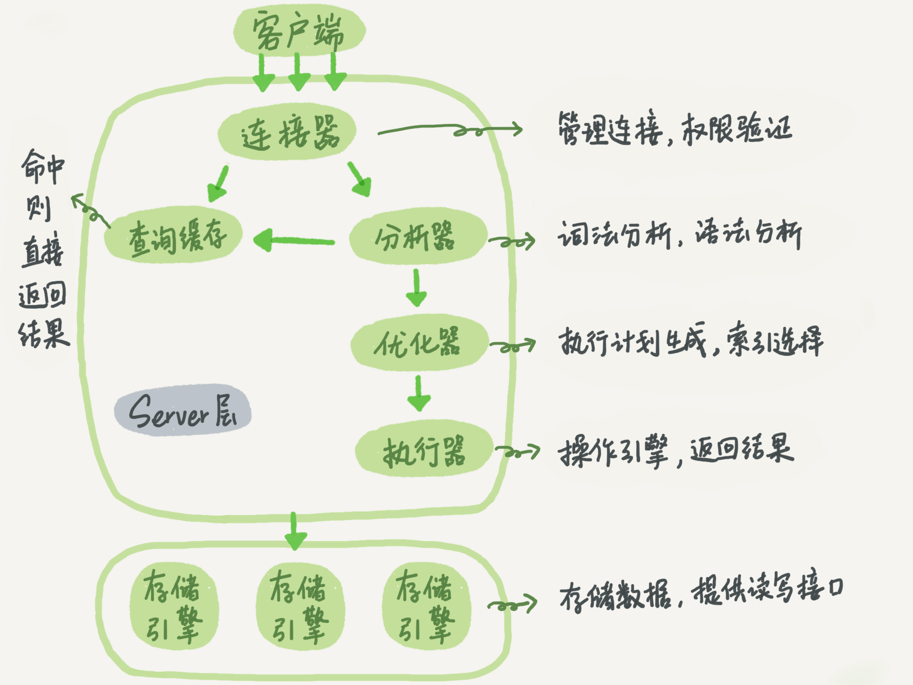
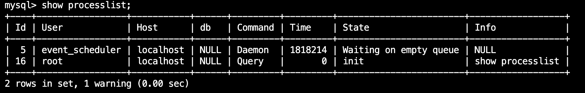

## 1. 一条 SQL 查询语句是如何执行的

> 不要直接陷入细节，应先鸟瞰全貌，从高纬度理解问题

### 1.1 MySQL 基本架构



- MySQL 可以分为 Server 层、存储引擎两层

**Server 层**：涵盖 MySQL 大多数核心服务功能，以及所有的内置函数（日期、时间、数学、加密函数等）

- 包括连接器、查询缓存、分析器、优化器、执行器
- 实现跨存储引擎功能：存储过程、触发器、视图等

**存储引擎**：负责数据的存储和提取

- 插件式架构：支持 InnoDB、MyISAM、Memory 等多个存储引擎（InnoDB 最常用且为默认存储引擎）
- 不同存储引擎共用一个 Server 层

- 可以在 `create table` 语句中使用 `engine=memory` 指定使用内存引擎


### 1.2 连接器

连接器负责与客户端建立连接、获取权限、维持和管理连接

```bash
mysql -h$ip -P$port -u$user -p
# 密码可以直接跟在 -p 后面（会泄露密码），也可以在上述命令后输入密码

# 本地使用（默认端口 3306，-h host）
mysql -u <username> -p <password>
```

连接命令中的 `mysql` 是客户端工具，用来跟服务端建立连接

- 在完成 TCP 三次握手后，连接器开始身份认证（用到用户名和密码）
    - 用户名/密码不正确，会报错，然后客户端程序结束执行


- 认证通过，连接器会到权限表里面查出你拥有的权限。之后，这个连接里面的权限判断逻辑，都将依赖于此时读到的权限
    - 连接建立以后，权限就确定下来，如果发生变化，需要下次重新连接时生效

连接建立后，如果没有后续的动作，连接就会处于空闲状态



- 客户端如果太长时间没动静，连接器就会自动将它断开。这个时间是由参数 wait_timeout 控制的，默认值是 8 小时
    - 连接端口后再发请求，会报错，需要重连

**长连接**：指连接成功后，如果客户端持续有请求，则一直使用同一个连接

短连接：每次执行完很少几次查询后就断开连接，下次查询再重新建立一个

**尽量使用长连接**：减少建立连接的动作


**使用长连接占用大量内存的问题**：全部使用长连接后，有些时候 MySQL 占用内存涨得特别快。这是因为 MySQL 在执行过程中临时使用的内存是管理在连接对象里面的，这些资源会在连接断开的时候才释放。所以如果长连接累积下来，可能导致内存占用太大，被系统强行杀掉（OOM），从现象看就是 MySQL 异常重启了

解决方案：

1. 定期断开长连接：使用一段时间，或者程序里面判断执行过一个占用内存的大查询后，断开连接，之后要查询再重连
2. `mysql_reset_connection`：MySQL 5.7 之后的版本，可以在每次执行一个比较大的操作后，通过执行 `mysql_reset_connection`来重新初始化连接资源。这个过程不需要重连和重新做权限验证，但是会将连接恢复到刚刚创建完时的状态


查询缓存**

> MySQL 8.0 之后移除了查询缓存


### 1.3 分析器

> 经过分析器，MySQL 就知道你要做什么

1. **词法分析**：识别传进来的字符串

2. **语法分析**：根据语法规则对字符串进行判断，如果有错误，会报错

     


### 1.4 优化器

优化器会改写 SQL，包括 join 的连接顺序、匹配索引，找到最优 SQL 策略

- 优化原则：尽可能扫描少的数据库行记录

- 在表里面有多个索引时，决定使用哪个索引
- 在一个语句有多表关联（join）时，决定各个表的连接顺序

```mysql
select * from t1 join t2 using(ID) where t1.c=10 and t2.d=20;
# using(ID) 简写 on t1.id = t2.id

# 既可以先从表 t1 里面取出 c=10 的记录的 ID 值，再根据 ID 值关联到表 t2，再判断 t2 里面 d 的值是否等于 20
# 也可以先从表 t2 里面取出 d=20 的记录的 ID 值，再根据 ID 值关联到 t1，再判断 t1 里面 c 的值是否等于 10
# 二者逻辑结果相同，优化器会根据执行效率决定使用哪一个方案
```

- 优化器阶段完成后，语句的执行方案就确定下来，进入执行器阶段


### 1.5 执行器

开始执行前，先判断用户对表是否有执行查询的权限，有权限则打开表继续执行

打开表时，执行器会根据表的引擎定义，去使用这个引擎提供的接口


## 问题

1. 通过连接池维护一些长连接？


