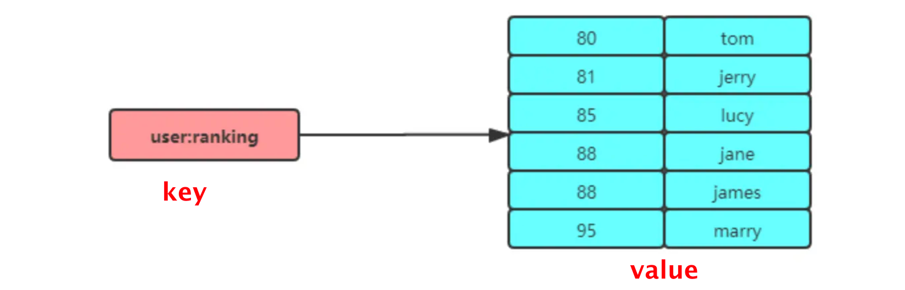

## 1. Redis 管道

管道技术 `Pipeline` 是**客户端提供的**一种批处理技术，用于一次处理多个 Redis 命令

- 可以解决多个命令执行时的网络等待，多个命令整合一起发送，服务端处理后统一返回
- 管道本质是客户端提供的功能，而非 Redis 服务端的功能

redis 的 pipeline 是非原子性的


## 3. Hash

Hash 是一个键值对 key-value 的集合，适合存储对象


内部使用哈希表或 listpack 实现


## 5. Zset

Zset（有序集合类型）相比于 Set 多了一个排序属性`score`，每个存储的 value 由两个值组成（成员 + 分值）



- zset 保留了集合不能有重复成员的特性，但分值可以重复

- 与 set 不同，zset 中的元素可以排序

### 5.1 Zset 内部实现

**压缩列表**：元素小于`128`个，并且每个元素值小于`64B`，zset 底层数据结构是压缩列表

**跳表**：不满足上述条件，则使用跳表作为底层数据结构

- Redis 7 舍弃压缩列表，改为`Listpack`

<br>

### 5.2 常用命令

```sql
ZADD key score member	# 插入
ZREM key member			# 删除
ZSCORE key member		# 返回有序集合key中元素member的分数
ZCARD key				# 返回有序集合key中元素的个数

# 分值 + increment
ZINCRBY key increment member 

# 正序获取 key 从 start 下标到 stop 下标的元素
ZRANGE key start stop [WITHSCORES]
# 倒序获取 key 从 start 下标到 stop 下标的元素
ZREVRANGE key start stop [WITHSCORES]

# 返回有序集合中指定分数区间内的成员，分数「由低到高」排序。
ZRANGEBYSCORE key min max [WITHSCORES] [LIMIT offset count]

# 返回指定成员区间内的成员，按字典正序排列, 分数必须相同。
ZRANGEBYLEX key min max [LIMIT offset count]
# 返回指定成员区间内的成员，按字典倒序排列, 分数必须相同
ZREVRANGEBYLEX key max min [LIMIT offset count]
```


