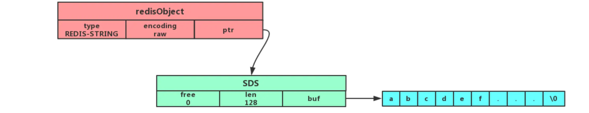

## 1. Redis 数据类型

**Redis 常见数据类型**：`String`，`Hash`，`List`，`Set`，`Zset`

**Redis 新增数据类型**：`BitMap`，`HyperLogLog`，`GEO`，`Stream`，

<br>

### 1.1. Stirng 字符串

标准`key-value`结构，`value`可以是字符串、整数、浮点数等，`value`最多可以容纳`512M`

String 类型的底层数据结构主要是`int`和`SDS`

#### 使用场景

**缓存对象**

```sql
# 直接保持对象JSON
SET user:1 '{"name":"xiaolin", "age":18}'

# 分离为 user:ID:属性 批量保存
MSET user:1:name xiaolin user:1:age 18 user:2:name xiaomei user:2:age 20
```

**常规计数**

```sql
SET aritcle:readcount:1001 0
INCR aritcle:readcount:1001	# Redis 单线程处理，执行命令是原子过程，可以使用 string 计数
```

<br>

### 1.2 List

List 列表是简单的字符串列表，**按照插入顺序排序**

**可以从头部、或尾部向 List 添加元素**

列表的最大长度为`2^32 - 1`，每个列表支持超过`40亿`个元素

`List` 底层数据结构由「**双向链表**」或「**压缩列表**」实现，Redis 3.2 之后，只由「**quicklist**」实现

<br>

## 2. Redis 数据结构实现

### 2.1 SDS 

`SDS`是简单动态字符串

**SDS 不仅可以保存文本数据，还可以保存二进制数据**



- 使用`len()`获取长度，O(1)
- 可以保持图片、音频、视频、压缩文件等二进制数据
- Redsi 的 SDS API 安全，拼接字符串不会造成缓冲区溢出（空间不足会自动扩容）

字符串对象有三种内部编码：

`int`：整数值

`row`：长字符串，保存为简单动态字符串（SDS）

`embstr`：保存短字符串，是只读的，修改时会转换为 row 格式

<br>

## 参考

[图解Redis](https://xiaolincoding.com/redis/data_struct/command.html#%E5%B8%B8%E7%94%A8%E6%8C%87%E4%BB%A4)


