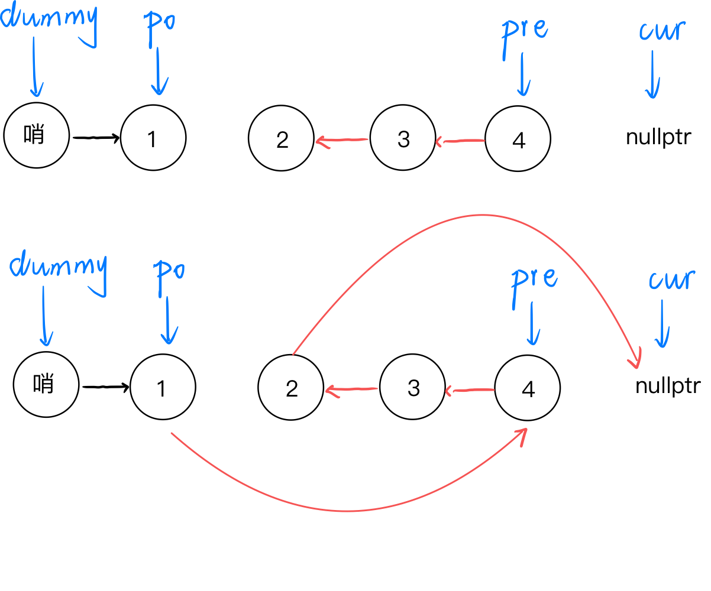

## 1. 设计链表

[模板题：707. 设计链表](https://leetcode.cn/problems/design-linked-list/)

### 1.1 C++ 版本

```cpp
class MyLinkedList {
public:
    struct ListNode {
        int val;
        ListNode *next;
        ListNode(int val):val(val), next(nullptr) {}
    };

    MyLinkedList() {
        dummy = new ListNode(0);
        size = 0;
    }
    
    int get(int index) {
        if(index < 0 || index >= size) return -1;
        ListNode *cur = dummy;
        // 遍历找到索引节点
        while(index-- >= 0) {
            cur = cur->next;
        }
        return cur->val;
    }
    
    void addAtHead(int val) {
        ListNode *node = new ListNode(val);
        node->next = dummy->next;
        dummy->next = node;
        size++;
    }
    
    void addAtTail(int val) {
        ListNode *node = new ListNode(val);
        ListNode *cur = dummy;
        while(cur->next) {
            cur = cur->next;
        }
        cur->next = node;
        size++;
    }
    
    void addAtIndex(int index, int val) {
        if(index < 0 || index > size) return;
        if(index == size) {
            addAtTail(val);
            return;
        }
        
        ListNode *node = new ListNode(val);
        ListNode *cur = dummy;
        while(index--) {
            cur = cur->next;
        }
        node->next = cur->next;
        cur->next = node;
        size++;
    }
    
    void deleteAtIndex(int index) {
        if(index < 0 || index >= size) return;

        ListNode *cur = dummy;
        while(index--) {
            cur = cur->next;
        }
        cur->next = cur->next->next;
        size--;
    }

private:
    ListNode *dummy;
    int size;
};
```


### 1.2 Go 版本

```go
type MyLinkedList struct {
    dummy *ListNode
    size int
}

// LeetCode 内置这个结构体了，答题时可以不定义
type ListNode struct {
    Val int
    Next *ListNode
}


func Constructor() MyLinkedList {
    return MyLinkedList {
        dummy: &ListNode{0, nil},
        size: 0,
    }
}   


func (this *MyLinkedList) Get(index int) int {
    if index < 0 || index >= this.size {
        return -1
    }
    if this.size == 0 {
        return -1
    }
    cur := this.dummy
    for index >= 0 {
        cur = cur.Next
        index--
    }
    return cur.Val
}


func (this *MyLinkedList) AddAtHead(val int)  {
    node := &ListNode{val, nil}
    node.Next = this.dummy.Next
    this.dummy.Next = node
    this.size++
}   


func (this *MyLinkedList) AddAtTail(val int)  {
    cur := this.dummy
    node := &ListNode{val, nil}
    for cur.Next != nil {
        cur = cur.Next
    }
    cur.Next = node
    this.size++
}


func (this *MyLinkedList) AddAtIndex(index int, val int)  {
    if index < 0 || index > this.size { return }
    if index == this.size {
        this.AddAtTail(val)
        return
    }
    cur := this.dummy
    node := &ListNode{val, nil}
    for index > 0 {
        cur = cur.Next
        index--
    }
    node.Next = cur.Next
    cur.Next = node
    this.size++
}


func (this *MyLinkedList) DeleteAtIndex(index int)  {
    if index < 0 || index >= this.size {
        return
    }
    cur := this.dummy
    for index > 0 {
        index--
        cur = cur.Next
    }
    cur.Next = cur.Next.Next
    this.size--
}
```


## 2. 反转链表

### 2.1 反转整个链表

[206. 反转链表](https://leetcode.cn/problems/reverse-linked-list/)


- 三个指针循环遍历链表，最终 `pre` 指向翻转后的链表头


```cpp
ListNode* reverseList(ListNode* head) {
    // 初始化指针
	ListNode* pre = nullptr, *cur = head;

    // 遍历链表
    while(cur) {
        ListNode* next = cur->next;	// 记录一下 nxt 位置
        cur->next = pre;
        pre = cur;
        cur = next;
    }

    return pre;
}
```


### 2.2 反转部分链表

[92. 反转链表 II](https://leetcode.cn/problems/reverse-linked-list-ii/)（暑期蚂蚁一面手撕题）

[25. K 个一组翻转链表](https://leetcode.cn/problems/reverse-nodes-in-k-group/)

- 反转从位置 `left` 到 `right` 的链表节点



- 设定哨兵节点 `dummy`，使头结点一般化
- `p0` 记录反转的前一个结点

**核心**：反转后，`pre` 指向反转序列的最后一个结点，`cur` 指向后续链表的首个结点


## 3. 快慢指针遍历链表

### 3.1 快慢指针遍历

[876. 链表的中间结点](https://leetcode.cn/problems/middle-of-the-linked-list/)

[141. 环形链表](https://leetcode.cn/problems/linked-list-cycle/)


### 3.1 链表判环

[142. 环形链表 II](https://leetcode.cn/problems/linked-list-cycle-ii/)

[参考题解: 环形链表 II（双指针，清晰图解）](https://leetcode.cn/problems/linked-list-cycle-ii/solutions/12616/linked-list-cycle-ii-kuai-man-zhi-zhen-shuang-zhi-)


```cpp
ListNode *detectCycle(ListNode *head) {
    ListNode *fast = head, *slow = head;

   	// step1: 快慢相遇
    while(true) {
        if(!fast || !fast->next) return nullptr;
        fast = fast->next->next;
        slow = slow->next;
        if(fast == slow) break;
    }
    
    
	// step2: 寻找入口
    fast = head;

    while(fast != slow) {
        fast = fast->next;
        slow = slow->next;
    }

    return fast;
}
```


### 3.2 链表重排

[143. 重排链表](https://leetcode.cn/problems/reorder-list/)


