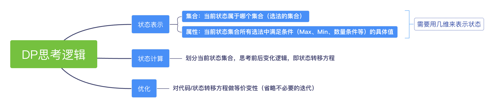

## y式Dp法

> 从**集合**角度理解



**状态表示**：考虑需要用几维状态表示状态

- 集合：状态属于哪个集合（选法的集合）
- 属性：Max、Min、数量（集合的所有选法，定性为满足属性的值）

**状态计算**：集合的划分，即状态转移方程

**优化**：一般来说，是对动态规划的代码或方程做等价变形

<br>

##  记忆化搜索 


> 递归求解每个状态

**使用记忆化搜索的目的**：该题目需要对从每个点作为起点的情况进行动态规划，使用迭代求DP需要套多层循环

- 好处：使用记忆化搜索，分离出DP函数，代码可读性更高

- 缺点：对于递归深度过高，也会有爆栈（栈溢出，stackoverflow）的风险

**例题**：[Acwing: 滑雪](https://www.acwing.com/problem/content/903/)

**状态表示**：`f(i, j)`

- 集合：所有从`(i, j)`开始滑的路径
- 属性：路径最大长度

**状态计算**：向上、下、左、右四个方向滑求最值，然后加上`(i, j)`（满足高度的前提下）

上：`f(i-1, j)`

下：`f(i+1, j)`

左：`f(i, j-1)`

右：`f(i, j+1)`

```cpp
#include <iostream>
#include <cstring>
using namespace std;
const int N = 310;

int n, m;
int h[N][N];    // 每个点的高度
int f[N][N];
int dx[4] = {-1, 0, 1, 0}, dy[4] = {0, -1, 0, 1};

// dp 返回的是每个状态的值
int dp(int x, int y) {
    if(f[x][y] != 1) return f[x][y];
    
    // 递归得到路径的长度
    for(int i = 0; i < 4; i++) {
        int a = x + dx[i], b = y + dy[i];
        if(a >= 1 && a <= n && b >= 1 && b <= m && h[a][b] < h[x][y])
            f[x][y] = max(f[x][y], dp(a, b) + 1);
    }
    
    return f[x][y];
}

int main() {
    cin >> n >> m;
    
    for(int i = 1; i <= n; i++) {
        for(int j = 1; j <= m; j++) {
            cin >> h[i][j];
            f[i][j] = 1;    // 初始化，最小值是1
        }
    }      
    
    int res = 0;
    
    for(int i = 1; i <= n; i++) {
        for(int j = 1; j <= m; j++) {
            res = max(res, dp(i, j));
        }
    }
    cout << res << endl;
    return 0;
}
```


  


