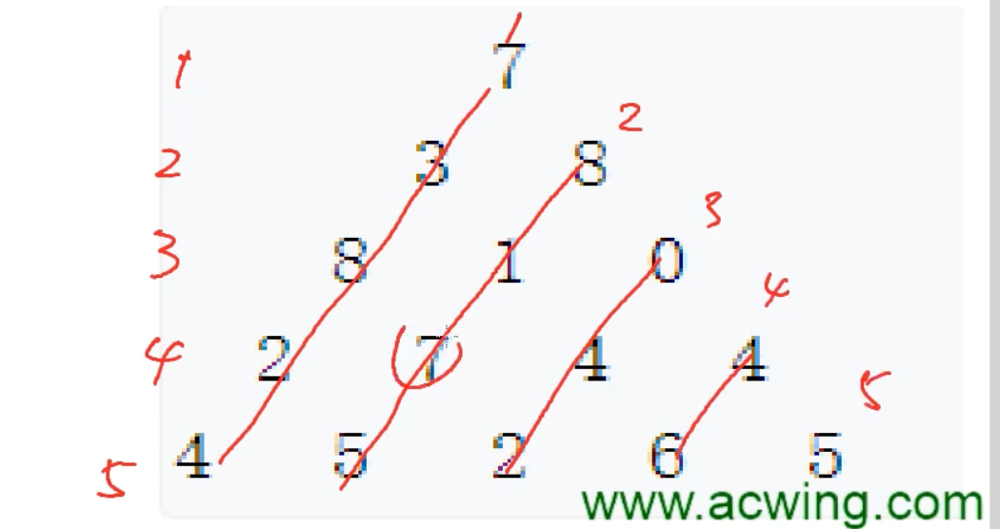

## 线性DP

> DP 核心：思考中间状态，思考中间状态怎么由上一个状态转化过来

- 线性DP：递推方程有明显的线性顺序
- 涉及i-1的下标，遍历从1开始

[Acwing: 数字三角形](https://www.acwing.com/problem/content/900/)



O(状态*转移)

状态表示：二维状态`f(i, j)`

- 集合：所有从起点走到`(i, j)`的路径
- 属性：路径上数字之和的最大值`Max`

状态计算： 划分后取Max

- 来自左上：`f(i-1, j-1) + a(i, j)`（a是当前数字） 
- 来自右上：`f(i-1, j) + a(i, j)`

O(N^2)

```cpp
#include <iostream>
using namespace std;
const int N = 510, INF = 1e9;
int n;
int f[N][N];	// 记录状态表示
int a[N][N];	// 记录当前枚举的数字

int main() {
    cin >> n;
    
    for(int i = 1; i <= n; i++)
        for(int j = 1; j <= i; j++) 
            cin >> a[i][j];
            
    for(int i = 1; i <= n; i ++)
        // 计算右上边界时，可能用到第0列的，j = i + 1的情况
        for(int j = 0; j <= i + 1; j ++)
            f[i][j] = -INF;  // 置为负无穷，避免处理边界
        
    f[1][1] = a[1][1];
    
    // 从第二行开始处理
    for(int i = 2; i <= n; i++)
        for(int j = 1; j <= i; j++) 
            f[i][j] = max(f[i-1][j-1] + a[i][j], f[i-1][j] + a[i][j]);
    
    int res = -INF;
    for(int i = 1; i <= n; i++)
        res = max(res, f[n][i]);
    
    cout << res << endl;
    
    return 0;
}
```


[Acwing: 最长上升子序列](https://www.acwing.com/problem/content/897/) 

- 子序列：从前往后，不是子串（不一定挨着）

状态表示（`a[i]`一定是上升子序列的结尾）

- 集合：所有以`a[i]`结尾的上升子序列
- 属性：集合中上升子序列长度的最大值`Max`

状态计算：以子序列中上一个数的取值为划分依据

- `j ∈ [0, i-1]`且`a[j] < a[i]`，后取Max

- `f[i] = max(f[j] + 1), j = 0, 1,.., i-1`

```cpp
// 朴素做法 O(N^2)
#include <iostream>
using namespace std;
const int N = 1010;
int n;
int a[N], f[N];

int main() {
    cin >> n;
    for(int i = 1; i <= n; i++) 
        cin >> a[i];
    
    for(int i = 1; i <= n; i++) {
        f[i] = 1;   // 只有a[i]一个数的情况
        for(int j = 1; j < i; j++) {
            if(a[j] < a[i])
                f[i] = max(f[i], f[j] + 1);
        }
    }
    
    int res = 0;
    for(int i = 1; i <= n; i++)
        res = max(res, f[i]);
        
    cout << res << endl;
    
    return 0;
}
```

- 求方案的话，把状态转移记录下来

[Acwing: 最长上升子序列 Ⅱ](https://www.acwing.com/problem/content/898/)（习题课，看看怎么优化）


[Acwing: 最长公共子序列](https://www.acwing.com/problem/content/899/)

状态表示：两维`f(i, j)`

- 集合：第一个序列的前`i`个字母，第二个序列的前`j`个字母，构成的公共子序列
- 属性：长度Max
- 注意：`a[i]`和`b[j]`只是可能在最大子序列中

状态计算：`a[i]`和`b[j]`是否可能在公共序列中，分为四种情况（0/1表示是否存在）后取Max

1. 00：`f(i-1, j-1)`
2. 01：`f(i-1, j)`（表示`b[j]`可能在公共子序列中）
3. 10：`f(i, j-1)`（表示`a[j]`可能在公共子序列中）
4. 11：`f(i-1, j-1) + 1`（表示`a[i]`和`b[j]`都在公共子序列中

- 划分有重叠，但不影响求最值（求数量时要求不重叠）
- 1的划分情况，包含在2和3中，即只需要考虑后三种划分

```cpp
#include <iostream>
using namespace std;
const int N = 1010;

int n, m;
char a[N], b[N];
int f[N][N];

int main() {
    cin >> n >> m >> a + 1 >> b + 1;
    
    for(int i = 1; i <= n; i++) {
        for(int j = 1; j <= m; j++) {
            f[i][j] = max(f[i-1][j], f[i][j-1]);
            // 需要保证是相同字符，才能都加入子序列
            if(a[i] == b[j])
                f[i][j] = max(f[i][j], f[i-1][j-1] + 1);
        }
    }
    
    cout << f[n][m] << endl;
    
    return 0;
}
```

<br>

## 区间 DP

- 状态定义为一个区间

[Acwing: 石子合并](https://www.acwing.com/problem/content/284/)

**状态表示**：`f(i,j)`（相邻才能合并）

- 集合：所有将第 i 堆和第 j 堆石子合并成一堆的合并方式
- 属性：代价Min

**状态计算**：以最后一次分界线的位置划分，`[i, k], [k+1, j]`

- 考虑划分线：`k ∈ [i, j-1]`

- 考虑上一个状态的最终情况：`f(i, k) + f(k+1, j)`
- 考虑将区间`[i,j]`所有石子堆合并的代价：`S[j] - S[i-1]`（前缀和）

 时间复杂度：`O(N^3)`

需要保证上一个状态（用到的）是已经算好的

经验：先循环区间长度，再循环区间左端点

```cpp
#include <iostream>
#include <climits>

using namespace std;

const int N = 310;

int n;
int s[N];   // 前缀和
int f[N][N];

int main() {
    cin >> n;
    
    for(int i = 1; i <= n; i++) {
        int x;
        cin >> x;
        s[i] = s[i-1] + x;
    }
            
    // 区间长度从小到大枚举状态，长度为1不需要计算
    for(int len = 2; len <= n; len++) {
        // 枚举起点
        for(int i = 1; i + len - 1 <= n; i++) {
            int l = i, r = i + len - 1;
            // 算最小值，需要初始化
            f[l][r] = INT_MAX;
            for(int k = l; k < r; k++)
                f[l][r] = min(f[l][r], f[l][k] + f[k+1][r] + s[r] - s[l-1]);
        }
    }
            
    cout << f[1][n] << endl;
    
    return 0;
}
```


## 数位统计DP

[Acwing: 计数问题](https://www.acwing.com/problem/content/340/)

> 分情况讨论！

区间问题转换为前缀问题

`count(n, x)`求 1-n 中x出现的次数

从a-b，即：`count(b, x) - count(a-1, x)`


求 1~n，x = 1 出现的次数

分别求出 1 在每一位出现的次数

```cpp
#include<stdio.h>
#include<iostream>

#define ll long long

using namespace std;

int power10(int x)//返回10的x次方
{
    int res=1;
    while(x--)res*=10;
    return res;
}

ll count(int n,int x)//返回从1~n所有数中x的总数
{
    ll res=0;
    int l,r,cnt=0,m=n;

    while(m)
    {
        cnt++;//存储数字n的位数
        m/=10;
    }

    for(int i=1;i<=cnt;i++)//从右往左依次枚举每一位上的x总数
    {
        //以abcdefg为例来看，现在是计算第四位上x的次数，那么现在i=4

        //先计算最高三位为000~abc-1的情况
        r=power10(i-1);//d右边可取到000~999共power10(i-1)个数
        l=n/(r*10);//d左边可取到000~abc-1共abc种情况，if(x==0)则为001~abc-1共abc-1种
        //abc=n/power10(i)=n/(r*10);
        if(x)res+=l*r;
        else res+=(l-1)*r;

        int d=(n/r)%10;// n/r=abcd;abcd%10=d;
        //再计算高三位等于abc的情况(只需考虑d>=x，因为d<x就不符合条件)
        if(d==x)//前四位abcd均相同，后三位可取0~efg共efg+1种
            res+=n%r+1;//efg+1=n%power(i-1)+1=n%r+1;
        else if(d>x)//此时后三位可取000~999共power10(i-1)种
            res+=r;
    }
    return res;
}
int main()
{
    int a,b;
    while(cin>>a>>b,a||b)
    {
        if(a>b)swap(a,b);

        for(int i=0;i<10;i++)
            cout<<count(b,i)-count(a-1,i)<<" ";

        cout<<"\n";
    }
    return 0;
}
```


## 状态压缩DP

[Acwing: 最短 Hamilton 路径](https://www.acwing.com/problem/content/93/)

 https://www.acwing.com/video/556/ 蒙德里安的梦想


