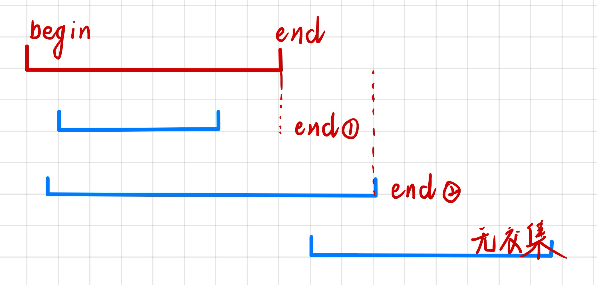

## 区间合并

### **题型**

1. 给定 n 个区间`[li,ri]`，要求合并所有有交集的区间

2. 注意如果在端点处相交，也算有交集（有公共端点）

3. 输出合并完成后的区间个数

### **思路**

1. 按区间左端点排序
2. 以左端点为基准，当前区间与之后的区间有三种情况



例题：[803. 区间合并](https://www.acwing.com/problem/content/805/)

```cpp
// segs 存放所有区间的首、尾端点
void merge(vector<PII> &segs)
{
    vector<PII> res;
    
    // 按左端点进行排序
    sort(segs.begin(), segs.end());
    
    // 设定为最边界（范围边界*2）
    int begin = -2e9, end = -2e9;
    for(auto seg : segs)
        // 1. 满足上图无交集的情况，且不是初始值时
        if(end < seg.first)
        {
            if(begin != -2e9)
                res.push_back({begin, end});	// 保存答案
            begin = seg.first, end = seg.second;	// 更新当前区间
        }
    	// 2. 满足上图中①、②情况，更新为区间并集
        else
            end = max(end, seg.second);
    
    // 保存最后begin-end维护的区间
    if(begin != -2e9)
        res.push_back({begin, end});
        
    segs = res;
}
```

