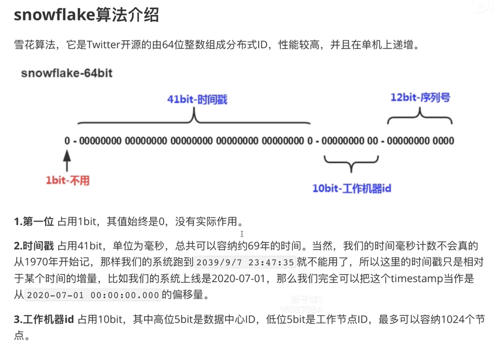
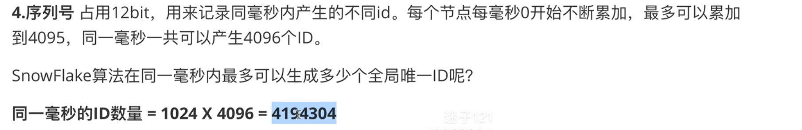
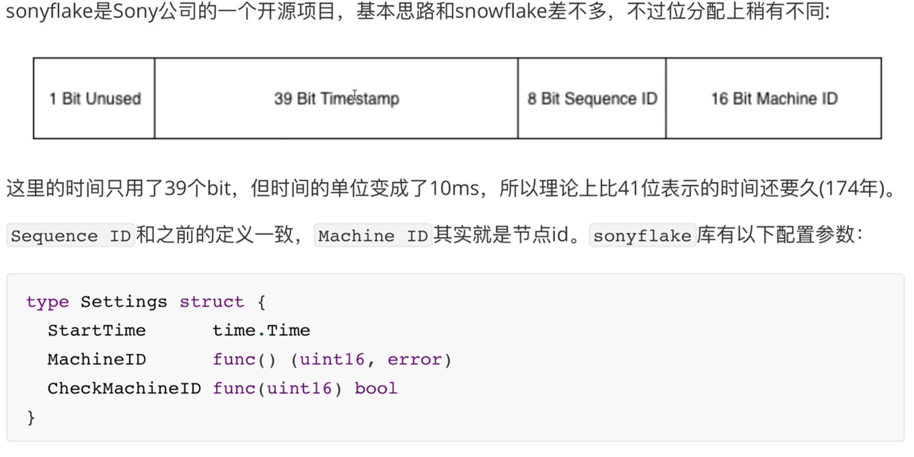

> bluebell 项目实战

## 用户模块开发

### 1. 用户表结构设计

1. 可以用goland连接MySQL，也可以在终端直接操作
2. 不能使用数据库自增id，用户注册时会暴漏用户量；分库时id也可能重复

```mysql
-- 创建用户表 `user`（为什么是反引号？）
CREATE TABLE `user` (
    `id` bigint(20) NOT NULL AUTO_INCREMENT,
    `user_id` bigint(20) NOT NULL,
    `username` varchar(64) COLLATE utf8mb4_general_ci NOT NULL,
    `password` varchar(64) COLLATE utf8mb4_general_ci NOT NULL,
    `email` varchar(64) COLLATE utf8mb4_general_ci,
    `gender` tinyint(4) NOT NULL DEFAULT '0',
    `create_time` timestamp NULL DEFAULT CURRENT_TIMESTAMP,
    `update_time` timestamp NULL DEFAULT CURRENT_TIMESTAMP ON UPDATE CURRENT_TIMESTAMP,
    PRIMARY KEY (`id`),
    UNIQUE KEY `idx_username` (`username`) USING BTREE,
    UNIQUE KEY `idx_user_id` (`user_id`) USING BTREE
) ENGINE=InnoDB DEFAULT CHARSET=utf8mb4 COLLATE=utf8mb4_general_ci;
```

### 2. 基于雪花算法的分布式 ID 生成器

> 分布式ID生成器

​	

​	

​	  

#### snowflake go 实现库

1. https://github.com/bwmarrin/snowflake

```go
// 当一个简单模块使用
package snowflake
import (
	"time"
	sf "github.com/bwmarrin/snowflake"
)

var node *sf.Node

func Init(startTime string, machineID int64) (err error) {
    // 开始时间
	var st time.Time
	st, err = time.Parse("2006-01-02", startTime)
	if err != nil {
		return
	}
	sf.Epoch = st.UnixNano() / 1000000
	node, err = sf.NewNode(machineID)
	return
}
func GenID() int64 {
	return node.Generate().Int64()
}

// main.go
if err := snowflake.Init(setting.Conf.StartTime, setting.Conf.MachineID); err != nil {
    fmt.Printf("init snowflake failed, err:%v\n", err)
    return
}
// 读取配置文件中的开始时间和分配的id数
```

2. https://github.com/sony/sonyflake

​	


### 3. 登录注册功能

​	

- 入手项目功能：从程序入口开始（`main.go`），从请求的入口入手（注册`router`）

- dao 层：把每一步数据库操作封装成函数，待 logic 层根据业务需求调用
- logic 层：存放业务逻辑的代码，等待多次调用（组合 dao 层的操作）
- controller 层：web 服务的入口

#### 注册功能处理流程

> 顺着请求的流程来

**接收请求**：router

1. 接收http请求
2. 注册路由（POST）
3. 根据不同目录，执行`HandlerFunc`

↓

**处理注册请求**：

1. 获取参数、校验参数（**controller 层处理请求**）
2. 业务处理（**logic 层执行业务处理**）
3. 返回响应

↓

**业务处理**：（**dao 层与数据库交互**）

1. 判断用户存不存在
2. 生成UID（snowflake），生成实例
3. 密码加密，保存进数据库


## 问题记录

1. 在处理`error`时，什么时候`fmt.Printf() return`，什么时候`panic`，panic具体怎么用？
2. 在有`(err error)`返回值时，直接`return`


