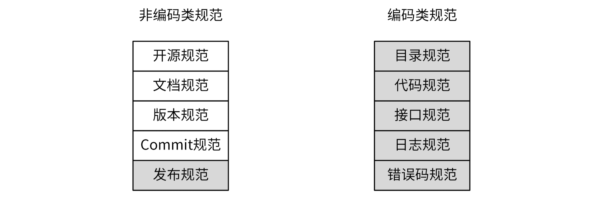
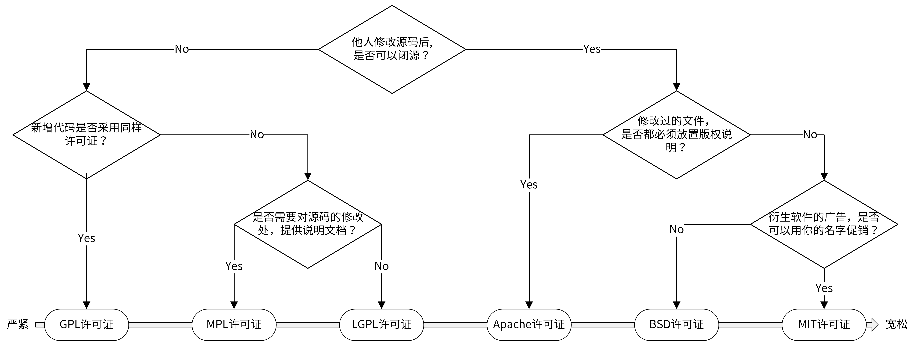
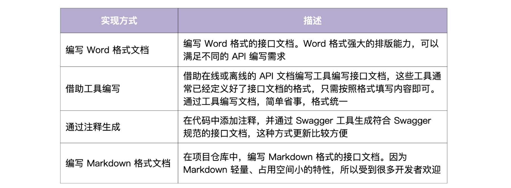

## 1. 规范设计

**非编码规范**：开源规范、文档规范、版本规范、Commit 规范、发布规范

**编码类规范**：目录规范、代码规范、接口规范、日志规范、错误码规范 



### 1.1 开源规范

**开源协议**：规定在使用开源软件时的权利和责任（使用开源项目时，才会用到开源规范）

[开源协议介绍](https://github.com/marmotedu/geekbang-go/blob/master/%E5%BC%80%E6%BA%90%E5%8D%8F%E8%AE%AE%E4%BB%8B%E7%BB%8D.md)	[开源规范列表](https://github.com/marmotedu/geekbang-go/blob/master/%E5%BC%80%E6%BA%90%E8%A7%84%E8%8C%83%E8%AF%A6%E7%BB%86%E5%88%97%E8%A1%A8.md)



- Apache 是对商业应用友好的协议，使用者也可以在需要的时候修改代码来满足需要，并作为开源或商业产品发布 / 销售，大型公司的开源项目通常会采用 Apache 2.0 开源协议

### 1.2 文档规范

**最重要的三类文档**：README 文档，项目文档，API 接口文档

**README 文档**：是开发者学习项目时第一个阅读的文档，会放在项目目录下

[IAM README 参考](https://raw.githubusercontent.com/marmotedu/iam/master/README.md)	[在线 README 生成工具](https://readme.so/)

```bash
# 项目名称
<!-- 写一段简短的话描述项目 -->

## 功能特性
<!-- 描述该项目的核心功能点 -->

## 软件架构(可选)
<!-- 可以描述下项目的架构 -->

## 快速开始

### 依赖检查
<!-- 描述该项目的依赖，比如依赖的包、工具或者其他任何依赖项 -->

### 构建
<!-- 描述如何构建该项目 -->

### 运行
<!-- 描述如何运行该项目 -->

## 使用指南
<!-- 描述如何使用该项目 -->

## 如何贡献
<!-- 告诉其他开发者如果给该项目贡献源码 -->

## 社区(可选)
<!-- 如果有需要可以介绍一些社区相关的内容 -->

## 关于作者
<!-- 这里写上项目作者 -->

## 谁在用(可选)
<!-- 可以列出使用本项目的其他有影响力的项目，算是给项目打个广告吧 -->

## 许可证
<!-- 这里链接上该项目的开源许可证 -->
```


**项目文档**：包括一切需要文档化的内容，通常集中放在 `/docs` 目录下

- 创建团队的项目文档时，通常会预先规划并创建好一些目录，用来存放不同的文档
- 好的文档规范：易读、可以快速定位文档

```bash
# IAM文档参考
docs
├── devel                            # 开发文档，可以提前规划好，英文版文档和中文版文档
│   ├── en-US/                       # 英文版文档，可以根据需要组织文件结构
│   └── zh-CN                        # 中文版文档，可以根据需要组织文件结构
│       └── development.md           # 开发手册，可以说明如何编译、构建、运行项目
├── guide                            # 用户文档
│   ├── en-US/                       # 英文版文档，可以根据需要组织文件结构
│   └── zh-CN                        # 中文版文档，可以根据需要组织文件结构
│       ├── api/                     # API文档
│       ├── best-practice            # 最佳实践，存放一些比较重要的实践文章
│       │   └── authorization.md
│       ├── faq                      # 常见问题
│       │   ├── iam-apiserver
│       │   └── installation
│       ├── installation             # 安装文档
│       │   └── installation.md
│       ├── introduction/            # 产品介绍文档
│       ├── operation-guide          # 操作指南，里面可以根据RESTful资源再划分为更细的子目录，
									 # 用来存放系统核心/全部功能的操作手册
│       │   ├── policy.md
│       │   ├── secret.md
│       │   └── user.md
│       ├── quickstart               # 快速入门
│       │   └── quickstart.md
│       ├── README.md                # 用户文档入口文件
│       └── sdk                      # SDK文档
│           └── golang.md
└── images                           # 图片存放目录
    └── 部署架构v1.png
```

- 开发文档：用来说明项目的开发流程（搭建开发环境、构建二进制文件、测试、部署等）
- 用户文档：软件的使用文档，对象一般是软件的使用者，内容可根据需要添加（包括 API 文档、SDK 文档、安装文档、功能介绍文档、最佳实践、操作指南、常见问题等）


**API 接口文档**：由后台开发人员编写，用来描述组件提供的 API 接口，以及如何调用这些 API 接口

- 在项目初期，接口文档可以解耦前后端，让前后端并行开发：前端只需要按照接口文档实现调用逻辑，后端只需要按照接口文档提供功能
- 当前后端都开发完成之后，就可以直接进行联调，提高开发效率
- 在项目后期，接口文档可以提供给使用者，不仅可以降低组件的使用门槛，还能够减少沟通成本



<br>


<br>

## 记录

1. 


