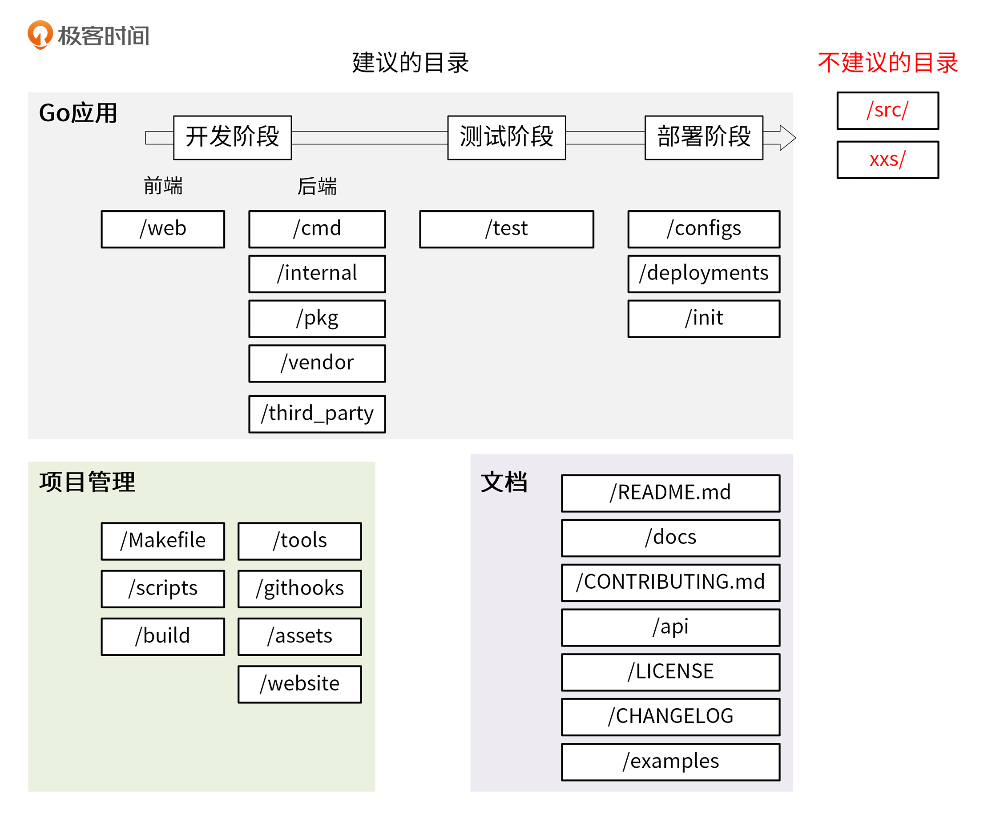

## 1. 平铺式目录结构

> 适用于代码框架/库

**平铺**：在项目的根目录下存放项目的代码

```bash
# golang/glog log 包就是平铺的
$ cd /home/going/go/go1.22.3/src/log
$ ls
example_test.go  internal  log.go  log_test.go  slog  syslog
```

- 平铺式的好处是引用路径明显减少，常用于很多框架/库中

<br>

## 2. 结构化目录

[推荐的结构化目录标准：project-layout](https://github.com/golang-standards/project-layout/blob/master/README_zh.md)

[Go 项目通常包含的内容](./Go 项目通常包含的内容.md)

### 结构化目录设计

- Go 项目三大部分：Go 应用，项目管理，文档




### 2.1 Go 应用

- Go 应用放前后端代码、测试代码、部署相关文件，贯穿开发、测试和部署阶段

#### `/web`

- 前端代码存放，主要存放 Web 静态资源，服务端模板和单页应用（SPAs）


#### `/cmd`

- 一个项目有很多组件，把组件 main 函数所在文件夹统一放在该目录下
- 具体的业务实现在 internal 目录下，cmd 目录可以快速找到应用入口

```bash
# IAM cmd 目录
$ ls cmd/
gendocs  geniamdocs  genman  genswaggertypedocs  genyaml  
iam-apiserver  iam-authz-server  iamctl  iam-pump

$ ls cmd/iam-apiserver/
apiserver.go
```

- 组件目录名与期望的可执行文件名一致

- `/cmd/<组件名>`目录下不要存放太多的代码

    - 如果代码可以导入并在其他项目中使用，应该放在` /pkg` 目录
    - 如果代码不可重用，或不希望其他人重用，放在 `/internal` 目录下

    

#### `/internal`

- 存放私有应用和库代码，不希望代码在其他应用和库中被导入

```bash
# 在引入其它项目 internal 下的包时，Go 语言会在编译时报错
An import of a path containing the element “internal” is disallowed
if the importing code is outside the tree rooted at the parent of the
"internal" directory.
```

- 可以通过 Go 语言本身的机制来约束其他项目 import 项目内部的包
    - `/internal/apiserver`：存放真实的应用代码（下面的 apiserver、authzserver、iamctl 目录）
    - `/internal/pkg`：存放项目内可共享，项目外不共享的包（提供基础、同样的功能，如工具、错误码、用户验证等）
    - 建议开始时将所有共享代码放在 `/internal/pkg` 下，后续转存到 `/pkg` 对外开发

```bash
# IAM internal 目录
├── apiserver	# 应用目录，包含应用程序的实现代码
│   ├── api
│   │   └── v1			# HTTP API 接口的具体实现，用来做 HTTP 请求的解包、参数校验、业务逻辑处理、返回
│   │       └── user		# 这里的业务逻辑处理应该是轻量级的，如果业务逻辑比较复杂，代码量比较多，
│   │						# 建议放到 /internal/apiserver/service 目录下。该源码文件主要用来串流程
│   ├── options			# 应用的 command flag
│   ├── config			# 根据命令行参数创建应用配置
│   ├── service			# 存放应用复杂业务处理代码
│   │   └── user.go
│   ├── store			# 存放接口定义，sql 语句组装存放在 service 中
│   │   ├── mysql			# 存放应用需要持久化存储的数据，即与数据库交互的代码
│   │   ├						#（Create、Update、Delete、Get、List 等）
│   │   │   └── user.go
│   │   ├── fake
│   └── testing
├── authzserver
│   ├── api
│   │   └── v1
│   ├── options
│   ├── store
│   └── testing
├── iamctl
│   ├── cmd
│   │   ├── cmd.go
│   │   ├── info
└── pkg			# 存放项目内可共享的包 
    ├── code		# 项目业务的 Code 码
    ├── middleware	# 通用的验证函数
    ├── options		
    └── validation	# HTTP 处理链
```


#### `/pkg`

- 是 Go 项目中最常见的目录，存放可以被外部应用使用的代码库，其他项目可以直接通过 import 导入
- 放入代码时要慎重！


#### `/vendor`

- 项目依赖，可通过 `go mod vendor` 构建
- 如果是一个 Go 库，不要提交 vendor 依赖包


#### `/third_party`

- 外部帮助工具，分支代码或其他第三方应用（如 Swagger UI）
- fork 一个 第三方 Go 包，并做小改动，就可以放在 `/third_party/forked` 下


#### `/test`

- 用于存放其他外部测试应用和测试数据
- `/test` 目录的构建方式比较灵活：对于大的项目，有一个数据子目录是有意义的
    - 可以使用 `/test/data` 目录，从而忽略该目录中的内容
    - Go 会忽略以 `.` 或 `_` 开头的文件或目录


#### `/configs`

- 用来配置文件模板或默认配置，可以存放 confd 或 consul-template 模板文件
    - 配置中不能携带敏感信息，用占位符替代

```yaml
apiVersion: v1    
user:    
  username: ${CONFIG_USER_USERNAME} # iam 用户名    
  password: ${CONFIG_USER_PASSWORD} # iam 密码
```


#### `/deplyments`

- 用来存放 Iaas、PaaS 系统和容器编排部署配置和模板（Docker-Compose、Kubernetes/Helm、Mesos、Teeraform、Bosh）
    - 在一些项目（特别是用 k8s 部署的）中该目录命名为 `/deploy`


#### `/init`

- 存放初始化系统（systemd，upstart，sysv）和进程管理配置文件（runit，supervisord）


### 2.2 项目管理

#### `/Makefile`

- 项目的根目录下应该有一个 Makefile 工具，用来对项目进行管理
- Makefile 通常用来执行静态代码检查、单元测试、编译等功能
- 在实际开发中，可以将一些重复性的工作自动化，添加到 Makefile 文件中统一管理

建议：直接执行 make 时，执行如下各项 `format -> lint -> test -> build`，如果是有代码生成的操作，还可能需要首先生成代码 `gen -> format -> lint -> test -> build`

[Makefile 常见管理内容](https://github.com/marmotedu/geekbang-go/blob/master/Makefile%E5%B8%B8%E8%A7%81%E7%AE%A1%E7%90%86%E5%86%85%E5%AE%B9.md)


#### `/scripts`

- 存放脚本文件，实现构建、安装、分析等不同功能；通常包含以下目录:
    - `/scripts/make-rules`：存放 makefile 文件，实现 `/Makefile` 文件中的各个功能
    - `/scripts/lib`：shell 库，用来存放 shell 脚本；一个大型项目中有很多自动化任务（发布、更新文档、生成代码等），可以写成 shell 脚本，这些脚本会有一些通用功能可以抽象成库，存放在 `/scripts/lib` 下
    - `/scripts/install`：如果项目支持自动化部署，可以将自动化部署脚本放在此目录下
        （简单脚本可以直接放在 `/scripts` 目录下）

- shell 脚本中的函数名，建议采用语义化的命名方式，例如 `iam::log::info` 这种语义化的命名方式，可以使调用者轻松的辨别出函数的功能类别，便于函数的管理和引用（在 Kubernetes 的脚本中，就大量采用了这种命名方式）


#### `/build`

- 存放安装包和持续集成相关的文件，主要包括 3 个可能用到的目录：
    - `/build/package`：存放容器（Docker）、系统（deb，rpm，pkg）的包配置和脚本
    - `/build/ci`：存放 CI（travis，circle，drone）的配置文件和脚本
    - `/build/docker`：存放子项目各个组件的 Dockerfile 文件


#### `/tools`

- 存放项目支持的工具，这些工具可导入来自 /pkg 和 /internal 目录的代码


#### `/githooks`

- Git 钩子，如 commit-msg 等可以存放在此目录


#### `/assets`

- 项目使用的其他资源（图片、CSS、JavaScript 等）


#### `/website`

- Github 页面以外的项目网站相关（网站介绍页面等）


### 2.3 文档

#### `/README.md`

- 参考 [0x02. 设计规范 - 文档规范](./0x02. 设计规范.md)

- 可借助 [tocenize](https://github.com/nochso/tocenize) 工具完成索引添加


#### `/docs`

- 存放设计文档、开发文档和用户文档等
    - `/docs/devel/{en-US, zh-CN}`：存放开发文档、hack 文档等
    - `/docs/guide/{en-US, zh-CN}`：存放用户手册、安装、quickstart、产品文档等
    - `/docs/images`：存放图片文件


#### `/CONTRIBUTING.md`

- 如果是开源就绪的项目，此文件用来说明如何贡献代码，如何开源协同等


#### `/api`

- 存放当前项目对外提供的各种不同类型的 API 接口定义文件，类似 `/api/protobuf-spec`、`/api/thrift-spec`、`/api/http-spec`、`openapi`、`swagger` 的目录，这些目录包含了当前项目对外提供和依赖的所有 API 文件

```bash
# IAM /api 目录
├── openapi/
│   └── README.md
└── swagger/
    ├── docs/
    ├── README.md
    └── swagger.yaml
```


#### `/LICENSE`

- 版权文件可以是私有的，也可以是开源的
    - 常用的开源协议有：Apache 2.0、MIT、BSD、GPL、Mozilla、LGPL
    - 有时候，公有云产品为了打造品牌影响力，会对外发布一个本产品的开源版本，所以在项目规划初期最好就能规划下未来产品的走向，选择合适的 LICENSE
- 为了声明版权，你可能会需要将 LICENSE 头添加到源码文件或者其他文件中，自动化工具：[addlicense](https://github.com/marmotedu/addlicense)
- 当代码中引用了其他开源代码时，需要在 LICENSE 中说明对其它源码的引用，需要知道代码引用了哪些源码，以及这些源码的开源协议，推荐工具：[glice](https://github.com/ribice/glice)
- [IAM LECENSE](https://github.com/marmotedu/iam/blob/master/LICENSE)


#### `/CHANGELOG`

- 存放更新记录，包括当前版本的更新内容或历史更新内容
- 可以结合 [Angular 规范](https://github.com/angular/angular/blob/22b96b9/CONTRIBUTING.md#-commit-message-guidelines) 和 [git-chglog](https://github.com/git-chglog/git-chglog) 自动生成


#### `/examples`

- 存放应用程序或者公共包的示例代码，辅助使用者降低上手门槛

<br>

## 3. 建议

### 3.1 小型项目目录

- 对于小型项目，可以先考虑包含 `/cmd`、`/pkg`、`/internal` 3 个目录，后续根据需要创建

```bash
# --noreport：抑制在树形列表末尾打印文件和目录报告
# -L 2：将目录遍历的深度限制为 2 层
# tms：要列出的根目录
$ tree --noreport -L 2 tms

tms
├── cmd
├── internal
├── pkg
└── README.md
```

- 设计目录结构时，可以在空目录下加一个 `.keep` 文件，使得空目录可以提交到 Git 仓库

```bash
$ ls -A build/ci/ 
.keep
```


### 3.2 不建议的目录

`/src/`：默认情况下，Go 的项目会被放置到 `$GOPATH/src` 目录，如果在项目中使用 src 目录，路径就会产生两个

`xxs/`：避免使用带负数的目录或包（具体还要看实际情况）


<br>

## 问题

1. vendor、gomodule