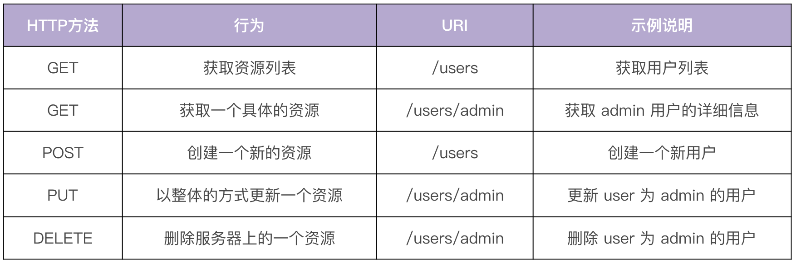
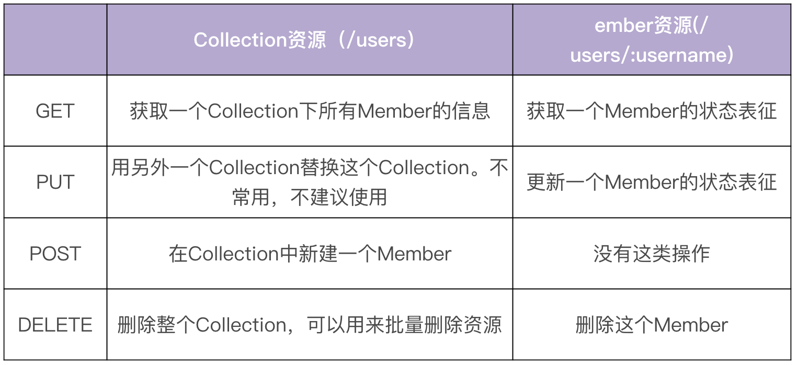
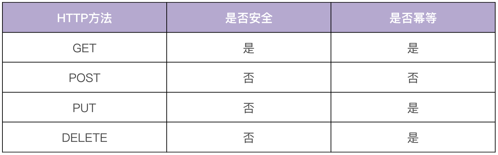
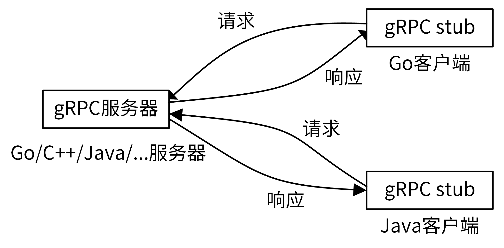

## 1. RESTful API

> 业界常用的三种 API 风格：REST、RPC、GraphQL（IAM 使用了 REST 和 RPC）

[GraphQL 文档](https://graphql.cn/)

### 1.1 什么是 REST

**REST**（REpresentational State Transfer）：表现层状态转移 [论文来源](https://ics.uci.edu/~fielding/pubs/dissertation/top.htm)

- REST 规范把所有内容都视为资源，即网络上一切皆资源

- REST 是一种软件架构风格，是一组架构约束条件和原则，而不是技术架构

- REST 有一系列规范，满足这些规范的 API 均可称为 RESTful API


### 1.2 REST 与 HTTP



- REST 架构对资源的操作包括获取、创建、修改和删除，正好与 HTTP 协议提供的方法对应
    （HTTP 动词对应 REST 风格 CRUD 如上表）

- REST 虽然适用于很多传输协议，但因其天生和 HTTP 相辅相成，HTTP 协议已经成了实现 RESTful API 事实上的标准


### 1.3 REST 核心特点

**以资源为中心**：所有的东西都抽象成资源，所有的行为都应该是在资源上的 CRUD 操作

- 资源对应面向对象范式里的对象，面向对象范式以对象为中心
- 每个资源实例都有一个唯一的 URI 标识（如用户名 admin 对应的 URI 是 `/users/admin`）

**资源有状态**：使用 `JSON/XML` 等在 HTTP Body 中表征资源的状态

**状态转化**：客户端通过四个 HTTP 动词，对服务端资源进行操作，实现“表现层状态转化”

**无状态**：每个 RESTful API 请求都包含了所有所有足够完成本次操作的信息，服务端无须保持 Session

- 无状态对于服务端的弹性扩容很重要？

<br>

## 2. RESTful API 设计原则

### 2.1 URI 设计

**URI**：统一资源标识符，用于标识互联网上资源的字符，通常有两种类型

- `URL`：统一资源定位符，指定资源的位置以及检索它的协议
- `URN`：统一资源名称，只作为资源的唯一标识符

**资源通过 URI 标识，需要遵循一些规范**

1. 资源名使用名词而非动词，并且使用名词复数表示，资源有以下两种分类：
    - `Collection`：一堆资源的集合（如系统中有很多用户 User，用 `域名/资源名复数` 的 URI 标识，
        如`https://iam.api.marmotedu.com/users`
    - `Member`：当特定资源，如系统中特定名字的用户，就是 Collection 里的一个 Member，用 `域名/资源名复数/资源名称` 的 URI 标识，如  `https://iam.api.marmotedu/users/admin`
2. URI 结尾不应包含 `/`
3. URI 中不能出现 `_`，建议用 `-` 代替
4. URI 路径用小写，不用大写
5. 避免层级过深的 URI，建议将其他资源转化为 `?` 参数

```bash
/schools/tsinghua/classes/rooma/students/zhang # 不推荐
/students?school=qinghua&class=rooma # 推荐
```

6. 将一个操作变成资源的一个属性

```bash
# 示例：在系统中禁用某个用户
URI: /users/zhangsan?active=false
```

7. 将操作当成是一个资源的嵌套资源

```bash
# 示例：Github 加星操作
PUT /gists/:id/start
DELETE /gists/:id/star
```

参考：[GitHub 标准 RESTful API](https://docs.github.com/en/rest?apiVersion=2022-11-28)


### 2.2 REST 资源映射为 HTTP 方法



对资源的操作应满足安全性和幂等性：

**安全性**：不会改变资源状态，即只读

**幂等性**：操作 1 次和 N 次，对资源状态改变的效果是等价的



#### 技巧与建议

**资源属性一致**：GET 返回的结果，尽量可用于 PUT、POST 操作中

- 如用 GET 方法获得了一个 user 的信息，调用者修改 user 邮件，然后将此结果再用 PUT 方法更新（要求 GET、PUT、POST 操作的资源属性是一致的）

**对资源进行状态/属性变更使用 PUT**：POST 方法仅用来创建或者批量删除这两种场景

**批量删除**：面对批量删除的需求，需要在请求中携带多个需要删除的资源名，但 HTTP 的 DELETE 方法不能携带多个资源名，解决方式：

1. 发起多个 DELETE 请求
2. 操作路径中带有多个 id，id 之间用分隔符分隔，例如：`DELETE /users?id=1,2,3`（推荐！）
3. 直接使用 POST 方法批量删除，body 中传入需要删除的资源列表


### 2.3 统一的返回格式

一般来说，一个系统的 RESTful API 会向外界开放多个资源的接口，每个接口的返回格式要保持一致

每个接口都会返回成功和失败两种消息，这两种消息的格式也要保持一致，否则客户端代码要适配不同接口的返回格式，每个返回格式又要适配成功和失败两种消息格式，会大大增加用户的学习和使用成本


### 2.4 API 版本管理

随着时间推移、需求变更，一个 API 往往满足不了现有需求，需要对 API 进行修改，同时不能影响其他系统的正常调用，这就要求 API 变更做到向下兼容，即新老版本共存

- 从一开始就引入 API 版本机制，当不能向下兼容时，就引入一个新的版本，老版本则保留原样
- 通常将版本标识放在如下位置：
    - URL 中，如 `/v1/users`（推荐！）
    - HTTP Header 中，如 `Accept: vnd.example-com.foo+json; version=1.0`
    - Form 参数中，如 `/users?version=v1`


### 2.5 API 命名

**驼峰命名法**：serverAddress

**蛇形命名法**：server_address

**脊柱命名法**：server-address（推荐！不需要切换输入法）


### 2.6 统一分页 | 过滤 | 排序 | 搜索功能

REST 资源的查询接口，通常情况下都需要实现分页、过滤、排序、搜索功能，因为这些功能是每个 REST 资源都能用到的，所以可以实现为一个公共的 API 组件

**分页**：在列出一个 Collection 下所有的 Member 时，应该提供分页功能，如 `/users?offset=0&limit=20`

- limit：指定返回记录的数量
- offset：指定返回记录的开始位置
- 引入分页功能可以减少 API 响应的时延，同时可以避免返回太多条目，导致服务器/客户端响应特别慢、甚至 crash 的情况
    （crash：崩溃，服务器或客户端在运行过程中因未处理的错误或异常情况而停止工作）

**过滤**：如果用户不需要一个资源的全部状态属性，可以在 URI 参数里指定返回哪些属性，

- 如 `/users?}fileds=email,username,address`

**排序**：用户很多时候会根据创建时间或其他因素，列出一个 Collection 中前 100 个 Member，可以在 URI 参数中指明排序参数

- 如`/users?sort=age,desc`

**搜索**：当一个资源的 Member 太多时，用户可能想通过搜索快速找到所需要的 Member，或者想搜下有没有名字为 xxx 的某类资源，需要提供搜索功能

- 搜索功能建议按模糊匹配来搜索


### 2.7 域名

API 的域名设置主要有两种方式：

`https://marmotedu.com/api`：适合 API 将来不会有进一步扩展的情况

`https://iam.api.marmotedu.com`：如果权威域名下未来会新增另一个系统 API，就需要每个系统的 API 拥有专用的 API 域名

- 如：`storage.api.marmotedu.com`，`net.api.marmotedu.com`

<br>

## 3. RPC API

### 3.1 RPC 介绍

**RPC**（Remote Procedure Call）：远程过程调用，一个计算机通信协议

- 该协议允许运行于一台计算机的程序调用另一台计算机的子程序
- 而程序员不用额外地为这个交互作用编程
- 

**理解**：服务端实现了一个函数，客户端使用 RPC 框架提供的接口，像调用本地函数一样调用这个函数，并获取返回值

- RPC 屏蔽了底层的网络通信细节，使得开发人员无需关注网络编程的细节
- 可以将更多的时间和精力放在业务逻辑本身的实现上，从而提高开发效率

#### RPC 的调用过程


1. Client 通过本地调用，调用 Client Stub
2. Client Stub 将参数打包（也叫 Marshalling）成一个消息，然后发送这个消息
3. Client 所在的 OS 将消息发送给 Server；Server 端接收到消息后，将消息传递给 Server Stub
4. Server Stub 将消息解包（也叫 Unmarshalling）得到参数
5. Server Stub 调用服务端的子程序（函数），处理完后，将最终结果按照相反的步骤返回给 Client

**Stub**：负责调用参数和返回值的流化、参数的打包和解包，以及网络层的通信

- `Client Stub`（客户端存根）：存放服务端地址信息，将客户端的请求参数数据信息打包成网络信息，再通过网络传输发送给服务端

- `Server Stub`（服务端存根）：接收客户端发送的请求消息并进行解包，然后再调用本地服务进行处理
- Client 端一般叫 Stub（存根），Server 端一般叫 Skeleton

`Network Service`：底层传输，可以是 TCP 或 HTTP

- RPC 封装后，服务消费者只需通过本地调用 RPC 接口，并获取返回值，中间过程透明

**流化**：将对象和数据结构转为线性结构（JSON、XML、二进制等），从而便于网络传输或数据持久化（保存对象的状态信息）


### 3.2 gRPC 

> gRPC （google Remote Procedure Call）协议的 “g” 指的是 Google，支持多种语言

[gRPC](https://github.com/grpc/grpc-go)：Google 开发的高性能、开源、跨多种编程语言的通用 RPC 框架

- 基于 HTTP/2.0 协议
- 默认采用 Protocol Buffers 数据序列化协议

 **gRPC 特性**

- 支持多种语言（Go、Java、C、C++、Python等）
- 基于 IDL（Interface Definition Language）文件定义服务，通过 proto3 工具生成指定语言的数据结构、服务端接口以及客户端 Stub（通过这种方式，可以将服务端和客户端解耦，进而可以并行开发）
- 通信协议基于标准的 HTTP/2 设计，支持双向流、消息头压缩、单 TCP 的多路复用、服务端推送等特性
- 支持 Protobuf 和 JSON 序列化数据格式
    - Protobuf 是一种语言无关的高性能序列化框架，可以减少网络传输流量，提高通信速度



- 在 gRPC 中，客户端可以直接调用部署在不同机器上的 gRPC 服务所提供的方法，调用远端的 gRPC 方法就像调用本地的方法一样，非常简单方便（通过多语言支持，编写的 gRPC 服务能够满足客户端多语言的需求）
- 通过 gRPC 调用，很容易构建出一个分布式应用

- gRPC 通过 IDL 语言，预先定义好接口（名字、传入参数和返回参数等）

    - 在服务端，gRPC 服务实现我们所定义的接口

    - 在客户端，gRPC 存根提供跟服务端相同的方法


### 3.3 Protocol Buffers

**Protocol Buffers**（protobuf）：是 Google 开发的一套对数据结构进行序列化的方法，可用作（数据）通信协议、数据存储格式等

- 与 XML、JSON 类似，是一种更加灵活、高效的数据格式
- 传输性能很好，常被用在一些对数据传输性能要求较高的系统中


#### 特性

1. 数据传输快：和 XML、JSON 文本传输格式相比，protobuf 在传输时会将数据序列化为二进制数据，可以节省大量的 IO 操作，从而提高数据传输速度
2. 跨平台多语言：protobuf 自带的编译工具 protoc 可以基于 protobuf 定义文件，编译出不同语言的客户端或者服务端，供程序直接调用，因此可以满足多语言需求的场景
3. 扩展性和兼容性良好：可以更新已有的数据结构，而不破坏和影响原有的程序
4. 基于 IDL 文件定义服务，通过 proto3 工具生成指定语言的数据结构、服务端和客户端接口


#### protobuf 应用于 gRPC

1. 定义数据结构

```protobuf
// SecretInfo contains secret details.
message SecretInfo {
    string name = 1;
    string secret_id  = 2;
    string username   = 3;
    string secret_key = 4;
    int64 expires = 5;
    string description = 6;
    string created_at = 7;
    string updated_at = 8;
}
```

2. 定义服务接口

```protobuf
// Cache implements a cache rpc service.
service Cache{
  rpc ListSecrets(ListSecretsRequest) returns (ListSecretsResponse) {}
  rpc ListPolicies(ListPoliciesRequest) returns (ListPoliciesResponse) {}
}
```

3. 可以通过 protobuf 序列化和反序列化，提升传输效率

<br>

## 4. gRPC 示例

### 4.1 示例目录结构


### 4.2 示例步骤

**1. 定义 gRPC 服务**

```bash
cd helloworld
```

```protobuf
syntax = "proto3";

option go_package = ".";

package helloworld;

// The greeting service definition.
service Greeter {
  // Sends a greeting
  rpc SayHello (HelloRequest) returns (HelloReply) {}
}

// The request message containing the user's name.
message HelloRequest {
  string name = 1;
}

// The response message containing the greetings
message HelloReply {
  string message = 1;
}
```

`option`关键字：对 .proto 文件进行一些配置；`go_package` 是必需的，值是包导入的路径

`package`关键字：指定生成 `.pb.go` 文件所在的包名

`service`关键字：定义服务，指定该服务拥有的 RPC 方法，并定义方法的请求和返回的结构体类型

**gRPC 支持定义 4 中类型的服务方法**

- 简单模式（Simple RPC）：最简单的 gRPC 模式
    - 客户端发起一次请求，服务端响应一个数据

```protobuf
rpc SayHello (HelloRequest) returns (HelloReply) {}
```

- 服务端数据流模式（Server-side streaming RPC）
    - 客户端发送一个请求，服务端返回数据流响应，客户端从流中读取数据直到为空

```protobuf
rpc SayHello (HelloRequest) returns (stream HelloReply) {}
```

- 客户端数据流模式（Client-side streaming RPC）
    - 客户端将消息以流的方式发送给服务器，服务器全部处理完成之后返回一次响应

```protobuf
rpc SayHello (stream HelloRequest) returns (HelloReply) {}
```

- 双向数据流模式（Bidirectional streaming RPC）
    - 客户端和服务端都可以向对方发送数据流，这个时候双方的数据可以同时互相发送，也就是可以实现实时交互 RPC 框架原理

```protobuf
rpc SayHello (stream HelloRequest) returns (stream HelloReply) {}
```


**2. 生成客户端和服务端代码**

```bash
protoc --go_out=. --go-grpc_out=. ./helloworld.proto
ls
helloworld.pb.go        helloworld.proto        helloworld_grpc.pb.go
```


**3. 实现 gRPC 服务**

```bash
cd ../server
```


## 记录

1. 怎么理解架构、框架、风格
2. http 四个动词
3. GraphQL API会比较适合接口变动比较频繁的开发环境，这种API设计看起来基本不用考虑版本兼容的问题
4. https://www.bookstack.cn/read/API-design-guide/API-design-guide-04-%E6%A0%87%E5%87%86%E6%96%B9%E6%B3%95.md
5. go/http -> gin