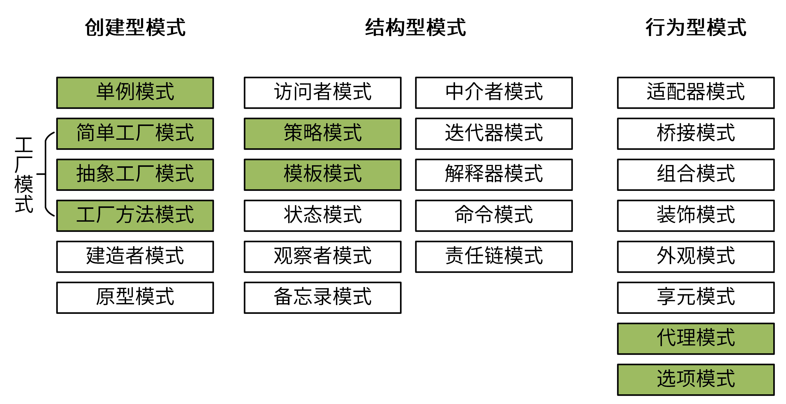

## 设计模式

## 面向对象设计原则

**面向对象设计核心问题**：提高软件系统的「可维护性」和「可复用性」

**单一职责原则** **(Single Responsibility Principle, SRP)**

- 类的职责单一，对外只提供一种功能，而引起类变化的原因都应该只有一个

**开闭原则** **(Open-Closed Principle, OCP)**

- 类的改动是通过增加代码进行的，而不是修改源代码

**里氏代换原则** **(Liskov Substitution Principle, LSP)**

- 任何抽象类（interface接口）出现的地方都可以用他的实现类进行替换，实际就是虚拟机制，语言级别实现面向对象功能

**依赖倒转原则** **(Dependence**  **Inversion Principle, DIP)**

- 依赖于抽象(接口)，不要依赖具体的实现(类)，也就是针对接口编程

**接口隔离原则** **(Interface Segregation Principle, ISP)**

- 不应该强迫用户的程序依赖他们不需要的接口方法。一个接口应该只提供一种对外功能，不应该把所有操作都封装到一个接口中去

**合成复用原则** **(Composite Reuse Principle, CRP)**

- 如果使用继承，会导致父类的任何变换都可能影响到子类的行为。如果使用对象组合，就降低了这种依赖关系。对于继承和组合，优先使用组合

**迪米特法则** **(Law of Demeter, LoD)**

- 一个对象应当对其他对象尽可能少的了解，从而降低各个对象之间的耦合，提高系统的可维护性。例如在一个程序中，各个模块之间相互调用时，通常会提供一个统一的接口来实现。这样其他模块不需要了解另外一个模块的内部实现细节，这样当一个模块内部的实现发生改变时，不会影响其他模块的使用。（黑盒原理）

## 问题

1. Go 包被初始化的流程

## 参考

[Go 设计模式](https://lailin.xyz/post/go-design-pattern.html)

https://www.liwenzhou.com/posts/Go/singleton/

https://www.liwenzhou.com/posts/Go/functional-options-pattern/

https://time.geekbang.org/column/article/386238

https://www.yuque.com/aceld/lfhu8y/pebesh

