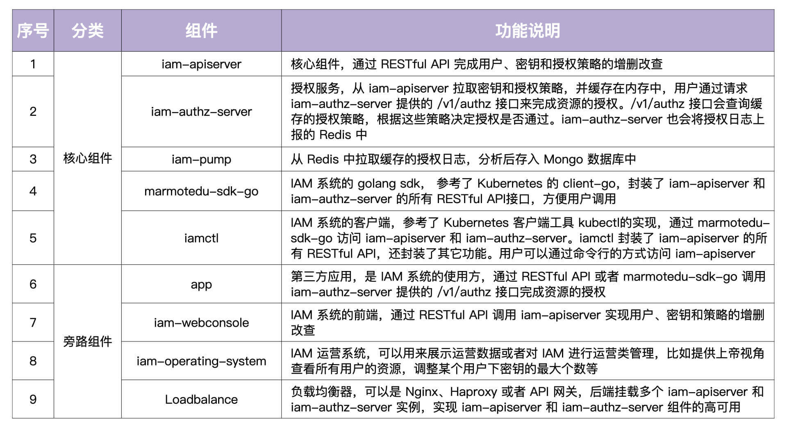

## 0. 课程简介

### Go 语言核心优势

1. 语言简单
2. 语言层面支持并发编程
3. 跨平台编译
4. 自带垃圾回收机制

**学习项目的方式**：修改代码、运行验证（跑起来，运行输出）

### 项目技术栈

**开发**

- Web 框架：gin
- 认证：Basic、JWT
- CRUD：GORM
- 数据库：MongoDB、Redis、MySQL（MariaDB）
- API：gRPC、HTTP（RESTful）
- 日志：zap
- 应用构建：viper、pflag、cobra
- 分布式作业系统

**测试**

**部署**

- Nginx + Keepalived
- K8S + Helm
- Docker
- 云原生
- CI/CD
- Makefile
- Swagger API doc

### 学习内容

- 设计模式：

    - 单例模式

    - 应用构建（选项模式）

    - 控制流（抽象工厂模式/依赖注入）

    - 认证（策略模式）

- Web 框架：gin（需要补充细节）、RESTful API

- 应用构建：viper、pflag、cobra

- 认证 Auth：Basic、JWT

- 授权 Authz：

    

    

    

 

## 1. IAM 系统概述

### 1.1 IAM 系统

> IAM（Identity and Access Management，身份识别与访问管理），给第三方用户提供访问控制服务

**解决的问题**：在特定条件下，谁能/不能对哪些资源做哪些操作，完成资源授权功能

#### Go 应用安全

> 对访问进行认证，对资源进行授权

**服务自身的安全**：需要禁止非法用户访问服务，以保证服务的安全

1. 服务器层面：通过物理隔离、网络隔离、防火墙等技术从底层保证服务的安全性；由运维团队保障
2. 软件层面：通过HTTPS、用户认证等手段加强服务的安全性；由开发者保障

**服务资源的安全**：服务内有很多资源，为了避免非法访问，开发者要避免 UserA 访问到 UserB 的资源，即需要对资源进行授权；通过资源授权系统对资源进行授权

CAM：基于属性的访问控制（Attribute-Based Access Control）模型

IAM：身份和访问管理（Identity and Access Management）授权模型

RBAC：基于角色的访问控制（Role-Based Access Control）模型

ACL：访问控制列表（Access Control List）模型

 

### 1.2 IAM 基本功能

**1. 登录与注册**

- 用户提供昵称、密码、邮箱、电话等信息注册并登录到 IAM 系统
- 以用户名和密码作为唯一的身份标识来访问 IAM 系统

**2. 密钥对创建**

- 访问 IAM 的资源授权接口是通过密钥`(secretID/secretKey)`的方式进行认证的
- 用户需要在 IAM 中创建属于自己的密钥资源

**3. 创建授权策略**

- IAM 通过授权策略完成授权，用户需要在 IAM 中创建授权策略

**4. 请求 IAM 提供的授权接口**

- IAM 根据用户的请求内容和授权策略来决定一个授权请求是否被允许

**三种系统资源，对应三种 RESTful 资源**

1. 用户（User)：实现对用户的 CRUD、修改密码、批量修改等
2. 密钥（Secret）：实现对密钥的 CRUD
3. 策略（Policy）：实现对策略的 CRUD、批量删除操作

 

### 1.3 IAM 系统架构

- 主要包括 9 大组件和 3 大数据库

 

### 1.4 IAM 使用流程

**1. 创建平台资源**

- 用户通过 `iam-webconsole`（RESTful API）或 `iamctl(sdk marmotedu-sdk-go)` 客户端请求 `iam-apiserver` 提供的 RESTful API 接口完成用户、密钥、授权策略的增删改查
- `iam-apiserver` 会将这些资源数据持久化存储在 MySQL 数据库中
- 为了确保通信安全，客户端服务端都是通过 HTTPS 协议来访问的

**2. 请求 API 完成资源授权**

- 用户可以通过请求 `iam-authz-server` 提供的 `/v1/authz` 接口进行资源授权
- 请求 `/v1/authz` 接口需要通过密钥认证
- 认证通过后 `/v1/authz` 接口会查询授权策略，决定资源请求是否被允许

- 为了提高`/v1/authz`接口的性能，`iam-authz-server`将密钥和策略信息缓存在内存中，以便实现快速查询

- 密钥和策略的存储：（redis 宕机数据是否会丢失？redis-server 作为 MQ 的隐患）
    - `iam-authz-server`通过调用`iam-apiserver`提供的 gRPC 接口，将密钥和授权策略信息缓存到内存中
    - 为了使内存中的缓存信息和`iam-apiserver`中的信息保持一致，当`iam-apiserver`中有密钥或策略被更新时，`iam-apiserver`会往特定的 Redis Channel（`iam-authz-server` 也会订阅该 Channel）中发送 `PolicyChanged` 和 `SecretChanged `消息
    - 当 `iam-authz-server` 监听到有新消息时就会获取并解析消息，根据消息内容判断是否需要重新调用 gRPC 接来获取密钥和授权策略信息，再更新到内存中

**3. 授权日志数据分析**

- iam-authz-server 会将授权日志上报到 Redis 高速缓存中
- iam-pump 组件会异步消费这些授权日志
- 再把清理后的数据保存在 MongoDB 中，供运营系统 iam-operating-system 查询

**4. 运营平台授权数据展示**

- iam-operating-system 是 IAM 的运营系统，它可以通过查询 MongoDB 获取并展示运营数据，比如某个用户的授权 / 失败次数、授权失败时的授权信息等
- 也可以通过 iam-operating-system 调用 iam-apiserver 服务来做些运营管理工作（如，以上帝视角查看某个用户的授权策略供排障使用，或者调整用户可创建密钥的最大个数，再或者通过白名单的方式，让某个用户不受密钥个数限制的影响等等）

 

### 1.5 IAM 软件架构

#### 前后端分离架构

> IAM 的运营系统 iam-operation-system 采用的就是前后端分离架构

前端：负责页面的展示，数据的加载和渲染

后端：负责返回前端需要的数据

- 前后端通过 RESTful API 通信

- 通过前端请求 `ops-webconsole` 时：
    - `ops-webconsole` 先请求静态文件服务器加载静态文件（HTML、CSS、JS）
    - 执行 JavaScript，通过负载均衡请求后端数据
    - 把后端返回的数据渲染到前端页面上

前后端分离架构的好处：

1. 可以让前、后端人员各自专注在自己业务的功能开发上，让专业的人做专业的事，来提高代码质量和开发效率
2. 前后端可并行开发和发布，这也能提高开发和发布效率，加快产品迭代速度
3. 前后端组件、代码分开，职责分明，可以增加代码的维护性和可读性，减少代码改动引起的 Bug 概率，同时也能快速定位 Bug
4. 前端 JavaScript 可以处理后台的数据，减少对后台服务器的压力
5. 可根据需要选择性水平扩容前端或者后端来节约成本

#### MVC 架构

- 当系统功能较少，可以采用 MVC 架构，节省沟通成本和前后端交互逻辑的开发

MVC（Model View Controller）

- View（视图）：提供给用户的操作界面，用来处理数据的显示
- Controller（控制器）：根据用户从 View 层输入的指令，选取 Model 层中的数据，然后对其进行相应的操作
- Model（模型）：应用程序中用于处理数据逻辑的部分

好处：通过 Controller 层将 View 层和 Model 层分离（解耦），当更改 View 层代码后，不需要重新编译 Controller 层和 Model 层的代码

 

## 2. 开发环境准备

[参考](https://time.geekbang.org/column/article/378076)

[快速部署](https://github.com/marmotedu/iam/blob/master/docs/guide/zh-CN/installation/README.md#%E5%BF%AB%E9%80%9F%E9%83%A8%E7%BD%B2)

[手动部署](https://github.com/marmotedu/iam/blob/master/docs/guide/zh-CN/installation/installation-procedures.md)

部署成功！后续看看怎么在容器中部署

 

 

## 记录

1. 数据库层与业务层解耦
2. Go 设计哲学（项目目录）
3. 高可用、安全、具备容灾能力，又可以轻松水平扩展
4. 负载均衡
5. webhook https://www.redhat.com/zh/topics/automation/what-is-a-webhook
6. web saas
7. 负载均衡
8. 选择 MongoDB：1. mongodb带有数据聚合功能，在某些场景下可以实现复杂的数据统计 2. 而且字段增减随意，查询方便 3. IAM系统授权日志量不大，场景也不复杂，再加上，这里是想展示mongodb的教学，所以就采用了mongo
9. 腾讯云 cam https://cloud.tencent.com/document/product/599/40011
10. machinery  和 gocelery（异步消费）
11. https://blog.csdn.net/weixin_42153410/article/details/90753696 mvc和三层架构
12. CMQ、NSQ 替换 redis 订阅
13. 项目间通信采用kafka消息队列，后台搜索功能数据放在ES（日志平台：filebeat + kafka + logstash + es）
14. iam 如何支持流量暴增，如何提高负载能力？（容器化部署，水平扩容，后台接口服务分发，做负载均衡，接口做相应的限流）
15. https://www.ruanyifeng.com/blog/2016/03/systemd-tutorial-commands.html
16. https://www.ruanyifeng.com/blog/2016/03/systemd-tutorial-part-two.html

 

## 参考

[**课程**：Go 语言项目开发实战](https://time.geekbang.org/column/article/378127)

[**项目**：IAM - 身份识别与访问管理系统](https://github.com/marmotedu/iam/tree/master?tab=readme-ov-file#iam---%E8%BA%AB%E4%BB%BD%E8%AF%86%E5%88%AB%E4%B8%8E%E8%AE%BF%E9%97%AE%E7%AE%A1%E7%90%86%E7%B3%BB%E7%BB%9F)

[《从零开发企业级 Go 应用》](https://www.itshujia.com/read/go-zero-cloud/306.html)
