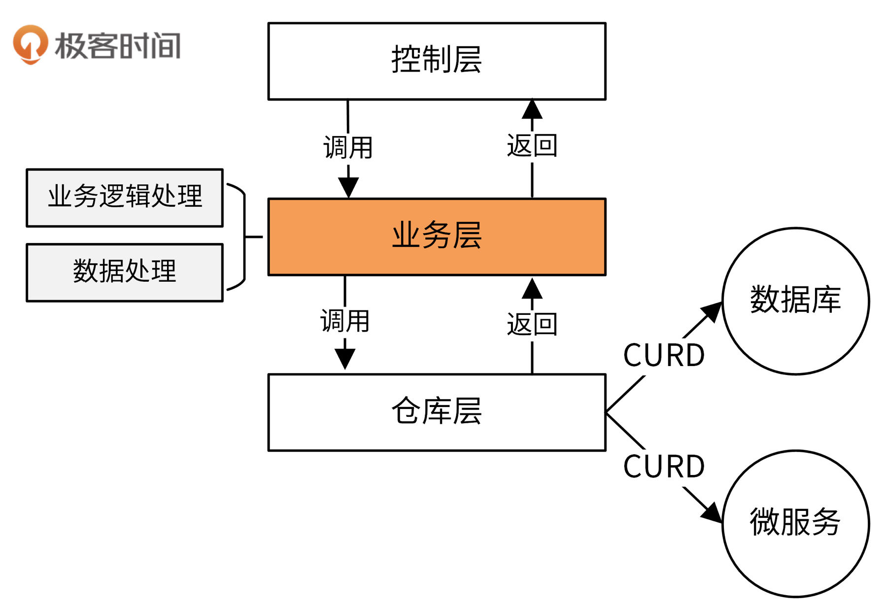
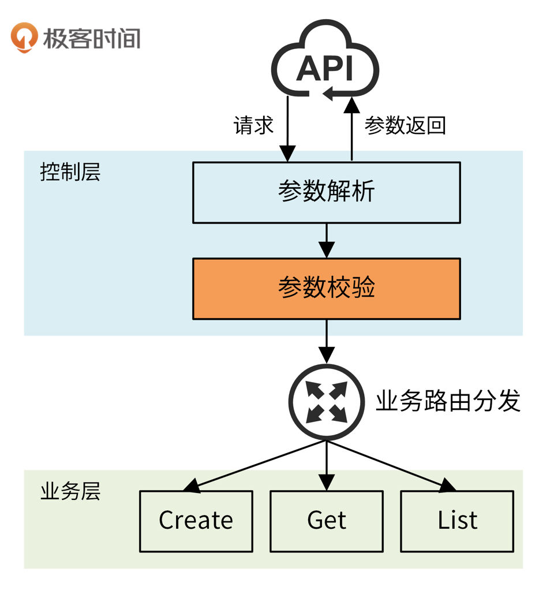

## 1. iam-apiserver 架构

### 1.1 架构特性

**独立于框架**：不依赖某些功能强大的软件库，而是使用

**可测试性**：可以在没有 UI、数据库、Web 服务或其他外部元素的情况下进行测试，实际开发中可通过 Mock 解耦依赖

**独立于 UI**

**独立于数据库**：可以用 Mongo、Oracle、Etcd 或其他数据库替换 MariaDB（业务规则不绑定具体数据库）

**独立于外部媒介**


### 1.2 架构分层


**iam-apiserver 代码架构分为四层：**

1. 模型层 Models
2. 控制层 Controller
3. 业务层 Service
4. 仓库层 Repository


**各层的包导入关系**

1. 模型层的包：仓库层、业务层、控制层可导入
2. 控制层：可以导入业务层、仓库层（尽量避免）的包，最好直接调用业务层
3. 业务层：可以导入仓库层的包


#### 模型层 Models

> 在某些软件架构中也叫实体层（Entities）

**模型层**：存储对象的结构和它的方法，在其他每一层都会使用

- 其中定义了 `User`、`UserList`、`Secret`、`SecretList`、`Policy`、`PolicyList`、`AuthzPolicy` 模型及其方法

- IAM 模型层是引入的外部库 https://github.com/marmotedu/api/tree/master
    - 模型层独立于项目之外，也可以被其他项目使用

- Models 即可以作为数据库模型，又可以作为 API 接口的请求参数（入参、出参），使创建资源的属性、保存在数据库的属性、返回资源的属性一致


#### 仓库层 Repository

> 仓库层不应封装任何业务逻辑！

基本功能

- 与数据库、第三方服务进行 CURD 交互，作为应用程序的数据引擎进行应用数据的输入和输出

- 负责数据库的选择（MySQL、MongoDB、MariaDB、Etcd 等），依赖于连接和数据库或其他第三方服务

数据转换：将从数据库/微服务中获取的数据转换为控制层、业务层能识别的数据结构，以及转换回来

```go
// internal/apiserver/store
```

```go
// pkg/storage
```


#### 业务层 Service

基本功能

- 主要用来完成业务逻辑处理，存放所有的业务逻辑处理代码
- 处理来自控制层的请求，并根据需要请求仓库层完成数据的 CURD 操作



```go
// internal/apiserver/service
```


#### 控制层 Controller

基本功能：实现了“业务路由”

- 接收 HTTP 请求
- 进行：参数解析、参数校验、逻辑分发处理、请求返回

控制层会将逻辑分发给业务层，业务层处理后返回，返回数据在控制层中被整合再加工，最终返回给请求方



- 不建议在控制层写复杂的代码，应将其分发到业务层或其他包

```go
// internal/apiserver/controller
```


## 2. 层间通信：通过接口解耦

### 2.1 层间通信逻辑

> 下面一业务层和控制层的通信为例，业务层和仓库层通信逻辑类似

```go
// internal/apiserver/service/v1/service.go
type Service interface {
	Users() UserSrv
	Secrets() SecretSrv
	Policies() PolicySrv
}
```

- 业务层提供了 `Service` 接口作为**业务对象（业务服务）集合**，接口方法返回的是各个业务对象

```go
// internal/apiserver/service/v1/user.go
type UserSrv interface {
	Create(ctx context.Context, user *v1.User, opts metav1.CreateOptions) error
	Update(ctx context.Context, user *v1.User, opts metav1.UpdateOptions) error
	Delete(ctx context.Context, username string, opts metav1.DeleteOptions) error
	DeleteCollection(ctx context.Context, usernames []string, opts metav1.DeleteOptions) error
	Get(ctx context.Context, username string, opts metav1.GetOptions) (*v1.User, error)
	List(ctx context.Context, opts metav1.ListOptions) (*v1.UserList, error)
	ListWithBadPerformance(ctx context.Context, opts metav1.ListOptions) (*v1.UserList, error)
	ChangePassword(ctx context.Context, user *v1.User) error
}
```

- `UserSrv` 作为业务层对象，定义了业务逻辑（该业务对象具体的业务方法集）

```go
// internal/apiserver/service/v1/user.go
type userService struct {
	store store.Factory
}

func (u *userService) Create(ctx context.Context, user *v1.User, opts metav1.CreateOptions) error {
	...
}

...
```

- `userService` 实现了 `UserSrv` 接口，即该业务对象的具体业务逻辑

```go
// internal/apiserver/controller/v1/user/user.go

// UserController create a user handler used to handle request for user resource.
type UserController struct {
	srv srvv1.Service
}

// NewUserController creates a user handler.
// 依赖注入获取业务层服务实例
func NewUserController(store store.Factory) *UserController {
	return &UserController{
		srv: srvv1.NewService(store),
	}
}
```

- 控制层创建了**业务层服务接口实例 **`UserController`

```go
// internal/apiserver/controller/v1/user/create.go

// Create add new user to the storage.
func (u *UserController) Create(c *gin.Context) {
    
	...
    
	// Insert the user to the storage.
	if err := u.srv.Users().Create(c, &r, metav1.CreateOptions{}); err != nil {
		core.WriteResponse(c, err, nil)

		return
	}

	...
}
```

- `u.srv.Users().Create()` 调用了创建用户的业务层逻辑


### 2.2 解耦

上述通信逻辑中，`Service` 接口剥离了业务层的具体业务逻辑，将业务服务抽象给控制层：

**解耦业务逻辑（业务逻辑抽象）**：控制层通过依赖注入获取业务层的服务实例，而不需要直接实例化业务逻辑，业务层将具体的业务逻辑封装在服务方法中，控制层使用这些服务方法执行业务操作，并不关心其实现细节（方便替换业务逻辑实现）

**解耦数据访问**：控制层不直接调用仓库层服务，而是通过业务层方法来执行

 

### 2.3 方便业务对象扩展

- 如新增一个 `Template` 业务层对象

```go
/* 业务层 */

// 将业务对象添加到业务服务中
type Service interface {
	Users() UserSrv
	Secrets() SecretSrv
	Policies() PolicySrv
    Template() TemplateSrv
}

func (s *service) Templates() TemplateSrv { return newTemplates(s) }

// template.go

// 业务对象
type TemplateSrc interface {
    Create(ctx context.Context, template *v1.Template, opts metav1.CreateOptions) error 
    ...
    // Other methods
}

// 确保 templateService 实现业务对象接口
var _ TemplateSrv = (*templateService)(nil)

// 业务对象实例化函数
func newTemplates(srv *service) *TemplateService { // more create logic 
    return &templateService{store: srv.store}
}

// 业务对象的具体实现逻辑
func (u *templateService) Create(ctx context.Context, template *v1.Template, opts metav1.CreateOptions) error { ... }

...
```

- 新增的 Template 业务对象代码几乎都在 `template.go` 中，满足开闭原则（增添而不修改）
- 对已有的 `Service` 接口几乎没有入侵，避免影响已有业务


### 2.4 接口实现检查

```go
var _ InterfaceType = (*ConcreteType)(nil)
```

- 该写法确保结构体 `ConcreteType` 实现了接口 `InterfaceType`，如果没有实现，编译器会报错
- 这种方法不会在运行时创建任何对象，也不会分配内存，因为`nil`指针没有实际值，仅用于类型检查


