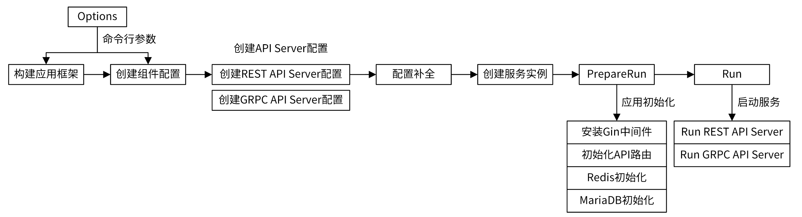
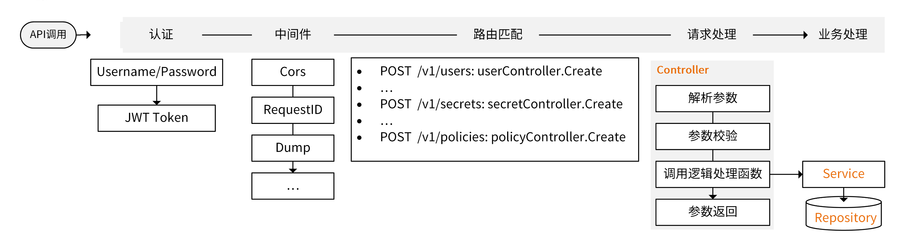

## 1. apiserver 控制流程

### 1.1 启动流程设计



**main 函数入口**：`cmd/iam-apiserve/apiserver.go`

```go
apiserver.NewApp("iam-apiserver").Run()
```

1. 构建应用框架
2. 执行命令

**初始化 Options，配置 App 选项**：`internal/apiserver`

- `app.go`：初始化 App
    - `NewApp()`：初始化 Options，配置 App 选项
    - `run()`：初始化日志、配置
- `run.go`：根据配置 Config 运行 apiserver
- `server.go`：
    - `createAPIServer()`：
    - `buildGenericConfig()`：


### 1.2 请求处理流程



**接口调用**：通过 API 调用 `<HTTP Method> + <HTTP Request Path>` 请求提供的 RESTful API 接口

**请求认证**：gin 框架接收到请求后，通过认证中间件完成请求认证（提供了 Basic 认证和 Bearer 认证）

**中间件处理**：请求会被加载的一系列中间件处理（跨域、RequestID、Dump 等）

**路由匹配**：根据 `<HTTP Method> + <HTTP Request Path>` 进行路由匹配到 Controller 函数


## 2. 应用配置与服务启动

- iam-apiserver 需要进行三种配置，三种配置独立、解耦，方便扩展而互不影响


**Options 配置**：构建命令行参数，值由命令行选项、配置文件 Merge 而成

- Options 是一个配置数据结构，可用来构建应用框架，也作为应用配置的输入

**应用配置**：组件中需要的一切配置

- 应用配置和 Options 配置独立，但在 iam-apiserver 中，二者配置项相同

**HTTP/gRPC 服务配置**：启动服务需要的配置


### 2.1 main 函数入口

```go
// cmd/iam-apiserve/apiserver.go
apiserver.NewApp("iam-apiserver").Run()
```

- 调用 `apiserver.NewApp` 构建应用框架
- 构建 `App` 应用框架，并执行 `a.Run()`


### 2.2 初始化配置

```go
// internal/apiserver/app.go
func NewApp(basename string) *app.App {
    // 创建带有默认值的 Options 类型变量
	opts := options.NewOptions()
	application := app.NewApp("IAM API Server",
		basename,	
		app.WithOptions(opts),	// 注册 Options
		app.WithDescription(commandDesc), // 注册 apiserver 详细描述
		app.WithDefaultValidArgs(),	// 注册默认命令参数配置
		app.WithRunFunc(run(opts)),
	)

	return application
}
```

1. `opts := options.NewOptions()` 创建带有默认值的 Options 类型变量 opts

    - `app.WithOptions(opts)`，将 opts 注册到应用框架的 `App.options` 字段

    - `app.WithRunFunc(run(opts))`，将 `run()` 函数注册到应用框架的 `App.runFunc` 字段，作为回调函数

        ```go
        // internal/apiserver/app.go
        func run(opts *options.Options) app.RunFunc {
        	return func(basename string) error {
        		// 初始化日志
        		log.Init(opts.Log)
        		defer log.Flush()
        
        		// 获得应用配置
        		cfg, err := config.CreateConfigFromOptions(opts)
        		if err != nil {
        			return err
        		}
        
        		return Run(cfg)
        	}
        }
        // 是 iam-apiserver 的启动函数
        ```

        ```go
        // Options 创建应用配置
        type Options struct { ... }
        ```
    
2. 很显然使用了设计模式「**选项模式**」设置应用数据结构 `App`，使得一部分字段可设置为默认值或更改

    - 四个 `WithXXX` 函数，分别设置了 `App` 的不同字段


### 2.3 应用框架构建

- `App` 是 cli 应用的数据结构

```go
// pkg/app/app.go
type App struct { ... }
```

```go
// pkg/app/app.go
func NewApp(name string, basename string, opts ...Option) *App {
	// 1. 初始化 App
    // 2. 基于「选项模式」，调用闭包 opts 配置 App 选项
    // 3. 通过 Cobra 库构建 Cli 命令（将配置 Options 注册到 FlagSet）
    a.buildCommand()
	...
	return a
}
```

```go
// pkg/app/app.go
func (a *App) buildCommand() {
    // 1. 创建 cobra.Command 命令 cmd
    
    // 2. 将 apiserver 启动回调函数，注册到 cmd.Run()
    if a.runFunc != nil {
		cmd.RunE = a.runCommand
	}
    
    // 3. 将 Options (实现了 Flags() 方法) 添加到 cobra 实例的 FlagSet 中
    
    // 4. 配置 global FlagSet
    
    // 5. 注册 cmd 到 App
}
```

```go
func (a *App) Run() {
	// cmd.Execute() 调用命令的执行入口
	...
}
// 在 main 函数中被调用
```


### 2.4 apiServer 服务配置

在 `pkg/app Run()`执行命令后，会调用 apiserver 启动函数 `internal/apiserver run()`

- 启动函数返回 `internal/apiserver Run(cfg)`

```go
// internal/apiserver
func Run(cfg *config.Config) error {
    // 创建、配置、初始化 apiserver
	server, err := createAPIServer(cfg)
	if err != nil {
		return err
	}

    // 运行 apiserver
	return server.PrepareRun().Run()
}
```


**具体服务配置、创建服务实例**

```go
// internal/apiserver/server.go
func createAPIServer(cfg *config.Config) (*apiServer, error) {
	// 1. 启动优雅关闭
    ... 

	// 2. 服务配置
	genericConfig, err := buildGenericConfig(cfg)
	...
    
	// 3. 其他服务配置
	extraConfig, err := buildExtraConfig(cfg)
	...

    // 4. 补全配置，根据配置构建服务实例
	genericServer, err := genericConfig.Complete().New()
	...
	extraServer, err := extraConfig.complete().New()
	...

   	// 5. 注册服务实例
	server := &apiServer{
		gs:               gs,
		redisOptions:     cfg.RedisOptions,
		genericAPIServer: genericServer,
		gRPCAPIServer:    extraServer,
	}

	return server, nil
}
```

```go
// internal/apiserver/server.go
// 构建通用配置
func buildGenericConfig(cfg *config.Config) (genericConfig *genericapiserver.Config, lastErr error) {
	// 初始化通用配置
	genericConfig = genericapiserver.NewConfig()

	// 使用 *config.Config (封装的 Options) 进行具体服务配置补全
	// 通用服务器配置
	if lastErr = cfg.GenericServerRunOptions.ApplyTo(genericConfig); lastErr != nil {
		return
	}
	// API server feature 配置
	if lastErr = cfg.FeatureOptions.ApplyTo(genericConfig); lastErr != nil {
		return
	}
	// HTTPS 服务配置
	if lastErr = cfg.SecureServing.ApplyTo(genericConfig); lastErr != nil {
		return
	}
	// HTTP 服务配置
	if lastErr = cfg.InsecureServing.ApplyTo(genericConfig); lastErr != nil {
		return
	}

	return
}
```

```go
// internal/apiserver/server.go
func buildExtraConfig(cfg *config.Config) (*ExtraConfig, error) {
	// 1. grpc 服务配置
	// 2. 证书相关配置
	// 3. MySQL 相关配置
	return &ExtraConfig{
		Addr:         fmt.Sprintf("%s:%d", cfg.GRPCOptions.BindAddress, cfg.GRPCOptions.BindPort),
		MaxMsgSize:   cfg.GRPCOptions.MaxMsgSize,
		ServerCert:   cfg.SecureServing.ServerCert,
		mysqlOptions: cfg.MySQLOptions,
		// etcdOptions:      cfg.EtcdOptions,
	}, nil
}
```


**服务启动准备**

```go
// internal/apiserver/server.go
func (s *apiServer) PrepareRun() preparedAPIServer {
	// 1. gin 中间件调用（JWT）、RESTful API 路由注册
	initRouter(s.genericAPIServer.Engine)

	// 2. 初始化 redis
	s.initRedisStore()

	// 3. 优雅关闭回调函数
	...

    // 4. 保存准备完毕的 apiServer
	return preparedAPIServer{s}
}
```


**服务运行**

```go
// internal/apiserver/server.go
func (s preparedAPIServer) Run() error {
	// 开一个 goroutine，启动 gRPC 服务
	go s.gRPCAPIServer.Run()

	// start shutdown managers
	// 启动优雅关闭
	if err := s.gs.Start(); err != nil {
		log.Fatalf("start shutdown manager failed: %s", err.Error())
	}

	return s.genericAPIServer.Run()
}
```


