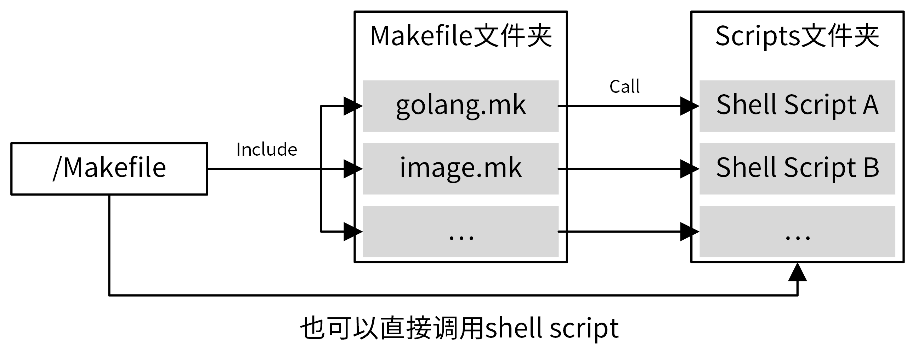

## 1. 规划 Makefile

[Makefile 语法参考：《跟我一起写 Makefile》](https://seisman.github.io/how-to-write-makefile/)

### 1.1 参考 IAM Makefile

```bash
$ make help
```

```makefile
Usage: make <TARGETS> <OPTIONS> ...

Targets:
  # 代码生成类命令
  gen                Generate all necessary files, such as error code files.

  # 格式化类命令
  format             Gofmt (reformat) package sources (exclude vendor dir if existed).

  # 静态代码检查
  lint               Check syntax and styling of go sources.

  # 测试类命令
  test               Run unit test.
  cover              Run unit test and get test coverage.

  # 构建类命令
  build              Build source code for host platform.
  build.multiarch    Build source code for multiple platforms. See option PLATFORMS.

  # Docker镜像打包类命令
  image              Build docker images for host arch.
  image.multiarch    Build docker images for multiple platforms. See option PLATFORMS.
  push               Build docker images for host arch and push images to registry.
  push.multiarch     Build docker images for multiple platforms and push images to registry.

  # 部署类命令
  deploy             Deploy updated components to development env.

  # 清理类命令
  clean              Remove all files that are created by building.

  # 其他命令，不同项目会有区别
  release            Release iam
  verify-copyright   Verify the boilerplate headers for all files.
  ca                 Generate CA files for all iam components.
  install            Install iam system with all its components.
  swagger            Generate swagger document.
  tools              install dependent tools.

  # 帮助命令
  help               Show this help info.

# 选项
Options:
  DEBUG            Whether to generate debug symbols. Default is 0.
  BINS             The binaries to build. Default is all of cmd.
                   This option is available when using: make build/build.multiarch
                   Example: make build BINS="iam-apiserver iam-authz-server"
  IMAGES           Backend images to make. Default is all of cmd starting with iam-.
                   This option is available when using: make image/image.multiarch/push/push.multiarch
                   Example: make image.multiarch IMAGES="iam-apiserver iam-authz-server"
  REGISTRY_PREFIX  Docker registry prefix. Default is marmotedu. 
                   Example: make push REGISTRY_PREFIX=ccr.ccs.tencentyun.com/marmotedu VERSION=v1.6.2
  PLATFORMS        The multiple platforms to build. Default is linux_amd64 and linux_arm64.
                   This option is available when using: make build.multiarch/image.multiarch/push.multiarch
                   Example: make image.multiarch IMAGES="iam-apiserver iam-pump" PLATFORMS="linux_amd64 linux_arm64"
  VERSION          The version information compiled into binaries.
                   The default is obtained from gsemver or git.
  V                Set to 1 enable verbose build. Default is 0.
```


### 1.2 Makefile 基本内容

**Go 项目的 Makefile 应该实现以下功能：**

- 格式化代码
- 静态代码检查
- 单元测试
- 代码构建
- 文件清理
- 帮助
- docker 镜像打包（都将 docker 打包命令，需要支持不同的 CPU 架构和平台）
- Options
- ...


需要根据 Makefile 管理功能，结合项目的需求，整理出一个 Makefile 要实现的功能列表

<br>

### 1.3 分层的设计方法

**根目录下的 Makefile 聚合所有的 Makefile 命令，具体实现则按功能分类，放在另外的 Makefile 中**



- 根目录下的 Makefile 聚合了项目所有的管理功能，通过 `Makefile 伪目标`的方式实现
- 将伪目标进行分类
    - 把相同类别的伪目标放在同一个 Makefile 中，方便维护
    - 将复杂的命令编写成独立的 shell 脚本，并在 Makefile 命令中调用

```bash
# IAM Makefile 组织结构
├── Makefile	# 根目录下
├── scripts
│   ├── gendoc.sh
│   ├── make-rules	# 存放各种类别操作的 Makefile 文件（在根目录下 include）
│   │   ├── gen.mk
│   │   ├── golang.mk
│   │   ├── image.mk
│   │   └── ...
    └── ...
```

```makefile
# 在 /Makefile 中 include
# ==============================================================================
# Includes

include scripts/make-rules/common.mk # make sure include common.mk at the first include line
include scripts/make-rules/golang.mk
include scripts/make-rules/image.mk
include scripts/make-rules/deploy.mk
include scripts/make-rules/copyright.mk
include scripts/make-rules/gen.mk
include scripts/make-rules/ca.mk
include scripts/make-rules/release.mk
include scripts/make-rules/swagger.mk
include scripts/make-rules/dependencies.mk
include scripts/make-rules/tools.mk
```

- 定义伪目标一定要加 `.PHONY` 标识，否则当有同名的文件时，伪目标可能不会被执行

<br>

## 2. Makefile 编写技巧

### Skill1：善用通配符和自动变量

Makefile 允许对目标进行类似正则运算的匹配，主要用到的通配符是 `%`

- 通过通配符可以使不同的目标使用相同的规则，增强扩展性

- 在 IAM 项目中使用了大量的通配符，如`go.build.%`、`ca.gen.%`、`deploy.run.%`、`tools.verify.%`、`tools.install.%`等

```makefile
# scripts/make-rules/tools.mk
tools.verify.%:
  @if ! which $* &>/dev/null; then $(MAKE) tools.install.$*; fi
# 使用 % 匹配 swagger和mockgen
# 使用 $* 指代被匹配的 swagger和mockgen
```


### Skill2：善用函数

[参考：Makefile 常用函数列表](https://github.com/marmotedu/geekbang-go/blob/master/makefile/Makefile%E5%B8%B8%E7%94%A8%E5%87%BD%E6%95%B0%E5%88%97%E8%A1%A8.md)

Makefile 自带的函数能够帮助我们实现很多强大的功能，如有需要优先使用函数


### Skill3：依赖需要用到的工具

如果 Makefile 某个目标的某个命令中用到了某个工具，可以将该工具放在目标的依赖中

- 当执行该目标时，就可以指定检查系统是否安装该工具，如果没有则自动安装，实现自动化

```makefile
# /Makefile
.PHONY: format
format: tools.verify.golines tools.verify.goimports
  @echo "===========> Formating codes"
  @$(FIND) -type f -name '*.go' | $(XARGS) gofmt -s -w
  @$(FIND) -type f -name '*.go' | $(XARGS) goimports -w -local $(ROOT_PACKAGE)
  @$(FIND) -type f -name '*.go' | $(XARGS) golines -w --max-len=120 --reformat-tags --shorten-comments --ignore-generated .
```


