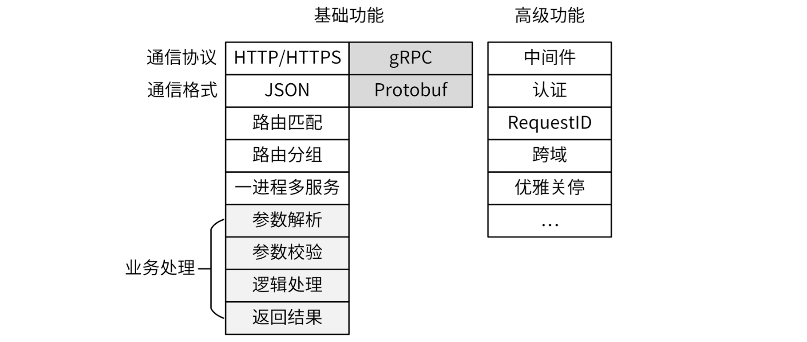
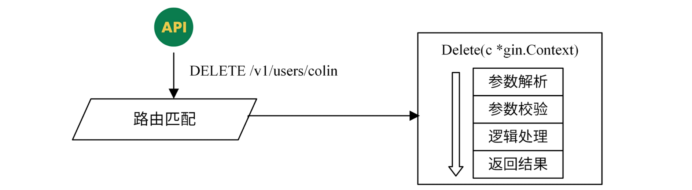

## 1. 标准 Web 服务

### 1.1 基础功能

**选择通信协议和通信格式**

1. `HTTP + JSON`（RESTful API）
2. `gRPC + Protobuf`（RPC API）

**Web 服务核心：路由匹配**

- 路由匹配其实就是根据`(HTTP方法, 请求路径)`匹配到处理这个请求的函数，最终由该函数处理这次请求，并返回结果

- 一次 HTTP 请求经过路由匹配，最终将请求交由 `Delete(c *gin.Context)` 函数处理
    - 变量 `c` 中存放了这次请求的参数
    - 在 `Delete` 函数中，可以进行参数解析、参数校验、逻辑处理，最终返回结果

**路由分组**：对于大型系统会有多个 API 接口，API 接口随着需求的更新迭代可能会有多个版本，为了方便管理就需要对路由进行分组

**一进程多服务**：有时候，我们需要在一个服务进程中，同时开启 HTTP 服务的 80 端口和 HTTPS 的 443 端口，这样我们就可以做到

- 对内的服务，访问 80 端口，简化服务访问复杂度
- 对外的服务，访问更为安全的 HTTPS 服务

没有必要为相同功能启动多个服务进程，需要 Web 服务的业务支持“一进程多服务的功能”

**业务处理**：Web 服务最核心的诉求是 `输入参数 -> 校验通过 -> 业务逻辑处理 -> 返回结果`，这就需要参数解析、参数校验、逻辑处理、返回结果

### 1.2 高级功能

**中间件**：在进行 HTTP 请求时，需要针对每一次请求都设置一些通用的操作（添加 Header、添加 RequestID、统计请求次数等）

**认证**：为了保证系统安全，对于每一个请求，我们都需要进行认证，认证通过才可以处理请求；有两种常用认证方式

1. 基于用户名和密码
2. 基于 Token

**RequestID**：方便定位和跟踪某一次请求，主要目的是排障

**跨域**：当前的软件架构中，很多采用了前后端分离的架构；在前后端分离的架构中，前端访问地址和后端访问地址往往是不同的，浏览器为了安全，会针对这种情况设置跨域请求，所以 Web 服务需要能够处理浏览器的跨域请求

 

## 2. Gin 框架

[Gin 中文文档](https://gin-gonic.com/zh-cn/docs/)

### 2.1 框架选择

- Web 服务有很多核心功能，实际开发中一般会选择基于 `net/http` 包进行封装的优秀开源 Web 框架，选择 Web 框架的考量：
    - 路由功能
    - 是否具备 middleware/filter 功能

