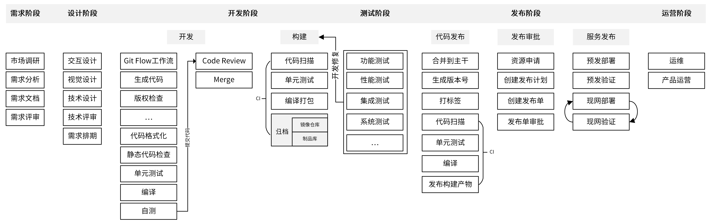
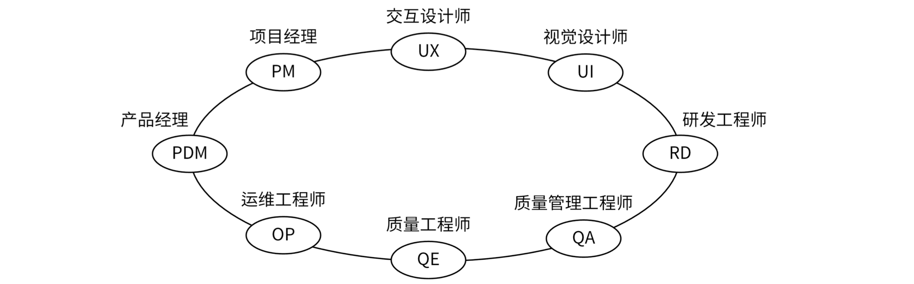
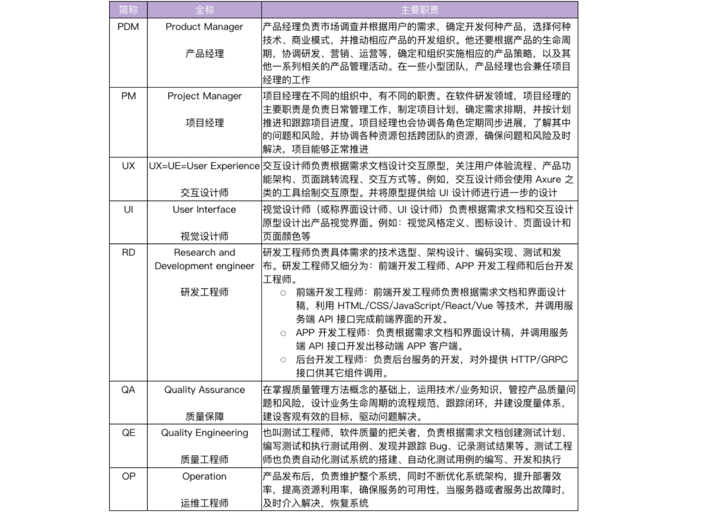
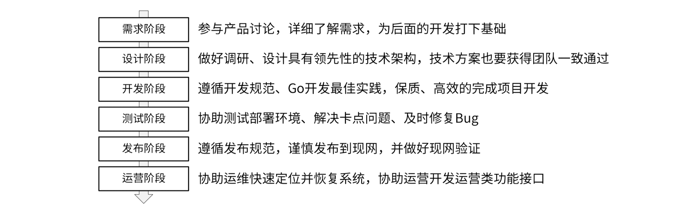
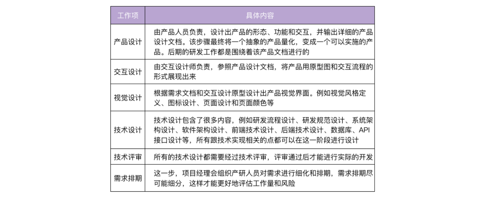
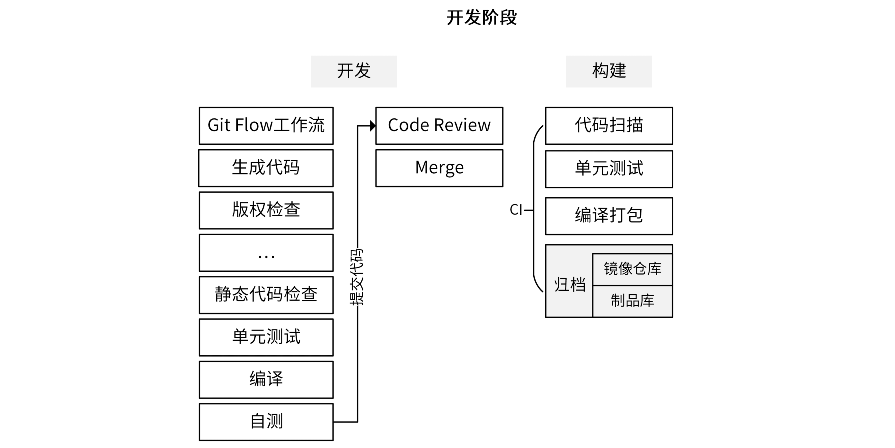
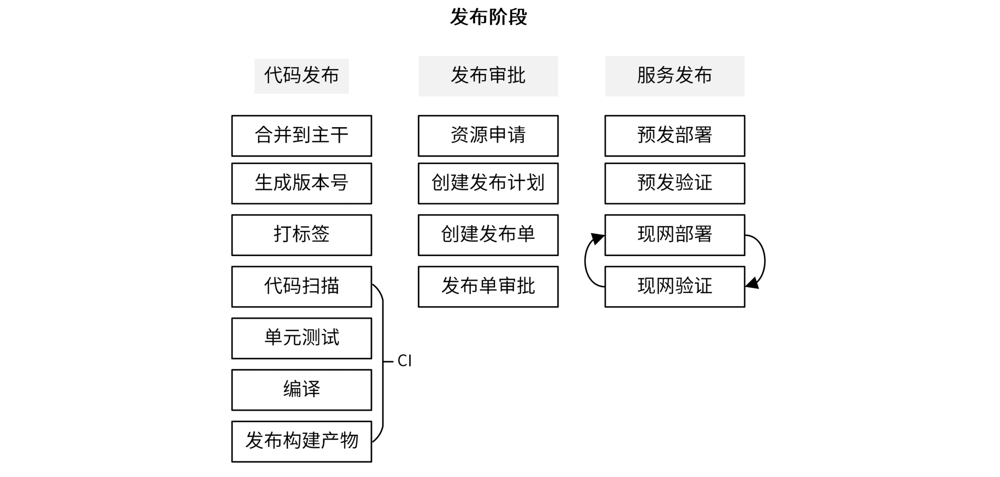
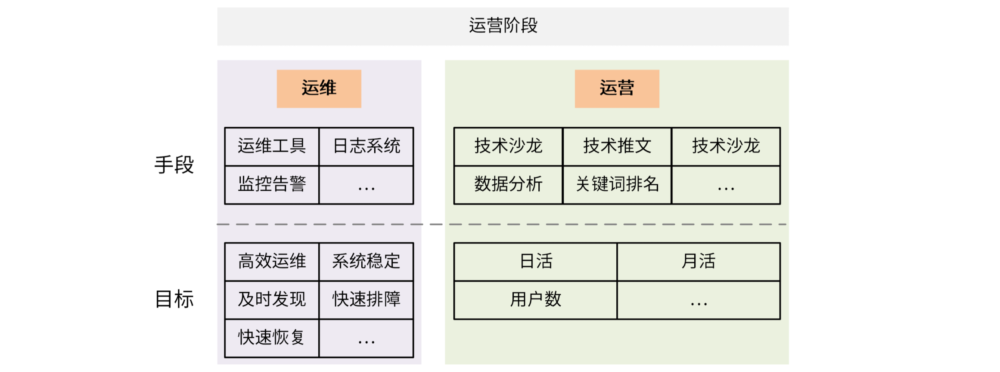

## 1. 研发流程

### 1.1 研发流程原则

**不合理的研发流程可能出现的问题**

1. 代码管理混乱：合并代码时出现合错、合丢、代码冲突等问题
2. 研发效率低：编译、测试、静态代码检查等全靠手动操作，效率低下。甚至，因为没有标准的流程，一些开发者会漏掉测试、静态代码检查等环节
3. 发布效率低：发布周期长，以及发布不规范造成的现网问题频发

**原则**

1. 发布效率高：减少发布时间和人工介入的工作量

2. 发布质量高：发布的代码经过测试
3. 迭代速度快：快速迭代，把握先机
4. 明确性：明确角色职责、工具使用、方法和流程
5. 流程合理：研发流程最终是供产品、开发、测试、运维等人员使用的，能够被各类参与人员接收并执行
6. 柔性扩展
7. 输入输出：每个阶段都应该有明确的输入输出，标志上一阶段的完成和下一阶段的开始

### 1.2 业界标准研发流程

**六个阶段**：需求阶段、设计阶段、开发阶段、测试阶段、发布阶段、运营阶段

- 开发人员主要参与：设计、开发、测试、发布

- 每个阶段结束时需要有产出物（里程碑），可以是文档、代码或部署组件等

### 1.3 研发流程的核心角色

 

## 2. 研发流程的六个阶段

### 2.1 需求阶段

需求阶段：将一个抽象的产品思路具化成一个可实施产品的阶段

- 产品人员：讨论产品思路、调研市场需求，并对需求进行分析，整理出一个比较完善的需求文档
- 最后，产品人员会组织相关人员对需求进行评审，如果评审通过，就会进入设计阶段

需求阶段一般不需要研发人员参与，但建议积极参与产品需求的讨论

### 2.2 设计阶段

- 技术方案和实现需要经过认真讨论、一致通过，否则之后遇到技术方案设计不当，需要返工并承担大部分责任

**设计阶段的产出物：一系列设计文档，指导后面的整个开发流程**

### 2.3 开发阶段

**开发**

- 生成代码：项目开发中要思考怎么尽可能自动生成代码（如`.pb.go`、API 文档、测试用例、错误码等），提高效率减少失误
- 自测之后，可以遵循 Git Flow 工作流将开发分支 push 到代码托管平台进行 code review
- code review 通过之后，可以将代码 merge 到 develop 分支

**构建**

- 构建阶段最好借助 CI/CD 平台实现自动化，提高构建效率
- 将编译打包后的二进制文件或 Docker 镜像上传到制品库或镜像仓库，即完成归档

**优化开发阶段的高频操作**

- 将开发阶段的步骤通过 Makefile 实现集中管理
- 将构建阶段的步骤通过 CI/CD 平台实现自动化

在最终合并代码到 master 之前，要确保代码是经过充分测试的；这就要求我们一定要借助代码管理平台提供的 Webhook 能力，在代码提交时触发 CI/CD 作业，对代码进行扫描、测试，最终编译打包，并以整个作业的成功执行作为合并代码的先决条件

**开发阶段的产物：满足需求的源代码、开发文档，以及编译好的归档文件**

### 2.4 测试阶段

测试阶段由测试工程师（质量工程师）负责，这个阶段的主要流程是：

- 测试工程师根据需求文档创建测试计划、编写测试用例
- 和研发人员一起评审测试计划和用例
- 评审通过后，测试工程师会根据测试计划和测试用例对服务进行测试

**为了提高整个研发效率，测试计划的创建和测试用例的编写可以跟开发阶段并行**

- 研发人员在交付给测试时，要提供自测报告、自测用例和安装部署文档

- 在测试阶段，为了不阻塞测试，确保项目按时发布，研发人员应该优先解决测试同学的 Bug，至少是阻塞类的 Bug
- 为了减少不必要的沟通和排障，安装部署文档要尽可能详尽和准确

**测试阶段的产出物：满足产品需求、达到发布条件的源代码，以及编译后的归档文件**

### 2.5 发布阶段

发布阶段主要是将软件部署上线，为了保证发布的效率和质量，我们需要遵循一定的发布流程

#### 代码发布

- 开发人员首先需要将经过测试后的代码合并到主干，通常是 master 分支，并生成版本号，然后给最新的 commit 打上版本标签
- 将代码 push 到代码托管平台，并触发 CI 流程，CI 流程一般会执行代码扫描、单元测试、编译
- 最后将构建产物发布到制品库；CI 流程中，我们可以根据需要添加任意功能

#### 发布审批

- 首先需要申请资源，资源申请周期可能会比较久，所以申请得越早越好，甚至资源申请可以在测试阶段发起
- 在资源申请阶段，可以申请诸如服务器、MySQL、Redis、Kafka 之类资源

- 建议优先容器化部署：

    资源申请通常是开发人员向运维人员提需求，由运维人员根据需求，在指定的时间前准备好各类资源。如果是物理机通常申请周期会比较久，但当前越来越多的项目选择容器化部署，这可以极大地缩短资源的申请周期。如果在像腾讯云弹性容器这类 Serverless 容器平台上部署业务，甚至可以秒申请资源。所以建议优先采用容器化部署。

#### 服务发布

- 发布之前需要创建发布计划，里面需要详细描述本次的变更详情，例如变更范围、发布方案、测试结果、验证和回滚方案等

**在创建发布计划时，一定要全面梳理这次变更的影响点**

- 例如，是否有不兼容的变更，是否需要变更配置，是否需要变更数据库等
- 任何一个遗漏，都可能造成现网故障，影响产品声誉和用户使用

- 接下来，需要创建发布单，在发布单中可以附上发布计划，并根据团队需求填写其它发布内容，发布计划需要跟相关参与者对齐流程、明确职责
- 发布单最终提交给审批人（通常是技术 leader）对本次发布进行审批，审批通过后，才可以进行部署

**最后，就可以进入到服务发布阶段，将服务发布到现网**

- 在正式部署的时候，应用需要先部署到预发环境
- 在预发环境，产品人员、测试人员和研发人员会分别对产品进行验证；其中，产品人员主要验证产品功能的体验是否流畅，开发和测试人员主要验证产品是否有 Bug
- 预发环境验证通过，产品才能正式发布到现网

> 建议：编写一些自动化的测试用例，在服务发布到现网之后，对现网服务做一次比较充分的回归测试；现网可能有多个地域，每个地域发布完成之后都要进行现网验证

**发布阶段的产出物：正式上线的软件**

### 2.6 运营阶段

> 运维属于技术类，运营属于产品类

研发流程的最后一个阶段是运营阶段，主要分为产品运营、运维两部分

**产品运营**：通过一系列的运营活动，比如线下的技术沙龙、线上的免费公开课、提高关键词排名或者输出一些技术推广文章等方式，来推高整个产品的知名度，提高产品的用户数量，并提高月活和日活

**运维**：由运维工程师负责，核心目标是确保系统稳定的运行，如果系统异常，能够及时发现并修复问题；长期目标是通过技术手段或者流程来完善整个系统架构，减少人力投入、提高运维效率，并提高系统的健壮性和恢复能力

在运营阶段，研发人员主要职责就是协助运维解决现网 Bug，优化部署架构；当然，研发人员可能也需要配合运营人员开发一些运营接口，供运营人员使用 

 

## 3. 管理应用的生命周期

## 记录

1. CI、CD 是什么意思？

