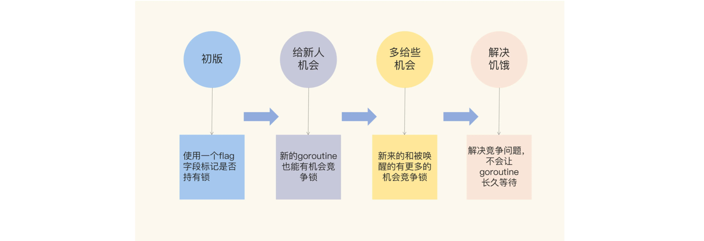

## 1. 互斥锁的基本使用

### 1.1 互斥的基本概念

> ”多个 goroutine 并发更新资源“，“资源”指分配到堆上的或全局变量，而分配到栈上的资源存在于 goroutine 拥有的独立栈空间

**临界区**：在并发编程中，如果程序中的一部分会被并发访问或修改，为了避免并发访问导致的意想不到的结果，这部分程序需要被保护起来，这部分被保护起来的程序，就叫做临界区

**使用互斥锁**：限定临界区只能同时由一个线程持有，其它线程如果想进入这个临界区，就会返回失败，或者是等待；直到持有的线程退出临界区，这些等待线程中的某一个才有机会接着持有这个临界区

**同步原语**：一组用于实现同步机制的基本操作或函数，用于处理以下场景：

1. **共享资源**：并发地读写共享资源，会出现数据竞争（data race）的问题，需要`Mutex、RWMutex`等并发原语保护

2. **任务编排**：需要 goroutine 按照一定的规律执行，而 goroutine 之间有相互等待或者依赖的顺序关系，使用`WaitGroup`或` Channel`实现

3. **消息传递**：信息交流以及不同的 goroutine 之间的线程安全的数据交流，使用`Channel`来实现。

<br>

### 1.2 Mutex 基本用法

`package sync`实现了一系列同步原语

```go
// Locker 接口定义了锁同步原语的方法集
type Locker interface{
    Lock()	// 请求锁
    Unlock()	// 释放锁
}
```

`Mutex`实现了 Locker 接口

```go
func (m *Mutex) Lock()	// 进入临界区前，调用 Lock 方法
func (m *Mutex) Unlock()	// 退出临界区，调用 Unlock() 方法
```

当一个 goroutine 通过调用 Lock 方法获得了这个锁的拥有权后，其它请求锁的 goroutine 就会**阻塞**在 Lock 方法的调用上，直到锁被释放并且自己获取到了这个锁的拥有权

#### 直接声明即可使用

- Mutex 的零值是还没有 goroutine 等待的未加锁的状态，所以不需要额外的初始化

```go
var mu sync.Mutex	
```

#### 在 sturct 中使用

```go
type Counter struct {
    mu		symc.Mutex	// 这个字段也不需要初始化
    Count 	uint64
}
```

> 经验：如果嵌入的 struct 有多个字段，一般会把 Mutex 放在要控制的字段上面，然后使用空格把字段分隔开来

```go
type Counter struct { 
    CounterType int 
    Name string 
    
    mu sync.Mutex 
    count uint64
}
```

#### 嵌入字段使用

```go
type Counter struct {
    symc.Mutex	
    Count 	uint64
}

// ...

var counter Counter

counter.Lock()	// 直接在 struct 上调用
counter.Count++
counter.Unlock()
```

问题：锁释放后，等待中的 goroutine 中哪一个会优先获取 Mutex？

自旋锁？一直尝试做获取锁，而不是让渡 cpu 给其他 goroutine

<br>

#### 使用 race detector 检查并发错误

```shell
go run -race main.go
```

- 在实际访问地址时才会发现 data race 问题
- 实际使用时比较影响性能（不要将带 race 参数编译的程序部署到线上）

```sh
go tool compile -S main.go	# 查看代码汇编指令

# go1.20 之后
go build -gcflags=-S counter.go 1> normal.txt 2>&1
go build -race -gcflags=-S counter.go 1> race.txt 2>&1
```

<br>

## 2. Mutex 实现



**初版**：使用`flag`表示锁是否被持有

**给新人机会**：使新的 goroutine 尽可能地先获取到锁

**多给些机会**：照顾新来的和被唤醒的 goroutine（存在饥饿问题）

**解决饥饿**：不会让 goroutine 长久等待

<br>

### 2.1 CAS 操作

`CAS`：将一个给定的期望值和一个内存地址中的值进行比较，如果是同一个值，就用新值替换内存中的值

- CAS（compare-and-swap / compare-and-set）由CPU指令实现，是一个原子操作，包括三步：
    1. 读取内存中的值
    2. 将内存中的值与期望值比较
    3. 如果相等，则将内存值更新为新值（新值和期望值不是一个）

**优点**：无锁、原子性、简单高效（硬件支持）

**缺点**：

- ABA 问题。如果一个值从 `A` 改为 `B`，又改回 `A`，那么 **CAS** 操作会误认为值没有改变。常用的解决方法是使用版本号
- 只能保证一个共享变量的原子操作。如果对多个共享变量操作，则需要使用锁
- 资源浪费。当 **CAS** 失败时，会进行重试，消耗 CPU 资源

<br>

### 2.2 第一版互斥锁

```go
// CAS 操作（当时还没有抽象出 atomic 包）
func cas(val *int32, old, new int32) bool

// 使用信号量休眠
func semacquire(*int32)	

// 使用信号量唤醒
func semrelease(*int32)
```

#### 结构体

```go
// 互斥锁的结构，包含两个字段
type Mutex struct {
    key  int32 // 锁是否被持有的标识
    sema int32 // 信号量专用，用以阻塞/唤醒goroutine
}
```

- `key >= 1`：表示锁已经被持有
- `key `标识了锁是否被持有，也记录了当前持有和等待过去锁的 goroutine 的数量

#### 操作

```go
// 保证成功在 val 上增加 delta 的值
func xadd(val *int32, delta int32) (new int32) {
    // 循环执行CAS操作直到成功
    for {
        v := *val	// CAS 保证这一步和下一步之间没有其他线程修改 key 的值
        if cas(val, v, v+delta) {
            return v + delta
        }
    }
    panic("unreached")
}

// 请求锁
func (m *Mutex) Lock() {
    // 标识加 1，如果等于 1，成功获取到锁（key == 0 时执行，获取锁，key变为1）
    if xadd(&m.key, 1) == 1 { 
        return
    }
    semacquire(&m.sema) // key >= 1，阻塞等待
}

// 释放锁
func (m *Mutex) Unlock() {
    if xadd(&m.key, -1) == 0 { // 将标识减去 1，如果等于 0，则没有其它等待者
        return
    }
    // key - 1 > 0，有其他阻塞的 goroutine，唤醒其中的一个
    // 被唤醒的 goroutine 退出 semacquire(&m.sema)，Lock() 操作成功，获取到锁
    semrelease(&m.sema) 
}    
```

**谁申请，谁释放**：`Unlock` 方法可以被任意 goroutine 调用释放锁，即使该 goroutine 没有持有这个互斥锁，因为 Mutex 本身并未包含持有这把锁的 goroutine 信息，`Unlock` 方法自然不会对此做检查（该设计保留至今）

- 存在的问题：其他 goroutine 可以强制释放锁，且临界区的 goroutine 不知道锁已经被释放了，还在执行临界区的业务操作，可能会导致 data race 问题
- 在使用互斥锁时，一般在同一个方法中获取锁和释放锁

```go
// 使用 defer 语句特性，成对使用 Lock/Unlock
mu.Lock()
defer mu.Unlock()
```

**初版实现问题**：请求锁的 goroutine 会排队等待获取互斥锁，从性能角度考虑，更好的实现方式是把锁交给正在占用 CPU 时间片的 goroutine，从而在高并发环境下节省上下文切换带来的开销（占用 CPU 时间片的进程就是持有锁的进程）

<br>

### 2.3 给新人机会

```go
type Mutex struct {
    state int32
    sema  uint32
}
```


```go
const (
    mutexLocked = 1 << iota // mutex is locked
    mutexWoken
    mutexWaiterShift = iota
)
```


## 参考

[极客：Go 并发实战课](https://time.geekbang.org/column/article/294905)

[CAS](https://niuery.com/post/48)