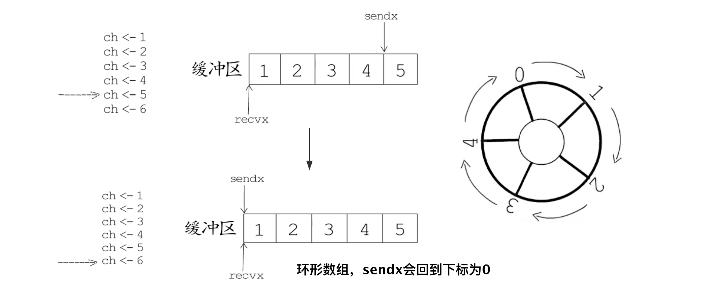
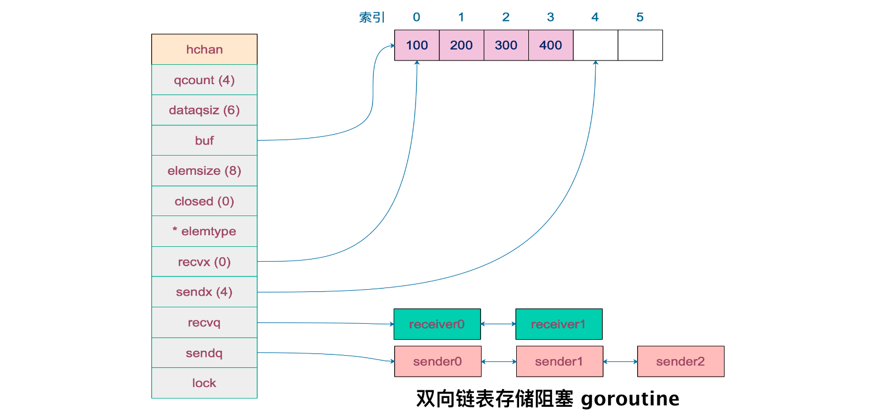

> Do not communicate by sharing memory; instead, share memory by comminicating
>
> 不要通过共享内存来通信，而要通过通信来实现共享内存

## 1. CSP 模型（并发模型）

**CSP**：Communicating Sequential Processes，通信顺序进程

- 是一种用于描述两个独立的并发实体，通过共享的通讯管道进行通信的并发模型

- 重视`input`和`output`，尤其重视并发编程
- Go 实现了CSP 模型，使用`goroutine`作为并发实体，使用`channel`通讯实现实体之间的数据共享

<br>

## 2. channel 的应用

```go
// 基本用法
var 变量名称 chan 元素类型	// 声明
make(chan 元素类型, [缓冲大小])	// 初始化

var ch1 chan int	// 未初始化，为零值nil
ch2 := make(chan int)
ch3 := make(chan bool, 1)

ch := make(chan int)
ch <- 10	// 发送10到通道
x := <-ch	// 接收1：赋值
<-ch		// 接收2：不处理
x1, ok := <-ch	// 接收3：ok != false 时，接收的的都是有效值
if ok {
    // 接收
}

close(ch)	// 关闭通道（可被垃圾回收，不是必要操作）

func f1(ch <-chan int){}	// 从通道接收数据
func f2(ch chan<- int){}	// 发送数据给通道
```

**常见应用场景**

1. 停止信号
2. 定时任务

```go
// 超时控制：100ms没收到值，返回flase
select {
	case <-time.After(100 * time.Millisecond)
	case <-s.stopc:
		return false
}

// 定时任务
func woker() {
    ticker := time.Tick(1 * time.Second)
    for {
        select {
            case <-ticker:
            	// 执行1s定时任务
        }
    }
}
```

3. 解耦生产方和消费方：生产方只需先`channel`发送任务，消费方只需不断从工作队列中取任务
4. 控制并发数：

```go
// 缓冲型 channel
// 遍历任务列表，执行任务 w() 前需要取得 token，执行完后归还
var token := make(chan int, 3)
func main() {
    //...
    for _, w := range work {
        go func() {
            token <- 1
            w()
            <-token
        }()
	}
    //...
}
```

5. 其他：消息过滤，信号广播，事件订阅与广播，请求、响应转发，任务分发，结果汇总，限流，同步与异步等

<br>

## 3. select 与通道

### 非阻塞模式

```go
// select 非阻塞接收：当接收失败时，会快速检测并执行 default 语句
select {
    case data := <-ch:
    	//...
    default:
    	//...接收失败
}
// 使用其他三种接收写法，当通道为空时且未关闭，会阻塞当前线程直到接收到数据
data := <-ch
<-ch
data, ok := <-ch
```

```go
// select 非阻塞发送
select {
    case ch <- 42:
    	//...
    default:
    	//...发送失败
}
// 阻塞发送，如果发送失败则会阻塞当前线程，直到通道有空间可用
ch <- 42
```

### 多路复用

```go
select {
    case <-ch1:
    	//...
	case data := <-ch2
    	//...
    case ch3 <- 10:
    	//...
    default:
    	//默认操作
}
```

- 处理多个 channel 的发送/接收操作
- 当多个 case 满足时，会随机选择一个执行
- 都不满足时，会阻塞 goroutine

<br>

## 4. channel 底层结构

### 数据结构



```go
type hchan struct {
	qcount   uint			// 通道内元素数量           
	dataqsiz uint   		// 循环数组长度（记）
	buf      unsafe.Pointer	// 循环数组指针 （记）
	elemsize uint16			// 元素大小
	closed   uint32			// channel 是否被关闭
	elemtype *_type 		// 元素类型（记）
	sendx    uint   		// 下一个要发送的元素的下标（记）
	recvx    uint   		// 下一个要接收的数组下标（记）
	recvq    waitq  		// 等待接受的 goroutine 队列（记）
	sendq    waitq  		// 等待发送的 goroutine 队列（记）
    
	lock mutex	// 互斥锁，不允许并发读写（记）
}
```



```go
// waitq 是 sudog 的双向链表，sudog 是对 goroutine 的一个封装
// sudog (synchronization data structute for goroutine, goroutine 同步数据结构)
type waitq struct {
    first *sudog
    last *sudog
}
```

<br>

### 从 channel 接收

根据是否带`ok`判断通道是否被关闭，分为`chanrecv1()`（不带）和`chanrecv2()`写法，但而这实际上调用了同一个函数

```go
func chanrecv(c *hchan, ep unsafe.Pointer, block bool) (selected, received bool) {...}
// ep 指向填充的内存空间，为nil时说明忽略了接收者
// block 标识阻塞型/非阻塞型接收
// 返回值 received 即对应的是 ok
```

执行流程

1. channel 为`nil`：非阻塞模式直接返回，阻塞模式下 goroutine 会被永远挂起
2. 快速检测：针对非阻塞模式且 channel 为空的情况
    - channel 未关闭，直接返回
    - `ep != nil`，返回类型零值
3. channel 关闭且`buf`无元素：非缓冲型关闭/缓冲型关闭但`buf`无元素的情况
    - 返回零值，返回`received = false`
    - 如果是`select`的 case 之一，这里属于被选中，可用作通知信号
4. `sendq`不为空：有 goroutine 等待发送数据给 channel（先检测发送队列）
    - 非缓冲型：内存复制`sender goroutine -> receiver goroutine`
    - 缓冲型：执行发送流程，将发送者的元素放入循环数组尾部
    - 接收前先判断是否向 channel 发送数据！
5. `buf`内有元素，正常接收，同时清理掉循环数组中的值，返回`true, true`
    - 即使 channel 关闭的情况下，也能正常接收，直到`c.qcount = 0`
6. 处理阻塞模式：构造`sudog`保存各种值，添加到`recvq`中，挂起 goroutine
7. 唤醒后，接收完毕

- ps：从快速检测到执行结束，会上锁保证并发安全（之前不加锁，是因为满足一个失败场景，即可直接返回）

<br>

### 向 channel 发送

```go
func chansend(c *hchan, ep unsafe.Pointer, block bool, callerpc uintptr) bool {...}
```

执行流程

1. channel 为`nil`：非阻塞模式直接返回，阻塞模式下 goroutine 会被永远挂起
2. 快速检测：针对非阻塞模式，快速检测以下失败场景
    - 非缓冲型：`recvq`为空
    - 缓冲型：`buf`已满
3. channel 关闭：`panic`！
4. `recvq`不为空：直接将发送的数据复制到接收 goroutine
5. 缓冲型且有空间：正常发送，从`ep`复制数据
6. 缓冲型但`buf`已满：
    - 非阻塞模式：发送失败，返回 false
    - 阻塞模式：构造`sudog`，添加到`sendq`中
7. 唤醒：
    - channel 关闭：`panic`！
    - 正常发送

- ps：同样的，从快速检测到执行结束，会上锁保证并发安全

<br>

### 关闭通道

```go
func closechan(c *hchan) {...}
```

执行流程

> 在不清楚是否还有发送 goroutine 的情况下，不要贸然关闭通道！

1. channel 为`nil`：`panic`！
2. ---- 上锁 ----
3. 修改标志位`c.closed = 1`
4. 释放所有`recvq`中的`sudog`：接收者收到零值
5. 释放所有`sendq`中的`sudog`：如果有，该 goroutine 直接引发 panic！
6. ---- 解锁 ----
7. 唤醒所有`sudog`相应的 goroutine
    - 对于发送 goroutine，会直接引发 panic！

#### 优雅地关闭通道（场景问题）

1. 只有一个 sender：从发送端关闭就好
2. N sender 1 receiver：非阻塞模式下，设置一个传递关闭信号的 channel，该通道只有一个 sender，当该通道关闭后，直接退出不再发送数据，而原本发送数据的通道由 GC 代劳关闭（在接收端关闭）
3. N sender M receiver：
    - 设置`channel toStop`: 中间人，`channel stopCh`: 传递关闭信号
    - 当中间人收到任何**第一个** receiver 或 sender 的关闭信号后，关闭`stopCh`通道，从而避免重复关闭通道而引发 panic

<br>

## 5. 其他补充

**值的复制**：接收和发送数据的本质，都是**值的复制**，而非地址操作

**channel 是线程安全的**：接收、发生、关闭都使用了锁保证并发安全，其设计目的也是在多线程之间传递数据，自然是线程安全的

**无缓冲区和有缓冲区**：

- 无缓冲区，向通道发送时需要有 goroutine 接收，从通道接收时需要有 goroutine 读取，否则会阻塞
- 有缓冲区：正常读写，从空缓冲区通道读数据，或向满缓冲区通道写数据也会发生阻塞

**通道引发资源泄露**：goroutine 操作 channel 后，处于发送/接收的阻塞态，而 channel 一直处于满/空状态，同时垃圾回收器不会回收此类资源，进而导致 goroutine 无法被唤醒执行

**错误使用总结**

1. 对关闭的通道再发送值 => `panic`
2. 关闭已经关闭的通道 => `panic`
3. 关闭`nil`通道 => `panic`
4. 读/写一个`nil `channel => 永远阻塞

<br>