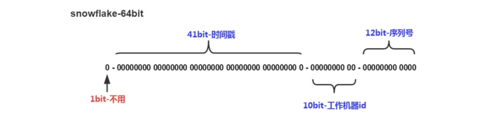
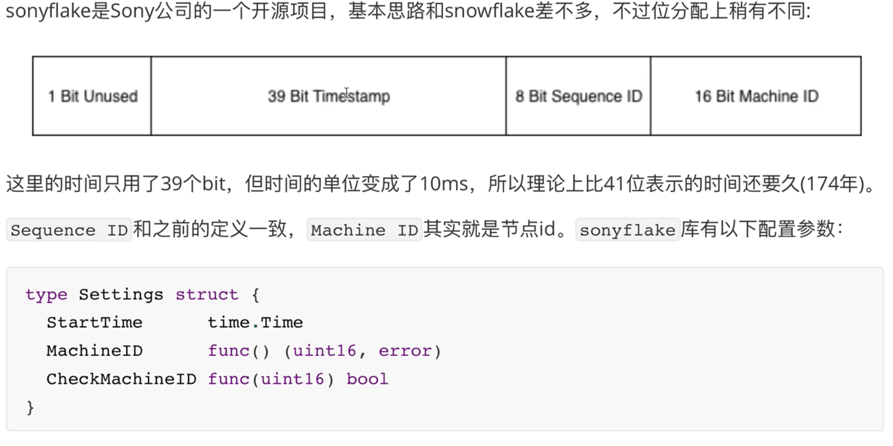
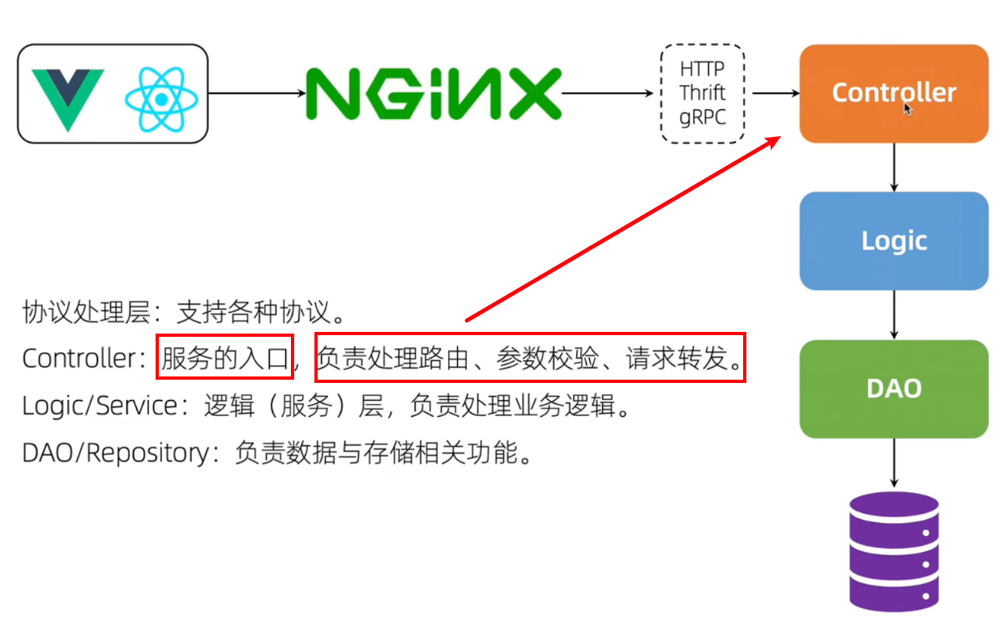

# islet 项目实战

## 1. 配置与日志

### 1.1 使用的库

[viper](https://github.com/spf13/viper)：使用管理配置文件，参考博客 [李文周-viper](https://www.liwenzhou.com/posts/Go/viper/#c-1-3-0)

[zap](https://github.com/uber-go/zap)：日志库，参考博客 [李文周-zap](https://www.liwenzhou.com/posts/Go/zap/)，[在 gin 框架使用 zap](https://www.liwenzhou.com/posts/Go/zap-in-gin/)

[lumberjack](https://github.com/natefinch/lumberjack)：zap不支持日志切割，使用该第三方库完成操作


<br>

## 2 用户模块开发

### 2.1 用户表结构设计

可以用goland连接MySQL，也可以在终端直接操作

```mysql
-- 创建用户表 `user`（为什么是反引号？）
CREATE TABLE `user` (
    `id` bigint(20) NOT NULL AUTO_INCREMENT,
    `user_id` bigint(20) NOT NULL,
    `username` varchar(64) COLLATE utf8mb4_general_ci NOT NULL,
    `password` varchar(64) COLLATE utf8mb4_general_ci NOT NULL,
    `email` varchar(64) COLLATE utf8mb4_general_ci,
    `gender` tinyint(4) NOT NULL DEFAULT '0',
    `create_time` timestamp NULL DEFAULT CURRENT_TIMESTAMP,
    `update_time` timestamp NULL DEFAULT CURRENT_TIMESTAMP ON UPDATE CURRENT_TIMESTAMP,
    PRIMARY KEY (`id`),
    UNIQUE KEY `idx_username` (`username`) USING BTREE,
    UNIQUE KEY `idx_user_id` (`user_id`) USING BTREE
) ENGINE=InnoDB DEFAULT CHARSET=utf8mb4 COLLATE=utf8mb4_general_ci;
```

### 2.2 雪花算法生成 ID

> 不能使用数据库自增 id，用户注册时会暴漏用户量；分库时 id 也可能重复

#### 分布式 ID 生成器特点

1. 全局唯一性：ID不能重复
2. 递增性：生成ID对于用户或业务是递增的
3. 高可用性：任何时候都能生成正确的ID
4. 高性能：在高并发环境下依然表现良好

**适用场景**：电商促销大量订单涌入、热点信息实时产生大量评论和转发等

<br>

#### snowflake 雪花算法

- Twitter 开源的 64 位组成分布式ID



`第一位`：1bit，始终为 0，没实际作用

`时间戳`：**41bit**，单位是毫秒，可以容纳 69 年的时间，可以设定为某个时间节点的偏移量

`工作机器id`：10bit，用于标识生成该ID的机器，最多容纳1024个节点

`序列号`：12bit，记录同毫秒内产生的不同id，同毫秒最多可产生4096个ID

snowflake 算法在同一毫秒内可以生成`1024 × 4096`个全局唯一ID

<br>

#### 雪花算法应用

1. https://github.com/bwmarrin/snowflake

```go
// 当一个简单模块使用
package snowflake
import (
	"time"
	sf "github.com/bwmarrin/snowflake"
)

var node *sf.Node

func Init(startTime string, machineID int64) (err error) {
    // 开始时间
	var st time.Time
	st, err = time.Parse("2006-01-02", startTime)
	if err != nil {
		return
	}
	sf.Epoch = st.UnixNano() / 1000000
	node, err = sf.NewNode(machineID)
	return
}
func GenID() int64 {
	return node.Generate().Int64()
}

// main.go
if err := snowflake.Init(setting.Conf.StartTime, setting.Conf.MachineID); err != nil {
    fmt.Printf("init snowflake failed, err:%v\n", err)
    return
}
// 读取配置文件中的开始时间和分配的id数
```

2. https://github.com/sony/sonyflake 项目使用的库

​	

<br>

### 2.3 注册与登录

[Go 语言的纯后端CLD分层](https://www.jianshu.com/p/403f3316a5fb)

​	

- 入手项目功能：从程序入口开始（`main.go`），从请求的入口入手（注册`router`）

- dao 层：把每一步数据库操作封装成函数，待 logic 层根据业务需求调用
- logic 层：存放业务逻辑的代码，等待多次调用（组合 dao 层的操作）
- controller 控制层：web 服务的入口

#### 注册功能处理流程

> 顺着请求的流程来

**接收请求**：router

1. 接收http请求
2. 注册路由（POST）
3. 根据不同目录，执行`HandlerFunc`

↓

**处理注册请求**：

1. 获取参数、校验参数（**controller 层处理请求**）
2. 业务处理（**logic 层执行业务处理**）
3. 返回响应

↓

**业务处理**：（**dao 层与数据库交互**）

1. 判断用户存不存在
2. 生成UID（snowflake），生成实例
3. 密码加密，保存进数据库

<br>

#### 登录功能处理流程

**接受请求**：router

1. 接收 http 请求 
2. 注册路由（POST）：不用将信息放在url中（GET 请求），更加安全
3. 划分不同的目录，执行`HandlerFunc`

**处理登录请求**：

1. 获取参数，校验参数（Controller）
2. 业务处理（logic，dao）
3. 返回响应

**业务处理细节**：（DAO）

1. 判断用户是否存在
2. 判断密码是否正确
3. 返回登录结果

<br>

### 2.4 用户认证和鉴权

> HTTP 是一个无状态的协议，一次请求结束后，服务器就不知道下一次请求是谁发来的（同 IP 的不同用户）
>
> 需要在 HTTP 请求之上，建立一套认证模式

#### Cookie - Session 认证模式

- 客户端使用用户名、密码进行认证
- 服务端验证，并存储 Session，将 SessionID 通过 Cookie 返回给客户端
- 客户端访问服务端，需要在认证接口的 Cookie 中携带 SessionID
- 服务端通过 SessionID 查找 Session 进行鉴权

问题：

1. 服务端存储 Session，占用大量内存空间
2. 如果是服务器集群，每台服务器都需要存储 Session
3. SessionID 可能遭受跨站侵权伪造攻击（CSRF），伪造 SessionID


#### Token 认证模式


#### 基于 jwt 的 Token 认证

[jwt](https://github.com/golang-jwt/jwt)，[jwt 参考博客](https://www.liwenzhou.com/posts/Go/json-web-token/)，[理解 jwt](https://blog.csdn.net/Sky_QiaoBa_Sum/article/details/107584356)

`Access Token`：即访问资源接口时需要的 Token，通常有效期较短

`Refress Token`：用于重新获取 Access Token，有效期较长

- 都失效的话，则需要重新登陆

	


**jwt**：服务端认证后，生成一个 JSON 对象

三部分：两个点分割三部分的 token

1. 头部 Header：算法和 Token 类型（这里是 "JWT"）
2. 负载 Payload：官方 JSON 字段、用户自定义私有 JSON 字段（项目中自定义存储了`UserID`字段）
3. 签名 Signature：指定只有服务器才知道的密钥，使用头部的算法产生密钥签名

特点：

1. 可以用于认证，也可用于交换信息
2. 服务器不保存 Session 状态，节省内存空间
3. 如果 Token 被盗用，任何人都可以获得令牌的所有权限，所以有效期应该尽量简短


#### 执行顺序

1. 登录成功后，根据私钥、自定义 Claims 字段、选定算法，生成 Access Token 和 Refresh Token
2. 服务端会将两个令牌返回给客户端
3. 设置中间件，在需要登录的请求中：验证Token格式、验证 Access Token
4. 如果 Access Token 过期，则验证 Refresh Token，是过期错误则产生新的 Access Token

后端需要对外提供一个刷新 Token 的接口

前端需要实现一个当  Access Token 过期时自动请求刷新 Token 接口获取新的 Access Token 的拦截器


#### 场景思考：限制同一账号同一时间只能在一个设备上登录

1. 在一个账号的用户登录时，验证该 user_id 是否已经生成了 Token
2. 使用 Redis 存储 user_id 和 Token 的对应关系
3. 验证 Token 有效的同时，验证与 user_id 的对应关系（限制同一账号同一时间）
4. Token 携带的信息标识设备ID，同时在数据库映射该设备ID 与 Token（一台设备）

<br>


## 3. 高效开发工具

### 3.1 为 Go 编写 Makefile

[为Go项目编写Makefile](https://www.liwenzhou.com/posts/Go/makefile/)

```makefile
.PHONY: all build run gotool clean help

# 项目名
BINARY="bluebell"

all: gotool build

# 编译命令
build:
	CGO_ENABLED=0 GOOS=linux GOARCH=amd64 go build -o ${BINARY}

run:
	@go run ./

gotool:
	go fmt ./
	go vet ./

clean:
	@if [ -f ${BINARY} ] ; then rm ${BINARY} ; fi

help:
	@echo "make - 格式化 Go 代码, 并编译生成二进制文件"
	@echo "make build - 编译 Go 代码, 生成二进制文件"
	@echo "make run - 直接运行 Go 代码"
	@echo "make clean - 移除二进制文件和 vim swap files"
	@echo "make gotool - 运行 Go 工具 'fmt' and 'vet'"
```

### 3.2 Air 实现Go程序实时热加载

[Air 实现Go程序实时热加载](https://www.liwenzhou.com/posts/Go/live-reload-with-air/)

<br>

## 4. 帖子投票功能实现

> Redis - zset（有序集合）适合用于热门排行榜等需要排序的场景

[go-redis](https://www.liwenzhou.com/posts/Go/redis/#c-0-0-0)

#### 创建帖子实现流程

1. 创建帖子的同时，调用 go-redis 使用两个 zset 存储帖子分数
2. 启动事务，保证存储分数的原子性

`<islet:post:time, {postID, score}>`：基于时间存储分数

`<islet:post:score, {postID, score}>`：基于投票得分存储分数

3. 查询帖子时，根据 query 语句，判断以 time 或 score 排序，并返回 page 分页的查询结果
    - 根据分页、排序方式，从 zset 中得到范围内的 postID 列表
4. 遍历列表，从 MySQL 中补齐返回请求需要的帖子信息


#### 投票规则

1. 帖子创建的时间作为基本分数，
2. 帖子创建时间超过一周，不能继续投票
3. 用户对帖子投票，可以分别有投赞成票、反对票、取消投票三种情况 `v = 1/-1/0`

```go
/*
v=0：取消投票，分数不变

diffAbs=0：投票没有更改，分数不变

v=1：投赞成票
    1. 之前投反对票，现在投赞成票：diffAbs=2，分数增加 432*2*1 = 864
    2. 之前没投票，现在投赞成票：diffAbs=1，分数增加 432*1 = 432

v=-1：投反对票
    1. 之前投赞成票，现在投反对票：diffAbs=2，分数减少 432*2*(-1) = -864
    2. 之前没投票，现在投反对票：diffAbs=1，分数减少 432*(-1) = -432
*/
```

4. 用户对帖子投票后，同时会更新帖子的分数

<br>

## 5. 项目细节

### 1. 项目的序列化方式


## 项目业务

### 1. 社区

#### 社区列表接口（展示所有社区）

1. router 注册路由
2. logic层调用dao层的查询请求
3. Controller层接收错误，返回响应

### 2. 帖子

#### 发帖功能

【router】接收请求，注册路由，调用Handler函数

【Controller】获取、校验信息，获得用户id

【logic】雪花算法生成帖子id，调用mysql创建帖子

【dao】将帖子信息插入数据库表


#### 帖子详情

【router】接收请求，注册路由，获取id，调用Handler函数

【Controller】获取id，调用业务

【logic】整合调用dao层，获取帖子详情、发帖人、发帖社区


#### 帖子列表2（mysql 实现）

【router】接收请求，注册路由，调用Handler函数

【Controller】调用业务

【logic】GetPostList2()


#### 帖子列表1


#### 查帖子列表


#### 数字失真问题

> 传给前端的 json 数据可能超过 JavaScript number的最大值`2^53-1`，需要转换为字符串进行传递

js 最大值 < `2^53 - 1`，要将`uint64`转换成字符串

```go
ID int64 `json:"id,string"`	// 技巧，在tag中，将uint64传递为string类型
```


## 投票功能

> 


[排名算法参考：Reddit](https://www.ruanyifeng.com/blog/algorithm/)

1. 86400 s/200，200 赞成票帖子续一天
2. 投一票加 432 分

投票的情况

​	

	

#### 功能拆分

1. 处理请求，注册路由
2. 校验投票参数，得到用户id，调用 redis 投票功能【Controller】
3. 保存帖子到redis，使用数据结构 `zset`
    - 帖子时间：`<bluebell:post:time, postID>`
    - 帖子投票记录：`<bluebell:post:voted:[postID], userID>.Val()`
    - 帖子分数：`<bluebell:post:voted:[postID], {userID, score}>`

```go
/* PostVote 为帖子投票

投票分为四种情况：1.投赞成票 2.投反对票 3.取消投票 4.反转投票

记录文章参与投票的人
更新文章分数：赞成票要加分；反对票减分

v=1 时，有两种情况

	1.之前没投过票，现在要投赞成票
	2.之前投过反对票，现在要改为赞成票

v=0 时，有两种情况

	1.之前投过赞成票，现在要取消
	2.之前投过反对票，现在要取消

v=-1 时，有两种情况

	1.之前没投过票，现在要投反对票
	2.之前投过赞成票，现在要改为反对票
*/
```


## 使用 swagger 生成接口文档


## 压力测试


## 限流策略

限流又称为流量控制（流控），通常是指限制到达系统的并发请求数

限流虽然会影响部分用户的使用体验，但是却能在一定程度上报障系统的稳定性，不至于崩溃

场景：电商系统的秒杀、微博上突发热点新闻、双十一购物节、12306抢票等

### 漏桶


### 令牌桶


## pprof 性能调优


## 项目部署


## 问题记录

1. 在处理`error`时，什么时候`fmt.Printf() return`，什么时候`panic`，panic具体怎么用？

    - 在error严重影响服务逻辑时，使用panic；否则，返回error + 进行处理
    - 能不panic时，就不panic

2. 在有`(err error)`返回值时，直接`return`

3. for 语句的参数问题

4. interface{}和any和gin.H

5. 不处理error时，使用`_`还是直接空着？

6. 什么是钩子机制?

7. 探究一下 golang panic

8. 为什么路由引擎不使用自己实现的日志处理中间件？

9. 再看看gin的HandlerFunc是个什么回事儿

10. 加密用到的`md5`是个什么情况

11. 搞明白雪花算法的原理（参考一个博客）

12. 什么内容应该存放进日志？？？（什么时候调用`zap.L().Error("", zap.Error(err))`）

13. 加密是怎么实现的？

14. 函数首字母大小写？

15. 是否使用`ioit`

16. 理解`gin.Context`

17. 

18. 理解Cookie-session，Token

19. 什么意思

        ```go
        v1.GET("/ping", func(c *gin.Context) {
            c.String(http.StatusOK, "pong")
        })
        ```

20. tag 字段的db

21. 类型转换，`strconv.`？

22. router，注册路由，接收响应请求等网络知识

23. fmt.Println 和 fmt.Error


