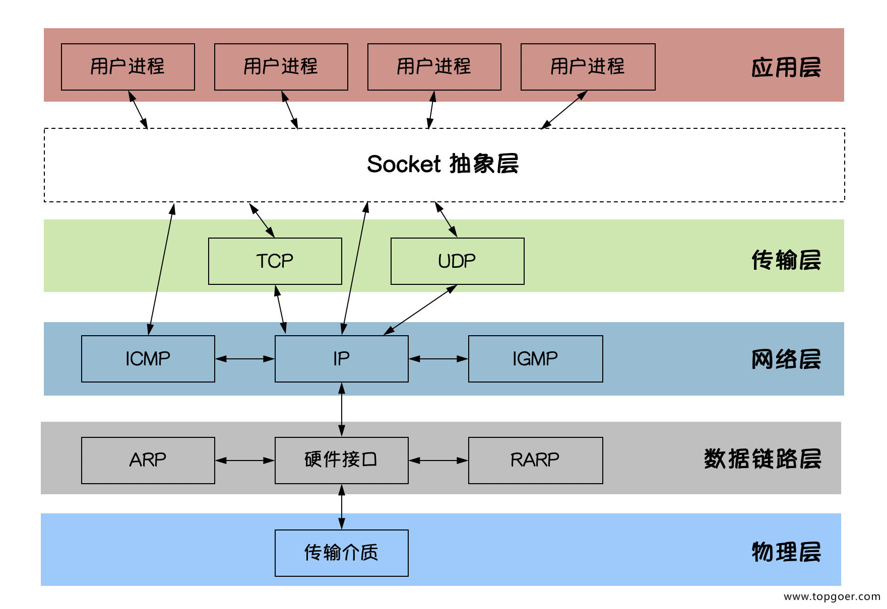

## 1. Socket 模型

> Socket 是 BSD UNIX 的进程通信机制，译作“套接字”

`Socket`：用于描述 IP 地址和端口，是一个通信链的句柄，是应用层和 TCP/IP协议栈的中间软件抽象层

- Socket 是一个门面模式，把复杂的 TCP/IP 协议族隐藏在 Socket 后面，对用户来说只需要调用 Socket 规定的相关函数，让 Socket 去组织符合指定的协议数据然后进行通信
- 流式 Socket：针对面向连接的 TCP 应用
- 数据报式 Socket：针对无连接的 UDP 应用

 

## 2. Go TCP 编程

