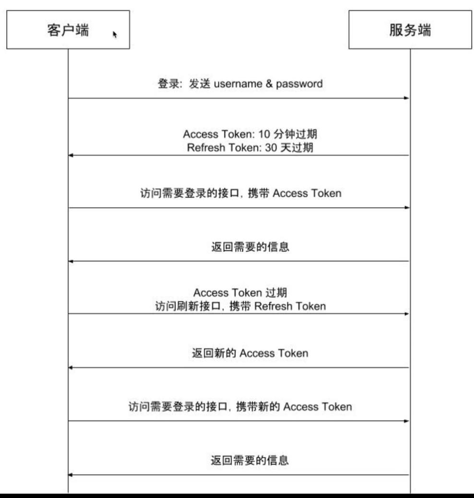

## 1. Cookie 和 Session

### 1.1 什么是 Cookie

​	HTTP协议是无状态的，一次请求完成，不会持久化请求与响应的信息。那么，在购物车、用户登录状态、页面个性化设置等场景下，就无法识别特定用户的信息。

**Cookie**：是客户端保存用户信息的一种机制，将服务器发送到浏览器的数据保存在本地，下次向同一服务器再发起请求时被携带，Cookie 可以设置过期时间

**Cookie 的应用**

1. 会话状态管理（如用户登录状态、购物车、分数等需要记录的信息）
2. 个性化设置（如用户自定义设置、主题等）
3. 浏览器跟踪行为

**存在的问题**：Cookie 存储在客户端，意味着可以通过一些方式进行修改、欺骗服务器

 

### 1.2 什么是 Session

**Session**：代表服务器和客户端一次会话的过程，是一种在服务器端保存数据的机制，用来跟踪用户状态的数据结构，可以保存在文件、数据库或者集群中；当应用程序在 web 页之间跳转时，存储在 Session 对象中的变量将不会丢失，而会在整个用户会话中一直存在下去，当客户端关闭会话、或 Session 超时失效时会话结束

- 第一次创建 Session 时，服务端会通过在 HTTP 协议中返回给客户端
- 在Cookie 中记录 SessionID，后续请求时传递 SessionID 给服务，以便后续每次请求时都可进行身份辨别

 

### 1.3 Cookie与Session的区别

- 作用范围不同，Cookie 保存在客户端(浏览器)，Session 保存在服务器端
- 存取方式的不同，Cookie只能保存 ASCII，Session可以存任意数据类型，比如UserId等
- 有效期不同，Cookie 可设置为长时间保持，比如默认登录功能功能，Session 一般有效时间较短，客户端关闭或者 Session 超时都会失效
- 隐私策略不同，Cookie 存储在客户端，信息容易被窃取；Session 存储在服务端，相对安全一些
- 存储大小不同， 单个 Cookie 保存的数据不能超过 4K，Session可存储数据远高于 Cookie

 

### 1.4 分布式系统中 Session 如何处理？

​	在分布式系统中，往往会有多台服务器来处理同一业务。如果用户在 A 服务器登录，Session 位于 A 服务器，那么当下次请求被分配到 B 服务器，将会出现登录失效的问题。

针对类似的场景，有三种解决方案：

**方案一**：请求精确定位。也就是通过负载均衡器让来自同一 IP 的用户请求始终分配到同一服务上。比如，Nginx的`ip_hash`策略，就可以做到。

**方案二**：Session 复制共享。该方案的目标就是确保所有的服务器的 Session 是一致的。像 Tomcat 等多数主流web 服务器都采用了 Session 复制实现 Session 的共享.

**方案三**：基于共享缓存。该方案是通过将 Session 放在一个公共地方，各个服务器使用时去取即可。比如，存放在 Redis、Memcached 等缓存中间件中。

 

### 1.5 客户端禁用 Cookie 会怎样?

**方案一**：拼接 SessionId 参数。在 GET 或 POST 请求中拼接 SessionID，GET 请求通常通过 URL 后面拼接参数来实现，POST 请求可以放在 Body 中。无论哪种形式都需要与服务器获取保持一致。

- 这种方案比较常见，比如老外的网站，经常会提示是否开启 Cookie。如果未点同意或授权，会发现浏览器的URL 路径中往往有`"?sessionId=123abc"`这样的参数。

**方案二**：基于 Token(令牌)。在APP应用中经常会用到Token来与服务器进行交互。Token本质上就是一个唯一的字符串，登录成功后由服务器返回，标识客户的临时授权，客户端对其进行存储，在后续请求时，通常会将其放在HTTP 的 Header 中传递给服务器，用于服务器验证请求用户的身份。

 

### 1.6 Cookie - Session 认证流程

- 客户端使用用户名、密码进行认证
- 服务端验证，并存储 Session，将 SessionID 通过 Cookie 返回给客户端
- 客户端访问服务端，需要在认证接口的 Cookie 中携带 SessionID
- 服务端通过 SessionID 查找 Session 进行鉴权

 

### 1.7 存在的问题

1. 服务端存储 Session，占用大量内存空间
2. 如果是服务器集群，每台服务器都需要存储 Session
3. SessionID 可能遭受跨站侵权伪造攻击（CSRF），伪造 SessionID

 

## 2. Token 认证模式

#### Token 认证模式

#### 基于 jwt 的 Token 认证

[jwt](https://github.com/golang-jwt/jwt)，[jwt 参考博客](https://www.liwenzhou.com/posts/Go/json-web-token/)，[理解 jwt](https://blog.csdn.net/Sky_QiaoBa_Sum/article/details/107584356)

`Access Token`：即访问资源接口时需要的 Token，通常有效期较短

`Refress Token`：用于重新获取 Access Token，有效期较长

- 都失效的话，则需要重新登陆

	

**jwt**：服务端认证后，生成一个 JSON 对象

三部分：两个点分割三部分的 token

1. 头部 Header：算法和 Token 类型（这里是 "JWT"）
2. 负载 Payload：官方 JSON 字段、用户自定义私有 JSON 字段（项目中自定义存储了`UserID`字段）
3. 签名 Signature：指定只有服务器才知道的密钥，使用头部的算法产生密钥签名

特点：

1. 可以用于认证，也可用于交换信息
2. 服务器不保存 Session 状态，节省内存空间
3. 如果 Token 被盗用，任何人都可以获得令牌的所有权限，所以有效期应该尽量简短

 

#### 执行顺序

1. 登录成功后，根据私钥、自定义 Claims 字段、选定算法，生成 Access Token 和 Refresh Token
2. 服务端会将两个令牌返回给客户端
3. 设置中间件，在需要登录的请求中：验证Token格式、验证 Access Token
4. 如果 Access Token 过期，则验证 Refresh Token，是过期错误则产生新的 Access Token

后端需要对外提供一个刷新 Token 的接口

前端需要实现一个当  Access Token 过期时自动请求刷新 Token 接口获取新的 Access Token 的拦截器

 

#### 场景思考：限制同一账号同一时间只能在一个设备上登录

1. 在一个账号的用户登录时，验证该 user_id 是否已经生成了 Token
2. 使用 Redis 存储 user_id 和 Token 的对应关系
3. 验证 Token 有效的同时，验证与 user_id 的对应关系（限制同一账号同一时间）
4. Token 携带的信息标识设备ID，同时在数据库映射该设备ID 与 Token（一台设备）

 

