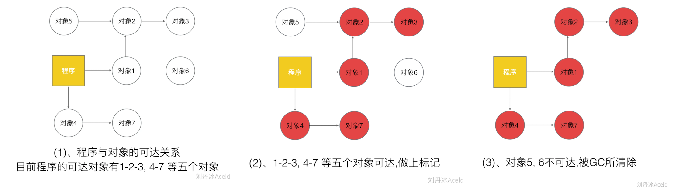
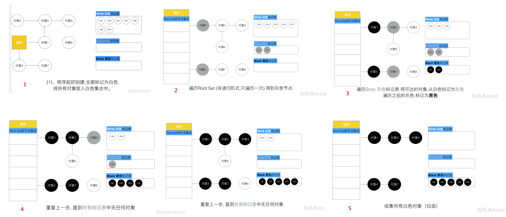
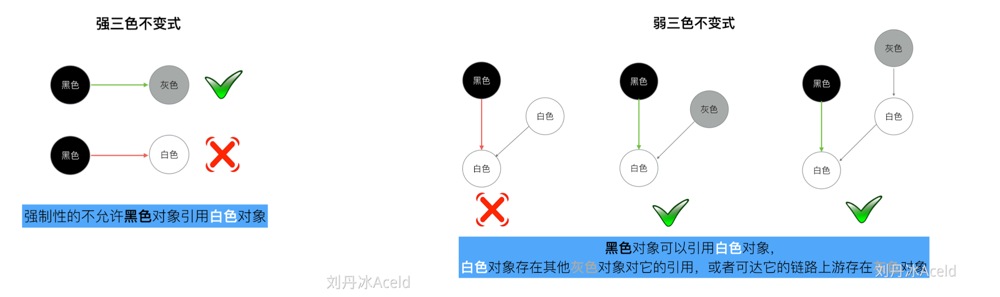

**垃圾回收（Garbage Collection，GC）**，是编程语言提供的自动的内存管理机制，自动释放不需要的内存对象，而无需程序员手动执行

## 1. 标记-清除 GC

> Go1.3 之前，mark-and-sweep



1. 程序暂停业务逻辑，分类出**可达**和**不可达**对象
2. 做出标记
3. 标记结束，清扫未标记的对象，停止暂停，程序继续执行

**STW**：stop the world，标记前启动 STW，CPU 不执行用户代码全部用于垃圾回收，程序会卡在此处等待垃圾回收结束（Go1.3 之前，整个过程启动 STW；Go1.3，只在标记过程启动 STW）

**缺点**：启动 STW 程序出现卡顿，标记过程扫描整个 Go 堆，清除数据会产生堆碎片（非连续内存分配）

<br>

## 2. 三色并发标记法 GC

> Go1.5

**三色标记法**：通过三个阶段的标记来确定清除的对象有哪些，GC 过程和其他用户 goroutine 可并发运行



1. 新创建的对象，默认标记为“白色”，标记表记录每个对象的标记颜色分类
    （“程序”是一些对象的根节点集合）
2. 每次 GC 回收开始，从根节点开始遍历可抵达对象，把遍历到的对象放入“灰色集合”
3. 遍历灰色集合，将其引用的白色对象放入灰色集合，将当前灰色集合放入“黑色集合”
4. 重复第三步，直到灰色集合无对象，剩余黑色对象（可抵达）、白色对象（垃圾数据）
5. 回收白色标记表内所有对象

### 2.1 使用 STW

- 为确保并发流程的内存数据安全，三色标记前加上 STW，确定黑白对象后放开

- 不使用 STW ，在 GC 过程中的读写操作可能使得已经标记为黑色的对象，新创建了对白色对象的引用，且该白色对象未被标记，从而被CG”误杀“

<br>

### 2.2 屏障机制



**强三色不变式**：强制不允许黑色对象引用白色对象

**弱三色不变式**：黑色对象可以引用白色对象，但可达该白色对象的链路上游存在灰色对象

<br>

#### 插入屏障

在 A 对象引用 B 对象时，B 对象被标记为灰色，满足**强三色不变式**

```go
/* 场景 */
A.添加下游对象(nil, B)   // A 之前没有下游，新添加一个下游对象B，B被标记为灰色
A.添加下游对象(C, B)     // A 将下游对象C 更换为B，B被标记为灰色
```

```go
/* 伪代码 */
添加下游对象(当前下游对象slot, 新下游对象ptr) {   
  //1
  标记灰色(新下游对象ptr)   
  
  //2
  当前下游对象slot = 新下游对象ptr  				  
}
```

**插入屏障只对堆空间对象使用**：函数调用栈频繁使用，每次引用对象都要检查，降低栈的性能

**STW 标记栈空间**：在三色标记扫描后，启动 STW，对栈空间重新进行三色扫描（防止对象丢失）

- 先对整体进行三色扫描，对堆空间做插入屏障处理，扫描结束后启动 STW 再扫描一次栈空间

<br>

#### 删除屏障

删除被引用的对象，如果该对象自身为灰色或者白色，将其标记为灰色，满足**弱三色不变式**

```go
/* 场景 */
A.添加下游对象(B, nil)	// A对象，删除B对象的引用：B被A删除，被标记为灰(如果B之前为白)
A.添加下游对象(B, C)		// A对象，更换下游B变成C：B被A删除，被标记为灰(如果B之前为白)
```

```go
/* 伪代码 */
添加下游对象(当前下游对象slot， 新下游对象ptr) {
  //1
  if (当前下游对象slot是灰色 || 当前下游对象slot是白色) {
  		标记灰色(当前下游对象slot)     //slot为被删除对象， 标记为灰色
  }
  
  //2
  当前下游对象slot = 新下游对象ptr
}
```

**栈空间**：栈空间的对象在退出函数调用栈后自动释放，不需要手动删除，删除屏障也只针对堆上的对象

<br>

#### 屏障机制弊端

插入写屏障：结束时需要 STW 重新扫描栈

删除写屏障：回收精度低，如果有指针指向被删除的对象，该指针本轮 GC 不会被被回收

<br>

## 3. 混合写屏障机制

> Go1.8，hybrid write barrier

### 3.1 混合写屏障规则

**满足弱三色不变式**

1. GC 开始时，将栈上的对象全部扫描并标记为”黑色“
2. GC 期间，任何在栈上创建的新对象，均为黑色
3. 堆上删除被引用的对象，标记为灰色
4. 堆上添加被引用的对象，标记为灰色

<br>

## 4. GC 的触发时机？

1）gcTriggerHeap：当所分配的堆大小达到阈值时，将会触发。

2）gcTriggerTime：当距离上一个 GC 周期的时间超过一定时间时，将会触发。时间周期以runtime.forcegcperiod 变量为准，默认 2 分钟。

3）gcTriggerCycle：如果没有开启 GC，则启动 GC

4）手动触发的 runtime.GC 方法

<br>

## 5. GC 存在的缺陷

内存泄露问题？


<br>

## 参考

[Golang 三色标记混合写屏障 GC 模式全分析](https://www.yuque.com/aceld/golang/zhzanb#d067ac74)

