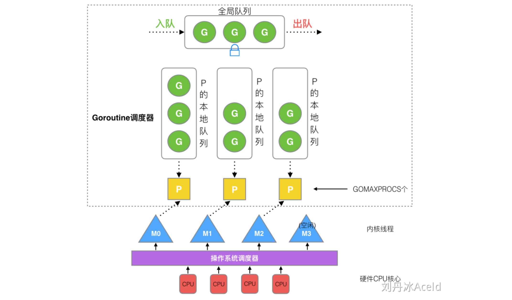

## 1. goroutine

### 1.1 认识 goroutine

- goroutine 是 Go 程序中最基本的并发单元
- 每一个Go程序都至少包含一个`goroutine`，即`main goroutine`，Go 程序启动时会自动创建

```go
go f() // 创建新的goroutine执行函数f
```

<br>

### 1.2 goroutine 和线程的区别

> 结合 OS 做”深度“探索

**内存消耗**：

- 创建一个 goroutine 的栈内存消耗为`2KB`，根据实际使用可以动态扩容
- 而创建一个线程需要消耗`1MB`栈内存

**创建和销毁**：

- goroutine 由 Go runtime 管理，属于用户级操作，创建和销毁的消耗非常小
- 线程创建和销毁需要和 OS 打交道，是内核级的，消耗巨大；通常使用线程池解决，尽量复用线程，减小开销

**切换**：

- goroutine 切换只需三个寄存器：PC、SP 和 BP
- 线程切换需要更多

<br>

### 1.3 用到的寄存器

`PC (Program Counter)`：程序计数器，存储当前 goroutine 即将执行的指令地址

`SP (Stack Pointer)`：栈指针，存储当前 goroutine 的栈顶指针

`BP (Base Pointer)`：栈基址指针，指向当前函数栈帧的基址（起始地址）

<br>

<br>

## 2. GMP 相关

### 2.1 进程 | 线程 | 协程

**进程**：是应用程序的启动实例，每个进程都有独立的内存空间，不同的进程通过进程间的通信方式来通信

**线程**：从属于进程，每个进程至少包含一个线程，线程是 CPU 调度的基本单位，多个线程之间可以共享进程的资源并通过共享内存等线程间的通信方式来通信

**协程**：为轻量级线程，与线程相比，协程不受操作系统的调度，协程的调度器由用户应用程序提供，协程调度器按照调度策略把协程调度到线程中运行

<br>

### 2.2 什么是 GMP

> 在 Go 中，线程是运行 goroutine 的实体，调度器的功能是把可运行的 goroutine 分配到工作线程上



#### 重要组成部分

> runtime 维护所有的 goroutine，根据调度器进行调度，goroutine 和内核线程是独立的，但 goroutine 需要依赖线程才能执行

> G 需要在 M 上运行，M 依赖 P 提供的资源，P 持有待运行的 G

**G**：Goroutine

**P**：Processor，Go 处理器，为 M 的执行提供上下文，保存 M 执行 G 时的一些资源

**M**：Machine，工作线程（系统线程），是真正工作的实体

**全局队列 Global Queue**：存放等待运行的 G，访问需要加锁

**P 的本地队列**：存放的也是等待运行的G（个数有限，不超过256个）

#### P 和 M 的数量

> P 对应的是逻辑核心数，M 对应一个内核线程

- 所有的 P 在程序启动时创建并保存在数组中，最多有`GOMAXPROCS`个
- M 设置的默认最大数值为 10000
- M 和 P 的数量没有绝对关系，一个 M 阻塞，P 会去创建或切换另一个 M
- Goroutine 调度器和 OS 调度器是通过 M 结合起来，每个 M 都代表一个**内核线程**，OS 调度器负责把内核线程分配到 CPU 的核上执行

#### P 和 M 的创建时机

- 在确定了 P 的最大数量后，运行时系统会创建相应个 P
- 当没有足够的 M 关联 P 并运行其中的可运行的 G，P 就会去寻找空闲的 M，没有空闲则创建新的 M

#### 设置 P 的原因

1. 每个 P 有自己的本地队列，大幅度的减轻了对全局队列的直接依赖（减少访问全局队列而产生的锁竞争开销）
2. GMP 模型中也实现了 Work Stealing 机制减少空转，提高了资源利用率
3. 如果本地队列直接挂载在 M 上，当 M 被阻塞后，未执行的 G 会全部阻塞，设置 P 可以将这些未执行的 G 转移到其他线程（用户级操作）

<br>

### 2.3 go func() 工作流程

1. **通过`go func()`创建一个 goroutine**：新创建的 G 先保存在 P 的本地队列中，如果队列满了，则会本地队列一半的 G 到全局队列
2. **M 运行任务**：需要先从本地队列获取 P，G 只能运行在 M 中，M 运行任务时必须持有一个 P
3. **如果持有的 P 本地队列为空**，则会从其他 M-P 组合偷取一个可执行的 G 来执行
4. **一个 M 调度 G 执行的过程是一个循环机制**：M 调度 P 本地队列中的 G 执行，当时间片超时后（被抢占），G 放回队列等待下一次调度，直至 G 任务执行完毕

<br>

<br>

## 3. Goroutine 调度策略

### 3.1 队列轮转

**本地队列**：

- 每个 P 维护一个本地 goroutine 队列
- 当不考虑系统调用或 IO 操作情况下，P 周期性的将 G 调度到M中执行，执行一小段时间，将上下文保存下来，然后将 G 放到队列尾部，然后从队列中重新取出一个 G 进行调度

**全局队列**：

- 每个 P 会周期性地查看全局队列中是否有 G 待运行并将其调度到 M 中执行
- 全局队列中 G 的来源，主要是从系统调用中恢复的 G
- 之所以 P 会周期性地查看全局队列，也是为了防止全局队列中的 G 被饿死

<br>

### 3.2 线程复用

#### Work Stealing 工作窃取

调度器每一轮的要做的工作就是找到处于就绪态的 goroutine 并执行，查找顺序如下

1. 本地队列找
2. 全局队列找
3. `netpoll`里找？？？
4. 从其他 P 偷取（即工作窃取）

`Work Stealing`：从其他 M 除了正在运行的 G 以外的本地队列中偷取一半 goroutine，以此保证所有 P 持续工作，尽快执行完所有 goroutine

#### Hand off 递交机制

1. M1 发生`syscall`或阻塞：M1 执行 G1 阻塞，`runtime`会把 M1 从 P 中摘除（detach），然后寻找新的线程 M 来服务这个 P（不包括 G1）
2. 当 M1 系统调用结束：如果获取到空闲的 P，M1 会获取后继续执行 G1，否则将 G1 放入全局队列，M1 进入缓存池休眠

<br>

## 4. 调度器 Go scheduler

> 是 Go runtime 的一部分，运行在用户空间

### 4.1 重要组成部分

`m0`

- 绑定启动程序后编号为`0`的主线程
- 实例保存在全局`runtime.m0`中，不需要在heap上分配
- 负责执行初始化操作和启动第一个 G `main goroutine`

`g0`

- 每个线程 M 的第一个 goroutine
- 仅用于调度其他的 G，不执行任何函数
- 在调度或系统调用时会使用 `g0`的栈空间, `m0`的 `g0`放在全局队列

<br>

### 4.2 调度器初始化过程**

1. 调整 SP：调整到地址为16的整数倍的位置
2. 初始化`g0`栈：为运行`runtime`代码提供环境
3. 主线程绑定`m0`：`runtime.m0`是一个全局变量，保存有`g0`的地址（二者互相关联）
4. 创建和初始化由`GOMAXPROCS`个 P 构成的 **P 列表**
5. ... (没搞懂？？？)

<br>

### 4.3 main 函数的执行流程

1. `runtime`创建`M0`和`G0`，并关联二者
2. 调度器初始化：初始化m0、栈、垃圾回收，以及创建和初始化由`GOMAXPROCS`个 P 构成的 **P 列表**
3. 为`runtime.main`创建 main goroutine（不是`g0`），放入 P（绑定 M0）的本地队列
4. M0 根据 G 栈中的栈信息和调度信息设置运行环境
5. M0 运行 main goroutine，`runtime.main`执行`mian.main`直到退出
6. `runtime.main`执行 defer 语句和 panic 处理，或调用`runtime.exit`退出程序

- main goroutine 执行开始标志着**调度器生命周期的开始**，并随着`runtime.main`结束而结束

#### symon 系统监视器

- 调度器启动的一个后台线程，用来检测长时间（超过 10ms）运行的 goroutine

<br>

### 4.4 调度过程中的阻塞

#### 用户态阻塞

**network I/O 阻塞**：golang 已经用`netpoller`实现了 goroutine 网络 I/O 阻塞不会导致 M 被阻塞，仅阻塞 G（探究一下！）

**channel 操作/等待锁/select 等**：

1. 对应的 G 会被放置到某个等待队列（如sendq/recvq等），G 的状态由`_Gruning`变为`_Gwaitting`
2. M 会跳过该 G 尝试获取并执行下一个 G，如果此时没有`runnable`的 G 供 M 运行，那么 M 将解绑 P，并进入休眠状态
3. 当阻塞的 G 被唤醒时（比如channel的可读/写通知），G 被标记为`runnable`
4. G 首先尝试寻找与其关联的 M（存储有上下文），即`原先队列 P -> 空闲的 P -> 放入全局队列`

<br>

#### 系统调用阻塞（见交付机制）

<br>

## 5. 抢占机制

### 5.1 同步协作式调度

> 对用户要求较高，编写时需要自行甄别是否需要让出时间片

**主动用户让权**：用户代码调用接口`Gosched()`，让 G 放弃当前在 M 上的执行权利，并在上下文切换后，将自身放入全局队列

**抢占标记**：在每个函数调用的序言 （函数调用的最前方）插入抢占检测指令，当检测到当前 Goroutine 被标记为被应该被抢占时， 则主动中断执行，让出执行权利

**存在的问题**：

1. 一个没有主动放弃执行权、且不参与任何函数调用的函数，直到执行完毕之前， 是不会被抢占的
2. 由于运行时无法停止该用户代码，则当需要进行垃圾回收时，无法及时进行
3. 对于一些实时性要求较高的用户态 Goroutine 而言，也久久得不到调度

### 5.2 异步抢占式调度

**系统监视器 sysmon**：在 Go 程序的初始化过程中，runtime 开了一条后台线程运行 sysmon 函数，用来检测执行时间过长的 goroutine，进而发出抢占

- P 处于`Prunning`：sysmon 每`10ms`通过`retake`对 G 发起抢占
- P 处于`Psyscall`：抢占阻塞在系统调用上的 G（见hand off机制）

**GC STW**：当 goroutine 主动出发 GC 时，需要把所有当前正在运行的 goroutine 停止下来，即 stw (stop the world)，

---- 这一块儿可以结合源码进行后续补充探究 ----

<br>

## 6. 常见场景处理

#### goroutine 存在死循环

**1.13版本前只能使用协作式抢占，无法处理死循环，解决方法**：

1. 添加退出条件
2. 使用超时限制`time.After()`等
3. 使用通道发送信号，接收后主动退出

**1.14版本后，添加了基于信号的异步抢占**：不会始终阻塞在死循环

<br>

#### 如果 goroutine 里面有 panic，外面能否接受到，怎么处理

​	在 Go 中，如果一个 Goroutine 内部发生了 panic，它会导致该 Goroutine 崩溃，并且它的调用者会收到 panic 的影响，即调用链上的函数也会停止执行，并且 panic 会沿着调用链一直传播，直到被某个 recover() 捕获或者到达程序的顶层

<br>

## 参考

[Goroutine 调度器的 GMP 模型的设计思想](https://www.yuque.com/aceld/golang/srxd6d#e0f6130f)

[Go 语言根本：6.8 协作与抢占](https://golang.design/under-the-hood/zh-cn/part2runtime/ch06sched/preemption/)

[抢占式调度](https://tiancaiamao.gitbooks.io/go-internals/content/zh/05.5.html)

https://cloud.tencent.com/developer/article/1836265
