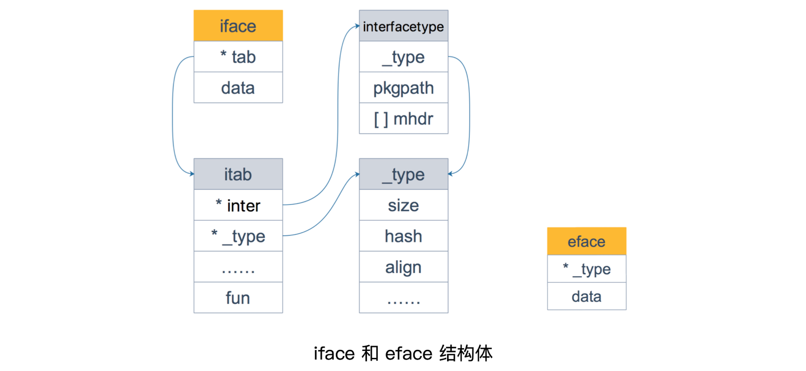

## 接口与反射

### 1. 值接收者和指针接收者

**方法**：给用户自定义类型添加新的行为，区别于函数，它有一个接收者

**实现层面**：

- 实现了接收者是`值`的方法，隐含地实现了接收者是`指针`的方法（都是操作的副本）
- 实现了接收者是`指针`的方法，反之不会自动生成接收者是`值`的方法（如果自动生成，就起不到修改接收者的效果）

**调用层面**：（前提是两种接收者类型的方法都实现了）

- `值类型`可以调用`值接收者`的方法，也可以调用`指针接收者`的方法
- `指针类型`可以调用`指针接收者`的方法，也可以调用`值接收者`的方法

**调用时隐含的语法糖**

| 调用者   | 值接收者（传递副本）       | 指针接收者（目的是修改原始值）                               |
| -------- | :------------------------- | :----------------------------------------------------------- |
| 值类型   | 方法会使用调用者的一个副本 | 使用值的引用来调用方法（会修改原始值，语法糖自动实现）       |
| 指针类型 | 指针被解引用为值（值传递） | 实际上也是“传值”，方法里的操作会影响到调用者，类似于指针传参，拷贝了一份指针 |

- 类型`T`只有接收者是`T`的方法，而类型`*T`有类型`*T`和`T`的方法（需要手动实现`T`接收者方法）

**使用时机**：考虑以下条件，不满足则推荐使用值接收者

1. 需要方法修改接收者的值
2. 避免拷贝大对象（结构体等）

<br>


### 2. 使用接口实现多态

**多态**：是一种运行期的行为，它有以下几个特点：

1. 一种类型具有多种类型的能力
2. 允许不同的对象对同一消息做出灵活的反应
3. 以一种通用的方式对待多个使用的对象
4. 非动态语言必须通过继承和接口的方式来实现

**Go 多态**：不同结构体的方法实现了接口拥有的函数，实际执行时，看的是最终传入的实体类型是什么，调用的是实体类型实现的函数，即当函数传入不同的实体类型时，调用的实际上是不同的函数实现，从而实现多态

<br>


### 3. Go 与“鸭子类型”

> 鸭子类型：如果某个东西长得像鸭子，像鸭子一样会游泳，像鸭子一样嘎嘎叫，那它就可以被看做是一只鸭子

- 鸭子类型是动态编程语言的一种**对象推断策略**，更关注对象被如何**使用**，而不是对象的类型本身
- 在这种风格中，一个对象有效的语义，不是由继承自特定的类或实现特定的接口决定，而是由它"**当前**方法和属性的集合"决定
- Go 作为一种静态语言，通过接口实现了鸭子类型，实际上是 Go 的编译器在其中作了隐匿的转换工作

<br>


### 4. iface 和 eface



#### iface

- `iface`包括接口的类型`inrerfacetype`和实体类型`_type`

```go
type iface struct {
    tab  *itab	// 接口表指针：指向itab实体（动态类型）
    data unsafe.Pointer	// 数据指针：指向接口具体值（在堆内的存储）（动态值）
}

type itab struct {
    inter  *interfacetype // 见下
    _type  *_type	// 描述实体类型（大小、内存对齐方式等）
    link   *itab
    hash   uint32 
    bad    bool   
    inhash bool   
    unused [2]byte
    fun    [1]uintptr	// 具体数据类型的方法入口地址
    					// 是按字典序排列的第一个方法的函数指针
}

// interfacetype 包装了_type，描述接口的类型
type interfacetype struct {
    typ     _type	// 见下
    pkgpath name	// 定义该接口的包名
    mhdr    []imethod	// 接口声明的方法列表
}

// _type Golang 描述各种数据类型的结构体
// Go 各种类型都是在 _type 字段基础上，增加一些额外的字段来进行管理的
type _type struct {
    // 类型大小
	size       uintptr
    ptrdata    uintptr
    
    hash       uint32	// 类型的 hash 值
    tflag      tflag	// 类型的 flag，和反射相关
    
    // 内存对齐相关
    align      uint8
    fieldalign uint8
    
    // 类型的编号，有bool, slice, struct 等等等等
	kind       uint8
	alg        *typeAlg
    
	// gc 相关
	gcdata    *byte
	str       nameOff
	ptrToThis typeOff
}
```

#### eface

```go
type eface struct {
    _type *_type	// 只包括实体类型
    data  unsafe.Pointer
}
```

<br>


### 5. 接口转换的原来

#### 动态值和动态类型

- 接口的结构体都包括：动态类型`tab/_type`，动态值`data`

- 接口值的零值是指动态类型和动态值都为`nil`，当仅且当这两部分的值都为`nil`的情况下，这个接口值就才会被认为`接口值 == nil`

####  实例赋值给接口 / 接口转换

- 当类型的方法集完全包含接口的方法集时，认为该类型实现了该接口
    - 接口变量可以存储任何实现了接口定义的所有方法的变量
- 接口的方法是字典序排列的，匹配的复杂度是`O(m+n)`（m个类型方法，n个接口方法）
- 可以将实现了接口的类型实例赋值给接口，从而实现接口转换

```go
// scr/runtime/iface.go 接口转接口源码
func convI2I(inter *interfacetype, i iface) (r iface) {
    // i 是绑定了实体类型的接口
    // r 是转换为 i 相同类型的新iface
	tab := i.tab
	if tab == nil {
		return
	}
	if tab.inter == inter {
		r.tab = tab
		r.data = i.data
		return
	}
	r.tab = getitab(inter, tab._type, false)	// 见下
	r.data = i.data	// 动态数据直接取类型实体的
	return
}

/*
r.tab = getitab(inter, tab._type, false) 的逻辑
（后续研究一下源码）
	1. 根据 inter、_type 在 itabTable 中寻找 itab
	2. 没找到，则上锁后再找一次（找到后，解锁同时返回）
	3. 在哈希表中没有找到，则生成一个新的 itab
	4. 将生成的 itab 添加到全局 itabTable 中
	5. 解锁
	
	上锁的逻辑：当其他goroutine查找相同itab时，在进行第二次查找前被挂住，之后可以直接查到写入哈希表的itab
*/
```

**itabTable**

```go
type itabTableType struct {
	size    uintptr             
	count   uintptr             
	entries [itabInitSize]*itab	// itab 指针数组
}
```

#### 接口转换的一般逻辑

**类型转空接口**：

1. `_type`字段直接复制源类型的`_type`
2. 调用`mallocgc`获得一块新内存，把值复制进去，`data`再指向这块新内存

**类型转非空接口**：

1. 入参`tab`是编译器在编译阶段预先生成好的
2. 新接口`tab`字段直接指向入参`tab`指向的`itab`
3. 调用`mallocgc`获得一块新内存，把值复制进去，`data`再指向这块新内存

**接口转接口**：`itab`调用`getitab`函数获取（只用生成一次，之后直接从哈希表中获取）

<br>


### 6. 类型转换与类型断言

**类型转换**：

```go
var f float64
f = float64(10)
```

**类型断言**：

- 类型断言操作对象是**接口**，比较接口的动态类型是否是断言类型

```go
var i any = new(Person)	// Person 是一个结构体	

s1 := i.(Person)	// 断言失败会 panic

s, ok := i.(Person)	// 安全断言
if ok {
    // 断言成功
}

// switch 断言（后续代码练习）
```

**`fmt.Println`处理参数**：参数类型是`interface`

1. 内置类型：穷举真实类型
2. 自定义类型：如果类型实现了`String()`方法，则直接调用，否则通过反射遍历对象的成员

<br>


### 7. 让编译器检测类型是否实现了接口*

```go
// 两种方法
var interface_name = (*T)(nil)
var interface_name = T{}
```

<br>


### 8. 什么是反射

**反射**：指计算机程序在运行时可以访问、检测和修改它本身状态或行为的一种能力

**本质**：程序在运行期，探知对象的类型信息（Type）和内存结构（Value）

**使用时机**：

1. 不能明确接口调用哪个函数，需要根据传入的参数在运行时决定
2. 不能明确传入函数的参数类型，需要在运行时处理任意对象

不推荐使用的理由：阅读困难、编码过程无法发现反射代码的错误、影响性能

<br>


### 9. 反射的实现

> 接口会存储实体的类型信息，反射就是通过接口的类型信息实现的，建立在类型的基础上

#### 反射的基本函数

`reflect.Type`是反射包里定义的接口，提供类型相关的方法，获取类型相关各种信息

```go
// go 1.21.1
func TypeOf(i any) Type {
	eface := *(*emptyInterface)(unsafe.Pointer(&i))	// 转为reflect包里的eface
	return toType((*abi.Type)(noescape(unsafe.Pointer(eface.typ))))
}

// 和eface基本一致
type emptyInterface struct {
	typ  *abi.Type
	word unsafe.Pointer
}
```

`reflect. Value`是定义在反射包里的结构体 

```go
// go 1.21.1
type Value struct {
	typ_ *abi.Type
	ptr unsafe.Pointer
	flag
}

func ValueOf(i any) Value {
	if i == nil {
		return Value{}
	}
	return unpackEface(i)
}

// unpackEface 将空接口转换成 Value
// 将 typ、word和标志位组装成 Value
func unpackEface(i any) Value {
	e := (*emptyInterface)(unsafe.Pointer(&i))
	t := e.typ
	if t == nil {
		return Value{}
	}
	f := flag(t.Kind())	// 设置标志位，标识Value.ptr是否是指向数据的指针
	if t.IfaceIndir() {
		f |= flagIndir
	}
	return Value{t, e.word, f}
}
```

**总结**：

- `TypeOf()`返回一个接口，通过接口定义的方法可以获取关于类型的所有信息
- `ValueOf()`返回一个结构体，包含类型信息以及实际值

#### 反射三大定律

> Reflection goes from interface value to reflection object.
>
> Reflection goes from reflection object to interface value.
>
> To modify a reflection object, the value must be settable（可设置的，不能是副本）.

- 想要操作原变量，反射变量`Value`必须持有原变量的地址

<br>


### 10. 实现深拷贝

**浅拷贝**：只复制指向某个对象的指针，而不复制对象本身，新旧对象中指针类型的字段还是共享一块内存

**深拷贝**：创造一个内容完全相同的对象，与原对象不共享内存

<p>


#### 方法一：序列化 + 反序列化

- 将对象序列化为一个JSON字串，再反序列化到复制的对象上
- 开销较大，且无法复制私有字段

```go
func Copy(dst any, src any) error {
	if dst == nil || src == nil {
		return fmt.Errorf("nil dst or src")
	}
	bytes, err := json.Marshal(src)
	if err != nil {
		return fmt.Errorf("unable to serialize src: %s", err)
	}
	err = json.Unmarshal(bytes, dst)
	if err != nil {
		return fmt.Errorf("unable to deserialize into dst: %s", err)
	}
	return nil
}
```

#### 方法二：通过反射

```go
// 后续探究
```

<br>


### 11. 判断两个对象是否完全相等*

使用函数`reflect.DeepEqual()`实现

```go
func DeepEqual(x, y any) bool {
	if x == nil || y == nil {
		return x == y
	}
	v1 := ValueOf(x)
	v2 := ValueOf(y)
	if v1.Type() != v2.Type() {
		return false
	}
	return deepValueEqual(v1, v2, make(map[visit]bool))
}

// deepValueEqual() 的逻辑：通过switch语句递归调用到最基本的数据类型，进行判断
// 从而保证两个值在每个层级上都相等
```

| 类型                                  | 深度相等情形                                                 |
| ------------------------------------- | ------------------------------------------------------------ |
| Array                                 | 相同索引处的元素“深度”相等                                   |
| Struct                                | 相应字段，包含导出和不导出，“深度”相等                       |
| Func                                  | 只有两者都是 nil 时判等                                      |
| Interface                             | 两者存储的具体值“深度”相等                                   |
| Map                                   | 1. 都为 nil；2. 非空、长度相等，指向同一个 map 实体对象，或者相应的 key 指向的 value “深度”相等 |
| Pointer                               | 1. 使用 == 比较的结果相等；2. 指向的实体“深度”相等           |
| Slice                                 | 1. 都为 nil；2. 非空、长度相等，首元素指向同一个底层数组的相同元素，即 &x[0] == &y[0] 或者 相同索引处的元素“深度”相等 |
| numbers, bools, strings, and channels | 使用 == 比较的结果为真                                       |

<br>

