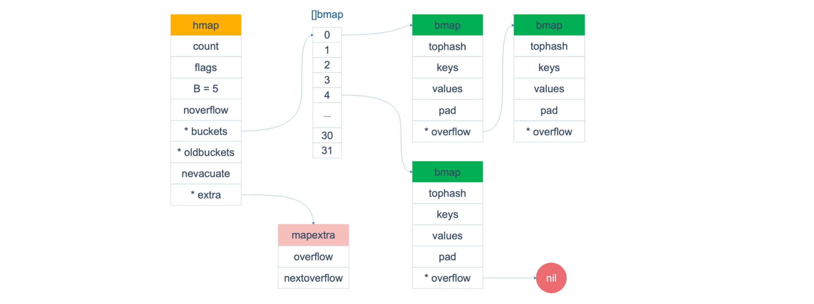
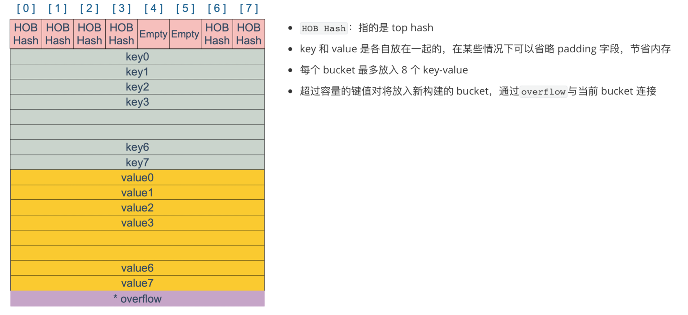
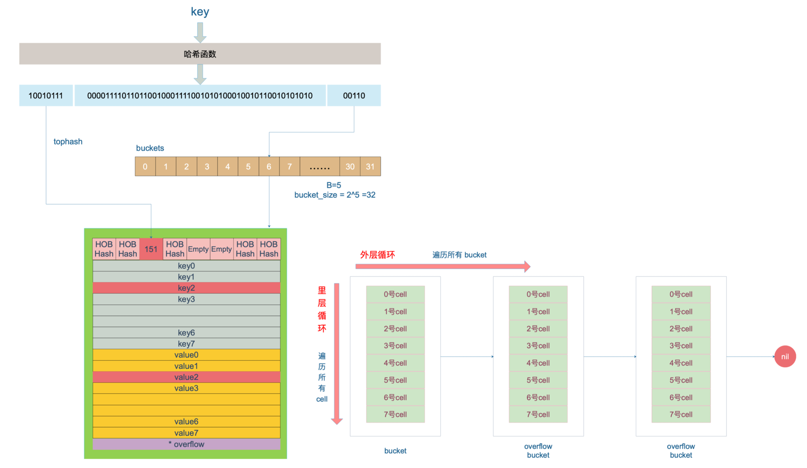

## 1. map 的底层实现原理

> 参考版本：go1.22.1

### 1.1 哈希表的整体结构

```go
// src/runtime/map.go
type hmap struct {
	count     int		// 元素个数，len(map)时返回该值
	flags     uint8		// 标志位
    B         uint8  	// log(buckets)，表示有 2^B 个 bucket
	noverflow uint16 	// 大概的溢出 bucket 数量
	hash0     uint32 	// 哈希随机数

	buckets    unsafe.Pointer // 指向 2^B 个桶的数组，元素为0时，该值为 nil
	oldbuckets unsafe.Pointer // 仅在扩容时非空，大小为 buckets 数组的一半
	nevacuate  uintptr        // 指示扩容进度，小于该地址的 buckets 已经完成迁移

	extra *mapextra // 可选字段
}

// extra 是对 map 结构的附加信息
// 当键值对都不含指针时，可以将 bucket 标记为不含指针，避免GC扫描时扫描整个map
// overflow 和 oldoverflow 字段存储所有溢出桶的指针，即 bmap 的 overflow 字段
// 它们只在键值对不含指针时使用
type mapextra struct {
	overflow    *[]*bmap
	oldoverflow *[]*bmap

	nextOverflow *bmap	// 指向空闲的溢出桶
}
```

```go
// bmap 即一个 bucket，最多存放 8 个键值对
type bmap struct {
	tophash [bucketCnt]uint8
}

// 经编译器编译后，会增加字段
type bmap struct {
    topbits [8]uint8
    keys	[8]keytype
    values	[8]valuetype
    pad		uintptr
    overflow	uintptr
}
```



- `buckets`指向一个`bmap`结构体数组



<br>

### 1.2 创建 map

```go
map1 := make([string]int, 8)	// 创建 string-int map，长度 8 是可选字段

var map2 map[string]int	// 不初始化直接使用，会引发 panic
```

#### makemap

```go
// 底层调用的是 makemap 函数
// 返回值是一个 hmap 指针，说明 map 是一个引用类型
func makemap(t *maptype, hint int, h *hmap) *hmap {
    // 检查是否超过内存申请的限制
	mem, overflow := math.MulUintptr(uintptr(hint), t.Bucket.Size_)
	if overflow || mem > maxAlloc {
		hint = 0
	}

	// 初始化 Hmap
	if h == nil {
		h = new(hmap)
	}
	h.hash0 = uint32(rand())

	// 找到一个 B，使得 map 的装载因子在正常范围内
	B := uint8(0)
	for overLoadFactor(hint, B) {
		B++
	}
	h.B = B

	// 初始化 hash table
	// if B == 0, buckets 在赋值的时候再分配（懒汉式）
	// 如果长度较大，清理内存花费的时间会长一些
	if h.B != 0 {
		var nextOverflow *bmap
		h.buckets, nextOverflow = makeBucketArray(t, h.B, nil)
		if nextOverflow != nil {
			h.extra = new(mapextra)
			h.extra.nextOverflow = nextOverflow
		}
	}

	return h
}
```

- `makemap`返回的是 hmap 指针，`makeslice`返回的是 slice 结构体 

<br>

### 1.3 key 的定位过程



定位 key 值底层调用的是`mapaccess`函数（下面的步骤没有涉及扩容情况）

键值 key 经过**哈希计算**后得到 64bit 哈希值

**后 B 位**：`B = log(buckets)`，将后 B 位（转十进制）记为键值对落入的桶编号

**高 8 位**：转换为十进制，就是 tophash 值，即 HOB Hash

1. 通过后 B 位：定位桶编号
2. 通过高 8 位：得到 tophash 值，遍历 Hob Hash 找到对应的槽 cell【拉链法处理冲突】
3. 仍然没有找到且`overflow`非空，则去 overflow bucket 中寻找
4. 如果最终没有找到该 key 对应的 value，则返回一个类型零值

```go
value, ok := map1[key]	// ok == false, value 是零值（没找到）
```

<br>

### 1.4 赋值过程

底层调用的是`mapassign`函数

根据 key 的不同，编译器会将赋值优化为几种“快速函数”，对应`uint32, uint64, string`类型

1. 首先检查标志位`flags`
    - 如果写位置置 1，说明其他协程对 hmap 执行写操作，因此**产生并发写，直接报 panic**
    - 否则将写位置置 1
2. 与寻找 key 类似：内层循环遍历 bucket 中的每个 cell，外层循环遍历 overbucket
3. 准备两个指针`inserti`和`insertk`
    - 指针在寻找 key 的过程中，会停留在第一个空闲位
    - `inserti`指向第一个空的 Hob Hash，`insertk`指向对应的空闲 cell（key 槽）
4. 如果 bucket 8个槽都放满了，挂 overbucket 前会查看是否满足扩容条件，满足则触发扩容操作
5. 扩容后重新定位 key 的操作
6. 函数返回 key 对应的 value 值的地址
7. 更新或写入 value 到相应的地址，如果是写入，则`count += 1`
8. 写标志位清零，完成操作

<br>

### 1.5 删除过程

删除操作调用的底层函数是`mapdelete`，同样根据 key 的类型会优化成更具体的函数

1. 检查`flags`标志位，如果写位置为 1，则**直接 panic**
2. 计算 key 的哈希，找到桶编号
3. 写标志位置 1 
4. 检查 map 是否在扩容，如果是则触发一次搬迁操作
5. 定位 key，对找到的位置进行清零操作
6. `count -= 1`，对应的 Hob Hash 改为空

<br>

## 2. map 扩容 △

### 2.1 扩容条件

**装载因子 load factor**：`loadFactor = count / (2^B)`

**扩容条件 1**：装载因子超过阈值`6.5`，大概 80% bucket 已满，此时查找、插入、删除的效率都降低很多

```go
func overLoadFactor(count int, B uint8) bool {
    // loadFactorNum*(bucketShift(B)/loadFactorDen) = 13 * (2^B / 2)
	// 判断条件：count > 8 && count > 2^B * 6.5
    return count > bucketCnt && uintptr(count) > loadFactorNum*(bucketShift(B)/loadFactorDen)
}
```

**扩容条件 2**：溢出的 bucket 数量过多（不停插入后、删除元素造成，是对条件 1 的补充）

1. `B < 15`，overflow bucket 超过 `2^B`
2. `B >= 15`，overflow bucket 超过 `2^15`

```go
func tooManyOverflowBuckets(noverflow uint16, B uint8) bool {
    // B > 15 时就只取 15
    if B > 15 {
       B = 15
    }
    // noverflow 是大概的溢出桶数量
    return noverflow >= uint16(1)<<(B&15)
}
```

<br>

### 2.2 扩容策略

**针对扩容条件 1**：元素太多 bucket 太少，直接 `B += 1`，将 bucket 总数变为原来的二倍

**针对扩容条件 2**：开辟一个新的 bucket 空间，将 old bucket 中的元素移过去，使得新桶内的 key 排列更紧密

- 第二种策略即**等 size 扩容**`sameSizeGrow`

- 会出现极端情况：所有 key 都落在一个 bucket 中，迁移不会改变溢出桶过多的情况，哈希表退化为链表

<br>

### 2.3 渐进式”搬迁“

```go
if !h.growing() && (overLoadFactor(h.count+1, h.B) || tooManyOverflowBuckets(h.noverflow, h.B)) {
    hashGrow(t, h)
    goto again	// 这里是 mapassign 函数的一部分，对应前面说的扩容后重新定位 key
}
```

- `hashGrow()`并没有真正地进行“搬迁”
    1. 分配好新的 buckets
    2. 设置`hmap.flags`的标志位，标识扩容策略的选择，如果是`sameSizeGrow`表示第一种扩容策略
    3. 并将老的 buckets 加载到`hmap.oldbuckets`字段
    4. `hmap.nevacuate = 0`，表示迁移进度为 0
- 真正的元素迁移在`growWork()`函数，而该函数在`mapassign`和`mapdelete`中
- 即**插入、修改、删除的时候**，会检查`oldbuckets`字段，不为 nil，则尝试进行迁移工作

```go
func growWork(t *maptype, h *hmap, bucket uintptr) {
    // 确认搬迁老的 bucket 对应正在使用的 bucket
	evacuate(t, h, bucket&h.oldbucketmask())

    // 判断 return h.oldbuckets != nil，如果没搬迁完，再搬迁一个桶
	if h.growing() {
		evacuate(t, h, h.nevacuate)
	}
}
```

```go
// evacuate 执行搬迁操作的函数
func evacuate(t *maptype, h *hmap, oldbucket uintptr) {
    // 1. 定位老 bucket 的地址，即选定一个 oldbucket，记为 b
    b := (*bmap)(add(h.oldbuckets, oldbucket*uintptr(t.BucketSize)))
    newbit := h.noldbuckets()	// 计算增长前的桶数，即 2^B
    
    // 2. 如果选定的桶没有被迁移过
    if !evacuated(b) {
       // evacDst 记录迁移目标的 bucket 数组、key 和 value 指针
       var xy [2]evacDst
        
       // 默认是等 size 扩容，使用 x 进行搬迁
       x := &xy[0]
       x.b = (*bmap)(add(h.buckets, oldbucket*uintptr(t.BucketSize)))
       x.k = add(unsafe.Pointer(x.b), dataOffset)
       x.e = add(x.k, bucketCnt*uintptr(t.KeySize))

       // 非等 size 扩容，使用 y 搬迁
       if !h.sameSizeGrow() {
          y := &xy[1]
          y.b = (*bmap)(add(h.buckets, (oldbucket+newbit)*uintptr(t.BucketSize)))
          y.k = add(unsafe.Pointer(y.b), dataOffset)
          y.e = add(y.k, bucketCnt*uintptr(t.KeySize))
       }

       // 3. 遍历选定的 oldbucket 及其溢出桶
       for ; b != nil; b = b.overflow(t) {
          k := add(unsafe.Pointer(b), dataOffset)
          e := add(k, bucketCnt*uintptr(t.KeySize))
          // 内层遍历桶中的所有槽，找到需要搬迁的 key 和 value
          for i := 0; i < bucketCnt; i, k, e = i+1, add(k, uintptr(t.KeySize)), add(e, uintptr(t.ValueSize)) {
             top := b.tophash[i]
             // 有tophash，但cell空，表示已经被搬迁了，跳过
             if isEmpty(top) {
                b.tophash[i] = evacuatedEmpty
                continue
             }
             if top < minTopHash {
                throw("bad map state")
             }
             k2 := k
             if t.IndirectKey() {
                k2 = *((*unsafe.Pointer)(k2))
             }
             var useY uint8
             
             // 如果不是等size扩容，需要重新计算哈希值
             if !h.sameSizeGrow() {
                hash := t.Hasher(k2, uintptr(h.hash0))	// 计算 key 的哈希值
                 
                // 当有协程在遍历 map 且相同 key 计算出不同的哈希值
                // 当使用 NaN() 作为 key 时会计算出不同的哈希值
             	if h.flags&iterator != 0 && !t.ReflexiveKey() && !t.Key.Equal(k2, k2) {
                    // 取哈希值的最低位作为 useY，高八位作为 tophash
                	useY = top & 1
                	top = tophash(hash)
             	} else {
                   	if hash&newbit != 0 {
                      	useY = 1
                   	}
                }
             }

             if evacuatedX+1 != evacuatedY || evacuatedX^1 != evacuatedY {
                throw("bad evacuatedN")
             }

             b.tophash[i] = evacuatedX + useY // evacuatedX + 1 == evacuatedY
             dst := &xy[useY]                 // evacuation destination

             // 如果有溢出桶
             if dst.i == bucketCnt {
                dst.b = h.newoverflow(t, dst.b)
                dst.i = 0
                dst.k = add(unsafe.Pointer(dst.b), dataOffset)
                dst.e = add(dst.k, bucketCnt*uintptr(t.KeySize))
             }
             dst.b.tophash[dst.i&(bucketCnt-1)] = top 
              
             // 复制值和指针到新的位置
             if t.IndirectKey() {
                *(*unsafe.Pointer)(dst.k) = k2 // copy pointer
             } else {
                typedmemmove(t.Key, dst.k, k) // copy elem
             }
             if t.IndirectElem() {
                *(*unsafe.Pointer)(dst.e) = *(*unsafe.Pointer)(e)
             } else {
                typedmemmove(t.Elem, dst.e, e)
             }
             // 定位到下一个槽
             dst.i++
             
             dst.k = add(dst.k, uintptr(t.KeySize))
             dst.e = add(dst.e, uintptr(t.ValueSize))
          }
       }
	   // 如果没有协程使用老的 buckets，就清除掉
       if h.flags&oldIterator == 0 && t.Bucket.PtrBytes != 0 {
          b := add(h.oldbuckets, oldbucket*uintptr(t.BucketSize))
         
          ptr := add(b, dataOffset)
          n := uintptr(t.BucketSize) - dataOffset
          memclrHasPointers(ptr, n)
       }
    }
	// 更新搬迁进度
    if oldbucket == h.nevacuate {
       advanceEvacuationMark(h, t, newbit)
    }
}
```

`evacuate()`函数每次只完成一个 bucket 的搬迁工作，将其所有有值的槽的值，复制到新的地方，并且需要搬迁溢出桶的槽

**对于扩容条件 1**：由于`B += 1`，需要重新计算哈希值，同时判断桶编号时需要多看一位（低 B 位）

多看一位意味着可以将原本一个桶内的值分为两个部分：`partX`和`partY`

- `X`表示低 B 位新加入的一位是 0：仍然搬迁到相同的桶编号
- `Y`则新加入的一位是 1：需要搬迁到新的桶编号处

#### 扩容基本流程

1. 在插入/修改前会判断扩容条件，如果满足则调用`hashGrow()`准备扩容条件
2. 在插入/修改、删除操作中会调用`growWork()`函数，检查是否扩容后执行真正的搬迁操作`evacuate()`
3. 选定一个还没有搬迁的 oldbucket
4. 根据两种扩容策略，判断是否是等size扩容，拿到新桶的 bucket 数组指针、key 指针、value 指针
    - 这里新桶的目标地址分为了`X`和`Y`两部分
5. 如果是等 size 扩容：直接使用原来的桶编号，即只使用`X`部分
6. 如果不是，则重新计算 key 的哈希值，根据新加入的低 B 位的最高位判断 key 落在`X`或`Y`部分
    - 这里用到了`X`和`Y`两部分
7. 外层循环遍历 oldbucket 及其溢出桶，内存循环遍历桶内的槽，将键值对移到目的地
8. 搬迁一个 oldbucket 后，会再次判断搬迁状态，再搬迁一个 oldbucket

#### 怪东西 NaN

`NaN`是 float64 类型的值，满足以下条件：

1. 与 NaN 进行数学运算，结果都为 NaN
2. 与 NaN 进行比较，结果都为 false
3. 可以使用`math.IsNaN()`判断

对 key 为 NaN 进行哈希计算，会产生不同的结果，需要单独处理该 key 搬迁后落在`X/Y`部分

-  采用的方法是以 tophash 的最低位进行判断，0 - X、1 - Y（哈希值高八位的最低位）

<br>

### 2.4 map 的遍历

```go
for k, v := range map1 {
    ...
}
```

map 使用迭代器`hiter`进行遍历

```go
type hiter struct {
	key         unsafe.Pointer 
	elem        unsafe.Pointer 
	t           *maptype
	h           *hmap
	buckets     unsafe.Pointer 
	bptr        *bmap          
	overflow    *[]*bmap       
	oldoverflow *[]*bmap       
	startBucket uintptr        
	offset      uint8          
	wrapped     bool           
	B           uint8
	i           uint8
	bucket      uintptr
	checkBucket uintptr
}
```

在得到遍历的桶编号以及 cell 序号时，会加入随机数，即从随机位置开始遍历

当遍历处于搬迁的中间状态时，需要遍历三种情况： oldbucket 未搬迁部分、新桶 X 部分、新桶 Y 部分

**每次遍历的结果都是无序的！**

<br>

## 3. map 问答

### Q1. map 中的 key 为什么是无序的


### Q2. map 是线程安全的吗


### Q3. map 读取的两种操作


