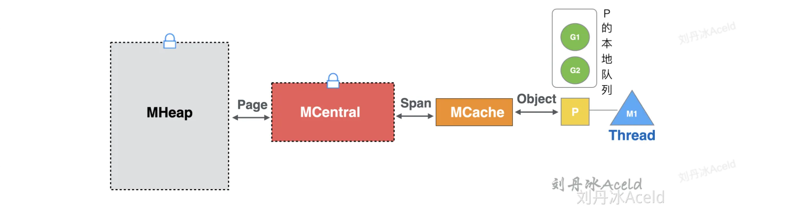
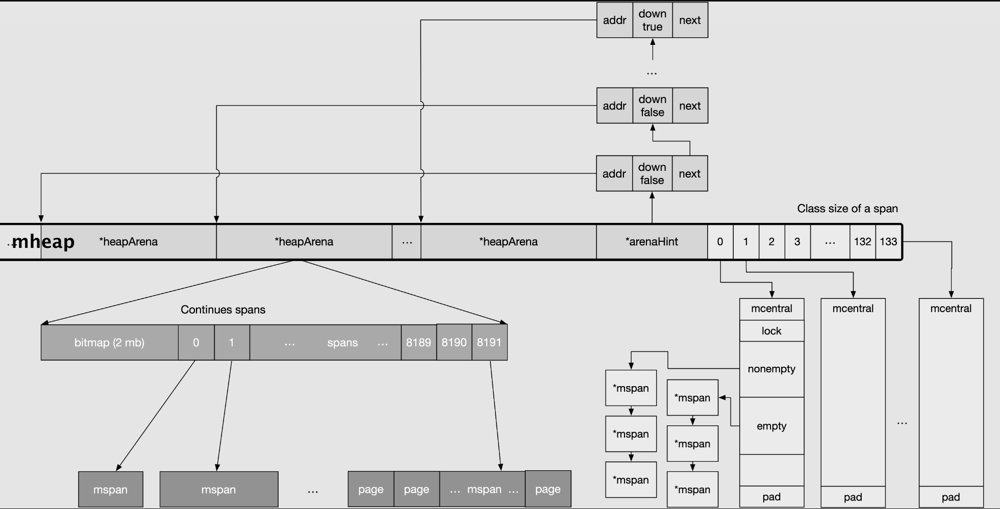
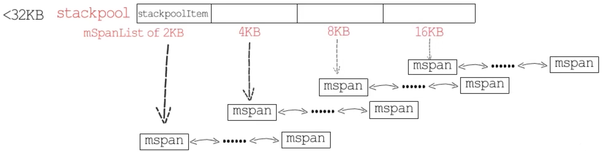

## 1. 内存管理的目的与组件

### 1.1 目的

1. 统一管理内存会提前分配或一次性释放一大块内存，进而减少与操作系统沟通（系统调用）造成的开销
1. 更好地支持垃圾回收

 

### 1.2 运行时内存管理的组件

**页分配器**：Page Allocator，从操作系统申请内存

**对象分配器**：Object Allocator，为用户程序分配内存

**垃圾回收器**：Garbage Collector，回收用户程序所分配的内存

**拾荒器**：Scavenger，向操作系统归还申请的内存

 

### 1.3 栈内存和堆内存

运行时`runtime`帮我们屏蔽掉了传统意义上程序的堆、栈概念，只需考虑运行时内部区分的两个分配内存的地方

**1. 全局的堆空间**（由 mheap 管理）

**2. 每个 goroutine 的执行栈空间**

除此之外，还有处理器 P 持有的本地缓存`mcache`，存放全局变量和常量、代码段以及其他数据的空间

 

## 2. 堆内存分配器结构

> Page 是 Go 内存管理与操作系统交互的基本单元，Go 内存管理的基本单元是 Object 

### 2.1 基本组件

#### 内存管理数据结构 

`mheap`：管理整个堆内存

`heapArena`：对应一个 arena，标记其中的页的一些信息，与页的使用情况、垃圾回收等有关

`mspan`：对应一个 span，存放下一个 span 的页数和自己的起始地址，相同等级大小的 mspan 构成一个双向链表

`mcache`：处理器 P 持有的本地缓存，由不同大小等级的 mspan 构成

`mcentral`：是堆上的一个全局 mspan 管理中心，对应不同大小类型的 mspan，**访问需要加互斥锁**

 

#### 内存分配的粒度

`page`：一个页为`8KB`

`span`：由一组连续的页组成，存放不同大小等级的对象`Object`，对应着不同大小的 span

`arena`：由 Go 堆上的**一系列**的页（8192 个）组成，每个`64MB`（64位），占用绝大部分堆空间

`heap`：Go 堆，下层是操作系统

 

#### 大小等级划分 sizeClass

根据指定对象的大小，划分为`8B - 32KB`范围内的`67`个大小等级，每个等级对应着一个`8KB - 32KB`范围内的 span

 

#### 内存交换的基本单位

- goroutine 逻辑层与`mcache`以 Object 为单位进行内存交换
- `mcache`与`mcentral`以 span 为单位进行内存交换
- `mcentral`与`mheap`以 page 为单位进行内存交换

- `mheap`与操作系统也是以 page 为单位进行内存交换

 

### 2.2 管理组件的结构

1. Go 堆`mheap`：由多个`arena`覆盖整个 Go 堆虚拟空间，通过`arenaHint`记录每个`arena`的起始位置
2. 每个`heapArena`：包括一段`bitmap`（标记内存使用情况）和一段连续的`mspan`指针
3. 每个`mspan`：由一串连续的页（8KB）组成

4. `mcentral`：在`mheap`有一个长度为 134 的结构体数组，字段是 mcentral 和 padding

5. `mcache`：被处理器 P 持有，并不在 Go 堆上（也不在 goroutine 执行栈上）

 

## 3. 堆内存分配

### 3.1 mallocgc

在 Go 堆上分配对象时，均调用了`runtime.newobject`方法，其内部封装了`mallocgc`方法，即内存分配的核心

`mallocgc`也是`new`和`make`实现的核心

 

### 3.2 分配流程

#### 大对象分配 `>32KB`

大对象直接在堆上进行分配，不涉及`mcache / mcentral / mheap`之间的三级过程，**需要加锁**

 

#### 小对象分配 `16B-32KB`

1. 调整大小等级：根据对象所需的内存大小，调整到能够容纳对象的大小等级，并查看`mcache`中对应等级的`mspan`
2. 从中枢缓存获取：`mspan`不足，从`mcentral`获取一个所需大小空间的新 mspan，这一步**需要对 mcentral 加锁**
3. 从 Go 堆获取：`mcentral`的 mspan 也为空，从`mheap`获取一串连续的页作为一个新的 mspan，**需要加锁**
4. Go 堆扩容：如果`mheap`空间不足，从操作系统分配一组新的页（至少`1MB`）

 

#### 微对象分配 `<16B`

对于微对象 Tiny Object，会分配一个`16B`的`mspan`作为其缓冲区，并以该 mspan 为单位转化为**小对象分配流程**

 

## 4. 栈内存管理

### 4.1 执行栈结构

> 调度器初始化时，会初始化两个用于栈分配的全局对象，这个的栈指的是 goroutine 执行栈

**stackpool**：`2KB - 32KB`以下的栈分配，初始都为`2KB`，提供`2K, 4K, 8K, 16K`四种规格的`mspan`链表

**stacklarge**：`>=32KB`的栈分配

**全局栈缓存**：两个全局对象作为全局栈，它们都是 mspan 的双向链表

**stackcache**：P 持有的本地栈缓存

 

### 4.2 栈分配

#### 小栈分配 `<32KB`

1. goroutine 会优先使用`stackcache`
2. 本地为空，从`stackpool`分配内存到本地缓存
3. `stackpool`也为空，从堆`mheap`分配内存到`stackpool`
4. 有些情况不能用本地缓存，则直接从`stackpool`分配

#### 大栈分配 `>=32KB`

1. 从`stacklarge`获取
2. 为空，则从堆`mheap`分配内存到`stackpool`

 

### 4.3 栈的伸缩

#### 栈的扩张

- 栈内存初始分配发生在 goroutine 创建时，初始栈都为`2KB`，空间不够就会申请内存进行扩张

**连续栈机制**：当执行栈发生溢出时，新建一个**两倍于原栈大小**的新栈，再将整个拷贝到新栈上，整个栈在扩容后仍然是连续的

 

#### 栈的收缩

- 发生在`GC`对栈进行扫描的阶段
- 如果一个栈仅被使用了`1/4`，就会触发栈收缩，收缩后是原栈大小的一半

 

### 4.4 栈的释放

#### `<32KB`

1. `<32KB`会先释放回`stackcache`中
2. `stackcache`的某一链表总和大于 32KB，放一半到`stackpool`中，保留 16KB
3. `stackcache`不可用，直接释放回`stackpool`
4. `stackpool`中某一 mspan 内存都被释放，则将其归还 mheap 中

#### `>=32KB`

1. 处于 GC 清理阶段，直接放回 mheap
2. 否则，放入`stacklarge`中

 

## 参考

[《Go 程序员面试宝典》- 内存分配机制](https://book.douban.com/subject/35871233/)

[一站式Golang内存管理洗髓经](https://www.yuque.com/aceld/golang/qzyivn)

[《Go 语言根本》- 内存分配篇](https://golang.design/under-the-hood/zh-cn/preface/)

[幼麟实验室：堆内存管理](https://www.bilibili.com/video/BV1av411G7pB/?spm_id_from=333.999.0.0&vd_source=dd7104d21739df564fbe60859b235237)

