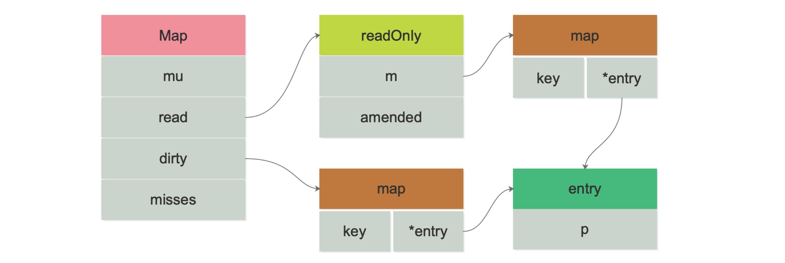

## 1. 等待组 sync.WaitGroup

### 1.1 用法

**执行屏障**：WaitGroup 提供了同步屏障的能力，显式指定同步条件，在多个并发执行的代码块达到 WaitGroup 的同步条件后，才可继续执行后续代码

- 当需要对一个并发执行的代码块引入等待条件时，使用`Add()`产生同步记录
- 当不需要再等待条件时，在并发执行的代码块中使用`Done()`促成同步条件达成

**使用**

1. `主 goroutine`通过调用`Add(i)`来设置需要等待的子 goroutine 数量，i 表示子 goroutine 数量
2. `子 goroutine`通过调用`Done()`来表示执行完毕
3. `主 goroutine`通过调用`Wait()`来等待所有的子 goroutine 执行完毕

```go
var wg sync.WaitGroup

func hello() {
    // goroutine 执行结束前，计数器-1（使用 defer 保证在协程中调用一次）
	defer wg.Done()
	fmt.Println("Hello Goroutine!")
}
func main() {
    // 计数器加 1
	wg.Add(1)
	go hello() 
	fmt.Println("main goroutine done!")
	wg.Wait()	// 同步屏障
}
```

<br>

### 1.2 WaitGroup

> 代码版本：go1.22.1 - src/sync/waitgroup.go

```go
type WaitGroup struct {
	noCopy noCopy	// 避免 WaitGroup 对象被拷贝
	
    // 高32位是运行计数 counter，低32位是等待计数 waiter
	state atomic.Uint64 
	sema  uint32	// 信号计数 semaphore
}
```

**`counter`**：记录当前要执行的 goroutine 个数

- `Add(i) => counter += i`
- `Done() => counter -= 1`

**`waiter`**：记录已经调用`Wait()`的 goroutine 个数

- `Wait() => waiter += 1`，并挂起当前 goroutine

**`semaphote`**：信号量计数

<br>

### 1.3 Wait()

```go
func (wg *WaitGroup) Wait() {...}
```

1. 检测运行计数`counter`，为零时无须继续等待，结束
2. `waiter++`
3. 调用`runtime_Semacquire(&wg.sema)`：增加信号量，阻塞，等待信号量唤醒
4. 结束

<br>

### 1.4 Add / Done

```go
func (wg *WaitGroup) Add(delta int) {...}
```

```go
// 实际就是 Add(-1)
func (wg *WaitGroup) Done() { wg.Add(-1) }
```

1. `counter++`
2. 判断：如果运行计数为负，直接 panic
3. 判断：`waiter != 0 && delta > 0`，即在`Add`之前调用`Wait()`，直接 panic
4. 判断：`counter > 0 || waiter == 0`，不需要释放信号量，返回
5. 判断：如果`Add()`和`Wait()`并行操作，直接 panic
6. 运行到此处，满足条件`counter == 0 && waiter > 0`，则循环以下操作释放所有等待 goroutine
    - `waiter--`
    - `runtime_Semrelease(&wg.sema, false, 0)`，释放信号量

<br>

### 1.5 补充说明

1. `Add`和`Wait`不能并发执行，必须是`Add happens before Wait`（Add 增加计数的情况）
2. 准确说是`Add() -> Wait() -> Done()`
3. 使用`Counter`，等待多个 goroutine 执行完毕后达成同步条件
4. 使用`Waiter`和信号量，多个 goroutine 可以执行`Wait()`操作等待同步条件

<br>

<br>

## 2. 缓存池 sync.Pool


<br>

<br>

## 3. 并发安全哈希表 sync.Map

> 后续需要补充理解！

### 3.1 简介与使用

**特点**

- `sync.Map`是线程安全的，读取、写入、删除时间复杂度都是`O(1)`

- 其零值是有效的，表示一个空的 map，在第一次被使用后，不允许被复制？
- 适用于读多写少的场景？

```go
import "sync"

var m sync.Map

// 写入
m.Store("Roxy", 30)
m.Store("Alice", 16)

// 读取
age, _ := m.Load("Roxy")

// 遍历
m.Range(func(key, value any) bool {
    name := key.(string)
    age := value.(int)
    fmt.Println(name, age)
    return true
})

// 删除
m.Delete("Alice")

// 读取或写入
m.LoadOrStore("Roxy", 45)
age, _ = m.Load("Roxy")
fmt.Println(age)	// key已经存在，返回 30（不存在会写入）
```

<br>

### 3.2 数据结构



> 以空间换时间的方式，用 read 和 dirty 两个哈希表分离读写，降低锁冲突（不需要手动加锁）

`read`：可以并发读

`dirty`：包含`read`中所有未被删除的字段，以及**新写入**的 key

- 如果 dirty 为 nil，则下一次写入时会新建一个
- 新建的 dirty 是 read 的复制，并且除掉已经被删除的 key

`misses`：每次从`read`读取失败会自增 1，达到一定阈值后，将`dirty`提升为`read`

```go
// go1.22.1 - src/sync/map.go
type Map struct {
	mu Mutex	// 互斥量，保护read和dirty字段
    
    // 可以并发读，但更新需要上锁
	read atomic.Pointer[readOnly]
    
    // 非线程安全的原始 map
    dirty map[any]*entry	
    
    misses int	// 记录读取失败次数
}
```

```go
type readOnly struct {
	m       map[any]*entry
	amended bool	// 标识dirty中有m中没有的key
}
```

#### p 的三种状态

```go
type entry struct {
	p atomic.Pointer[any] // 指向 value 的指针
}
```

`read`和`dirty`各自维护一套 key，其值都是`entry`指针，指向的是同一个 value

1. 正常状态
2. `p == nil`：键值对已被删除，`m.dirty == nil`或`m.dirty[k]`指向该 entry
3. `p == expunged`：键值对已被删除，`m.dirty`非空且没有这个 key

```go
var expunged = new(any) // 标记 dirty map 中删除的 entry
```

<br>

#### Store

1. 在`read`里找到 key，且`p != expunged`：更新`entry`
2. 第一步失败：没找到 key 或标记删除该 key【此处开始上锁】
3. 在`read`里再找一次
    - 存在 key：即`p == expunged`，直接更新 value
    - 不存在 key：在`dirty`里找，找到则更新 value（read 仍然没有）
4. `read`和`dirty`都不存在该 key：
    - `dirty`为空，创建并复制`read`中未删除的元素
    - 更新`amended`字段进行标识
    - k-v 写入`dirty map`，`read map`仍然不变

#### Load

1. 在`read`里找 key：
    - 找到，直接取出`entry`指向的值
    - 没找到，且`amended == false`，返回
2. 在`read`里没找到，且`amended == true`：上锁后在`dirty`中找，同时`misses++`
    - `dirty`晋升阈值：满足`m.misses >= len(m.dirty)`
    - 晋升 dirty 为 read 后，清空 dirty 和 misses

#### Delete

- 如果 read 和 dirty 都存在该 key：并不是直接删除 k-v，而是设置 key 对应的`entry = nil`，以提高 read 的命中率

#### LoadOrStore

#### Range

<br>

### 3.3 小结

**写操作**：主要是针对 dirty map 进行，内部会加锁进行操作

**读多写少**：在写多的场景下，会导致频繁上锁，甚至当未命中 read map 次数过多时，频繁发生晋升操作，这一时间复杂度为`O(N)`，大大降低效率

<br>

<br>

## 参考

[《Go 程序员面试宝典》](https://golang.design/go-questions/)

[Golang package sync 剖析(二)： sync.WaitGroup](https://segmentfault.com/a/1190000021653777)

[深入理解Go语言(08)：sync.WaitGroup源码分析 ](https://www.cnblogs.com/jiujuan/p/16735012.html)

[为什么说并发场景不要乱用 sync.map](https://juejin.cn/post/6983646719909036039)

[深度解密 Go 语言之 sync.map ](https://www.cnblogs.com/qcrao-2018/p/12833787.html)
