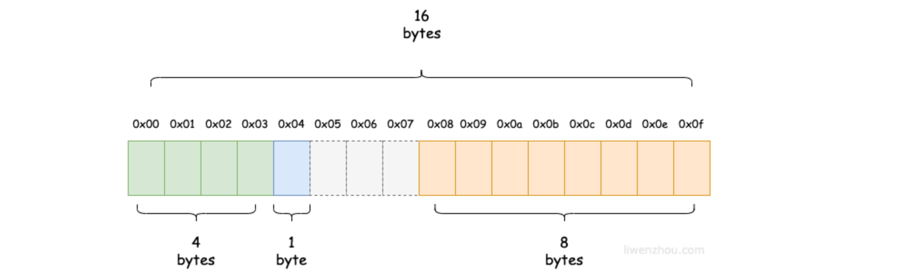
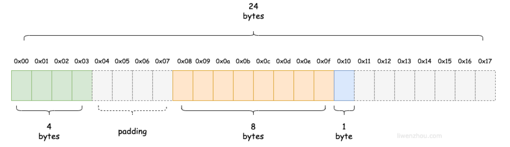

## 简短问答

### 1. 值类型和引用类型

**值类型**：

- 值类型：`int系列`，`float系列`，`bool`，`string`，`数组`，`结构体`
- 变量直接存储值，在**栈**中分配内存

**引用类型**：

- 引用类型：`指针`，`slice`，`channel`， `interface`，`map`，`函数`
- 变量存储的是地址，地址对应在**堆**中分配的内存空间，该空间内存储的是值

<br>

### 2. 空结构体 struct{} 有什么用法

`struct{}`在 Go 中可以作为**占位符或标记**使用，因为不包含任何字段，所以在内存中**不占用任何空间**

**作为占位符**

```go
// 使用空结构体作为通道元素类型，表示只关注通道的事件，而不需要传输任何数据
ch := make(chan struct{})

// 在map中使用，只关注键时使用，节省掉值占用的内存空间
set := make(map[string]struct{})
```

<br>

### 3. Go 命名空间

**包命名空间**：不同包之间的标识符不会产生冲突（小写开头）

**块命名空间**：在例如函数体、循环体、条件语句等代码块内，不会影响到外部的命名空间

**方法集命名空间**：与类型关联的方法集，方法名是类型的一部分

**全局命名空间**：大写开头定义全局变量、常量、函数等

<br>

### 4. make 和 new 的区别

二者都是 Go 内置用来分配内存的函数

`make`：用于引用类型 slice、map、channel，返回初始化之后的类型的引用（值）

`new`：用于值类型 int、数组、结构体等，为类型的新值分配置零的内存空间，并返回指针

<br>

### 5. Go 语法糖（待补充）

1. `:=`
2. `range`
3. `defer`
4. 匿名函数和闭包
5. 字面量初始化

<br>

### 6. 闭包

**闭包 = 函数 + 引用环境**：一个闭包继承了函数声明时的作用域，Go 中所有匿名函数都是闭包

```go
func Func1() func(int) int {
    // 引用的 Func1 的局部作用域环境
    var x int
    
    // 函数类型
    return func(delta int) int {
        fmt.Println(x)
        x += delta
        return x
    }
}

func main() {
    var a = Func1()
    var b = Func1()
    
    fmt.Println(a(1))	// 1
    fmt.Println(a(10))	// 11
    fmt.Println(b(1))	// 1
    fmt.Println(b(10))	// 11
}
```

- 闭包捕获的变量和常量是引用传递，不是值传递
- 闭包在运行时可以有多个实例，实例之间互不影响，实例内部的变量是同一个地址（引用）

<br>

### 7. 结构体的内存对齐

Go 在编译的时候会按照一定的规则自动进行内存对齐，这么设计是为了减少 CPU 访问内存的次数，加大 CPU 访问内存的吞吐量

CPU 访问内存时，并不是逐个字节访问，而是以字为单位访问

- 比如 64位 CPU 的字长为 8B，那么 CPU 访问内存的单位也是 8 字节，每次加载的内存数据也是固定的若干字长

结构体内不同的定义顺序，因为内存对齐，会占用不同的空间

```go
type Bar1 struct {
	x int32 // 4
	z bool  // 1
	y *Foo  // 8
}
// 对于 x、z 可以放在一个 8B 空间内
```



```go
type Bar2 struct {
	x int32 // 4
	y *Foo  // 8
	z bool  // 1
}
// 对于 x、y 无法放在一个 8B 空间内，就需要对 4B 的 x 进行内存对齐
```



<br>


## 语法补充

### 1. int 和 string 互转

- Go 不支持`(int)str`的写法，需要使用`Atoi`将 string 转为 int，使用`Itoa`将 int 转为 string

```go
strconv.Atoi("123")	// 123 转"123"
strconv.Itoa(123)	// "123"转 123
```

<br>


<br>

## Tips

1. 不能给内置类型和接口定义方法
2. Go 不允许隐式类型转换，`=`两边类型必须相同
3. Go 中所有类型都”实现了“空接口，空接口没有定义任何函数
4. 无论业务大小，并发量多少，都应该选择流式`io.Copy`，而不是一次性读出来`ReadAll`


## 问题记录

1. 常见的panic
2. 需要make初始化的类型（make和New的区别）
3. 锁机制：悲观锁、自旋锁
4. netpoll
5. 对象的对齐方式
6. 并发相关：操信号机制
7. OOM
