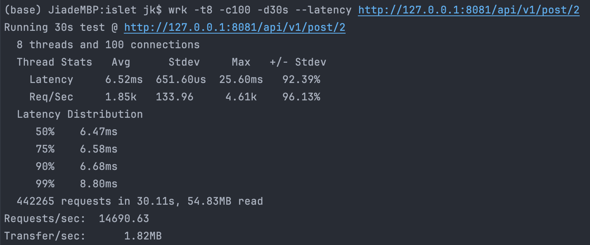

## 临面押题

### Q1. Docker 与虚拟机的区别

1. Docker 是一个轻量的虚拟机，只虚拟软件所需的运行环境
2. 支持绝大部分的系统，不同系统的部署方式相同

`自己电脑上开发、测试` -> `打包为Docker镜像` ->` 在服务器上一个命令部署好`


### Q2. 项目的压力测试

使用`wrk`进行压力测试

[李文周-HTTP服务压测工具](https://www.liwenzhou.com/posts/Go/benchmark-tools/)

测试：8个线程，100个连接，持续30s

442265个请求




### Q3. 雪花算法生成分布式ID

**一个分布式ID占用 64 位**：时间戳部分（从某个时间点的偏移量）+ 10bit 工作机器id + 序列号

`第一位`：1bit，始终为 0，没实际作用

`时间戳`：**41bit**，单位是毫秒，可以容纳 69 年的时间，可以设定为某个时间节点的偏移量

`工作机器id`：10bit，用于标识生成该ID的机器，最多容纳1024个节点

`序列号`：12bit，记录同毫秒内产生的不同id，同毫秒最多可产生4096个ID

snowflake 算法在同一毫秒内可以生成`1024 × 4096`个全局唯一ID


### Q4. 使⽤ jwt 进⾏⽤户认证


### Q5. 帖子投票功能实现

1. 创建帖子的同时，调用 go-redis 使用两个 zset 存储帖子分数
2. 启动事务，保证存储分数的原子性

`<islet:post:time, {postID, score}>`：基于时间存储分数

`<islet:post:score, {postID, score}>`：基于投票得分存储分数

3. 查询帖子时，根据 query 语句，判断以 time 或 score 排序，并返回 page 分页的查询结果
    - 根据分页、排序方式，从 zset 中得到范围内的 postID 列表
4. 遍历列表，从 MySQL 中补齐返回请求需要的帖子信息


### Q6. 互斥锁、自旋锁、读写锁、乐观锁、悲观锁（OS）

加锁的目的：保证共享资源在任意时间里，只有一个线程访问，这样就可以避免多线程导致共享数据错乱的问题

**互斥锁**：独占锁，线程 A 加锁成功后，其他线程会加锁失败，线程释放 CPU 给其他线程

- 通过操作系统内核实现，加锁失败后，内核会将线程置为「睡眠」状态
- 锁被释放后，内核会在合适的时间唤醒线程
- 涉及两次线程上下文切换的成本

**自旋锁**：其他线程加锁失败，线程会「忙等待」，直到它拿到锁

- 通过`CAS`函数实现，在「用户态」完成加锁和解锁操作，不会主动产生线程上下文切换
- 线程会持有CPU一直自旋，直到拿到锁，或因为被抢占 CPU 交给其他线程

`CAS`函数：Compare And Swap，将下列步骤合并为一条硬件级指令，形成**原子指令**

1. 查看锁的状态（比较当前值和预期值），如果锁是空闲的，则执行第二步
2. 将锁设置为当前线程持有

- CAS 是一种乐观锁，比较当前值、预期值和新值，如果当前值和预期值相等，则用新值更新当前值，否则任务操作失败

**读写锁**：读锁可以被多个线程持有

**悲观锁**：认为多线程同时修改共享资源的概率比较高，很容易出现冲突，所以访问共享资源前，先要上锁

**乐观锁**：先修改完共享资源，再验证这段时间内有没有发生冲突，如果没有其他线程修改资源，那么操作完成，如果发现有其他线程已经修改过这个资源，就放弃本次操作


### Q7. GC 触发时机

1. **主动触发**，通过调用 runtime.GC 来触发 GC，此调用阻塞式地等待当前 GC 运行完毕
2. **被动触发**，分为两种方式：
    - 使用系统监控，当超过两分钟没有产生任何 GC 时，强制触发 GC
    - 使用步调（Pacing）算法，其核心思想是控制内存增长的比例


### Q8. Linux 命令

**查看网络配置**

```sh
ifconfig
ip
```

**查看 socket 信息**

```sh
netstat -nlp

ss -ltnp
```

**查完进程信息**

```sh
ps aux
top
```

**kill 命令**

```sh
kill -9 pid	
kill -1 <user_ID>
# 1(HUP): 重新加载进程，通知进程重启
# 9(KILL): 杀死一个进程，进程收到信号后，会立即被停止
# 15(TERM): 正常停止一个进程，进程收到信号后，会进行一些清理工作后正常停止
```


### Q9. MyISAM 对比 InnoDB

1. InnoDB 支持事务处理，有MVCC和行级锁机制；MyISAM 不支持事务，只有表级锁


## Q10. I/O 多路复用

**进程可以通过系统调用函数从内核中获取多个事件，从而使多个请求复用一个进程**

**文件描述符**：Socket 是一个文件，对应一个文件描述符

**系统内存**，每个 TCP 连接在内核中都有对应的数据结构，意味着每个连接都是会占用一定内存的；

`select`：将已连接的 Socket 放在一个文件描述符集合中，调用 select 函数将文件描述符集合拷贝到内核，让内核检测是否有网络事件发生（遍历文件描述符集合），当检测到网络事件，将 Socket 标记为可读或可写，然后将文件描述符集合拷贝回用户态，用户态遍历找到可读或可写的 Socket，再对其进行处理

`poll`：用动态数组组织文件描述符集合而不是 BitsMap，操作与 select 类似

`epoll`：

内核中使用红黑树跟踪进程所有待检测的文件描述字

当有socket事件发生，通过回调函数将其加入就绪事件链表

使用红黑树跟踪进程中所有待检测的文件描述字，epoll 使用**事件驱动**的机制，内核里**维护了一个链表来记录就绪事件**，当某个 socket 有事件发生时，通过**回调函数**内核会将其加入到这个就绪事件列表中


