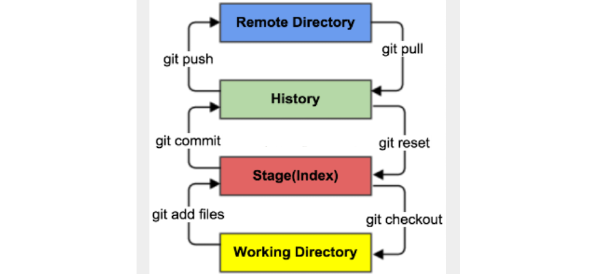
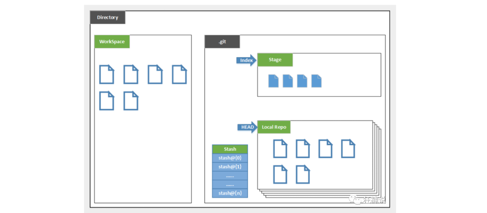
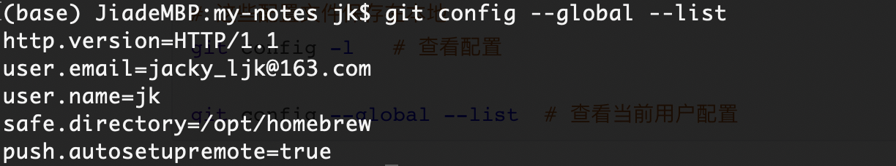

## 1. Git 及其工作原理

> Giit 分布式版本控制软件

### 1.1 什么是版本控制

**版本控制 Revision control**：是一种在开发的过程中用于管理文件、目录或工程等内容的**修改历史**，方便查看更改历史记录，备份以便恢复以前的版本的软件工程技术

- 用于管理多人协同开发项目的技术


### 1.2 Git 和 SVN 的区别

**SVN**：是集中式版本控制系统，版本库是集中放在中央服务器的，而工作时使用本地PC，首先要从中央服务器得到最新的版本，完成工作后，需要把自己做完的活推送到中央服务器

**Git**：是分布式版本控制系统，没有中央服务器，每个人的电脑就是一个完整的版本库，工作的时候不需要联网了，因为版本都在自己电脑上

- 比如自己在电脑上改了文件 A，其他人也在电脑上改了文件 A，这时，只需把各自的修改推送给对方，就可以互相看到对方的修改
- Git 可以直接看到更新了哪些代码和文件

<br>

### 1.3 Git 工作原理



- Git 在本地有三个工作区域：
    - **工作区 Working Directory**：代码目录
    - **暂存区 Stage/Index**：临时存放改动，保存即将提交到文件列表的信息
    - **本地仓库 Repository**：存放提交到所有版本的数据，HEAD 指向最新放入仓库的版本
- **远程仓库 Remote Directory**：托管代码的服务器



`.git`：存放 Git 管理信息的目录，初始化仓库时自动创建

`Stach`：隐藏的工作状态保存栈，用于保存/恢复 WorkSpace 中的临时状态

#### 工作流程

1. 在 WorkSpace 添加、修改、删除文件
2. 将需要进行版本管理的文件放入暂存区 `git add`
3. 提交到 git 仓库 `git push`

#### 文件的四种状态


`Untracked`：未跟踪，文件在工作目录中，但未加入 git 库，通过`git add`变为`Staged`

`Unmodify`：文件已经入库，但未修改

`Staged`：暂存状态

- `git commit`会将修改同步到库中，变为`Unmodify`状态
- `git reset HEAD filename`取消暂存，状态变为`Modified`

`Modified`：文件已修改

- 未加入 git 库，通过`git add`变为`Staged`
- `git checkout`丢弃修改，返回未修改状态（从库中取出文件，覆盖掉修改）

<br>


## 2. 常用命令

### 2.1 配置相关操作

```bash
# 这些配置文件保存在本地
git config -l	# 查看配置

git config --global --list	# 查看当前用户配置
```

#### **配置用户信息**



```bash
git config --global user.name "jk"
git config --global user.email "jacky_ljk@163.com"
```

#### ssh 公钥配置

[github 配置 ssh key](https://blog.csdn.net/weixin_42310154/article/details/118340458)

<br>

### 2.2 常用命令

#### 新建项目上传到 GitHub

```bash 
git init	# 当前目录新建一个Git代码库（创建一个.git目录）

git add .

git commit -m "注释内容"

# 在 GitHub 创建一个仓库

git remote add origin [url]	# 关联本地仓库到远程仓库

git push origin master	# 执行上传推送命令
```

```bash
git clone [url]	# 克隆仓库

git status [filename]	# 查看文件状态，或者查看所有文件状态

git diff	# 比较暂存区与工作区文件的差异
```

#### 提交

```bash
git add .	# 添加所有文件 -> 暂存区

git add -p	# 提交，并处理每个变化

git commit -m "注释内容"	# 暂存区 -> 本地仓库

git push [url]	# 本地仓库 -> 远程仓库
```

#### 远程同步

```bash
git fetch [url]	# 下载远程仓库所有变动

git remote -v	# 显示所有远程仓库

git pull [url] [branch]	# 取回远程仓库的变化，并与本地分支合并

git push [url] [branch]

git push [url] --force

git push [url] --all
```

#### 撤销

```bash
git checkout [filename]	# 暂存区 -> 工作区

git reset [filename]	# 重置暂存区，与上一次commit保持一致，工作区不变
```

<br>

### 2.3 分支处理

```bash
git branch	# 显示所有本地分支

git branch -r	# 显示所有远程分支

git branch [branch-name]	# 新建分支，但停留在当前分支

git checkout -b [branch]	# 新建分支，并切换到该分支

git checkout merge [branch]	# 合并指定分支到当前分支

git branch -d [branch-name]	# 删除分支

git push origin --delete [branch-name]	# 删除远程分支
```

#### 分支合并

```bash
git checkout master # 切换到master分支

git pull origin master

git merge dev	# 把dev分支合并到master上
```

#### 分支变基

```bash
git checkout dev

git rebase master
```

https://blog.csdn.net/weixin_42310154/article/details/119004977

#### fork

[参考 GitHub fork 操作](https://www.cnblogs.com/lvhuayan/p/14532886.html)

<br>

### 2.4 补充

#### `.gitignore`文件

> 忽略某些不想纳入版本控制中的文件

```bash
*.txt        # 忽略所有 .txt 结尾的文件,这样的话上传就不会被选中

!lib.txt     # 但 lib.txt 除外

/temp        # 仅忽略项目根目录下的 TODO 文件,不包括其它目录 temp

build/       # 忽略 build/ 目录下的所有文件

doc/*.txt    # 会忽略 doc/notes.txt 但不包括 doc/server/arch.txt
```


## 参考

[git 文档](https://git-scm.com/docs)

[阮一峰 - 常用 Git 命令清单](https://www.ruanyifeng.com/blog/2015/12/git-cheat-sheet.html)


