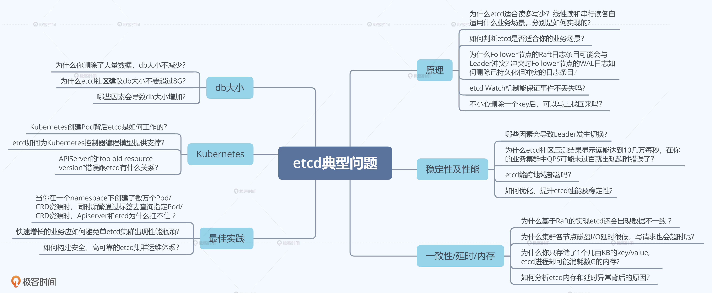

## 简介

### 学习目标

1. 知道什么是`etcd`，了解其基本读写原理、核心特性和能解决什么问题
2. 能判断`etcd`是否适合业务场景
3. 能设计出良好的存储结构，避免`expensive request`
4. 使用`Kubernetes`时，知晓每个操作背后的`etcd`是如何工作的，遵循`Kubernetes/etcd`最佳实践
5. 运维`etcd`集群时，知晓`etcd`集群核心监控指标，了解常见的坑，制定良好的巡检、监控策略，及时发现、规避问题，避免事故的产生
6. 遇到`etcd`问题时，能分析为什么会出现这样的错误，并知道如何解决

### 典型问题

### 知识点目录

 

## 1. 为什么使用 etcd

### 1.1 问题场景

CoreOS 团队构建 Container Linux 产品，一个开源、轻量级操作系统，侧重自动化、快速部署应用服务，并要求应用程序都在容器中运行，同时提供集群化的管理方案，用户管理服务像单机一样方便

**问题**：在重启任意一节点的时候，用户的服务不会因此而宕机，导致无法提供服务，需要运行多个副本。但多个副本之间需要通过协调，从而避免变更的时候所有副本不可用。

### 

## 临时记录

1. 解决棘手问题的思路：分析业务场景、痛点、核心目标，基于目标进行方案选型，评估
2. 业务描述：需求背景，技术方案，方案选型，方案优缺点，遇到的困难，怎么解决的困难，极端情况有什么问题

## 参考

[etcd 实战课](https://time.geekbang.org/column/intro/100069901?tab=catalog)