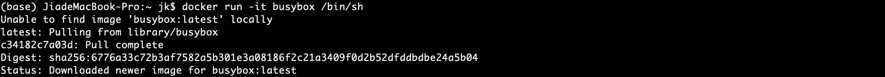
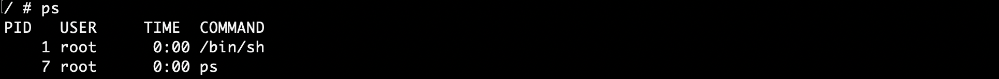
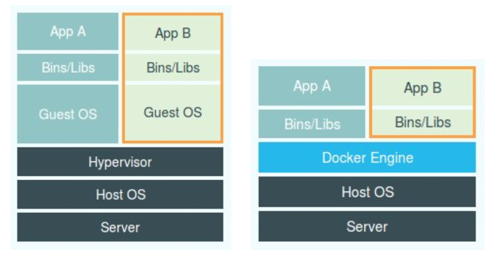
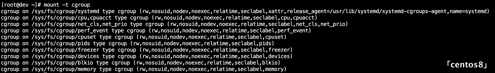
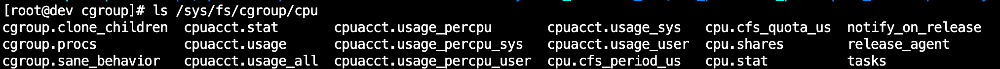
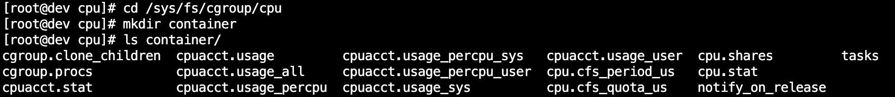
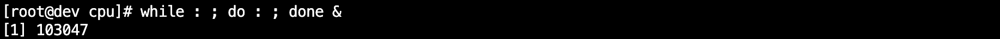
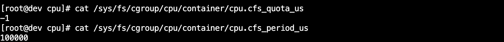

## 1. 容器基础

> 容器本身没有价值，有价值的是「容器编排」

### 1.1 从进程到容器

**容器其实是一种沙盒技术**

- 沙盒就是能够像一个集装箱一样，把应用“装”起来的技术
- 这样，应用与应用之间，就因为有了边界而不至于相互干扰
- 而被装进集装箱的应用，也可以被方便地搬来搬去

**程序**：源代码经过编译得到二进制文件，其中包括了正常运行所需要的数据，这些数据加上代码本身存放在磁盘上，就是一个「程序」，也叫代码的可执行镜像（executable image）

- 当程序被执行起来，就从磁盘上的二进制文件变成了内存中的数据、寄存器里的值、堆栈中的指令、被打开的文件，以及各种设备的状态信息的一个集合

**进程**：像这样一个程序运行起来后的计算机执行环境的总和就是进程

- 程序的静态表现是放在磁盘上的文件；动态表现是程序运行起来后数据和状态的总和，即进程

> 容器技术的核心功能，是通过约束和修改进程的动态表现，为其创建出一个”边界“

**容器**：在创建容器进程时，没有创建所谓的”容器“，而是宿主机操作系统通过 `Namespace` 对应用进程进行隔离，通过 `Cgroups` 技术对被隔离的应用进程进行资源限制

- Cgroups 技术是用来制造约束的主要手段

- Namespace 技术则是用来修改进程视图的主要方法

<br>

### 1.2 Linux Namespace 机制

```shell
# 启动容器，容器里运行 /bin/sh，分配一个命令行终端与容器交互
$ docker run -it busybox /bin/sh
```

`docker run`：启动一个容器

`busybox`：一个轻量级的 Linux 发行版

`-it`：在容器内启动一个交互式的伪终端（pseudo-TTY），允许用户与容器进行交互，能够通过命令行工具进行操作和输入

`/bin/sh`：在 docker 容器里运行的程序



发现运行容器后，`/bin/sh`和`ps`都被隔离在一个与宿主机不同的空间中

先运行的`/bin/sh`是容器内的 1 号进程（pid=1）



#### Namespace 机制

> Namespace 是一种资源逻辑隔离机制

本来，每当我们在宿主机上运行了一个`/bin/sh`程序，操作系统都会给它分配一个进程编号，比如 PID=100，唯一标识这个进程

通过 Docker 把这个程序运行在一个容器中，其实就是对被隔离应用的进程空间做了手脚，使得这些进程只能看到重新计算过的进程编号，比如 PID=1；可实际上，他们在宿主机的操作系统里，还是原来的第 100 号进程。

**Namespace 技术实际上修改了应用进程看待整个计算机“视图”**

**它的“视线”被操作系统做了限制，只能“看到”某些指定的内容**

Namespace 的实现只是 Linux 创建进程的一个可选参数

```c
// 通过系统调用函数 clone() 创建进程，并返回它的 pid
int pid = clone(main_function, stack_size, CLONE_NEWPID | SIGCHLD, NULL);
```

`CLONE_NEWPID`：创建一个新的 PID 命名空间，创建的进程在新的 Namespace 中 PID=1

- 多次执行`clone()`调用，可以创建多个 PID Namespace
- 容器是一个”单进程“模型，含义是只有一个进程是可控的，但可以运行多个进程
- 除了 PID Namespace，Linux 操作系统还提供了 Mount、UTS、IPC、Network 和 User 这些 Namespace，用来对各种不同的进程上下文进行“障眼法”操作

#### Namespace 的六项隔离

| Namespace | 系统调用参数    | 隔离的内容                 |
| --------- | --------------- | -------------------------- |
| UTS       | `CLONE_NEWUTS`  | 主机名域名                 |
| IPC       | `CLONE_NEWIPC`  | 信号量、消息队列与共享内存 |
| PID       | `CLONE_NEWPID`  | 进程编号                   |
| Network   | `CLONE_NEWNET`  | 网络设备、网络栈、端口等   |
| MOUNT     | `CLONE_NEWNS`   | 挂载点                     |
| USER      | `CLONE_NEWUSER` | 用户与组                   |

<br>

### 1.3 虚拟机与容器（容器技术与虚拟化技术）



**虚拟机**：名为`Hypervisor`的软件是虚拟机最主要的部分。它通过硬件虚拟化功能，模拟出了运行一个操作系统需要的各种硬件，比如 CPU、内存、I/O 设备等等。然后，它在这些虚拟的硬件上安装了一个新的操作系统，即`Guest OS`

- 用户的进程就可以运行在这个虚拟机中，看到的只有`Guest OS`的文件和目录


> 容器只是运行在宿主机上的一种特殊的进程，多个容器之间使用的还是同一个宿主机的操作系统内核

**容器**：与虚拟机相比，并没有一个真正的「Docker 容器」运行在宿主机里，Docker 项目启动的还是原来的应用进程，只不过创建进程时添加了各种各样的 Namespace 参数（“障眼法”）

- Docker 项目被称为轻量级虚拟化技术的说法并不严谨，右图 Docker Engine 与 Hypervisor 并不对等，前者对应用进程的隔离环境负责（硬件层面），后者不会创建任何实体的”容器“，真正对隔离环境负责的是宿主机操作系统本身
- 容器如果是镜像 OS，只提供了一套镜像文件系统的文件，使用的还是宿主机上的内核


**对比**：「敏捷」和「高性能」是容器相较于虚拟机最大的优势

- 使用虚拟化技术，必须运行一个完整的且真实存在的 Guest OS，有额外的资源消耗和占用；用户应用运行在虚拟机中，对宿主机操作系统的调用就需要经过虚拟化软件的拦截和处理，对计算资源、网络和磁盘 I/O 损耗很大
- 容器化的用户应用依然是运行在宿主机上的普通进程，额外的资源占用几乎可以忽略不计；但容器技术相较于虚拟化技术，隔离得不彻底（多个容器使用的还是同一个宿主机的内核），内核、时间等资源不能被隔离

<br>

### 1.4 Linux Cgroups 机制

> 使用 Namespace 机制可以隔离出一个应用进程的”视图“，但不同的容器之间仍然使用的是宿主机上的资源，这些资源可以随时被其他进程占用，因此还需要对资源进行限制

#### **Linux Cgroups**

> （Linux Control Groups）：一个子系统目录加上一组资源限制文件的组合

1. 用于限制一个进程组能够使用的资源（CPU、内存、磁盘、网络带宽等）上限
2. 能够对进程进行优先级设置、审计，以及将进程挂起和恢复等操作


**mount 指令**：Linux 系统在使用光盘、软盘或U盘时，必须先执行挂载（mount）命令；挂载命令会将这些存储介质指定成系统中的某个目录，以后直接访问相应的目录即可读写存储介质上的数据

```bash
$ mount /dev/fd0 /mnt/floppy	# 将软盘挂载到 /mnt/floppy
$ unmount /mnt/floppy			# 卸载
```


Linux 中，Cgroups 给用户暴露出来的操作接口是文件系统，在路径`/sys/fs/cgroup`下

```bash
$ mount -t cgroup # 查看 cgroup 类型挂载
```



在`/sys/fs/cgroup`下面有很多诸如 cpuset、cpu、 memory 这样的子目录，也叫子系统

这些都是这台机器当前可以被 Cgroups 进行限制的资源种类

```bash
$ ls /sys/fs/cgroup/cpu	# 查看CPU子系统中的配置文件
```



其中`cfs_period`和`cfs_quota`组合起来，可以限制：

- 进程在长度为 `cfs_period` 的一段时间内，只能分配到总量为 `cfs_quota` 的 CPU 时间


#### 使用子系统配置文件

```bash
$ cd /sys/fs/cgroup/cpu
$ mkdir container	# 进入目录，创建一个”控制组“
$ ls container/
```



- 这样的一个目录称为一个”控制组“

**控制组限制进程**

1. 后台执行死循环脚本



2. 查看 CPU 使用


3. 查看控制组队 CPU 的限制



- `-1`表示 CPU quota 没有限制，`100000`是 CPU period 默认的 100 ms（100000 us）

4. 修改配置，对 CPU 资源做限制


- 向 container 组里的 `cfs_quota` 文件写入 20 ms（100 ms 限制进程只能使用 20 ms 的 CPU 时间）
- 将被限制进程 PID 写入控制组的 `tasks` 文件中，限制就会生效

5. top 查看，发现 CPU 使用率降为 20%


6. 删除控制组（善后）

```bash
# 借助 libcgroup 工具
$ yum install libcgroup
$ yum install libcgroup-tools
$ cd /sys/fs/cgroup
$ cgdelete cpu:/container/
```


#### Cgroups 的子系统

`cpu`：限制 cpu 分配给进程的时间等

`blkio`：为块设备设定 I/O 限制，一般用于磁盘等设备

`cpuset`：为进程分配单独的 CPU 核和对应的内存节点

`memory`：为进程设定内存使用的限制


#### Docker 容器项目

- 只需要在每个子系统下面，为每个容器创建一个控制组（即创建一个新目录），然后在启动容器进程之后，把这个进程的 PID 填写到对应控制组的 tasks 文件中就可以了

```sh
# 限制 Docker 容器只能使用 20% 的 CPU 带宽
$ docker run -it --cpu-period=100000 --cpu-quota=20000 ubuntu /bin/bash
```

**Cgroups 限制能力的缺陷**

限制对`/proc`不可见，执行`top`命令，显示的是宿主机的数据（Linux 下的`/proc`目录存储的是记录当前内核运行状态的一系列特殊文件，用户可以通过访问这些文件，查看系统以及当前正在运行的进程的信息）

<br>

## 2. 容器镜像

通过 `clone()` 系统调用创建一个新的子进程，并声明为它启用 `Mount Namespace`，这个进程被隔离

但即使开启了 `Mount Namespace`，容器进程看到的文件系统也跟宿主机完全一样

- `Mount Namespace` 修改的，是容器进程对文件系统”挂载点“的认知，只有挂载操作完成之后，进程的视图才会发生改变，在此之前，新创建的容器会继承宿主机的各个挂载点


> 后续整理原理！！


`Mount Namespace` 对容器进程视图的改变，一定是伴随着挂载操作才能生效


## 问题

1. Linux 创建进程：fork vs clone
2. cat 命令
3. 进程总结：https://linux.cn/article-8451-1.html
4. https://www.jianshu.com/p/ab423c3db59d， 容器 = cgroup + namespace + rootfs + 容器引擎 Cgroup： 资源控制 Namespace： 访问隔离 rootfs：文件系统隔离。镜像的本质就是一个rootfs文件 容器引擎：生命周期控制
5. http://www.floydhilton.com/docker/2017/03/31/Docker-ContainerHost-vs-ContainerOS-Linux-Windows.html


## 参考

[Linux 资源管理之 cgroups 简介](https://tech.meituan.com/2015/03/31/cgroups.html)

https://coolshell.cn/articles/17010.html


