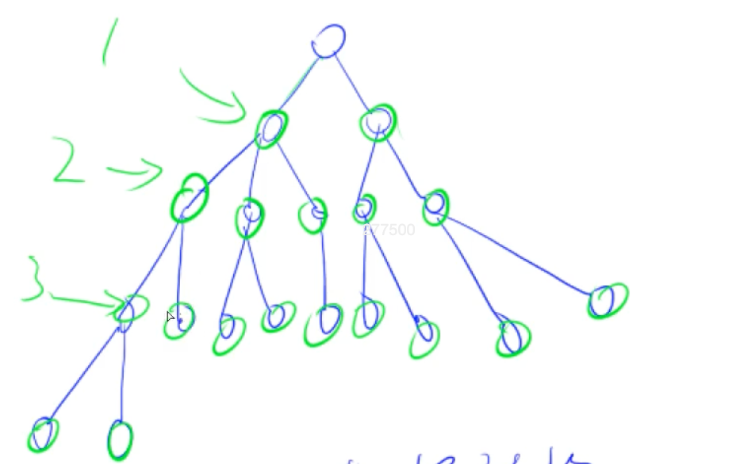
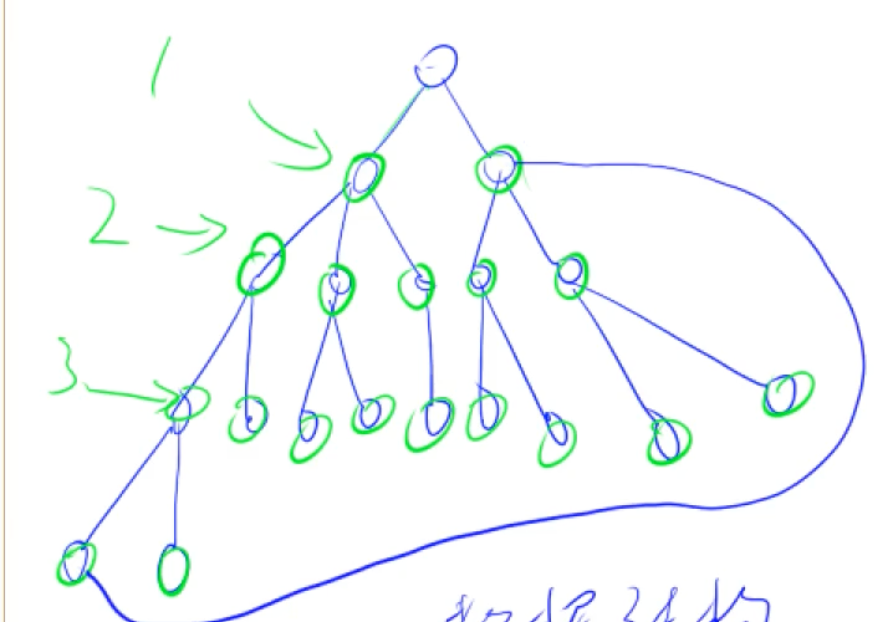

## BFS 宽度优先搜索

- 每次搜索先搜索本层的所有节点，之后再搜索下一层，每次只扩展一层
- 用队列
- （空间）O(2^h)
    - （以二叉树为例，二叉树第h层是2^h - 1个节点，第n层有2^n个节点）（复习一下）
- 有最短路的性质（最小步数、最短距离、最少操作次数）【优势】
    - 记录第一次遍历取得的距离，即是最小距离




- 搜到的是最短路



（左下角节点搜索结果为第二层，权重为2，即存在最短路特性）

> 只有当所有边的权重相同时，才能用BFS求最短路径

```cpp
#include <cstring>
#include <iostream>
#include <algorithm>


using namespace std;

const int N = 110;
typedef pair<int, int> PII;

int n, m;
int paths[N][N];     // 存图
int d[N][N]; // 存每个点到起点的距离
PII q[N * N];

int bfs() {
    // 手动模拟队列
    int hh = 0, tt = 0;
    q[0] = {0, 0};
    
    // 初始化为-1
    memset(d, -1, sizeof d);
    
    // 表示走过
    d[0][0] = 0;
    
    // 表示下一步的向量
    int dx[4] = {-1, 0, 1, 0}, dy[4] = {0, 1, 0, -1};
    
    while(hh <= tt) {   // 队列不空
        auto t = q[hh++];   // 取出队头
        
        // 用 (x,y) 表示下一步走的位置
        // 向上(x-1, y)，向下(x+1, y)，向左(x, y-1)，向右(x, y+1)
        for(int i = 0; i < 4; i++) {
            int x = t.first + dx[i];
            int y = t.second + dy[i];
            // 在边界内，该点是0，该点没走过（第一次搜到是最短距离）
            if(x >= 0 && x < n && y >= 0 && y < m && paths[x][y] == 0 && d[x][y] == -1) {
                // 可以走到该点，记录距离
                d[x][y] = d[t.first][t.second] + 1;
                q[++tt] = {x, y};
            }
        }
    }
    // 输出右下角点的距离
    return d[n-1][m-1];
}

int main() {
    cin >> n >> m;
    
    // 读入节点
    for(int i = 0; i < n; i++)
        for(int j = 0; j < m; j++)
            cin >> paths[i][j];
            
    cout << bfs() << endl;
    
    return 0;
}
```

- 如果遍历路径，可以开一个数组记录上一个位置的点的坐标` PII pre[N][N]`


## 树和图的存储

树是无环连通图，一种特殊的图，考虑图即可

复习单链表

### 有向图

#### 1. 邻接矩阵

- `g[a][b]`适合存储稠密图


#### 2. 邻接表

每个点开一个单链表，存该点可以走的点的位置（类似哈希拉链法）

开一条新路径，找到该点的链表，将新的点插入到链表中


### 无向图


## 树和图的深度优先遍历


