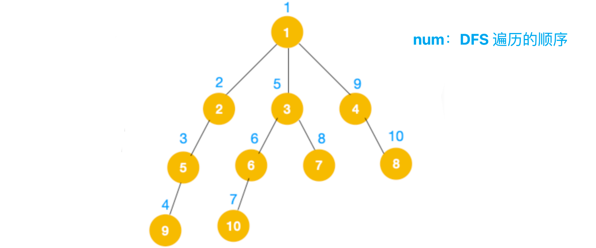
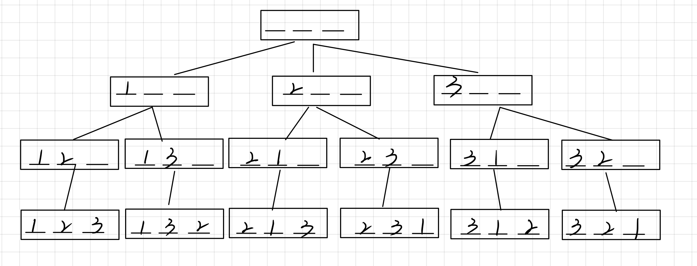

## DFS 深度优先搜索

**定义**：优先向深度搜索，搜索到底回溯，如果确定当前节点没有子节点，继续回溯

**数据结构**：栈实现，实际上是程序内部实现递归函数调用、

**空间复杂度**：与高度成正比`O(h)`

**对比 BFS**：不具有最短路特性



   

## 经典题目理解

> 每个DFS都对应一棵搜索树，最重要考虑顺序，重点理解”回溯“、”剪枝“操作

### [Acwing: 排列数字（全排列）](https://www.acwing.com/problem/content/844/)

- 每次只会存储一条路径，不需要把整个树写出来，属于递归思路的一种

- 回溯：注意恢复现场



```cpp
#include <iostream>
using namespace std;
const int N = 10;

int n;
int path[N];    // 存储：记录当前路径上的数字
bool st[N];     // 记录状态：当前数字有没有被用到 state[i]

void dfs(int u) {
    // 如果搜索到底，所有位置填满，输出结果，返回，开始回溯
    if(u == n) {
        // 从第0层开始，即 u = 1，输出该条路径上存储的所有数字
        for(int i = 0; i < n; i++) {
            cout << path[i] << " ";    // 输出路径上的数字
        }   
        puts("");
        return;
    }
    
    // 没有搜索到底，存入数字到没用过的位置，状态标为用过
    for(int i = 1; i <= n; i++) {
        // 当前位置没有被用到
        if(!st[i]) {
            // 记录当前第 u 层存的数字 i，和数字 i 被用过的状态
            path[u] = i;
            st[i] = true;
            // 递归搜索下一层，搜索到叶节点，开始回溯
            // u == 0/1/2.../n 时，对应着搜索到第 0/1/2.../n 层
            dfs(u + 1); 
            
            // 回溯：恢复现场
            // 省略了一步恢复 path[u] = 0
            st[i] = false;
        }
    }
}

int main() {
    cin >> n;
    // 从第 0 层开始深度搜索
    dfs(0);
    return 0;
}
```

   

### [Acwing: n-皇后问题](https://www.acwing.com/problem/content/845/)

> 注意**剪枝**，提前判断当前节点继续深度搜索不合法，直接回溯

#### **对于同一条`对角线/反对角线`上元素下标的理解**

- 对角线 `y = -x + b, 截距 b = y + x`

- 反对角线 `y = x + b上，截距 b = y - x, 加偏移量保证非负即 b = y - x + n`
- 存储对角线使用状态的数组，实际上存储的是截距`b`

   

#### **思路1：转化为全排列问题，根据条件剪枝	O(N*N!)**

- 全排列的思想，逐行确定一个皇后的位置，到最后一行时返回
- 类似于排列中在每行摆一个不同的数字

```cpp
#include <iostream>
using namespace std;
const int N = 10;

int n;
char res[N][N];    // 存储方案

// 记录当前列、对角线、反对角线是否被用到
bool col[N];    // 列 y = b，col[y]
bool dg[N];     // 正对角线 y = x + b，dg[n + y - x]
bool udg[N];    // 反对角线 y = -x + b, udg[x + y]


void dfs(int u) {
    if(u == n) {
        for (int i = 0; i < n; i++)
            puts(res[i]);
        puts("");
        return;
    }
    
    for (int i = 0; i < n; i++) {
        // u是横坐标，i是纵坐标，定值"b"对应一条对角线
        // 相同坐标系对角线上不能有两个皇后
        // 满足条件的继续递归，否则直接下一次循环
        if(!col[i] && !dg[u + i] && !udg[n - u + i]) {
            res[u][i] = 'Q';
            col[i] = dg[u + i] = udg[n - u + i] = true;
            dfs(u + 1);
            col[i] = dg[u + i] = udg[n - u + i] = false;
            res[u][i] = '.';
        }
    }
}

int main() {
    cin >> n;
    
    // 所有位置初始化
    for(int i = 0; i < n; i++)
        for(int j = 0; j < n; j++)
            res[i][j] = '.';
    
    dfs(0);
    
    return 0;
}
```

   

#### **思路2：枚举每个位置，剪枝进行化简	O(2^N^2)**	

- 从`(0, 0)`枚举，每个位置分为”放皇后“和”不放皇后“两种路径
- 每次搜索到第N行，即深度最大，返回可能的结果

```cpp
#include <iostream>
using namespace std;
const int N = 10;
char res[N][N];
int n;

// 行、列、对角线、反对角线状态
bool row[N], col[N], dg[N], udg[N];

// 搜索的位置 (x,y)，当前已经有的皇后数 s
void dfs(int x, int y, int s) {
    // 枚举到最后一列，则转到下一行的第一列
    if (y == n) {
        y = 0;  
        x++;
    }
    
    // 枚举到最后一行，输出方案结果
    if (x == n) {
        // 已摆够皇后数
        if(s == n) {
            for (int i = 0; i < n; i++) 
                puts(res[i]);
            puts("");
        }
        return;
    }
    
    // 不放皇后，枚举下一个位置
    dfs(x, y + 1, s);
    
    // 放皇后（通过判断条件进行剪枝）
    if (!row[x] && !col[y] && !dg[x + y] && !udg[n - x + y]) {
        res[x][y] = 'Q';
        row[x] = col[y] = dg[x + y] = udg[n - x + y] = true;
        dfs(x, y + 1, s + 1);
        // 回溯，恢复状态和值
        row[x] = col[y] = dg[x + y] = udg[n - x + y] = false;
        res[x][y] = '.';
    }
}

int main() {
    cin >> n;
    for (int i = 0; i < n; i++)
        for (int j = 0; j < n; j++)
            res[i][j] = '.';
    
    dfs(0, 0, 0);
    return 0;
}
```


## 习题补充


