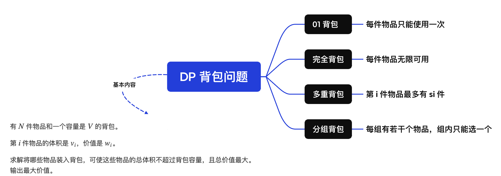
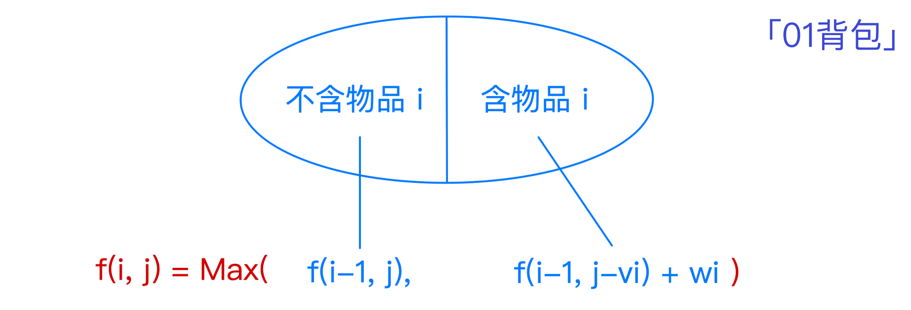
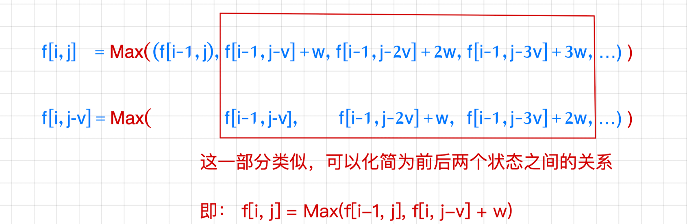
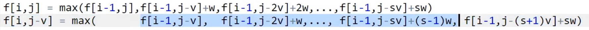

## 背包问题

**状态表示的思考**：入手点思路都是取到第`i`个物品时，容量为`j`，求当前价值的最大值



<br>

## 01背包

**模板题**：[Acwing: 01背包问题](https://www.acwing.com/problem/content/2/)

**问题理解**

- `01`：每件物体只能用0/1次
- `wi`表示价值，即权重
- 不一定装满背包
- DP 没有模板，理解分析思路

<br>


#### DP思考逻辑

**状态表示**：`f(i,j)`是满足以下属性的集合`(i,j)`中的选法

- 集合：`f(i,j)`表示一个选法集合，满足条件（最终集合是`(n,v)`，即问题的要求）
    1. 只考虑前`i`个物品
    2. 选出的物品的总体积不超过`j`

- 属性：选法的价值是最大值`Max`

**状态计算**：将状态`f(i,j)`分为两大子集（要求：不重（求最值可以不满足）、不漏）

- 集合1：不包含物品`i`：`f(i,j) = f(i-1,j)`（j < v[i]，无法加入第 i 件物品）

- 集合2：包含物品`i`：

    - 把集合内所有选法第`i`个物品去掉`f(i-1, j-vi)`，列为选法最大值候选

    - `f(i,j) = f(i-1, j-vi) + wi`

- 综合两个集合：`f(i, j) = max(f(i-1, j), f(i-1, j-v(i)) + w(i))`



### 朴素做法

```cpp
#include <iostream>
using namespace std;
const int N = 1010;
int n, m;
int v[N], w[N];
int f[N][N];

int main() {
    cin >> n >> m;
    for(int i = 1; i <= n; i++) 
        cin >> v[i] >> w[i];
        
    // basic case：初始状态，0件物品价值为0，这里省略
    // f[0][0~v] = 0
    
    for(int i = 1; i <= n; i++) {
        for(int j = 0; j <= m; j++) {
            // 不包含i的子集一定存在
            f[i][j] = f[i - 1][j];  
            
            // 包含i的子集不一定存在，需要满足去掉i的体积后剩余体积大于0
            if(j >= v[i])
                f[i][j] = max(f[i][j], f[i-1][j-v[i]] + w[i]);
        }
    }
    
    cout << f[n][m] << endl; 
    return 0;
}
```

### 优化为一维

**优化思路**：利用滚动数组，前后分别存储（未铺满）两个维度的信息

- 观察递推公式：DP 数组中第`i`行的元素仅由第`i-1`行的元素得来，即第 `0`行元素的更新值放到第`1` 行，第`1`行元素的更新值放到第 `2`行，以此类推用到了二维数组
- 与其把一行的更新值放到新的一行，**不如直接原地更新**，因此我们的 DP 数组只需要一行来存储，即一维数组

<br>

**思考哪些存储哪些值是非必要的**

```cpp
for(int i = 1; i <= n; i++) {
    for(int j = 0; j <= m; j++) {
        // f[j] = [j];  恒等式，可以合并

        // 要满足判断条件，j = 0 ~ j = v[i-1] 没有意义
        // j 没必要从头开始遍历
        if(j >= v[i])	
            f[i][j] = max(f[i][j], f[i-1][j-v[i]] + w[i]);
    }
}
```

**思考一维状态含义**

`f[j]`：已经决策了`i`件物品后，背包的容量的最大价值

- 从`i-1`件物品决策到`i`件物品的过程，是体积`j`从小变大的过程

<br>

**思考状态转移方程的逻辑**

`f[j] = max(f[j], f[j-v[i]] + w[i]);`

- 第 i 行的`f[j]`：表示从第`i-1`行的`f[j - v[i]] + w[i]`和`f[j]`得来
- 第 i 行的`f[j + v[i]]`：表示从第`i-1`行的`f[j + v[i]]`和`f[j] + w[i]`得来

如果`j`顺序遍历，会先更新`f[j]`，再更新`f[j + v[i]]`

- 即先使用了`f[j]`更新较小的状态`f[j]`，当遍历到更大状态的`f[j + v[i]]`时，仍然会用到`f[j]`
- 此时式子中的`f[j] = f[(j + v[i]) - v[i]]`
- 先决策加入物品更新了`f[j]`，用`f[j]`再加入物品更新了`f[j + v[i]]`，显然错误

而逆序遍历，先更新的数据（更大）不会覆盖后更新的数据，因为是`max`取得的

> 总结：如果更新状态用到上一层的状态，从大到小枚举体积

```cpp
// 转换为从大到小枚举
// 这里也可以一次遍历读体积和价值，同时计算（省去v[N], w[N]）
for(int i = 1; i <= n; i++) {
    for(int j = m; j >= v[i]; j--) {        
        f[j] = max(f[j], f[j-v[i]] + w[i]);
    }
}
```

<br>

## 完全背包

> 每件物品可以用无限次

**模板题**：[Acwing: 完全背包问题](https://www.acwing.com/problem/content/3/)

### 朴素做法

**状态表示**：`f(i,j)`

**状态计算**：状态集合分为若干组，分别表示第`i`个物品选`0/k`个，下面两个可以合并`f(i,j) = f(i-1, j-k*v[i]) + k*w[i]`

1. 不选第`i`个物品：`f(i,j) = f[i-1,j]`（k=0）
2. 第`i`个物品选了k个，`f(i,j) = f(i-1, j-k*v[i]) + k*w[i]`
    - 曲线救国
        1. 去掉 k 个物品
        2. 求Max，`f(i-1, j-k*v[i])`
        3. 加上 k 个物品
3. k取值的上限取决于本次加入的物品是否不大于当前容量`k*v[i] <= j`

```cpp
// 朴素做法：Time Limit Exceeded   O(n*v^2)
for(int i = 1; i <= n; i++)
    for(int j = 0; j <= m; j++)
        for(int k = 0; k*v[i] <= j; k++)
            f[i][j] = max(f[i][j], f[i-1][j-k*v[i]] + k*w[i]);
```

### 优化

**思考中间状态的转化思路**：



```cpp
// 优化成二维
for(int i = 1; i <= n; i++)
    for(int j = 0; j <= m; j++) {
        f[i][j] = f[i - 1][j];
        if(j >= v[i])
            f[i][j] = max(f[i][j], f[i][j - v[i]] + w[i]);
    }
```

```cpp
// 进一步优化成一维
for(int i = 1; i <= n; i++)
    for(int j = v[i]; j <= m; j++) 
        f[j] = max(f[j], f[j - v[i]] + w[i]);
// 这里的 j - v[i] 就是第 i 层的，不需要逆序遍历
```

<br>

## 多重背包

- 第`i`件物体最多有`Si`个
- 优化版

**模板题**：[Acwing: 多重背包问题 Ⅰ](https://www.acwing.com/problem/content/4/)

**状态表示**：`f(i,j)`

**状态计算**：第 i 个物品选`0 ~ si`个（和完全背包朴素做法一致，设置一个 k 的上限）

`f[i][j] = max(f[i-1][j - v[i]*k] + w[i]*k)`，k∈[0, s[i]]

### 朴素做法

```cpp
// 朴素做法
for(int i = 1; i <= n; i++)
    for(int j = 0; j <= m; j++)
        for(int k = 0; k <= s[i] && k*v[i] <= j; k++)
            f[i][j] = max(f[i][j], f[i - 1][j - v[i]*k] + w[i] * k);
```

**扩大问题数据**：[Acwing: 多重背包问题 Ⅱ](https://www.acwing.com/problem/content/5/) 朴素做法超时 !

<br>

### 二进制优化方法



(???咋多一项，完全背包问题物品可以取无限次)

- 把第 i 个物品打包为若干组，打包后的总和**看做一个物品**的体积和价值，每组有`1, 2, ..., 512, .., si`个
- 对于每组中的每个物品，划分为选/不选（01背包）

```cpp
// 二进制优化方式 O(NVlogS)
#include <iostream>

using namespace std;

// N = nlogs = 1000*log2000 -> 1000 * 11（log2048）（物体个数）
const int N = 11010, M = 2010;

int n, m;
int v[N], w[N];
int f[M];

int main() {
    cin >> n >> m;
    int cnt = 0;
    
    for(int i = 1; i <= n; i++) {
        int a, b, s; // 体积、价值、个数
        cin >> a >> b >> s;
        int k = 1;
        while(k <= s) {
            cnt++;
            v[cnt] = a * k;
            w[cnt] = b * k;
            s -= k;
            k *= 2;
        }
        
        if(s > 0) {
            cnt++;
            v[cnt] = a * s;
            w[cnt] = b * s;
        }
    }
    
    n = cnt;
    
    for(int i = 1; i <= n; i++) 
        for(int j = m; j >= v[i]; j--)
            f[j] = max(f[j], f[j - v[i]] + w[i]);
            
    cout << f[m];
    
    return 0;
}
```

<br>

## 分组背包

**状态表示**：`f(i, j)`

- 集合：从前 i 组选，体积不大于 j
- 属性：Max

**状态计算**：枚举第 i 组物品，选或不选

- 不选
- 选第k个物品 `f(i-1, j - v[i,k]) + w[i,k]`

```cpp
// 直接是优化后的版本
#include <iostream>

using namespace std;

const int N = 110;

int n, m;
int v[N][N], w[N][N], s[N];
int f[N];

int main() {
    cin >> n >> m;
    
    for(int i = 1; i <= n; i++) {
        cin >> s[i];
        for(int j = 0; j < s[i]; j++) {
            cin >> v[i][j] >> w[i][j];
        }
    }
    
    for(int i = 1; i <= n; i++)
        for(int j = m; j >= 0; j--)
         for(int k = 0; k < s[i]; k++)
            if(v[i][k] <= j)
                f[j] = max(f[j], f[j - v[i][k]] + w[i][k]);
    
    cout << f[m] << endl;
    
    return 0;
}
```


## 补充

[背包九讲（补充）](https://www.bilibili.com/video/BV1qt411Z7nE/?spm_id_from=333.337.search-card.all.click&vd_source=dd7104d21739df564fbe60859b235237)


​    


