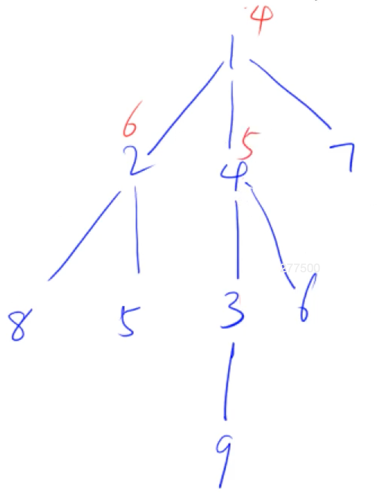
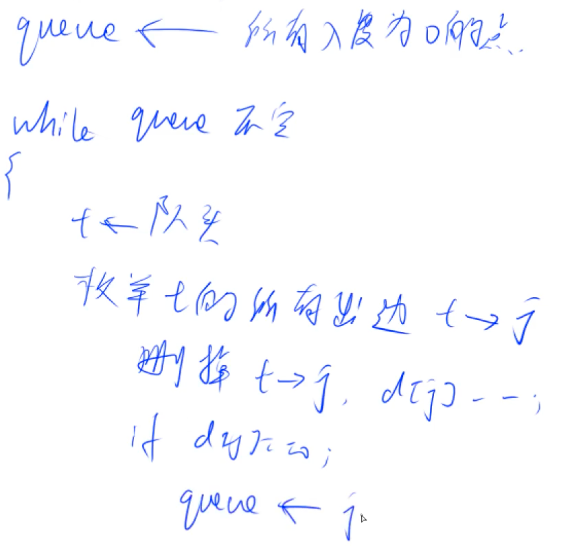

## 树和图的存储

树是无环连通图，一种特殊的图，考虑图即可

复习单链表

### 有向图

#### 1. 邻接矩阵

- `g[a][b]`存储每个点的权重，适合存储稠密图


#### 2. 邻接表

每个点开一个单链表，存该点可以走的点的位置（类似哈希拉链法）

- 开一条新路径，找到该点的链表，将新的点插入到链表中

- 边多用邻接矩阵，点多用邻接表

```cpp
// 邻接表存储树或图
#include <iostream>
#include <cstring>
#include <algorithm>

const int N = 100010;
const int M = N * N;

int h[N], e[M], ne[M], idx;

// 插入a指向b的边(在a链表头插一个b节点)
void add(int a, int b) {
    e[idx] = b, ne[idx] = h[a], h[a] = idx, idx++;
}

int main() {
    cin >> n;
    
    // 初始化头节点数组
    for(int i = 0; i < n; i++)
        h[i] = -1;
        
    return 0;
}
```


## 树和图的遍历 O(N + M) 点和边

### 深度优先遍历

- 可以算出每个子树的大小

```cpp
// 深度优先遍历（遍历节点u）
void dfs(int u) {
    st[u] = true;
    
    for(int i = h[u]; i != -1; i = ne[i]) {
        int j = e[i];
        if(!st[j])
            dfs(j);
    }
}
```

例题：[Acwing: 树的重心](https://www.acwing.com/problem/content/848/)

遍历每个点时，可以找到删掉该点的子树外，其余连通图的节点个数（n - size(u)），从中找最大值



```cpp
#include <iostream>
#include <cstring>
#include <algorithm>

using namespace std;

const int N = 100010;
const int M = N * 2;

int n;
int h[N], e[M], ne[M], idx;
bool st[N];     // 存状态
int ans = N;    // 最小的最大值


// 以u为根的子树中点的数量
int dfs(int u) {
    st[u] = true;
    int sum = 1;    // 当前子树的节点数
    int res = 0;    // 删掉该点后，每个连通块大小的最大值
    
    for(int i = h[u]; i != -1; i = ne[i]) {
        int j = e[i];
        if(!st[j]) {
            int s = dfs(j); // 不含根，子树的节点数
            res = max(res, s);
            sum += s;
        }
    }
    res = max(res, n - sum);
    ans = min(res, ans);
    return sum;
}

void add(int a, int b) {
    e[idx] = b, ne[idx] = h[a], h[a] = idx++;
}

int main() {
    cin >> n;
    
    for(int i = 0; i < N; i++)
        h[i] = -1;
        
    for(int i = 0; i < n - 1; i++) {
        int a, b;
        cin >> a >> b;
        add(a, b), add(b, a);   // 无向边
    }
    
    dfs(1);
    
    cout << ans << endl;
        
    return 0;
}
```

[参考题解](https://www.acwing.com/solution/content/13513/)


### 宽度优先遍历

[Acwing: 图中点的层次](https://www.acwing.com/problem/content/849/)

```cpp
#include <cstdio>
#include <cstring>
#include <iostream>
#include <algorithm>
#include <queue>
using namespace std;

const int N = 100010;

int n, m;
int h[N], e[N], ne[N], idx;
int d[N];

void add(int a, int b)
{
    e[idx] = b, ne[idx] = h[a], h[a] = idx ++ ;
}

int bfs()
{
    memset(d, -1, sizeof d);

    queue<int> q;
    d[1] = 0;
    q.push(1);

    while (q.size())
    {
        int t = q.front();
        q.pop();

        for (int i = h[t]; i != -1; i = ne[i])
        {
            int j = e[i];
            if (d[j] == -1)
            {
                d[j] = d[t] + 1;
                q.push(j);
            }
        }
    }

    return d[n];
}

int main()
{
    scanf("%d%d", &n, &m);
    memset(h, -1, sizeof h);

    for (int i = 0; i < m; i ++ )
    {
        int a, b;
        scanf("%d%d", &a, &b);
        add(a, b);
    }

    cout << bfs() << endl;

    return 0;
}
```


## 应用

### 有向图的拓扑序列

[Acwing: 有向图的拓扑序列](https://www.acwing.com/problem/content/850/)

拓扑序列：都是从前指到后（无环图才有拓扑序列）

- 有向五环图（拓扑图）一定存在拓扑序列

入度，出度

1. 入度为0（不是被指向的点）的点都可以作为起点
1. 有环时，环上的点不会入队（入度永远不会为0）
1. 一个有向无换图，至少存在一个入度为0的点



```cpp
#include <iostream>
#include <cstring>

using namespace std;

const int N = 1e5 + 10;

int n, m;
int h[N], e[N], ne[N], idx; // 邻接表存图
int q[N];
int d[N];   // 入度

void add(int a, int b) {
    e[idx] = b, ne[idx] = h[a], h[a] = idx++;
}

bool topsort() {
    int hh = 0, tt = -1; // 数组模拟队列
    
    // 点的编号是1-n
    for(int i = 1; i <= n; i++)
        if(!d[i]) 
            q[++tt] = i;
    
    while(hh <= tt) {
        // 拿到队头
        int t = q[hh++];
        
        // 枚举t的所有出边 t->j
        for(int i = h[t]; i != -1; i = ne[i]) {
            int j = e[i];
            // 删除t->j
            d[j]--;
            // 判断j的入度为0，则入队
            if(d[j] == 0)
                q[++tt] = j;
        }
    }
    // 所有节点都入队，最终队列中是拓扑序
    return tt == n - 1;
}

int main() {
    cin >> n >> m;
    
    memset(h, -1, sizeof h);
    
    for(int i = 0; i < m; i++) {
        int a, b;
        cin >> a >> b;
        add(a, b);
        d[b] ++;
    }
    
    if(topsort()) {
        // 虽然逻辑上出队，但实际上数组存储了队列中的所有元素
        for(int i = 0; i < n; i++)
            cout << q[i] << " ";
    } else {
        puts("-1");
    }
    
    return 0;
}
```


